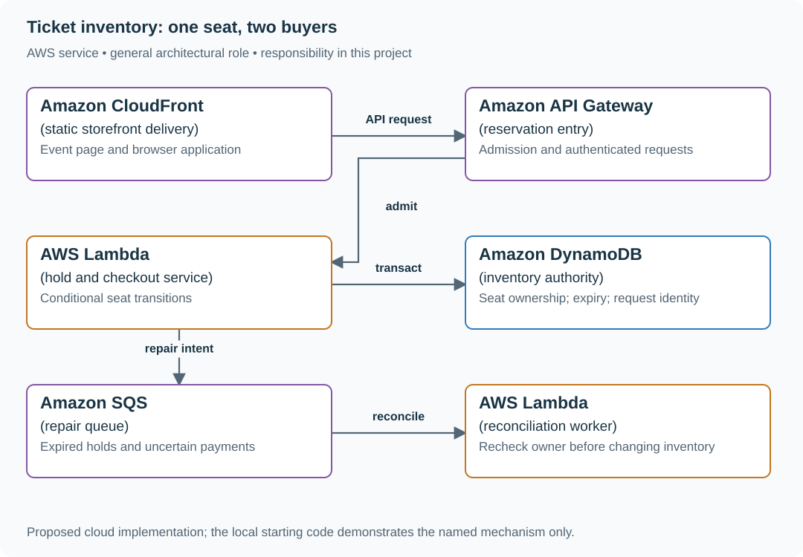

# Reserve concert seats with expiring holds

## Application background

Ticket buyers choose seats, hold them briefly and pay before the hold expires. Browsers may show the same available seat, but only its current hold owner can confirm it.

This is a fictional engineering scenario. The workload figures later in the page are exercise assumptions, not measured production traffic.

## Your assignment

**Deliver:** Atomic seat holds, expiry and confirmation operations, with a competing-buyers walkthrough and an expired-payment decision.

Build ticket reservations for a 30,000-seat concert. At noon, 60,000 purchase attempts/s arrive for twenty seconds. Seat A-17 is shown as available to many browsers; exactly one active hold may own it.

**Required behavior:** POST /holds accepts event, seat IDs and request identity. A hold expires after five minutes. Checkout converts a live hold to sold under the same owner; cached availability never authorizes the sale.

The required first milestone is a working local implementation of the behavior above. The numbered implementation steps define the scope; the cloud architecture is a later extension, not something the starter has already provisioned.

## Get the code and run the supplied example

The code is in the public [junior-to-staff repository](https://github.com/Soulful-Iris/junior-to-staff). Install Git and Python 3.12+. No AWS account or Python packages are required for this first run. If you already have a checkout, use it and skip cloning.

```bash
git clone https://github.com/Soulful-Iris/junior-to-staff.git
cd junior-to-staff
python3 examples/architecture-starts/ticket_inventory.py
```

**Supplied file:** [`examples/architecture-starts/ticket_inventory.py`](https://github.com/Soulful-Iris/junior-to-staff/blob/main/examples/architecture-starts/ticket_inventory.py). You can also [read or download the source here](../../../../examples/architecture-starts/ticket_inventory.py).

This program is a **mechanism demonstration**: it runs the small scenario in one process and prints the result. It is not an HTTP service, a complete application, or an AWS deployment. A successful run demonstrates this mechanism only; it does not establish the workload or failure guarantees of the application you will build.

**Example output from the supplied run:**

Generated IDs and timestamps may differ; compare the state transitions and outcomes.

```text
Ana held
Ben 409 unavailable
Ben after expiry held
Late Ana 409 hold invalid
… (more output follows)
```

### Set up your implementation workspace

Create `work/ticket-inventory/` in your checkout (or use a separate repository). Copy the supplied mechanism into that directory as `mechanism.py`, then extract its state transitions into functions you can call from your implementation. The record and module names below describe what you must implement; they are not a promise that files with those names already exist. Keep a `README.md` beside your implementation with its exact run commands and observed results.

## Local components and state to implement

This table names the records, interfaces or decision inputs for your deliverable. Unless a name is explicitly linked to supplied source above, it is something you create. Implement the local state transitions first, then connect the HTTP, storage or worker boundaries required by the steps.

| Record / module | Key or interface | Responsibility |
|---|---|---|
| seats | event_id,seat_id,status,hold_id,expires_at | Conditional inventory authority. |
| holds | owner,request_id,seat_ids,version | One cart intent and its current lifecycle. |
| payments | hold_id,provider_key,outcome | Unknown provider outcome requires reconciliation. |

## Implement the assignment

### 1. Model the seat transition

Implement available → held → sold with owner, expiry and version conditions in a single authority. Reclaim an expired hold only through a conditional update. Persist the cart request result so an uncertain response cannot allocate another set of seats.

### 2. Commit a multi-seat hold

Use DynamoDB transactional conditional updates for the selected bounded seat set, or one short relational transaction locking seats in stable order. Never hold a database transaction open while the customer enters payment details.

### 3. Separate admission from inventory

Put a waiting room or bounded admission token ahead of expensive writes. A token grants permission to attempt a reservation, not ownership of a seat. Rate-limit by event and customer to avoid making the final few seats a destructive hot-key storm.

### 4. Reconcile payment after expiry

Payment timeout means unknown. Record the provider key before the call. If a late payment succeeds after the hold was lost, move to an explicit refund or reacquisition workflow; do not mark an already sold seat as available.

## Demonstrate the completed local result

| Action | Expected visible result |
|---|---|
| Run the starting program | Ben cannot take Ana’s live hold; after expiry Ana cannot sell Ben’s newly held seat. |
| Lose a reservation response and retry | The original hold ID returns. |
| Pause expiry cleanup | Expired holds still fail checkout because the write checks expires_at. |

**Handoff:** In your implementation README, include the start command, one successful operation, the failure case above and the resulting stored state or decision. State which dependencies are simulated. Someone with a fresh checkout should be able to reproduce this without your chat history.

## Workload assumptions and capacity decisions

These are constructed exercise assumptions. The stated workload is a design target; the local demonstration does not establish that throughput. Use the [estimation constants](../../../01-code/01-problem-solving/estimation-constants.md) to check units before choosing capacity.

| Input or objective | Calculation / consequence |
|---|---|
| 60,000 attempts/s × 20 seconds | 1.2 million attempts compete for 30,000 seats; most attempts cannot succeed. |
| Five-minute hold lifetime | Expiration is a checked timestamp, not the time a cleanup worker happens to run. |
| Four-seat cart limit | Decide whether all four seats are held atomically; this exercise requires all or none. |

## Map the local implementation to AWS

**Deployment status: local only.** Running the supplied command creates no AWS resources and configures no cloud connections. The diagram is a proposed deployment of the completed application. Each box needs either a deployed runtime, a provisioned service or an explicitly external dependency.

Read the diagram by following the arrows from the entry point: application code accepts the request or event, the state owner commits it, and any worker produces the later result. The table ties those roles to code and adapter work. Multiple boxes do not imply multiple Python files already exist.



The database decides seat ownership. CloudFront makes the storefront cheap to serve but cannot make a stale seat map authoritative. SQS handles repair after independent payment and inventory commits.

| Local responsibility | Cloud destination and role | Implementation still required |
|---|---|---|
| Local static/media delivery path | Amazon CloudFront: static storefront delivery | Configure an origin, cache policy and private-content access; distinguish cached bytes from current authorization. |
| Local HTTP boundary or the endpoint you will add | Amazon API Gateway: reservation entry | Create routes and an integration; translate requests and responses and configure identity validation. |
| Python operation or worker function | AWS Lambda: hold and checkout service | Write a Lambda event adapter, package its dependencies and give its role only the required resource actions. |
| Local dictionary, SQLite records or state model | Amazon DynamoDB: inventory authority | Design partition/sort keys and write a storage adapter with conditional updates or transactions; Python state and SQL are not uploaded as a database. |
| Local pending-work collection | Amazon SQS: repair queue | Publish committed job intent, consume messages and persist deduplication/ownership state; add visibility, retry and dead-letter handling. |
| Python operation or worker function | AWS Lambda: reconciliation worker | Write a Lambda event adapter, package its dependencies and give its role only the required resource actions. |

### Provision resources, then connect the application

| Resource or boundary | Initial configuration and reason |
|---|---|
| DynamoDB inventory | Condition every transition on current owner/status and time; TTL only removes old records eventually. |
| Admission capacity | Start the exercise with a configured maximum active reservation rate and explicit 429/Retry-After behavior; tune from observed write capacity. |
| Payment credentials | Secrets Manager and a sandbox provider; no card data in application logs. |

Use one disposable AWS environment for the cloud exercise. Put the named resources in `infra/template.yaml` or your existing IaC tool, pass resource IDs through configuration, and scope each runtime role to its own tables, buckets and queues. The diagram is a design to implement; it is not a claim that these resources have been deployed. Record the commands you used to deploy and remove the exercise resources.

For concrete provisioning commands, configuration wiring and cleanup, use the [AWS foundation guide](../../../../examples/architecture-starts/infra/README.md). It includes a deployable table/queue/object-storage foundation and explains which application and service adapters you still implement.

A provisioned queue or table does not make the local program use it. Configure resource IDs in the deployed runtime, replace the local adapter, and replay the same successful and failing operation against that runtime. Record the deployed commit and observable result, then remove the disposable resources using your infrastructure tool.

## Extend the design after the baseline works


Let users reserve any four adjacent seats. The search result is a suggestion; the selected set still needs one atomic claim. Quantify retries near sellout and choose when to stop searching rather than spin indefinitely.

<details>
<summary>Additional design cases, alternatives and original source notes</summary>


Constructed practice brief. Assume 30,000 seats across a venue, an on-sale spike of 60,000 requests/s for 20 seconds, a five-minute hold, and a payment provider outside your database transaction. The spike is workload, not a promise that the database can write 60,000 seat updates/s.

| Event | Expected answer | Failure to prevent |
|---|---|---|
| A12 has no hold; Ana and Ben reserve concurrently | One valid hold ID; one explicit unavailable result | Two confirmed owners |
| Hold expires while payment completes | One documented authority chooses whether capture wins or is refunded | Sold seat returning to inventory |
| Same request ID retried after lost reply | Return the original hold/result | Two charges or two holds |
| Buyer releases A12 | The seat is available after the release commits | Stale hold silently blocking stock |

## Start with the invariant

At any instant, a seat can have at most one live owner or hold. Keep authoritative `seat_id, state, hold_id, expires_at, version` together. A conditional transition from AVAILABLE (or expired under a checked lease) to HELD is the linearization point. Do not implement “read AVAILABLE, then write HELD” as two unprotected operations. Use the server's authoritative time for expiry; TTL cleanup is not the decision itself. A client countdown only shows an estimate.

Queue or waiting-room admission can keep the sale alive under burst, but it does not fix seat correctness. Partition seats by event or seat ID, protect popular sections from hot partitions, and decide if selecting adjacent seats requires one atomic reservation of all requested seats. If not supported, reject the group or explicitly offer partial seats; never silently split a paid order.

Trace the orange path separately: expiry releases only hold `h1` if it still owns the seat. A payment arriving after expiry requires a refund or repair record; it cannot change AVAILABLE directly to SOLD based on an obsolete hold.

## Follow the failure instead of guessing

Draw the seat write, the hold-expiry worker, the payment call, and the confirmation message as separate boundaries. Write a three-event trace where expiry and payment acknowledgement cross. The finalization step must recheck that *this hold* still owns the seat. A committed paid order needs one stable purchase ID. If payment succeeds but finalization loses the seat, record a compensating refund and a reconciliation owner; a retry must not hide that debt.

## Put the AWS names on the boxes

**Why these boxes, and what changes the choice:** DynamoDB conditionally moves one seat from FREE to HELD; Aurora with a row lock is an alternative when grouped seats require relational transactions. SQS buffers arrivals but is not the seat owner. Lambda handles holds; ECS suits long-lived, predictable reservation workers.


**Senior follow-up:** The waiting room admits 2,000 buyers/s while the reservation store handles 300 writes/s. Calculate queue growth over 30 seconds; surface wait time and bound admissions. Explain cancellations, payment timeout, and how an operator reconciles provider charges against confirmed orders.

**Staff follow-up:** Tickets are sold from two Regions. Eventual cross-Region replication cannot guarantee a globally unique owner of A12. Select a home-region write owner or strong global coordination, state the availability/latency trade, and rehearse failover while one hold is in flight.

**Practice artifact:** Seat state machine, before/after box diagram, race timeline, two competing transactions, and a failure table containing charge success with database failure. Re-run the timeline with a duplicated client request.

**AWS translation:** A DynamoDB conditional item update or a relational row lock can arbitrate one seat; DynamoDB Transactions or database transactions are needed when reserving a group atomically. EventBridge/SQS may carry notifications after the authoritative commit; neither determines seat ownership. [DynamoDB consistency](https://docs.aws.amazon.com/amazondynamodb/latest/developerguide/HowItWorks.ReadConsistency.html) and [global-table modes](https://docs.aws.amazon.com/amazondynamodb/latest/developerguide/bp-global-table-design.html) constrain the regional claim.

**Source note:** This is an original practice scenario modeling common inventory races. No company attribution or claim that these numbers come from production.

</details>
