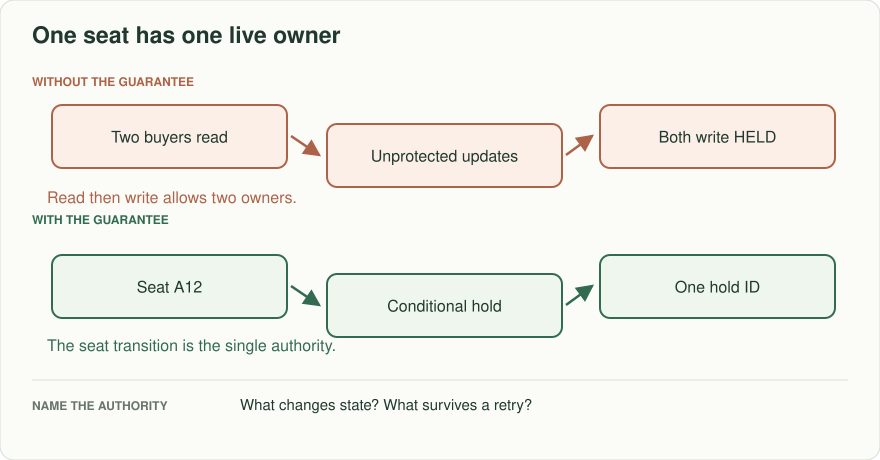
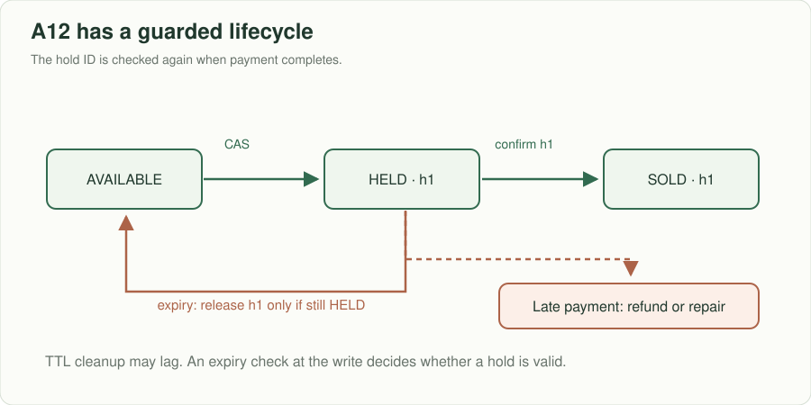
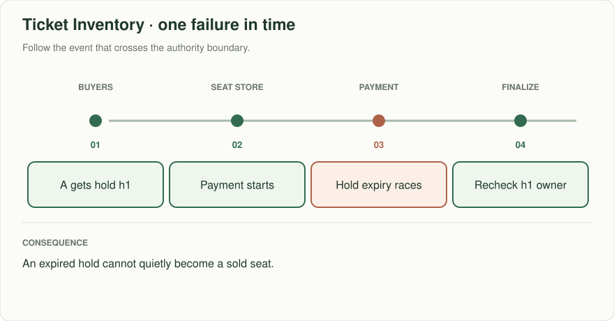
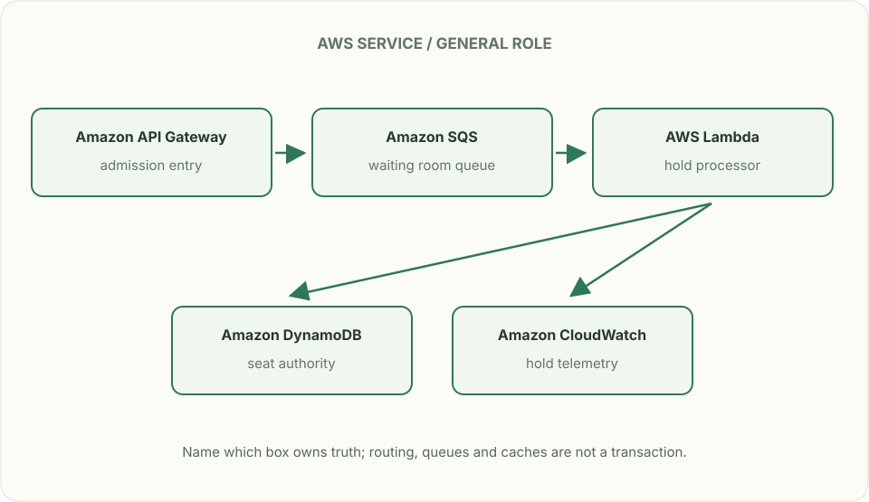

# Ticket inventory: one seat, two buyers

*Design brief · diagrams and reasoning exercises; no complete application is supplied.*

> **Interviewer:** “A theater sells assigned seats. Two buyers see A12 as available and both click Reserve. One pays; the other loses connection after the server accepts a hold. Prevent overselling, expire abandoned holds, and make the final result understandable to both buyers.”

Constructed practice brief. Assume 30,000 seats across a venue, an on-sale spike of 60,000 requests/s for 20 seconds, a five-minute hold, and a payment provider outside your database transaction. The spike is workload, not a promise that the database can write 60,000 seat updates/s.

| Event | Expected answer | Failure to prevent |
|---|---|---|
| A12 has no hold; Ana and Ben reserve concurrently | One valid hold ID; one explicit unavailable result | Two confirmed owners |
| Hold expires while payment completes | One documented authority chooses whether capture wins or is refunded | Sold seat returning to inventory |
| Same request ID retried after lost reply | Return the original hold/result | Two charges or two holds |
| Buyer releases A12 | The seat is available after the release commits | Stale hold silently blocking stock |

## Start with the invariant

At any instant, a seat can have at most one live owner or hold. Keep authoritative `seat_id, state, hold_id, expires_at, version` together. A conditional transition from AVAILABLE (or expired under a checked lease) to HELD is the linearization point. Do not implement “read AVAILABLE, then write HELD” as two unprotected operations. Use the server's authoritative time for expiry; TTL cleanup is not the decision itself. A client countdown only shows an estimate.

Queue or waiting-room admission can keep the sale alive under burst, but it does not fix seat correctness. Partition seats by event or seat ID, protect popular sections from hot partitions, and decide if selecting adjacent seats requires one atomic reservation of all requested seats. If not supported, reject the group or explicitly offer partial seats; never silently split a paid order.

Trace the orange path separately: expiry releases only hold `h1` if it still owns the seat. A payment arriving after expiry requires a refund or repair record; it cannot change AVAILABLE directly to SOLD based on an obsolete hold.

## Follow the failure instead of guessing

Draw the seat write, the hold-expiry worker, the payment call, and the confirmation message as separate boundaries. Write a three-event trace where expiry and payment acknowledgement cross. The finalization step must recheck that *this hold* still owns the seat. A committed paid order needs one stable purchase ID. If payment succeeds but finalization loses the seat, record a compensating refund and a reconciliation owner; a retry must not hide that debt.

## Put the AWS names on the boxes

**Why these boxes, and what changes the choice:** DynamoDB conditionally moves one seat from FREE to HELD; Aurora with a row lock is an alternative when grouped seats require relational transactions. SQS buffers arrivals but is not the seat owner. Lambda handles holds; ECS suits long-lived, predictable reservation workers.

Read the smaller label under each service first: it names the architectural job. Then ask whether that service supplies the guarantee in the problem, or simply moves work to the next box.

**Senior follow-up:** The waiting room admits 2,000 buyers/s while the reservation store handles 300 writes/s. Calculate queue growth over 30 seconds; surface wait time and bound admissions. Explain cancellations, payment timeout, and how an operator reconciles provider charges against confirmed orders.

**Staff follow-up:** Tickets are sold from two Regions. Eventual cross-Region replication cannot guarantee a globally unique owner of A12. Select a home-region write owner or strong global coordination, state the availability/latency trade, and rehearse failover while one hold is in flight.

**Practice artifact:** Seat state machine, before/after box diagram, race timeline, two competing transactions, and a failure table containing charge success with database failure. Re-run the timeline with a duplicated client request.

**AWS translation:** A DynamoDB conditional item update or a relational row lock can arbitrate one seat; DynamoDB Transactions or database transactions are needed when reserving a group atomically. EventBridge/SQS may carry notifications after the authoritative commit; neither determines seat ownership. [DynamoDB consistency](https://docs.aws.amazon.com/amazondynamodb/latest/developerguide/HowItWorks.ReadConsistency.html) and [global-table modes](https://docs.aws.amazon.com/amazondynamodb/latest/developerguide/bp-global-table-design.html) constrain the regional claim.

**Source note:** This is an original practice scenario modeling common inventory races. No company attribution or claim that these numbers come from production.
