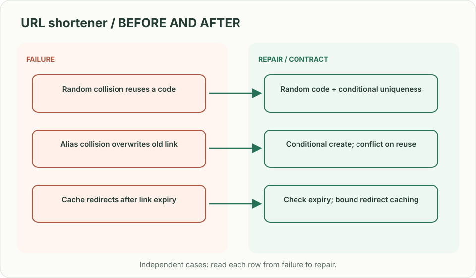
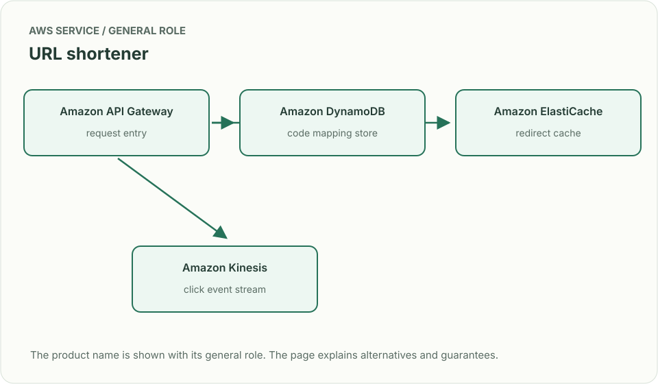
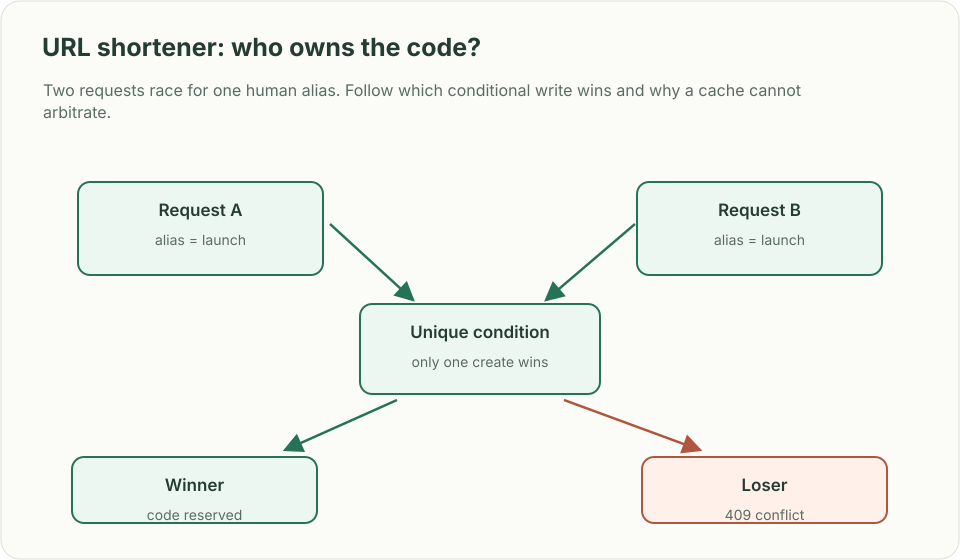

# URL shortener: who owns the code?

*Design brief · diagrams and reasoning exercises; no complete application is supplied.*

> **Interviewer:** “Turn long links into short links that redirect quickly. Users can choose a custom alias, set an expiry, and inspect click counts. What happens if two people request the same alias?”

This is a **commonly listed system-design interview prompt** with a concrete practice contract. Assume 30 million new links/day, 3 billion redirects/day, and redirect p99 below 100 ms. Start with redirect correctness; make analytics asynchronous. Clarify service guarantees and a first version before filling the board with services.

| Situation | Input / condition | Expected result |
|---|---|---|
| New link | Create a URL with a 30-day expiry | Return one durable, unguessable short code. |
| Alias collision | Two tenants request `launch` | One conditional create wins; the other gets a conflict. |
| Expired link | Resolve after expiry | Return a defined not-found/expired response; never redirect stale cache. |
| Hot link | One campaign gets 80k redirects/s | Serve a safe cached mapping without losing expiry or abuse controls. |

## Think from the contract to the boxes

A code is an identifier, not proof that the row was created. Allocate with uniqueness enforced by the durable store, then publish the mapping to caches. Redirects are reads; clicks are events, so a slow analytics write must not block the redirect. Decide whether expired links are immediately invalid or invalid after a bounded cache TTL, then make that bound visible in the contract.

**First diagram:** Trace alias creation through uniqueness, cache fill, redirect, expiry invalidation, and click aggregation.

| AWS service / general role | Why it fits this design | Alternative and when it fits better |
|---|---|---|
| **Amazon API Gateway** / request entry | Authenticate link creation and shape redirects. | ALB + ECS when custom redirect handling and connection reuse matter. |
| **Amazon DynamoDB** / code mapping store | Conditional put gives the chosen code one owner. | Aurora PostgreSQL for relational ownership and reporting queries. |
| **Amazon ElastiCache** / redirect cache | Serve hot code-to-target lookups cheaply. | CloudFront for globally distributed redirect caching. |
| **Amazon Kinesis** / click event stream | Move click counts off the redirect path. | SQS for simpler asynchronous counting with looser event-time needs. |

Service choice follows the contract: the box label gives the generic job, while the table explains the AWS product and a reasonable substitute. Name which component owns durable truth, where retries happen, and the guarantee each managed service does **not** provide by itself.

## Pressure-test the design

**Follow-up: Two requests race for one human alias. Follow which conditional write wins and why a cache cannot arbitrate.**

**Senior expectation:** A cached target was changed for a phishing report. Bound invalidation delay, add a deny list that wins over cache, and explain the emergency kill switch.

**Staff expectation:** Aliases become a cross-region namespace. Choose a home for uniqueness, define collision behavior during partitions, and bound how many codes can be lost or allocated twice.

**Practice artifact:** Trace alias creation through uniqueness, cache fill, redirect, expiry invalidation, and click aggregation. Then trace every row in the table, draw one failure, and state what the customer observes. Suggested rehearsal: 35 minutes design, 10 minutes to challenge the guarantees.

**Evidence and origin:** The current community interview-question catalog lists user-submitted URL-shortener reports across companies including PayPal, Microsoft, and JPMorgan Chase; individual report dates are not shown. The entry does not show the interview date and is not a verified company rubric. The prompt contract, workload, outcomes, diagrams and solution here are original practice material. Treat company tags as reported sightings, not a prediction of your interview loop.

**Interview report listing:** [Open the community question entry](https://www.hellointerview.com/community/questions/url-shortener-design/cm5svnaco01dqxszbok7e1lk1).
