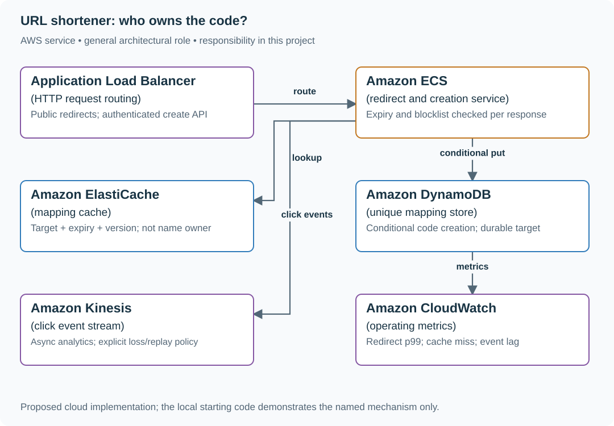

# Build short links with unique aliases and safe redirects

## Application background

Marketing teams publish short campaign URLs. A creator submits a destination and optional alias; readers open the alias and receive an HTTP redirect. Expired or blocked aliases must stop working.

This is a fictional engineering scenario. The workload figures later in the page are exercise assumptions, not measured production traffic.

## Your assignment

**Deliver:** Alias creation and redirect endpoints, an atomic alias reservation, and an expiry/blocking path.

Build a campaign-link service for a marketing platform. A creator reserves /launch for a product announcement; another creator requests the same alias at the same instant. Readers need fast redirects, while the abuse team needs expired and blocked links to stop resolving.

**Required behavior:** POST /links accepts target, optional alias and expiry; return 201 or 409. GET /{code} returns 302 with Cache-Control: no-store, or 410 after expiry. The management API requires ownership.

The required first milestone is a working local implementation of the behavior above. The numbered implementation steps define the scope; the cloud architecture is a later extension, not something the starter has already provisioned.

## Get the code and run the supplied example

The code is in the public [junior-to-staff repository](https://github.com/Soulful-Iris/junior-to-staff). Install Git and Python 3.12+. No AWS account or Python packages are required for this first run. If you already have a checkout, use it and skip cloning.

```bash
git clone https://github.com/Soulful-Iris/junior-to-staff.git
cd junior-to-staff
python3 examples/architecture-starts/url_shortener.py
```

**Supplied file:** [`examples/architecture-starts/url_shortener.py`](https://github.com/Soulful-Iris/junior-to-staff/blob/main/examples/architecture-starts/url_shortener.py). You can also [read or download the source here](../../../../examples/architecture-starts/url_shortener.py).

This program is a **mechanism demonstration**: it runs the small scenario in one process and prints the result. It is not an HTTP service, a complete application, or an AWS deployment. A successful run demonstrates this mechanism only; it does not establish the workload or failure guarantees of the application you will build.

**Example output from the supplied run:**

Generated IDs and timestamps may differ; compare the state transitions and outcomes.

```text
201 reserved launch for https://example.com/one
409 alias already owned
now 99 302 https://example.com/one
now 100 410 expired
… (more output follows)
```

### Set up your implementation workspace

Create `work/url-shortener/` in your checkout (or use a separate repository). Copy the supplied mechanism into that directory as `mechanism.py`, then extract its state transitions into functions you can call from your implementation. The record and module names below describe what you must implement; they are not a promise that files with those names already exist. Keep a `README.md` beside your implementation with its exact run commands and observed results.

## Local components and state to implement

This table names the records, interfaces or decision inputs for your deliverable. Unless a name is explicitly linked to supplied source above, it is something you create. Implement the local state transitions first, then connect the HTTP, storage or worker boundaries required by the steps.

| Record / module | Key or interface | Responsibility |
|---|---|---|
| links | code → owner,target,expires_at,version | Durable uniqueness authority. |
| request_results | (owner,request_id) → payload hash and code | Keeps random-code allocation stable after a lost response. |
| redirect.py / analytics.py | resolve(code, now); record_click(event_id) | Separate resolving the mapping from counting an event. |

## Implement the assignment

### 1. Implement alias ownership

Use a unique database key or DynamoDB conditional put. Do not check then insert as two separate unprotected operations. For generated codes, retry a random-code collision with a fresh candidate; persist the allocated code with the create operation’s identity.

### 2. Write the redirect path

Read target, expiry and version. Check the timestamp before constructing the response. Return `302` and `Cache-Control: no-store`; ordinary CDN/browser redirect caching can outlive your expiry decision. Reject unsupported target schemes and restrict management changes to the owner.

### 3. Handle a hot campaign

Cache mapping data inside the resolver and coalesce concurrent misses per code. Maintain a blocklist whose maximum accepted age is five seconds for this exercise; if that authority is unavailable or too old, fail closed for redirects. Demonstrate expiry with a deliberately stale cached mapping.

### 4. Count clicks asynchronously

Emit events with a stable event ID and timestamp. Define whether failed event publication can undercount analytics; redirect availability and complete click accounting are different promises. Aggregate duplicates by event ID inside a bounded replay window and report delayed counts explicitly.

## Demonstrate the completed local result

| Action | Expected visible result |
|---|---|
| Run the starting program | The first launch reservation wins; the second conflicts. A cached mapping returns 410 at time 100. |
| Pause blocklist refresh | Redirects stop once policy age exceeds five seconds. |
| Slow the click consumer | Redirect latency remains bounded while the visible analytics lag grows. |

**Handoff:** In your implementation README, include the start command, one successful operation, the failure case above and the resulting stored state or decision. State which dependencies are simulated. Someone with a fresh checkout should be able to reproduce this without your chat history.

## Workload assumptions and capacity decisions

These are constructed exercise assumptions. The stated workload is a design target; the local demonstration does not establish that throughput. Use the [estimation constants](../../../01-code/01-problem-solving/estimation-constants.md) to check units before choosing capacity.

| Input or objective | Calculation / consequence |
|---|---|
| 30 million links/day | 30,000,000 / 86,400 ≈ 347 creates/s average; provision for the actual burst, not just this mean. |
| 3 billion redirects/day | About 34,722 redirects/s average; model the existing 80,000/s hot-campaign case separately. |
| 100 ms redirect p99; 30-day default expiry | Keep analytics off the critical path and enforce expiration on each lookup, including cache hits. |

## Map the local implementation to AWS

**Deployment status: local only.** Running the supplied command creates no AWS resources and configures no cloud connections. The diagram is a proposed deployment of the completed application. Each box needs either a deployed runtime, a provisioned service or an explicitly external dependency.

Read the diagram by following the arrows from the entry point: application code accepts the request or event, the state owner commits it, and any worker produces the later result. The table ties those roles to code and adapter work. Multiple boxes do not imply multiple Python files already exist.



An ECS resolver behind an ALB makes its in-memory connections and cache behavior explicit at sustained traffic. API Gateway/Lambda is a reasonable smaller baseline. The database owns names; a cache only accelerates reads of already-owned mappings.

| Local responsibility | Cloud destination and role | Implementation still required |
|---|---|---|
| Local HTTP listener | Application Load Balancer: HTTP request routing | Deploy a service behind a target group, configure health checks and bounded connection/request behavior. |
| Application or worker process | Amazon ECS: redirect and creation service | Build a container and task definition; supply configuration, task roles and graceful shutdown behavior. |
| Local cache, counter or coordination state | Amazon ElastiCache: mapping cache | Implement a Redis/Valkey adapter and atomic operations, expiry and unavailable-cache behavior; keep the durable authority separate. |
| Local dictionary, SQLite records or state model | Amazon DynamoDB: unique mapping store | Design partition/sort keys and write a storage adapter with conditional updates or transactions; Python state and SQL are not uploaded as a database. |
| Local event sequence or input stream | Amazon Kinesis: click event stream | Implement producer/consumer adapters, partition keys, durable acceptance and checkpoint/replay behavior. |
| Local counters, timestamps and diagnostic output | Amazon CloudWatch: operating metrics | Emit bounded metrics and logs, build the named operational view and configure retention and access. |

### Provision resources, then connect the application

| Resource or boundary | Initial configuration and reason |
|---|---|
| DynamoDB mapping table | Use the short code as the unique key; conditional create; backup enabled. TTL is cleanup, not the expiry check. |
| ECS resolver + ALB | Start with two tasks in separate AZs and a bounded connection pool. Size from measured requests per task; do not infer 80k/s from the diagram. |
| ElastiCache | Use cached target/expiry/version with bounded memory; apply expiration and abuse policy on every response. |
| Kinesis and monitoring | Stream click records separately; observe mapping-cache misses, redirect p99, blocklist age and analytics lag. |

Use one disposable AWS environment for the cloud exercise. Put the named resources in `infra/template.yaml` or your existing IaC tool, pass resource IDs through configuration, and scope each runtime role to its own tables, buckets and queues. The diagram is a design to implement; it is not a claim that these resources have been deployed. Record the commands you used to deploy and remove the exercise resources.

For concrete provisioning commands, configuration wiring and cleanup, use the [AWS foundation guide](../../../../examples/architecture-starts/infra/README.md). It includes a deployable table/queue/object-storage foundation and explains which application and service adapters you still implement.

A provisioned queue or table does not make the local program use it. Configure resource IDs in the deployed runtime, replace the local adapter, and replay the same successful and failing operation against that runtime. Record the deployed commit and observable result, then remove the disposable resources using your infrastructure tool.

## Extend the design after the baseline works


At multi-region scale, choose one owner for alias allocation or a globally consistent authority. Do not let two independent regional caches reserve the same alias. Quantify added write latency and what a region does during loss of the allocation authority.

<details>
<summary>Additional design cases, alternatives and original source notes</summary>


This is a **commonly listed system-design interview prompt** with a concrete practice contract. Assume 30 million new links/day, 3 billion redirects/day, and redirect p99 below 100 ms. Start with redirect correctness; make analytics asynchronous. Clarify service guarantees and a first version before filling the board with services.

| Situation | Input / condition | Expected result |
|---|---|---|
| New link | Create a URL with a 30-day expiry | Return a durably unique random code; chosen aliases are guessable. |
| Alias collision | Two tenants request `launch` | One conditional create wins; the other gets a conflict. |
| Expired link | Resolve after expiry | Return a defined not-found/expired response; never redirect stale cache. |
| Hot link | One campaign gets 80k redirects/s | Serve a safe cached mapping without losing expiry or abuse controls. |

## Think from the contract to the boxes

A code is an identifier, not proof that the row was created. Allocate with uniqueness enforced by the durable store, then publish the mapping to caches. Redirects are reads; clicks are events, so a slow analytics write must not block the redirect. This brief promises **no new redirect after the expiry decision time**. Cache `(target, expires_at, version)`, but check `now < expires_at` on every resolution, even on a cache hit. TTL eviction is storage cleanup, not the check. Use `302` with `Cache-Control: no-store` and disable redirect-response caching in the CDN; cache mapping data inside the service instead. An optional edge implementation must enforce the same timestamp and clock-skew policy before every redirect, not just when filling its cache.

**Check with values:** warm a mapping expiring at `10:00:00`; leave it in cache and resolve at `10:00:01` → `410`. Repeat through the browser/CDN and confirm neither reuses an old redirect. A redirect already sent before expiry cannot recall a destination the client learned.

**Abuse is a separate clock:** choose a five-second maximum age for the deny-list snapshot in this exercise. A blocked code wins over a cached mapping; an older or unavailable snapshot fails closed. Test a takedown with invalidation paused. Random generated codes reduce enumeration but do not authorize a private link; require authentication and ownership checks for private resources.

**First diagram:** Trace alias creation through uniqueness, cache fill, redirect, expiry invalidation, and click aggregation.

| AWS service / general role | Why it fits this design | Alternative and when it fits better |
|---|---|---|
| **Amazon API Gateway** / request entry | Authenticate link creation and shape redirects. | ALB + ECS when custom redirect handling and connection reuse matter. |
| **Amazon DynamoDB** / code mapping store | Conditional put gives the chosen code one owner. | Aurora PostgreSQL for relational ownership and reporting queries. |
| **Amazon ElastiCache** / redirect cache | Serve hot code-to-target lookups cheaply. | CloudFront plus an edge resolver only when each response enforces expiry and takedown; ordinary cached redirects weaken this contract. |
| **Amazon Kinesis** / click event stream | Move click counts off the redirect path. | SQS for simpler asynchronous counting with looser event-time needs. |

Service choice follows the contract: the box label gives the generic job, while the table explains the AWS product and a reasonable substitute. Name which component owns durable truth, where retries happen, and the guarantee each managed service does **not** provide by itself.

## Pressure-test the design

**Follow-up: Two requests race for one human alias. Follow which conditional write wins and why a cache cannot arbitrate.**

**Senior expectation:** A cached target was changed for a phishing report. Bound invalidation delay, add a deny list that wins over cache, and explain the emergency kill switch.

**Staff expectation:** Aliases become a cross-region namespace. Choose a home for uniqueness, define collision behavior during partitions, and bound how many codes can be lost or allocated twice.

**Practice artifact:** Trace alias creation through uniqueness, cache fill, redirect, expiry invalidation, and click aggregation. Then trace every row in the table, draw one failure, and state what the customer observes. Suggested rehearsal: 35 minutes design, 10 minutes to challenge the guarantees.

**Evidence and origin:** The current community interview-question catalog lists user-submitted URL-shortener reports across companies including PayPal, Microsoft, and JPMorgan Chase; individual report dates are not shown. The entry does not show the interview date and is not a verified company rubric. The prompt contract, workload, outcomes, diagrams and solution here are original practice material. Treat company tags as reported sightings, not a prediction of your interview loop.

**Interview report listing:** [Open the community question entry](https://www.hellointerview.com/community/questions/url-shortener-design/cm5svnaco01dqxszbok7e1lk1).

</details>
