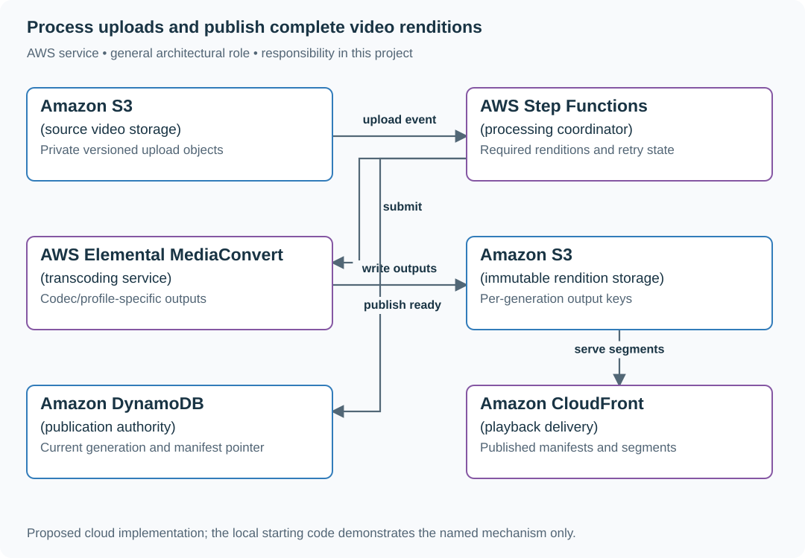
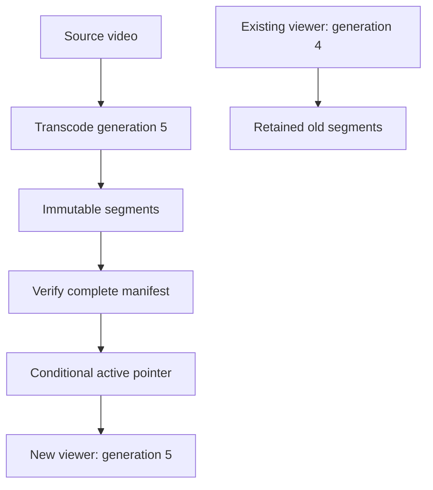

# Process uploads and publish complete video renditions

## Application background

An instructor uploads a large training video. Students need smaller versions suited to different screens and internet speeds. The processing service creates those versions before making the video available to watch.

A rendition is one prepared version of the video. A playback manifest lists the files a player can request. Publishing that list before its files exist would give students a video that starts and then fails.

### Example walkthrough

| Action | Expected behavior |
|---|---|
| An instructor uploads a source video | Record a processing job. |
| Two renditions finish and a third fails | Keep the incomplete playback set unpublished. |
| The missing rendition is rebuilt successfully | Publish a manifest pointing only to complete files. |

Upload success means the source file arrived. Playback readiness is a later result that the application must track explicitly.

## Your assignment

**Deliver:** Build upload and processing records for each video version. Publish a playback manifest only when all required output files are complete, and allow failed work to resume.

**Required behavior:** Create an upload session, accept a completed source object, and expose processing status. Publish a versioned playback manifest only after every required rendition is verified. Reprocessing creates a new generation without overwriting the currently published one.

The required first milestone is a working local implementation of the behavior above. The numbered implementation steps define the scope. The cloud architecture is a later extension, not something the starter has already provisioned.

## Get the code and run the supplied example

The code is in the public [junior-to-staff repository](https://github.com/Soulful-Iris/junior-to-staff). Install Git and Python 3.12+. No AWS account or Python packages are required for this first run. If you already have a checkout, use it and skip cloning.

```bash
git clone https://github.com/Soulful-Iris/junior-to-staff.git
cd junior-to-staff
python3 examples/architecture-starts/video_processing.py
```

**Supplied file:** [`examples/architecture-starts/video_processing.py`](https://github.com/Soulful-Iris/junior-to-staff/blob/main/examples/architecture-starts/video_processing.py). You can also [read or download the source here](../../../../examples/architecture-starts/video_processing.py).

This program is a **mechanism demonstration**: it runs the small scenario in one process and prints the result. It is not an HTTP service, a complete application, or an AWS deployment. A successful run demonstrates this mechanism only. It does not establish the workload or failure guarantees of the application you will build.

**Example output from the supplied run:**

Generated IDs and timestamps may differ. Compare the state transitions and outcomes.

```text
still processing: ['1080p']
ready
{'360p': 'g2/360.mp4', '720p': 'g2/720.mp4', '1080p': 'g2/1080.mp4'}
```

### Set up your implementation workspace

Create `work/video-processing/` in your checkout (or use a separate repository). Copy the supplied mechanism into that directory as `mechanism.py`, then extract its state transitions into functions you can call from your implementation. The record and module names below describe what you must implement. They are not a promise that files with those names already exist. Keep a `README.md` beside your implementation with its exact run commands and observed results.

## Local components and state to implement

This table names the records, interfaces or decision inputs for your deliverable. Unless a name is explicitly linked to supplied source above, it is something you create. Implement the local state transitions first, then connect the HTTP, storage or worker boundaries required by the steps.

| Record / module | Key or interface | Responsibility |
|---|---|---|
| uploads | upload_id,owner,source_key,checksum | Authorized source object and completion evidence. |
| processing_jobs | video_id,generation,required_outputs,state | Current ownership and expected rendition set. |
| manifests | video_id,generation,object_keys | Atomic pointer to verified complete output. |

## Implement the assignment

### 1. Accept and verify a source upload

Issue a short-lived upload authorization scoped to owner, key, size and allowed type. On completion, inspect object metadata and checksum where available. Object notifications may duplicate, so create processing identity from video and source version rather than notification delivery ID.

### 2. Run versioned processing

Store the required rendition list and generation before submission. Use MediaConvert for supported managed transcoding or a bounded container worker for custom processing. Retry failed work under the same logical job while writing immutable attempt-specific outputs.

### 3. Publish a complete manifest

Verify that each required output is present, readable and belongs to the current source generation. Commit ready plus the manifest pointer conditionally. A late success from an old generation must not replace newer output.

### 4. Expose progress and repair

Show queued, processing, failed and ready with a reason and last progress time. Track queue wait separately from encoding duration. Keep original input until the documented reprocessing/retention policy allows removal. Clean orphan output after active attempts expire.

## Demonstrate the completed local result

| Action | Expected visible result |
|---|---|
| Run the starting program | Two renditions remain processing. The third enables publication. |
| Deliver a duplicate source notification | One logical processing generation exists. |
| Finish an old generation late | The current manifest pointer is unchanged. |

**Handoff:** In your implementation README, include the start command, one successful operation, the failure case above and the resulting stored state or decision. State which dependencies are simulated. Someone with a fresh checkout should be able to reproduce this without your chat history.

## Workload assumptions and capacity decisions

These are constructed exercise assumptions. The stated workload is a design target. The local demonstration does not establish that throughput. Use the [estimation constants](../../../01-code/01-problem-solving/estimation-constants.md) to check units before choosing capacity.

| Input or objective | Calculation / consequence |
|---|---|
| 50,000 uploads/day | About 0.58 uploads/s average. The stated 300 concurrent processing jobs is a separate peak. |
| 99% of files below 2 GB ready within ten minutes | Measure from completed upload to published manifest. Separate upload time and processing queue time. |
| Three renditions/source assumption | Track 150,000 rendition outcomes/day, plus retries and reprocessing generations. |

## Map the local implementation to AWS

**Deployment status: local only.** Running the supplied command creates no AWS resources and configures no cloud connections. The diagram is a proposed deployment of the completed application. Each box needs either a deployed runtime, a provisioned service or an explicitly external dependency.

Read the diagram by following the arrows from the entry point: application code accepts the request or event, the state owner commits it, and any worker produces the later result. The table ties those roles to code and adapter work. Multiple boxes do not imply multiple Python files already exist.



Transcoding completion and publication are separate decisions. Step Functions tracks workflow progress. DynamoDB’s conditional pointer makes one complete generation visible to readers.

| Local responsibility | Cloud destination and role | Implementation still required |
|---|---|---|
| Local file, object fixture or exported payload | Amazon S3: source video storage | Implement upload/download and metadata adapters, scoped access, object naming, retention and incomplete-upload cleanup. |
| Local workflow transitions | AWS Step Functions: processing coordinator | Define workflow tasks and durable transition inputs. Retries still need application-level idempotency and reconciliation. |
| Local rendition result fixture | AWS Elemental MediaConvert: transcoding service | Submit identified conversion jobs, handle completion/failure events and publish only complete output sets. |
| Local file, object fixture or exported payload | Amazon S3: immutable rendition storage | Implement upload/download and metadata adapters, scoped access, object naming, retention and incomplete-upload cleanup. |
| Local dictionary, SQLite records or state model | Amazon DynamoDB: publication authority | Design partition/sort keys and write a storage adapter with conditional updates or transactions. Python state and SQL are not uploaded as a database. |
| Local static/media delivery path | Amazon CloudFront: playback delivery | Configure an origin, cache policy and private-content access. Distinguish cached bytes from current authorization. |

### Provision resources, then connect the application

| Resource or boundary | Initial configuration and reason |
|---|---|
| S3 upload/output | Separate private prefixes or buckets, scoped upload authorization and lifecycle for abandoned multipart uploads. |
| MediaConvert jobs | Explicit output profiles, account concurrency/quota review, bounded retries and completion-event reconciliation. |
| Publication | Conditional generation change. CloudFront origin access restricted to the intended output bucket. |

Use one disposable AWS environment for the cloud exercise. Put the named resources in `infra/template.yaml` or your existing IaC tool, pass resource IDs through configuration, and scope each runtime role to its own tables, buckets and queues. The diagram is a design to implement. It is not a claim that these resources have been deployed. Record the commands you used to deploy and remove the exercise resources.

For concrete provisioning commands, configuration wiring and cleanup, use the [AWS foundation guide](../../../../examples/architecture-starts/infra/README.md). It includes a deployable table/queue/object-storage foundation and explains which application and service adapters you still implement.

A provisioned queue or table does not make the local program use it. Configure resource IDs in the deployed runtime, replace the local adapter, and replay the same successful and failing operation against that runtime. Record the deployed commit and observable result, then remove the disposable resources using your infrastructure tool.

## Extend the design after the baseline works
### Worked follow-up: Publish a new video generation while viewers use the old one

Overwriting segment files in place lets a player combine an old manifest with new bytes. Deleting the old generation immediately can break viewers who already loaded its manifest.

| Starting design | Changed requirement |
|---|---|
| A completed transcode publishes one manifest. | Reprocessing builds a replacement without disrupting existing playback. |

**Revised architecture.** Follow the changed responsibility and failure path below. This is a design to implement. The supplied local example does not provision these components.



**What to implement.** Write segments under immutable generation-specific S3 keys. Record a manifest only after all required outputs are complete and verified. Atomically change the active generation pointer using the expected prior version. Existing sessions keep their old manifest until the documented session and delivery-cache retention bound. Garbage collection checks that bound before deleting old objects. Failed reprocessing leaves the old pointer intact.

**Walk through the result.** Play generation 4 while generation 5 fails halfway through encoding. New sessions must still receive 4. Complete 5 and switch the pointer once. Show an existing session fetching a generation-4 segment and a new session fetching generation 5. Hand over the publication condition and deletion eligibility rule.


Allow students to keep watching during reprocessing. Keep the previous manifest valid until the new generation is complete, and define when old segments can be removed without breaking active sessions.

<details>
<summary>Additional design cases, alternatives and original source notes</summary>


Assume 50,000 uploads/day, peak 300 concurrent uploads, and a 99% target of publish-ready within ten minutes for videos under 2 GB. The target is a hypothetical exercise requirement. Clarify whether larger files have a different SLA.

| Situation | Observable result |
|---|---|
| Upload session created, bytes never arrive | Expiring session. No playable video |
| Client retries the last part | Already accepted part is not doubled in final object |
| Transcoder writes one rendition, then crashes | Retry resumes or safely replaces output. No premature READY |
| Creator revokes a published video | New playback requests denied. Address old signed URLs' expiry |

## Design the state machine first

CREATED → UPLOADING → RECEIVED → PROCESSING → READY, with FAILED and DELETED branches. A signed upload permission is scoped to one object key and expires. It is not a proof that the final object exists or passes validation. Verify completion, size, content type, owner, and malware policy before enqueueing work. Commit READY only after all required outputs and metadata are durable. Treat object events as triggers to reconcile state, not as unique commands.

## Draw the byte path and the control path

The small API path creates a session and reports status. Bytes travel directly to object storage. A worker creates renditions and publishes a manifest. Playback requests pass authorization and fetch content via CDN. Specify which objects get cleaned when an upload expires, a job fails, or a creator deletes the video. A video CDN reduces origin load. It does not itself authorize revoked users after a signed URL was issued.

## Put the AWS names on the boxes

**Why these boxes, and what changes the choice:** Direct S3 upload keeps bytes away from API workers. MediaConvert handles managed media jobs. ECS with FFmpeg fits custom codecs and scheduling. DynamoDB moves status to READY only when outputs exist, SQS can redeliver, and CloudFront distributes authorized renditions.


**Senior follow-up:** Publishing has a ten-minute target but the processing queue waits twelve minutes. Estimate arrivals × average work and worker demand. Prioritize small jobs fairly without starving large jobs. Expose P50/P99 ingest-to-ready and DLQ age, not just successful worker duration.

**Staff follow-up:** A viral launch floods playback while an owner requests removal. State revocation delay and signed URL expiry. Describe a stricter authorized delivery path when immediate revocation is mandatory. Budget transcoding and egress cost under peak demand.

**Practice artifact:** Draw an upload status machine, two paths, and a failure timeline for a duplicated transcode. Explain what READY certifies and give three testable stop conditions.

**AWS translation:** Short-lived S3 multipart upload URLs, private buckets, SQS for processing triggers, ECS/MediaConvert for conversion depending on requirements, and CloudFront for delivery. Standard SQS can redeliver. Use job identity and compare state before committing output. Read [SQS visibility semantics](https://docs.aws.amazon.com/AWSSimpleQueueService/latest/SQSDeveloperGuide/sqs-visibility-timeout.html) and [CloudFront signed URL semantics](https://docs.aws.amazon.com/AmazonCloudFront/latest/DeveloperGuide/private-content-creating-signed-url-canned-policy.html).

**Source note:** Original scenario with exercise numbers. Cloud service capabilities are linked, not attributed interview questions.

</details>
