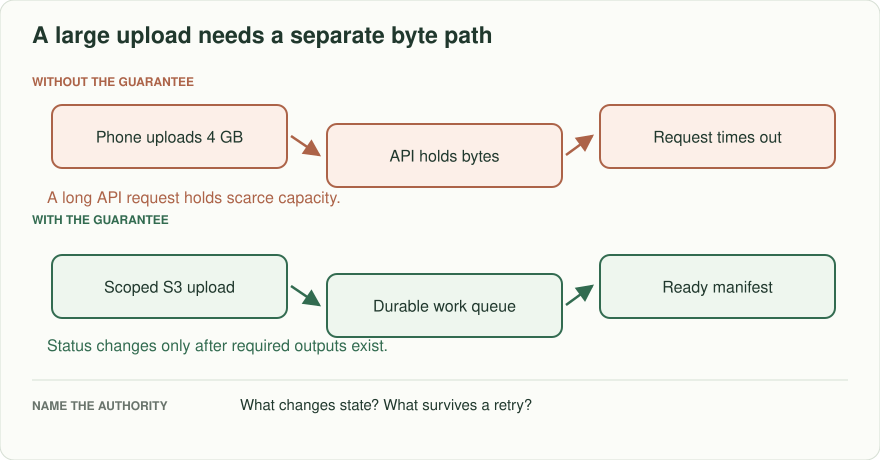
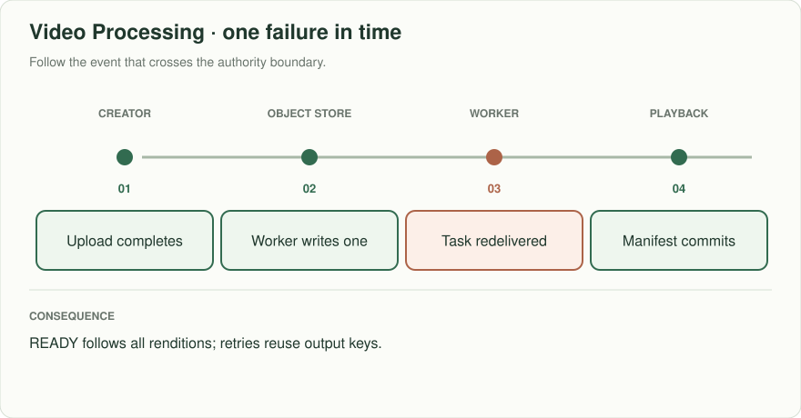
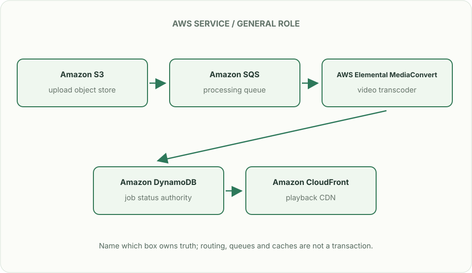

# Video processing: accept once, publish when ready

> **Interviewer:** “Creators upload 4 GB videos. Processing produces three renditions and a thumbnail. The mobile connection drops mid-upload; a transcode task times out after writing one rendition. Design the upload and watch experience without making the API hold a 4 GB request open.”

Assume 50,000 uploads/day, peak 300 concurrent uploads, and a 99% target of publish-ready within ten minutes for videos under 2 GB. The target is a hypothetical exercise requirement; clarify whether larger files have a different SLA.

| Situation | Observable result |
|---|---|
| Upload session created, bytes never arrive | Expiring session; no playable video |
| Client retries the last part | Already accepted part is not doubled in final object |
| Transcoder writes one rendition, then crashes | Retry resumes or safely replaces output; no premature READY |
| Creator revokes a published video | New playback requests denied; address old signed URLs' expiry |

## Design the state machine first

CREATED → UPLOADING → RECEIVED → PROCESSING → READY, with FAILED and DELETED branches. A signed upload permission is scoped to one object key and expires; it is not a proof that the final object exists or passes validation. Verify completion, size, content type, owner, and malware policy before enqueueing work. Commit READY only after all required outputs and metadata are durable. Treat object events as triggers to reconcile state, not as unique commands.

## Draw the byte path and the control path

The small API path creates a session and reports status. Bytes travel directly to object storage; a worker creates renditions and publishes a manifest. Playback requests pass authorization and fetch content via CDN. Specify which objects get cleaned when an upload expires, a job fails, or a creator deletes the video. A video CDN reduces origin load; it does not itself authorize revoked users after a signed URL was issued.

## Put the AWS names on the boxes

**Why these boxes, and what changes the choice:** Direct S3 upload keeps bytes away from API workers. MediaConvert handles managed media jobs; ECS with FFmpeg fits custom codecs and scheduling. DynamoDB moves status to READY only when outputs exist, SQS can redeliver, and CloudFront distributes authorized renditions.

Read the smaller label under each service first: it names the architectural job. Then ask whether that service supplies the guarantee in the problem, or simply moves work to the next box.

**Senior follow-up:** Publishing has a ten-minute target but the processing queue waits twelve minutes. Estimate arrivals × average work and worker demand. Prioritize small jobs fairly without starving large jobs; expose P50/P99 ingest-to-ready and DLQ age, not just successful worker duration.

**Staff follow-up:** A viral launch floods playback while an owner requests removal. State revocation delay and signed URL expiry; describe a stricter authorized delivery path when immediate revocation is mandatory. Budget transcoding and egress cost under peak demand.

**Practice artifact:** Draw an upload status machine, two paths, and a failure timeline for a duplicated transcode. Explain what READY certifies and give three testable stop conditions.

**AWS translation:** Short-lived S3 multipart upload URLs, private buckets, SQS for processing triggers, ECS/MediaConvert for conversion depending on requirements, and CloudFront for delivery. Standard SQS can redeliver; use job identity and compare state before committing output. Read [SQS visibility semantics](https://docs.aws.amazon.com/AWSSimpleQueueService/latest/SQSDeveloperGuide/sqs-visibility-timeout.html) and [CloudFront signed URL semantics](https://docs.aws.amazon.com/AmazonCloudFront/latest/DeveloperGuide/private-content-creating-signed-url-canned-policy.html).

**Source note:** Original scenario with exercise numbers; cloud service capabilities are linked, not attributed interview questions.
