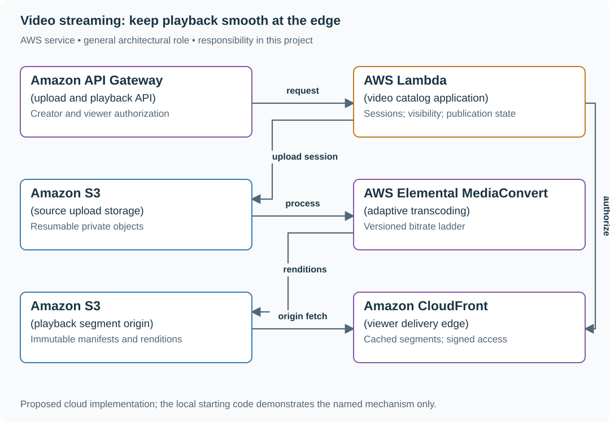
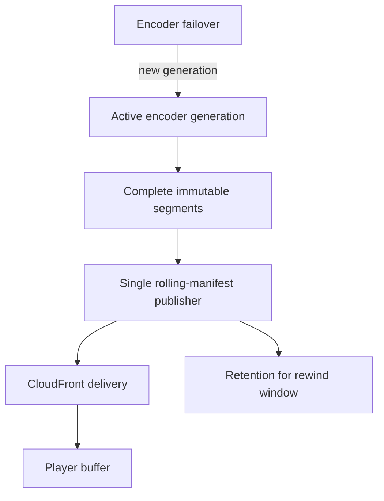

# Build resumable uploads and authorized video playback

## Application background

A creator uploads a video while viewers use phones and TVs to watch published videos. An interrupted upload should resume from the pieces already received. During playback, the player switches between prepared video sizes as the connection changes.

The application handles video identity, status and access permission. The media files are much larger than those records and need their own storage and delivery path. A popular release can put most of its load on that delivery path.

### Example walkthrough

| Action | Expected behavior |
|---|---|
| An upload stops after part 7 | Resume the same upload from the remaining parts. |
| An authorized viewer requests a private video | Give the player access to the allowed playback files. |
| The viewer's connection slows | Let the player request a smaller prepared rendition. |

Separate the small control requests, such as permission checks, from the large video bytes. Both paths must work for the viewer to watch successfully.

### Sizing that affects this decision

Five million uploads/day averages about 58 uploads/s. At an assumed mean source size of 500 MB, that is 2.5 PB/day of source bytes before making playback renditions. The 20 GB maximum upload size is a per-request limit, not the average to use in that storage estimate. This is why media delivery cannot be sized from API request counts alone.

These are exercise assumptions. The [estimation reference](../../../01-code/01-problem-solving/estimation-constants.md) explains the units and approximations. They do not establish the local demo's measured capacity.

## Your assignment

**Deliver:** Build resumable upload and authorized playback flows. Track when a video is ready and estimate the application traffic separately from the much larger video traffic.

**Required behavior:** Uploads are resumable and bounded to 20 GB. Playback returns a manifest only for a ready, authorized video. The target is p95 startup under two seconds, measured on a defined device/network cohort rather than promised for every connection.

The required first milestone is a working local implementation of the behavior above. The numbered implementation steps define the scope. The cloud architecture is a later extension, not something the starter has already provisioned.

## Get the code and run the supplied example

The code is in the public [junior-to-staff repository](https://github.com/Soulful-Iris/junior-to-staff). Install Git and Python 3.12+. No AWS account or Python packages are required for this first run. If you already have a checkout, use it and skip cloning.

```bash
git clone https://github.com/Soulful-Iris/junior-to-staff.git
cd junior-to-staff
python3 examples/architecture-starts/video_streaming_platform.py
```

**Supplied file:** [`examples/architecture-starts/video_streaming_platform.py`](https://github.com/Soulful-Iris/junior-to-staff/blob/main/examples/architecture-starts/video_streaming_platform.py). You can also [read or download the source here](../../../../examples/architecture-starts/video_streaming_platform.py).

This program is a **mechanism demonstration**: it runs the small scenario in one process and prints the result. It is not an HTTP service, a complete application, or an AWS deployment. A successful run demonstrates this mechanism only. It does not establish the workload or failure guarantees of the application you will build.

**Example output from the supplied run:**

Generated IDs and timestamps may differ. Compare the state transitions and outcomes.

```text
Resume missing parts: [2]
Upload complete: True
ana manifest allowed
ben 403
```

### Set up your implementation workspace

Create `work/video-streaming-platform/` in your checkout (or use a separate repository). Copy the supplied mechanism into that directory as `mechanism.py`, then extract its state transitions into functions you can call from your implementation. The record and module names below describe what you must implement. They are not a promise that files with those names already exist. Keep a `README.md` beside your implementation with its exact run commands and observed results.

## Local components and state to implement

This table names the records, interfaces or decision inputs for your deliverable. Unless a name is explicitly linked to supplied source above, it is something you create. Implement the local state transitions first, then connect the HTTP, storage or worker boundaries required by the steps.

| Record / module | Key or interface | Responsibility |
|---|---|---|
| upload_sessions | creator,session,object_key,parts | Resumable source transfer and expiry. |
| video_catalog | video_id,owner,visibility,generation,state | Current publication and access authority. |
| playback_sessions | viewer,video,generation,expires_at | Authorized access to a specific published rendition set. |

## Implement the assignment

### 1. Complete one resumable upload

Create multipart upload sessions scoped to one creator and source key. Track uploaded parts and finish only the intended object. Expire abandoned sessions and multipart data. Accept completion idempotently and never trust a browser’s ready flag as processing evidence.

### 2. Create adaptive playback output

Transcode a defined bitrate ladder into HLS or DASH segments. Publish an immutable versioned manifest after all required outputs are ready. Choose segment duration with startup delay, switching granularity and request overhead in mind. Document the exact profiles used in your small demo.

### 3. Authorize and distribute playback

Check current visibility before issuing a short-lived playback authorization. Restrict S3 origin access so users cannot bypass the CDN policy. Document that already issued signed access may remain valid until expiry. Proxy or shorten the window if immediate revocation is required.

### 4. Measure a cold and warm start

Capture time to authorization, manifest, first segment and first rendered frame. Compare a cold CDN object with a warm one and a constrained client connection. Tune the first-rendition choice and caching using the measured bottleneck, not only server response latency.

## Demonstrate the completed local result

| Action | Expected visible result |
|---|---|
| Run the starting program | Only part 2 needs resuming. Only the authorized viewer receives manifest access. |
| Interrupt a large upload | Resume missing parts without restarting completed transfer. |
| Request a processing video | Status is visible. No incomplete manifest is issued. |

**Handoff:** In your implementation README, include the start command, one successful operation, the failure case above and the resulting stored state or decision. State which dependencies are simulated. Someone with a fresh checkout should be able to reproduce this without your chat history.

## Workload assumptions and capacity decisions

These are constructed exercise assumptions. The stated workload is a design target. The local demonstration does not establish that throughput. Use the [estimation constants](../../../01-code/01-problem-solving/estimation-constants.md) to check units before choosing capacity.

| Input or objective | Calculation / consequence |
|---|---|
| Five million uploads/day | About 58 uploads/s average. At an assumed 500 MB mean that is 2.5 PB/day of source data before renditions. |
| 100 million viewers. 20 GB maximum upload | Maximum file size is a request bound, not the average storage assumption. |
| Two-second p95 playback start | Budget authorization, manifest fetch, first segment transfer and decoder startup independently. |

## Map the local implementation to AWS

**Deployment status: local only.** Running the supplied command creates no AWS resources and configures no cloud connections. The diagram is a proposed deployment of the completed application. Each box needs either a deployed runtime, a provisioned service or an explicitly external dependency.

Read the diagram by following the arrows from the entry point: application code accepts the request or event, the state owner commits it, and any worker produces the later result. The table ties those roles to code and adapter work. Multiple boxes do not imply multiple Python files already exist.



The CDN carries repeated viewer bytes. The application handles identity, catalog state and publication. Keeping large transfers off API servers changes both capacity and failure behavior.

| Local responsibility | Cloud destination and role | Implementation still required |
|---|---|---|
| Local HTTP boundary or the endpoint you will add | Amazon API Gateway: upload and playback API | Create routes and an integration. Translate requests and responses and configure identity validation. |
| Python operation or worker function | AWS Lambda: video catalog application | Write a Lambda event adapter, package its dependencies and give its role only the required resource actions. |
| Local file, object fixture or exported payload | Amazon S3: source upload storage | Implement upload/download and metadata adapters, scoped access, object naming, retention and incomplete-upload cleanup. |
| Local rendition result fixture | AWS Elemental MediaConvert: adaptive transcoding | Submit identified conversion jobs, handle completion/failure events and publish only complete output sets. |
| Local file, object fixture or exported payload | Amazon S3: playback segment origin | Implement upload/download and metadata adapters, scoped access, object naming, retention and incomplete-upload cleanup. |
| Local static/media delivery path | Amazon CloudFront: viewer delivery edge | Configure an origin, cache policy and private-content access. Distinguish cached bytes from current authorization. |

### Provision resources, then connect the application

| Resource or boundary | Initial configuration and reason |
|---|---|
| S3 lifecycle | Abort incomplete multipart uploads and separately retain source/rendition generations according to product policy. |
| CloudFront | Restricted origin access, cache versioned segments long-term and keep authorization responses private. |
| Cost model | Estimate storage, transcode minutes and delivered GB separately. Show assumptions for watch duration and average bitrate. |

Use one disposable AWS environment for the cloud exercise. Put the named resources in `infra/template.yaml` or your existing IaC tool, pass resource IDs through configuration, and scope each runtime role to its own tables, buckets and queues. The diagram is a design to implement. It is not a claim that these resources have been deployed. Record the commands you used to deploy and remove the exercise resources.

For concrete provisioning commands, configuration wiring and cleanup, use the [AWS foundation guide](../../../../examples/architecture-starts/infra/README.md). It includes a deployable table/queue/object-storage foundation and explains which application and service adapters you still implement.

A provisioned queue or table does not make the local program use it. Configure resource IDs in the deployed runtime, replace the local adapter, and replay the same successful and failing operation against that runtime. Record the deployed commit and observable result, then remove the disposable resources using your infrastructure tool.

## Extend the design after the baseline works
### Worked follow-up: Replace completed-video publishing with a live stream

Live playback cannot wait for the final file because the event has not ended. Segment duration, upload completion and manifest refresh now contribute directly to how far behind the event a viewer is.

| Starting design | Changed requirement |
|---|---|
| A complete immutable manifest is published after processing finishes. | An encoder continuously produces segments and a moving playback window. |

**Revised architecture.** Follow the changed responsibility and failure path below. This is a design to implement. The supplied local example does not provision these components.



**What to implement.** Give each encoder run a generation and each segment a sequence number. Upload a complete immutable segment before adding it to the rolling manifest. One fenced publisher owns that manifest. An encoder failover starts a new generation and declares the discontinuity instead of overwriting an existing sequence. Keep old segments long enough for the advertised rewind window and delayed viewers. The AWS path can use an ECS encoder with S3 origin and CloudFront delivery, or a managed media pipeline after checking its contract.

**Walk through the result.** With illustrative two-second segments and a three-segment player buffer, the buffer alone contributes about six seconds before network and encoding delay. Stop the encoder after segment 100. Show the last safe manifest, the new generation and how the player resumes without requesting a partially uploaded segment. Deliver the rolling-manifest example.


Add live streaming. Revisit segment latency, encoder failure, rolling manifest updates and origin failover. The immutable completed-video assumptions no longer cover the entire path.

<details>
<summary>Additional design cases, alternatives and original source notes</summary>


This is a **commonly listed system-design interview prompt** with a concrete practice contract. Assume 5 million daily uploads, 100 million viewers, 4K source files up to 20 GB, and playback start p95 under 2 seconds. Clarify service guarantees and a first version before filling the board with services.

| Situation | Input / condition | Expected result |
|---|---|---|
| Partial upload | Network drops at 80% | Resume multipart upload without restarting all bytes. |
| Worker retry | Transcode task delivered twice | Stable rendition key and manifest commit prevent duplicate publication. |
| Slow connection | Bandwidth falls mid-playback | Player switches to a lower bitrate segment. |
| Private video | Owner revokes access | New segment requests fail authorization after bounded token expiry. |

## Think from the contract to the boxes

Separate the control path (upload authorization, job state, manifest) from media bytes. Transcode into aligned segments at multiple bitrates. Publish a manifest only after required renditions pass validation. A CDN serves immutable segments, while signed access controls protect private content. Model the player’s buffer and bitrate adaptation, not just the upload pipeline.

**First diagram:** Show source upload, processing fan-out, manifest publish point, CDN cache, and authorization on segment fetch.

| AWS service / general role | Why it fits this design | Alternative and when it fits better |
|---|---|---|
| **Amazon S3** / source + rendition objects | Durably store large media through multipart upload. | EFS only for shared POSIX scratch, not a public byte-serving path. |
| **Amazon SQS** / transcode work queue | Buffer rendition tasks and retry workers. | Step Functions for multi-stage workflows with explicit job state. |
| **AWS Elemental MediaConvert** / transcode service | Generate device/bitrate outputs without owning codec fleet. | ECS/EC2 with FFmpeg for custom filters or codec tuning. |
| **Amazon CloudFront** / media CDN | Serve cached segments near viewers. | Third-party CDN where geographic reach/contracts require it. |
| **Amazon DynamoDB** / job + manifest state | Track processing and publish only validated outputs. | Aurora for relational creator/catalog requirements. |

Service choice follows the contract: the box label gives the generic job, while the table explains the AWS product and a reasonable substitute. Name which component owns durable truth, where retries happen, and the guarantee each managed service does **not** provide by itself.

## Pressure-test the design

**Follow-up: A single 4K file becomes a bitrate ladder. Show the player switching from 8 Mbps to 2 Mbps while the segment timeline remains aligned.**

**Senior expectation:** A viral launch empties origin capacity. Explain CDN cache key, segment immutability, cache warming limits, origin shielding, and how auth changes affect cacheability.

**Staff expectation:** Multiple regions ingest the same creator’s content. Set source ownership, replication/egress trade-offs, takedown propagation target, and recovery behavior during an origin outage.

**Practice artifact:** Show source upload, processing fan-out, manifest publish point, CDN cache, and authorization on segment fetch. Then trace every row in the table, draw one failure, and state what the customer observes. Suggested rehearsal: 35 minutes design, 10 minutes to challenge the guarantees.

**Evidence and origin:** The current community interview-question catalog lists YouTube-style streaming reports at companies including Datadog, Snapchat and Meta. Report dates are not disclosed. The entry does not show the interview date and is not a verified company rubric. The prompt contract, workload, outcomes, diagrams and solution here are original practice material. Treat company tags as reported sightings, not a prediction of your interview loop.

**Interview report listing:** [Open the community question entry](https://www.hellointerview.com/community/questions/creator-viewer-paths/cm6wu2x3y0000356pl299toa0).

</details>
