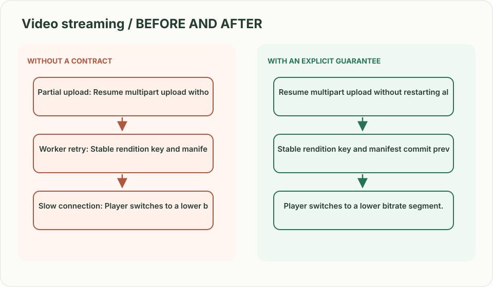
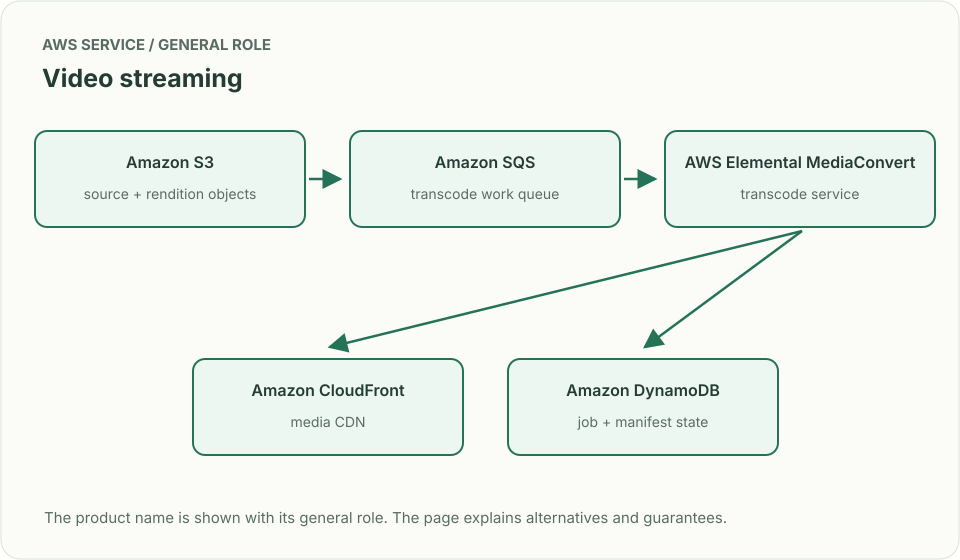
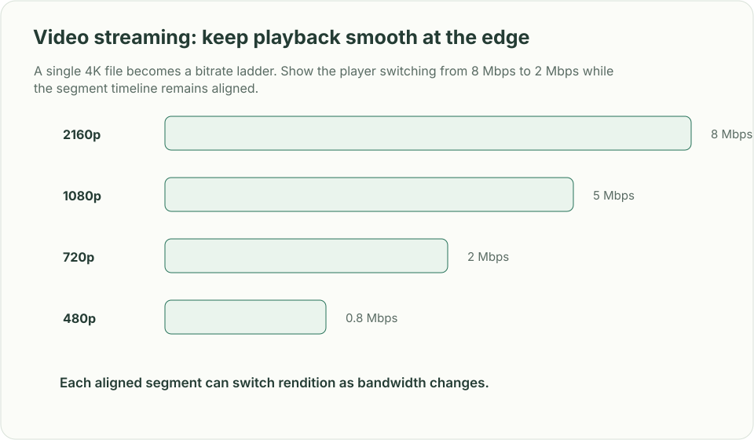

# Video streaming: keep playback smooth at the edge

*Design brief · diagrams and reasoning exercises; no complete application is supplied.*

> **Interviewer:** “Creators upload large videos. Viewers start playback quickly and continue across different bandwidths and devices. Design ingest, processing, storage, and delivery.”

This is a **commonly listed system-design interview prompt** with a concrete practice contract. Assume 5 million daily uploads, 100 million viewers, 4K source files up to 20 GB, and playback start p95 under 2 seconds. Clarify service guarantees and a first version before filling the board with services.

| Situation | Input / condition | Expected result |
|---|---|---|
| Partial upload | Network drops at 80% | Resume multipart upload without restarting all bytes. |
| Worker retry | Transcode task delivered twice | Stable rendition key and manifest commit prevent duplicate publication. |
| Slow connection | Bandwidth falls mid-playback | Player switches to a lower bitrate segment. |
| Private video | Owner revokes access | New segment requests fail authorization after bounded token expiry. |

## Think from the contract to the boxes

Separate the control path (upload authorization, job state, manifest) from media bytes. Transcode into aligned segments at multiple bitrates; publish a manifest only after required renditions pass validation. A CDN serves immutable segments, while signed access controls protect private content. Model the player’s buffer and bitrate adaptation, not just the upload pipeline.

**First diagram:** Show source upload, processing fan-out, manifest publish point, CDN cache, and authorization on segment fetch.

| AWS service / general role | Why it fits this design | Alternative and when it fits better |
|---|---|---|
| **Amazon S3** / source + rendition objects | Durably store large media through multipart upload. | EFS only for shared POSIX scratch, not a public byte-serving path. |
| **Amazon SQS** / transcode work queue | Buffer rendition tasks and retry workers. | Step Functions for multi-stage workflows with explicit job state. |
| **AWS Elemental MediaConvert** / transcode service | Generate device/bitrate outputs without owning codec fleet. | ECS/EC2 with FFmpeg for custom filters or codec tuning. |
| **Amazon CloudFront** / media CDN | Serve cached segments near viewers. | Third-party CDN where geographic reach/contracts require it. |
| **Amazon DynamoDB** / job + manifest state | Track processing and publish only validated outputs. | Aurora for relational creator/catalog requirements. |

Service choice follows the contract: the box label gives the generic job, while the table explains the AWS product and a reasonable substitute. Name which component owns durable truth, where retries happen, and the guarantee each managed service does **not** provide by itself.

## Pressure-test the design

**Follow-up: A single 4K file becomes a bitrate ladder. Show the player switching from 8 Mbps to 2 Mbps while the segment timeline remains aligned.**

**Senior expectation:** A viral launch empties origin capacity. Explain CDN cache key, segment immutability, cache warming limits, origin shielding, and how auth changes affect cacheability.

**Staff expectation:** Multiple regions ingest the same creator’s content. Set source ownership, replication/egress trade-offs, takedown propagation target, and recovery behavior during an origin outage.

**Practice artifact:** Show source upload, processing fan-out, manifest publish point, CDN cache, and authorization on segment fetch. Then trace every row in the table, draw one failure, and state what the customer observes. Suggested rehearsal: 35 minutes design, 10 minutes to challenge the guarantees.

**Evidence and origin:** The current community interview-question catalog lists YouTube-style streaming reports at companies including Datadog, Snapchat and Meta; report dates are not disclosed. The entry does not show the interview date and is not a verified company rubric. The prompt contract, workload, outcomes, diagrams and solution here are original practice material. Treat company tags as reported sightings, not a prediction of your interview loop.

**Interview report listing:** [Open the community question entry](https://www.hellointerview.com/community/questions/creator-viewer-paths/cm6wu2x3y0000356pl299toa0).
