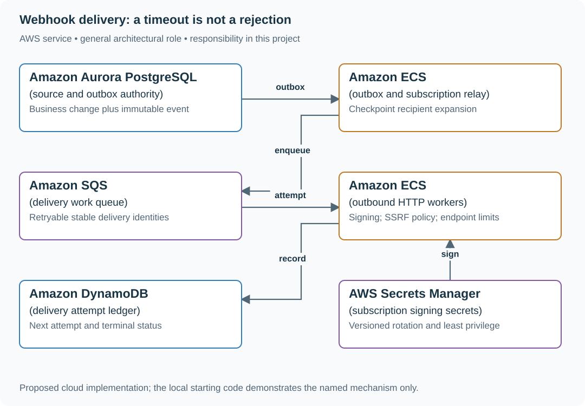

# Deliver signed webhooks with retries and replay

## Application background

A shop wants its own system to hear when an order changes in your commerce platform. It registers an HTTP address. Your service sends an event, such as Order 17 paid, to that address. This outgoing event request is a webhook.

The shop's server may be unavailable, or it may save the event but lose the response. Your service needs to retry without inventing a new order event, and a failing shop must not delay deliveries to healthy shops.

### Example walkthrough

| Action | Expected behavior |
|---|---|
| Event `order-17-paid` is created | Record delivery work for the registered destination. |
| The destination returns 500 | Schedule another attempt under the same event ID. |
| An operator replays the event | Keep its original business identity and record the new delivery attempt. |

A delivery attempt is one network call. The event is the underlying business fact. Keeping their identities separate makes retry and investigation understandable.

## Your assignment

**Deliver:** Build event delivery with signed requests, saved attempt history, bounded retries and an operator replay command that preserves the original event's identity.

**Required behavior:** Each committed source event creates one logical delivery per subscription. Attempts may repeat for 48 hours. Receivers use stable event IDs to deduplicate. Senders sign the exact body and expose delivery history.

The required first milestone is a working local implementation of the behavior above. The numbered implementation steps define the scope. The cloud architecture is a later extension, not something the starter has already provisioned.

## Get the code and run the supplied example

The code is in the public [junior-to-staff repository](https://github.com/Soulful-Iris/junior-to-staff). Install Git and Python 3.12+. No AWS account or Python packages are required for this first run. If you already have a checkout, use it and skip cloning.

```bash
git clone https://github.com/Soulful-Iris/junior-to-staff.git
cd junior-to-staff
python3 examples/architecture-starts/webhook_delivery.py
```

**Supplied file:** [`examples/architecture-starts/webhook_delivery.py`](https://github.com/Soulful-Iris/junior-to-staff/blob/main/examples/architecture-starts/webhook_delivery.py). You can also [read or download the source here](../../../../examples/architecture-starts/webhook_delivery.py).

This program is a **mechanism demonstration**: it runs the small scenario in one process and prints the result. It is not an HTTP service, a complete application, or an AWS deployment. A successful run demonstrates this mechanism only. It does not establish the workload or failure guarantees of the application you will build.

**Example output from the supplied run:**

Generated IDs and timestamps may differ. Compare the state transitions and outcomes.

```text
Signed bytes: {"id":"evt-7","type":"order.paid"}
Signature: 5320fc164aa4700b4eca86de5a39d45cd8da9562e3daea0cf13bf0f92883e55c
attempt 1 apply event
attempt 2 already handled
```

### Set up your implementation workspace

Create `work/webhook-delivery/` in your checkout (or use a separate repository). Copy the supplied mechanism into that directory as `mechanism.py`, then extract its state transitions into functions you can call from your implementation. The record and module names below describe what you must implement. They are not a promise that files with those names already exist. Keep a `README.md` beside your implementation with its exact run commands and observed results.

## Local components and state to implement

This table names the records, interfaces or decision inputs for your deliverable. Unless a name is explicitly linked to supplied source above, it is something you create. Implement the local state transitions first, then connect the HTTP, storage or worker boundaries required by the steps.

| Record / module | Key or interface | Responsibility |
|---|---|---|
| events | event_id,schema_version,body_hash | Immutable source event and exact bytes. |
| deliveries | subscription_id,event_id,state,next_attempt | One logical delivery with bounded retry horizon. |
| attempts | delivery_id,attempt_no,status,latency | Individual network outcomes. Never overwrite history. |

## Implement the assignment

### 1. Commit source and dispatch intent

Write an outbox event with the business transition. Expand eligible subscriptions using a recorded subscription snapshot or clearly defined selection time. Preserve event ID and immutable body through every retry and manual replay.

### 2. Implement signed HTTP delivery

Sign timestamp plus raw body bytes with the subscription secret. Document verification, timestamp tolerance and rotation overlap. Use HTTPS, strict deadlines and capped response bodies. Validate destination DNS and every redirect against an outbound policy. Block private and metadata addresses at connection time.

### 3. Isolate failing endpoints

Limit concurrency per endpoint and tenant. Apply bounded exponential backoff with jitter and a 48-hour terminal deadline. A healthy destination must keep progressing while another fails. Respect a capped Retry-After without allowing an endpoint to consume unbounded resources.

### 4. Expose replay and ambiguity

Return event and attempt history to authorized customers. A 2xx means the endpoint accepted the request, not that its business logic ran exactly once. Manual replay uses the same event identity and is recorded as another attempt.

## Demonstrate the completed local result

| Action | Expected visible result |
|---|---|
| Run the starting program | Both attempts carry one event identity. The receiver applies it once. |
| Make one endpoint return 500 | Other endpoints continue. Failed attempts back off and eventually expire. |
| Redirect to a private address | The worker records a destination-policy rejection before opening the connection. |

**Handoff:** In your implementation README, include the start command, one successful operation, the failure case above and the resulting stored state or decision. State which dependencies are simulated. Someone with a fresh checkout should be able to reproduce this without your chat history.

## Workload assumptions and capacity decisions

These are constructed exercise assumptions. The stated workload is a design target. The local demonstration does not establish that throughput. Use the [estimation constants](../../../01-code/01-problem-solving/estimation-constants.md) to check units before choosing capacity.

| Input or objective | Calculation / consequence |
|---|---|
| 50,000 subscriptions. 8,000 source events/s | Delivery rate equals events times matching subscriptions. Measure fan-out instead of assuming 8,000 HTTP calls/s. |
| 48-hour retry window | Backlog storage depends on failure rate and payload size. Cap per-endpoint outstanding work. |
| Ten-second HTTP deadline. 1,000 concurrent calls | At ten-second service time capacity is only 100 attempts/s, so deadlines and concurrency materially change throughput. |

## Map the local implementation to AWS

**Deployment status: local only.** Running the supplied command creates no AWS resources and configures no cloud connections. The diagram is a proposed deployment of the completed application. Each box needs either a deployed runtime, a provisioned service or an explicitly external dependency.

Read the diagram by following the arrows from the entry point: application code accepts the request or event, the state owner commits it, and any worker produces the later result. The table ties those roles to code and adapter work. Multiple boxes do not imply multiple Python files already exist.



SQS transports work. The ledger owns retry eligibility and evidence. Per-endpoint limits are application behavior and do not appear automatically because the queue scales.

| Local responsibility | Cloud destination and role | Implementation still required |
|---|---|---|
| Local records and transaction boundary | Amazon Aurora PostgreSQL: source and outbox authority | Write PostgreSQL schema/migrations and a database adapter. Configure credentials, connection limits and recovery. |
| Application or worker process | Amazon ECS: outbox and subscription relay | Build a container and task definition. Supply configuration, task roles and graceful shutdown behavior. |
| Local pending-work collection | Amazon SQS: delivery work queue | Publish committed job intent, consume messages and persist deduplication/ownership state. Add visibility, retry and dead-letter handling. |
| Application or worker process | Amazon ECS: outbound HTTP workers | Build a container and task definition. Supply configuration, task roles and graceful shutdown behavior. |
| Local dictionary, SQLite records or state model | Amazon DynamoDB: delivery attempt ledger | Design partition/sort keys and write a storage adapter with conditional updates or transactions. Python state and SQL are not uploaded as a database. |
| Local provider configuration placeholder | AWS Secrets Manager: subscription signing secrets | Store provider credentials, scope runtime reads and implement rotation without writing secrets to logs. |

### Provision resources, then connect the application

| Resource or boundary | Initial configuration and reason |
|---|---|
| Worker networking | Route outbound requests through a controlled egress path. The application must pin validated destinations and avoid redirect bypasses. |
| SQS scheduling | For retries beyond a queue delay limit, keep next_attempt in the ledger and dispatch due work. Do not sleep a worker for hours. |
| Secret access | Fetch only the subscription secret/version needed. Never put secrets in payload logs or customer-visible attempt records. |

Use one disposable AWS environment for the cloud exercise. Put the named resources in `infra/template.yaml` or your existing IaC tool, pass resource IDs through configuration, and scope each runtime role to its own tables, buckets and queues. The diagram is a design to implement. It is not a claim that these resources have been deployed. Record the commands you used to deploy and remove the exercise resources.

For concrete provisioning commands, configuration wiring and cleanup, use the [AWS foundation guide](../../../../examples/architecture-starts/infra/README.md). It includes a deployable table/queue/object-storage foundation and explains which application and service adapters you still implement.

A provisioned queue or table does not make the local program use it. Configure resource IDs in the deployed runtime, replace the local adapter, and replay the same successful and failing operation against that runtime. Record the deployed commit and observable result, then remove the disposable resources using your infrastructure tool.

## Extend the design after the baseline works


Allow customers to rotate a secret while attempts wait. Decide whether you sign with the current secret or an event-bound version, publish the overlap contract, and show how receivers verify a replay.

<details>
<summary>Additional design cases, alternatives and original source notes</summary>


**Your contract.** Assume 50,000 subscriptions, 8,000 events/s at peak, 48-hour delivery attempts, endpoint-specific secrets, and a visible replay tool. Ask whether per-subscription ordering matters: it changes partitioning and throughput. This is a constructed practice problem.

| Event at our boundary | Expected state and next action |
|---|---|
| Checkout commits `order.paid` but producer crashes | Durable outbox retains the event for later dispatch |
| Receiver commits event `e21`, response is lost | Retry **same event ID**. Receiver should deduplicate. Delivery remains uncertain until success |
| Receiver returns 429 with retry hint | Back off for this destination, preserve other destinations' progress |
| Permanent 400 due to obsolete schema | Stop repeated hot retries. Surface a failure and replay path after repair |

## Reason about two boundaries

In the order transaction, write an outbox row with a stable event ID. A dispatcher publishes it asynchronously. Each subscription gets a **delivery attempt record** keyed by event ID and endpoint. Sign the raw payload with a rotating secret, enforce an outbound URL policy against private-network targets, and use a short timeout. Retries with jitter are bounded by age and attempts. A 2xx confirms transport reception only. The merchant owns idempotent processing. A replay uses the same event ID for the same logical event, with a new delivery-attempt ID.

| AWS box | Job here | Alternative and deciding factor |
|---|---|---|
| Aurora PostgreSQL outbox | Atomically commit order plus event intent | DynamoDB transaction with an outbox item for a DynamoDB-owned order |
| EventBridge | Route events to interested subscriptions | SNS for simple topic broadcast with fewer routing needs |
| SQS per delivery tier | Buffer retries and isolate slow endpoints | EventBridge API destinations for a simpler managed outbound path when its timeout and retry controls fit |
| Lambda or ECS worker | Sign, rate-limit, call endpoint, record outcome | ECS when long-lived connection control or predictable high throughput dominates |
| SQS dead-letter queue | Retain exhausted deliveries for triage and replay | Explicit failure table if richer query and operator tooling are required |

EventBridge routing plus a queue does **not** make the order write atomic with publication. The outbox and reconciler close that gap. If using EventBridge API destinations directly, verify its execution timeout and bounded retry behavior against the 20-second receiver. Use an asynchronous receipt contract where necessary.

**Senior follow-up:** One customer floods 429s. Budget per-endpoint concurrency and inspect oldest queued age, retry count, terminal failures, and delivery-to-commit delay. Ensure their backlog does not consume the whole worker pool.

**Staff follow-up:** Rotate signing keys without invalidating already queued events. Define which payload schema and secret version each attempt uses. Explain how consumers migrate versions and how operators replay a week without a thundering herd.

**Practice artifact:** Draw the order transaction, delivery lane, and operator replay lane. Walk the four rows above and distinguish event ID from attempt ID.

**Source boundary:** Original exercise. Current [EventBridge API destinations](https://docs.aws.amazon.com/eventbridge/latest/userguide/eb-api-destinations.html) and [DLQ behavior](https://docs.aws.amazon.com/eventbridge/latest/userguide/eb-rule-dlq.html) supply AWS constraints. Neither makes the receiver exactly-once.

</details>
