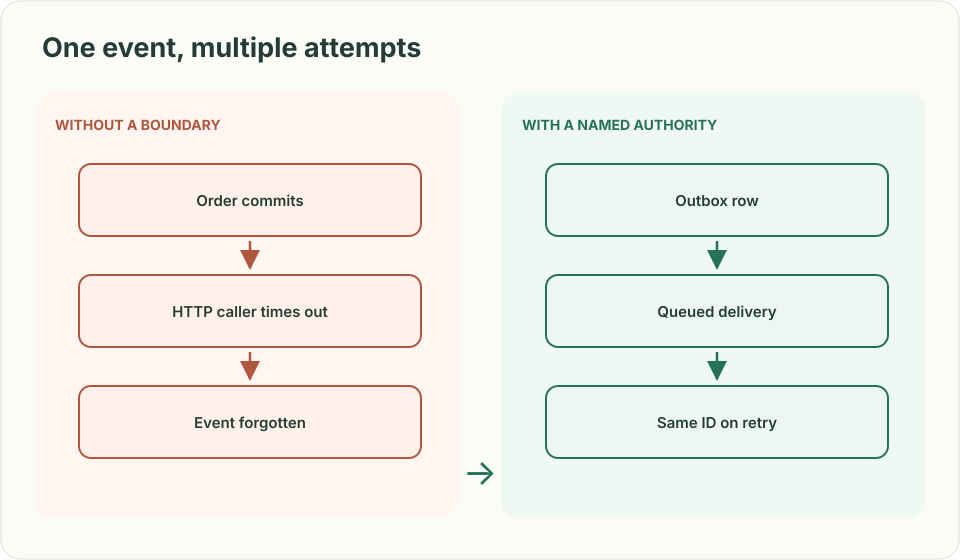
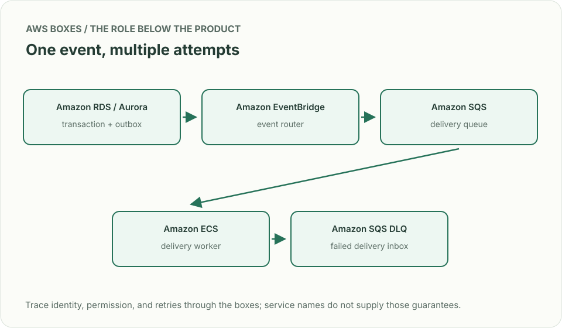
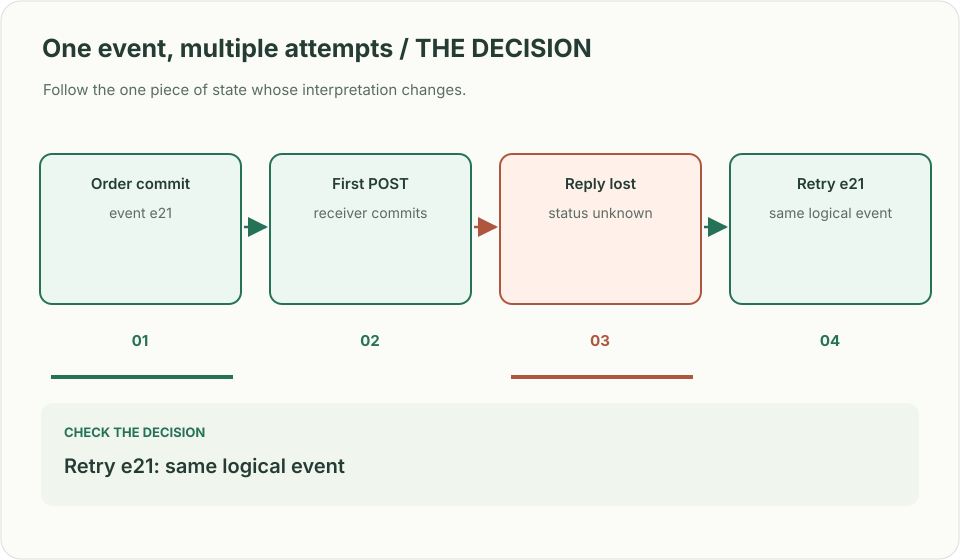

# Webhook delivery: a timeout is not a rejection

*Design brief · diagrams and reasoning exercises; no complete application is supplied.*

> **Interviewer:** “Merchants subscribe to order events over HTTPS. A merchant's endpoint takes 20 seconds and sometimes commits the event before returning a timeout. How will you deliver without slowing checkout or claiming exactly-once delivery?”

**Your contract.** Assume 50,000 subscriptions, 8,000 events/s at peak, 48-hour delivery attempts, endpoint-specific secrets, and a visible replay tool. Ask whether per-subscription ordering matters: it changes partitioning and throughput. This is a constructed practice problem.

| Event at our boundary | Expected state and next action |
|---|---|
| Checkout commits `order.paid` but producer crashes | Durable outbox retains the event for later dispatch |
| Receiver commits event `e21`, response is lost | Retry **same event ID**; receiver should deduplicate; delivery remains uncertain until success |
| Receiver returns 429 with retry hint | Back off for this destination, preserve other destinations' progress |
| Permanent 400 due to obsolete schema | Stop repeated hot retries; surface a failure and replay path after repair |

## Reason about two boundaries

In the order transaction, write an outbox row with a stable event ID; a dispatcher publishes it asynchronously. Each subscription gets a **delivery attempt record** keyed by event ID and endpoint. Sign the raw payload with a rotating secret, enforce an outbound URL policy against private-network targets, and use a short timeout. Retries with jitter are bounded by age and attempts. A 2xx confirms transport reception only; the merchant owns idempotent processing. A replay uses the same event ID for the same logical event, with a new delivery-attempt ID.

| AWS box | Job here | Alternative and deciding factor |
|---|---|---|
| Aurora PostgreSQL outbox | Atomically commit order plus event intent | DynamoDB transaction with an outbox item for a DynamoDB-owned order |
| EventBridge | Route events to interested subscriptions | SNS for simple topic broadcast with fewer routing needs |
| SQS per delivery tier | Buffer retries and isolate slow endpoints | EventBridge API destinations for a simpler managed outbound path when its timeout and retry controls fit |
| Lambda or ECS worker | Sign, rate-limit, call endpoint, record outcome | ECS when long-lived connection control or predictable high throughput dominates |
| SQS dead-letter queue | Retain exhausted deliveries for triage and replay | Explicit failure table if richer query and operator tooling are required |

EventBridge routing plus a queue does **not** make the order write atomic with publication. The outbox and reconciler close that gap. If using EventBridge API destinations directly, verify its execution timeout and bounded retry behavior against the 20-second receiver; use an asynchronous receipt contract where necessary.

**Senior follow-up:** One customer floods 429s. Budget per-endpoint concurrency and inspect oldest queued age, retry count, terminal failures, and delivery-to-commit delay; ensure their backlog does not consume the whole worker pool.

**Staff follow-up:** Rotate signing keys without invalidating already queued events. Define which payload schema and secret version each attempt uses; explain how consumers migrate versions and how operators replay a week without a thundering herd.

**Practice artifact:** Draw the order transaction, delivery lane, and operator replay lane. Walk the four rows above and distinguish event ID from attempt ID.

**Source boundary:** Original exercise. Current [EventBridge API destinations](https://docs.aws.amazon.com/eventbridge/latest/userguide/eb-api-destinations.html) and [DLQ behavior](https://docs.aws.amazon.com/eventbridge/latest/userguide/eb-rule-dlq.html) supply AWS constraints; neither makes the receiver exactly-once.
