# 08 · System design — five projects

> Senior tier · each one an afternoon · read [the section](README.md) first

Five projects that produce the artefacts a design decision is actually made
from: measured constraints, two shapes with their bills, a failure table, a
capacity ceiling, and a recovery posture you have priced.

None of them is mostly code. Four of the five end in a page of writing backed
by a number you measured, which is the correct ratio — the section's whole
argument is that the reasoning is the deliverable and the diagram is a
byproduct.

They also happen to be where the standard interview questions get their real
answers. *What if traffic goes up ten times* is project 4. *What if the
database goes down* is project 3. *What if us-east-1 goes down* is project 5.
You will not be reciting a pattern; you will be describing something you did.



---

### 1. The constraints you measured instead of imagined

*You end up with a one-page constraint sheet where at least four numbers came from your own system and every invented one is marked as invented.*

**Build**

Take something you already run — the [Act 1](../../../projects/reading-list/stages/01-it-works/README.md)
system, a side project, a service at work — and write its constraints as
checkable statements. Then go and measure the ones that are measurable, and
mark the rest as guesses in a way you cannot later forget.

**The thought process**

The first decision is **which constraints are load-bearing**. A system has
dozens of true statements about it and about four that determine its shape:
how much arrives per second at peak, how stale the data may be, what must
never be lost, and how long it may be down. Everything else follows. Spending
an afternoon on the fifth most important constraint is the commonest way this
exercise turns into paperwork.

Second: **peak is not average, and you will get this wrong.** Systems fail at
peak by definition, so a design sized from a daily average is a design sized
for a moment that never matters. The number you need is the busiest minute,
and the gap between it and the mean is usually larger than people guess —
often five or ten times for anything with human users attached to a timezone.

Third, and this is the honest part: **mark what you invented.** You will not
be able to measure "how stale may this be" because that is a product question,
and you may not have anyone to ask. Writing *(assumed: 5 minutes, nobody has
told me)* costs nothing now and saves an argument in four months, when someone
designs against that number as though it were a fact.

Fourth: **a constraint without a consequence is a mood.** "It should be fast"
is not a constraint. "A search that takes over 2 seconds causes the user to
retype and double our load" is — it has a number and a thing that happens.

**How to organise the prompts**

```
Here is what my system does: <description>. Before proposing anything,
write its constraints as checkable statements: peak volume, freshness,
durability, what must never be lost, acceptable downtime, and growth
over the next year.

For each, mark whether it is (a) something I told you, (b) something
you can infer from what I told you, or (c) something you invented
because the answer was missing.

Do not propose a design.
```

The three-way marking is the whole trick. A model will produce a confident
list either way; the categories are what let you see the seam between what is
known and what was filled in.

```
For each constraint in category (b) and (c), tell me exactly what I
would measure or ask to turn it into (a) — the query, the metric, the
person.
```

This turns the guesses into a to-do list rather than leaving them as fog.

```
I measured these: <your real numbers>. Update the sheet, and tell me
which of your earlier guesses were wrong and by how much.
```

Doing this step is what makes the exercise stick. The gap between what the
model assumed and what your system does is a calibration you get nowhere else.

**On AWS**

Nearly every constraint you need is already being recorded and nobody looks.
Peak request rate and latency: **CloudWatch** metrics on your
**Application Load Balancer** — `RequestCount` at 1-minute granularity, then
`Maximum` rather than `Average` on the statistic, because the default average
is exactly the mistake above. Database shape: **RDS Performance Insights** for
which queries actually cost you, and **CloudWatch** `DatabaseConnections` for
how close you sit to the connection ceiling.

Where money is going, which is a constraint people forget is one:
**Cost Explorer** grouped by service, and **AWS Budgets** to make the number
arrive without being asked. For growth, **CloudWatch Metrics Insights** or a
saved **Logs Insights** query over 30 days gives you the trend rather than
today.

Why these and not an observability vendor: for this project you want the
numbers that exist without you instrumenting anything, because the point is
to stop guessing today. A vendor is the right answer to [10 ·
Observability](../04-observability/README.md), not to this.

The one to know by name is **Service Quotas**. Several of your real
constraints are not physics, they are an account limit somebody can raise with
a ticket — concurrent Lambda executions, VPC elastic IPs, API Gateway request
rate. Reading your own quotas page is a fifteen-minute job that turns
"probably fine" into a list of specific ceilings.

**What productionising it means**

The sheet lives next to the code, not in a doc nobody opens. Every number says
where it came from and when it was taken, because a measured number rots.
Invented constraints are visibly marked as invented for as long as they remain
invented. And there is a date on it, so the next person knows whether to trust
it or re-measure.

**The learning**

Most architecture disagreements are not about architecture. They are two
people holding different unstated numbers, and the argument cannot be settled
until both numbers are on the table. Writing constraints down first is less
about rigour than about making the real disagreement visible early enough to
be cheap.

**How you would know it is wrong**

- Count how many constraints have a number you personally measured. Under three and you wrote a wish list.
- Check whether you used `Average` anywhere peak matters. That is the single commonest error here.
- Show the sheet to somebody who knows the system and ask which number is wrong. There is usually one and they will know it instantly.
- Look for an adjective. "Scalable", "robust", "fast" — each one is a constraint you have not written yet.
- Re-measure one number a month later. If it moved more than you expected, your growth constraint is wrong too.

---

### 2. Two shapes and the bill for each

*You end up with two designs that genuinely differ, a one-sentence cost for each, and a written note of what would make you switch.*

**Build**

Take the constraint sheet from project 1 and produce two architectures that
both satisfy it and differ on something structural. Write the bill for each in
one sentence. Then choose, and write down the observation that would change
your mind.

**The thought process**

First: **two designs that differ only in naming are one design.** The test is
whether they differ on *where state lives* or *what can fail independently*.
"Monolith versus microservices" is often the same design with different deploy
scripts; "one database versus a database plus a queue and an eventually
consistent read model" is a real fork, because the second one has a new place
where two copies of a fact can disagree.

Second, and this is the decision people skip: **which axis are you trading
on?** Almost every real architectural fork is one of a small set — simplicity
against isolation, latency against consistency, cost against headroom,
coupling against coordination. Naming the axis before comparing the shapes
stops the comparison sliding into a list of features.

Third: **the bill has to be a sentence you would say out loud to the person
who inherits this.** "A single service is simpler, and one bad deploy takes
everything down" is a bill. "Slightly more complex" is a way of not saying
one. If you cannot state the cost without sounding defensive, you have
finished preferring rather than finished choosing.

Fourth: **write the switching condition.** Not "we would revisit this later" —
an observation. "If the export job's p99 crosses 30 seconds, split it out."
That sentence is the difference between a decision and a mood, and it is the
thing that lets a future person change the design without relitigating it.

**How to organise the prompts**

```
Here are my constraints: <the sheet>. Propose two architectures that
both satisfy them and differ STRUCTURALLY — on where state lives, or
on what can fail independently.

For each: what moves, what waits, what can fail and what happens then,
where state lives.

Do not recommend one.
```

The prohibition on recommending is doing real work. Left alone, a model
collapses the fork back into one answer before you have understood the axis,
and you lose the thing you came for.

```
Name the single axis these two trade on. Then tell me what each one
costs that the other does not, in one sentence each — phrased as
something I would have to admit to a colleague, not as a caveat.
```

```
For the shape I did NOT pick: describe it well enough that I could
build it from this page, and steelman it. What would have to be true
about my system for it to be the better choice?
```

That last question is the one worth keeping. The answer is usually a specific
condition — a volume, a team size, a latency requirement — and when your
system drifts into that condition, you want to recognise it.

```
Now the boring option. Is there a simpler shape than both of these that
still satisfies the constraints? If there is, say so plainly; if there
is not, name the specific constraint that rules it out.
```

**On AWS**

This is where the service choice is the design, so make the model do the
comparison rather than the pick.

Compute: **Lambda** against **ECS on Fargate** against **EC2**. The real axis
is not cost, it is what you own — Lambda gives you no servers and a hard
execution ceiling and a cold-start tail; Fargate gives you a long-running
process and a container to keep patched; EC2 gives you the machine and the
job of managing it. Pick by the shape of the work: spiky and short favours
Lambda, steady and long favours Fargate.

Storage: **RDS** against **DynamoDB** against **Aurora Serverless v2**. The
axis is your access pattern. If you know your queries in advance and they are
key-shaped, DynamoDB is cheaper to run and will not surprise you at 3am; if
you need to ask questions you have not thought of yet, you want SQL and you
want RDS. Aurora Serverless v2 is the answer to "SQL, but the load is spiky
and I do not want to size an instance."

Between components: **SQS** against **EventBridge** against **Kinesis**. SQS
is a work queue with one logical consumer group and is the boring right
answer most of the time. EventBridge is a router — many consumers, content
filtering, and you do not want the producer to know who is listening. Kinesis
is an ordered replayable stream, and you want it when order matters or when
several consumers need the same records at their own pace.

Being able to say *why not the neighbour* for each of those three pairs is a
large fraction of what a senior system-design conversation is made of.

**What productionising it means**

The rejected design is written down, not remembered. The bill is in the
document where the next person will find it. The switching condition is
attached to a metric that actually exists — which sometimes means going and
creating it. And the decision has a date and a name on it, so it can be
overturned by someone who knows what it was for.

**The learning**

Every design buys something and charges for it, and the charge is always paid
by someone later. The senior move is not picking the clever shape; it is being
able to say, without flinching, exactly what the shape you picked makes worse.

**How you would know it is wrong**

- Ask whether your two designs differ on state or on failure isolation. If neither, you produced one design twice.
- Say the cost sentence out loud. If it comes out as a caveat, rewrite it until it is a cost.
- Hand the constraints to somebody else and ask what they would build. Somewhere very different means an unstated constraint — find it.
- Check the switching condition names a metric that exists. If it does not, the condition is decorative.
- Ask what would have to be true for the boring option to work. "Nothing much" means take the boring option.

---

### 3. The failure interrogation

*You end up with a table: every component, what a user sees when it is down, what is retried, what is lost, and what state is left behind.*

**Build**

Take one design and walk every component failing, one at a time. Produce a
table with a row per component and four columns filled in honestly. Then pick
the two worst rows and actually cause those failures in a test environment to
find out whether the table was right.

**The thought process**

The first thing to get straight is that **"it retries" is not a failure
analysis, it is where one stops.** The question that matters is always one
level further: what happens when the retry also fails, and what does the user
see while it is trying. Most failure documents survive exactly one question.

Second: **half-finished state is the interesting output.** A component dying
mid-operation tends to leave something behind — a row written without its
sibling, a file uploaded without its database record, a payment taken without
an order. The user-visible symptom is usually mild and the leftover state is
usually the thing that costs a day of somebody's life later. Ask what is left
behind for every row, including the rows where the answer is reassuring.

Third, and this is where the exercise starts finding real bugs: **the shared
dependency.** Interrogating components one at a time makes you notice that
four of them fail together because they all call the same thing — the auth
service, the config store, DNS. A failure table with independent-looking rows
hides that, so add a column or a note for what else goes down at the same
time.

Fourth: **then go and cause two of them.** The table is a hypothesis. The
gap between what you wrote and what happened is the entire value of this
project, and in my experience there is always a gap, usually in the direction
of "the timeout was much longer than anybody thought."

**How to organise the prompts**

```
Here is my design. Walk through each component failing, one at a time.

For each: what does a user see, what is retried, what is lost, what
state is left behind that needs cleaning up.

Do not say "it retries" without saying what happens if the retry also
fails.
```

```
Now group them. Which of these components fail TOGETHER because they
share a dependency? List the shared things, and for each, what goes
dark with it.
```

The grouping question usually produces the surprise. Single-component
analysis is inherently optimistic.

```
For the database being unavailable specifically: walk the full path.
What is the timeout at each layer, what does the user see at 1 second,
at 10 seconds, at 60 seconds, and what happens to in-flight writes.
```

Singling out the database is deliberate — it is the component whose failure
people have thought about least carefully and been asked about most often.

```
Pick the two failures from this table that are most likely and most
damaging. Design a safe experiment for each in a non-production
environment, with a stop condition. Do not run anything yet.
```

Then run them, and correct the table from what happened rather than from what
should have happened.

**On AWS**

For causing the failures rather than imagining them, **AWS Fault Injection
Service** is the purpose-built tool, and the reason to prefer it over a script
that kills things is the stop condition: an FIS experiment can be wired to a
**CloudWatch alarm** that halts it automatically, which is what makes running
one outside a sandbox defensible. It has prebuilt scenarios for the cases you
care about, including interrupting an Availability Zone.

For the database row specifically: an **RDS Multi-AZ** deployment lets you
trigger a failover on demand from the console or CLI, and doing that once,
deliberately, in daylight, is one of the highest-value hours in this whole
tier. You will learn your actual failover time, that your connection pool does
not reconnect the way you assumed, and that something in your stack caches DNS
past its TTL. **RDS Proxy** exists largely because of the third one — it holds
the pooled connections so your application's reconnect behaviour stops being
load-bearing during a failover.

For the shared-dependency question, **X-Ray** or an **ADOT** trace over a real
request shows you what is actually on the path, which is reliably more than
the design document claims. And **VPC Flow Logs** will show you calls you did
not know you were making.

This project is the one that answers *"what happens if the database goes
down"* with a time, a user-visible symptom and a leftover-state answer,
instead of with the word "failover".

**What productionising it means**

The table is in the repository and gets updated when the design changes.
Timeouts are set deliberately at every layer and the numbers descend as you go
inward — see [09 · Reliability](../05-reliability/README.md). Half-finished state has a
cleanup path that somebody has run. And at least two rows have been verified
by causing the failure rather than by reasoning about it.

**The learning**

You cannot reason your way to a failure table, because the system contains
timeouts, retries and caches that nobody remembers setting. The table's job is
not to be right — it is to be specific enough to be *proved wrong* by an
experiment, which is the only way the real numbers ever surface.

**How you would know it is wrong**

- Find any row that says "it retries" with nothing after it. That row is empty.
- Check every row has an answer for leftover state, including the boring ones.
- Cause two failures for real and compare to what you wrote. No gap at all means your experiment was too gentle.
- Look for components that fail together. If every row is independent, you have not found your shared dependencies yet.
- Time the database failover yourself. Whatever number you believed, measure it.

---

### 4. The ten-times question

*You end up naming the component that breaks first at ten times today's traffic, with the arithmetic that says so, and what you would do in the ninety seconds after it broke.*

**Build**

Work out, on paper and then with a load test, where your system breaks first
if traffic multiplies by ten. Produce an ordered list of ceilings — what
saturates first, second, third — with a number against each. Then load it
until the first one actually gives, and check the order was right.

**The thought process**

Start with the reframing that makes this tractable: **there is always exactly
one bottleneck at a time.** A system does not "get slow"; one resource
saturates, and everything downstream of it queues. So the question is not
"will it scale" but "which resource runs out first, at what number, and what
is behind it."

Second: **the candidates are a short list.** Connections to the database.
Concurrency limits on your compute. CPU on one hot instance. A third-party API
with a rate limit. A quota on your AWS account. Memory on the cache. Work
through them with arithmetic before you touch a load generator — if 200
requests per second each hold a database connection for 40ms, you need about 8
concurrent connections, and knowing that beforehand tells you what the load
test should show.

Third: **connections are the one people miss.** Database connection ceilings
are a function of instance memory, not of how much traffic you want, and the
failure is abrupt rather than gradual: everything is fine, and then nothing
can connect. Anything that scales horizontally in front of a fixed-size
database — and serverless compute is the extreme case — turns a traffic spike
into a connection storm.

Fourth: **fixing the first bottleneck reveals the second, and it will be
worse.** This is why the ordered list matters more than the fix. A team that
adds read replicas and declares the scaling problem solved has moved the
ceiling to whatever was behind it, usually without noticing.

Fifth, the honest one: **check whether ten times is a real number.** The
fastest way to answer a capacity question badly is to design for a multiple
nobody has justified. Go back to the growth constraint in project 1.

**How to organise the prompts**

```
Here is my architecture and here is today's measured peak: <numbers>.

At 10x that, work out which resource saturates FIRST. Show the
arithmetic for each candidate: database connections, compute
concurrency, CPU, memory, third-party rate limits, AWS service quotas.

Give me an ordered list of ceilings with a number against each.
```

Demanding the arithmetic is what stops this becoming a list of
recommendations. You want to be able to check the sums.

```
For the first three ceilings, tell me the SYMPTOM — what a user
experiences and what a graph looks like as each one is approached and
then crossed. I want to be able to recognise it live.
```

Recognising the symptom is the operational half. A connection-pool exhaustion
and a CPU saturation look quite different on a latency graph and knowing which
you are looking at saves twenty minutes at the worst possible time.

```
Design a load test that finds the first ceiling rather than one that
just applies load: ramp shape, what to measure, and the stopping
condition. Tell me what I should see just BEFORE it breaks.
```

```
Now: I have 90 seconds and traffic is 10x. What are my levers, in
order, and what does each one cost? Include the ones that degrade the
product rather than adding capacity.
```

That last prompt is the one that makes this interview-proof and, more
importantly, incident-proof. The good answers are usually not "add capacity" —
they are shed the low-priority class, turn off the expensive feature, serve
stale from cache.

**On AWS**

The ceilings and where to see them. Database connections: **CloudWatch**
`DatabaseConnections` against the `max_connections` your instance class
actually permits, with **RDS Proxy** as the standard answer when the ceiling
is the problem — it pools on your behalf so a hundred Lambda executions do not
become a hundred connections. Compute: Lambda's account-level concurrency
limit is a **Service Quotas** entry, and hitting it looks like throttles
rather than errors, which is its own diagnostic trap. On Fargate, the ceiling
is your service's desired count and the **Application Auto Scaling** policy in
front of it.

For seeing it happen: **CloudWatch** `TargetResponseTime` and
`RejectedConnectionCount` on the ALB, `ThrottledRequests` on DynamoDB,
`ApproximateAgeOfOldestMessage` on SQS — that last one being the early
warning that your consumers have fallen behind, which is covered properly in
[09 · Reliability](../05-reliability/README.md).

For the relief levers: **ElastiCache** in front of a read-heavy database, or
**DAX** if you are on DynamoDB; **CloudFront** in front of anything cacheable,
which is the single highest-leverage change for read traffic because it
absorbs load before it reaches your account at all; **SQS** to convert a
synchronous spike into a backlog you can drain. And **Auto Scaling** with a
target-tracking policy, remembering that scaling out helps only if your
compute is the bottleneck — if it is the database, more instances make it
strictly worse.

For generating the load, **Distributed Load Testing on AWS** is a published
solution that runs the generators for you; a container running k6 or Locust on
Fargate is the smaller version and is usually enough.

**What productionising it means**

The ceilings are written down with their numbers and re-checked when the
instance sizes change. There is an alarm at a fraction of the first one — a
ceiling you only discover by hitting it is not a ceiling you manage. The
relief levers are things somebody can actually pull, which means they are
feature flags or scaling policies rather than a code change and a deploy. And
the load test is repeatable, because the number moves.

**The learning**

Capacity is not a property of a system, it is a property of its narrowest
part — and the narrowest part is usually something unglamorous like a
connection count rather than the thing you optimised. Once you have found one
ceiling by measurement, you stop believing any capacity claim that does not
come with arithmetic.

**How you would know it is wrong**

- Load until something breaks and compare to your ordered list. Wrong order is the normal result the first time; that is the finding.
- Check you included connections and quotas. Both are invisible in code review and both stop you abruptly.
- After fixing the first ceiling, run it again. If you cannot name the new bottleneck, you have not finished.
- Look at your 90-second levers and ask whether you could actually pull each one right now. A lever that needs a deploy is not a lever.
- Compare the 10x assumption to your measured growth rate. Designing for a number nobody justified is its own failure.

---

### 5. The region question

*You end up with a chosen recovery posture, a written RTO and RPO you would defend, and a restore you have actually performed and timed.*

**Build**

Decide what happens to your system if an entire AWS region is unavailable.
Pick one of the four postures deliberately, write the RTO and RPO you are
committing to, and then do the cheapest honest thing: perform a restore into a
second region and time it end to end.

**The thought process**

The first decision is the one people skip because it feels like giving up:
**how much downtime is actually acceptable, and who says so?** For most
systems a full region outage is rare enough and the alternative expensive
enough that "we are down for four hours and we say so" is a defensible,
adult answer — and it is only defensible if it was chosen rather than
discovered.

Second: **RTO and RPO are two different questions and conflating them costs
money.** RTO is how long until you are serving again; RPO is how much data you
are willing to lose. They have different fixes. RPO is bought with
replication, RTO is bought with standing capacity, and a system can perfectly
reasonably want a small RPO and a large RTO — lose nothing, take four hours to
come back.

Third: **the posture ladder above is a cost curve, not a quality curve.**
Backup-and-restore is not the bad option, it is the cheap option with a long
RTO. Active/active is not the good option, it is the option where you pay for
a second region every day and inherit a distributed-data problem that is
harder than the outage you were avoiding.

Fourth, and this is the one that separates a plan from a wish: **the failover
path has to be exercised.** Every component of a recovery plan that has never
run will have something wrong with it — a missing IAM role, an AMI that does
not exist in the other region, a hardcoded endpoint, a secret that was never
replicated, a quota in the second region that is still at the default. All of
those are discovered in about an hour of trying, and never by reading.

Fifth: **data is what makes this hard.** Standing up compute elsewhere is a
solved problem you can do from a template. Getting the data there, knowing how
stale it is, and deciding what happens to writes that arrived in the old
region after the last replication — that is the actual project.

**How to organise the prompts**

```
Here is my architecture. If <region> is entirely unavailable, walk
through what breaks, in order, and what is still reachable.

Include the things people forget: DNS, secrets, container images,
certificates, IAM, and anything with a region baked into its name.
```

The "things people forget" list is doing real work. The compute and the
database are obvious; the reason failovers fail is the sixth item.

```
Price the four postures for MY architecture specifically — backup and
restore, pilot light, warm standby, active/active.

For each: rough RTO, rough RPO, what runs all the time, and what I
would have to build. Tell me which parts of my system make one of them
much more expensive than it would normally be.
```

```
I am choosing <posture>. Write the runbook as numbered steps somebody
else could follow at 3am without me, including how to decide whether to
fail over at all — and how to fail BACK.
```

Failing back is the half that never gets written, and it is the part with the
data conflicts in it.

```
Now find the assumptions in that runbook. Which steps depend on
something existing in the second region that I have never checked?
```

Then go and check them, which is the real deliverable.

**On AWS**

For data, this is where the service comparison actually decides your posture.
**Aurora Global Database** gives cross-region replication with a typically
sub-second lag and a managed failover, which buys a small RPO without running
a full second stack. **DynamoDB Global Tables** are genuinely active/active
with last-writer-wins conflict resolution — the cheapest route to a
multi-region write path, provided your data model can live with that
resolution rule, which is a real design constraint and not a footnote. Plain
**RDS** gives you cross-region read replicas and automated **snapshot copy**;
**S3 Cross-Region Replication** handles objects; **AWS Backup** can run
cross-region copy on a schedule for everything at once, which is the low-effort
starting point and the right first move.

For traffic: **Route 53** health checks with failover routing is the standard
answer and its weakness is DNS caching — clients and resolvers ignore your TTL
more than you would like, so measured failover is slower than the TTL implies.
**AWS Global Accelerator** moves the failover into the network with anycast
IPs, which is faster and more predictable, and is the thing to know about when
someone asks why DNS failover was slow.

For the second region existing at all: **CloudFormation**, **CDK** or
Terraform, because a pilot light you cannot stamp out from a template is not a
pilot light. Watch for the region-scoped things that do not travel — AMIs, ACM
certificates (regional, and CloudFront wants us-east-1), Secrets Manager
secrets (replicable, but only if you asked), ECR images, and your **Service
Quotas**, which start at defaults in the new region no matter what you raised
them to in the old one.

And the honest note about scope: a full region outage is rarer than an
Availability Zone outage, and **Multi-AZ** is the much cheaper insurance that
covers the more likely event. If you are not yet Multi-AZ, do that first — it
is a checkbox on RDS and a subnet choice on everything else, and it protects
against the failure you are actually going to have.

**What productionising it means**

The posture is written down with its RTO and RPO, and somebody who is not you
has agreed to those numbers. The runbook exists and has been followed by a
second person, who found two things wrong with it, because they always do. A
restore has been performed and timed — an untested backup is a wish, and the
day you find out it does not restore is the day you needed it. And there is a
calendar entry to do it again, because the plan decays as the system changes.

**The learning**

Disaster recovery is not a technology choice, it is a purchase: you decide how
much downtime and data loss you are buying out of, and you pay for it every
day whether or not the disaster comes. The people who are good at this are not
the ones with the most elaborate plan; they are the ones who have run theirs.

**How you would know it is wrong**

- Perform a restore and time it. If your RTO is a guess, it is wrong, and the direction is always "longer than you thought".
- Count how many manual steps the runbook has. Each one is a step somebody fumbles at 3am.
- Hand the runbook to someone else and watch them follow it without helping. Write down where they stop.
- Check what does not exist in the second region: quotas, images, certificates, secrets. There is always at least one.
- Ask who signed off on the RTO. If the answer is nobody, you have a preference rather than a commitment.
- Confirm you are Multi-AZ before spending anything on multi-region. The cheap insurance covers the likelier event.
