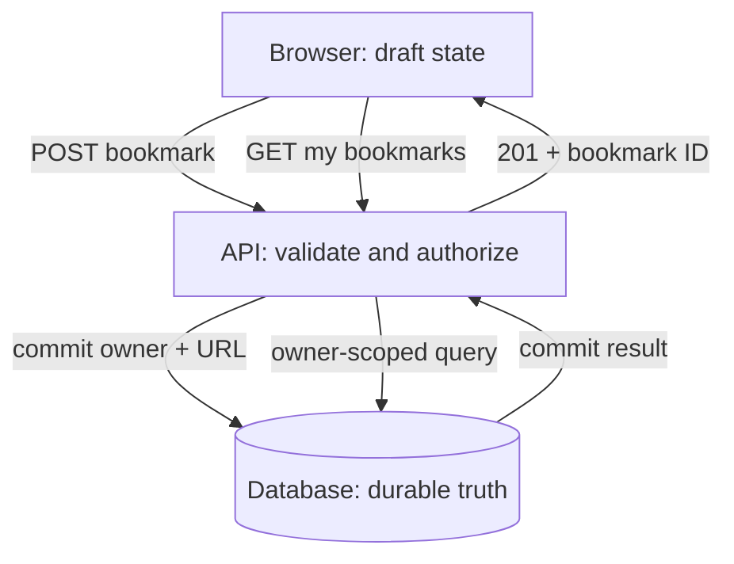
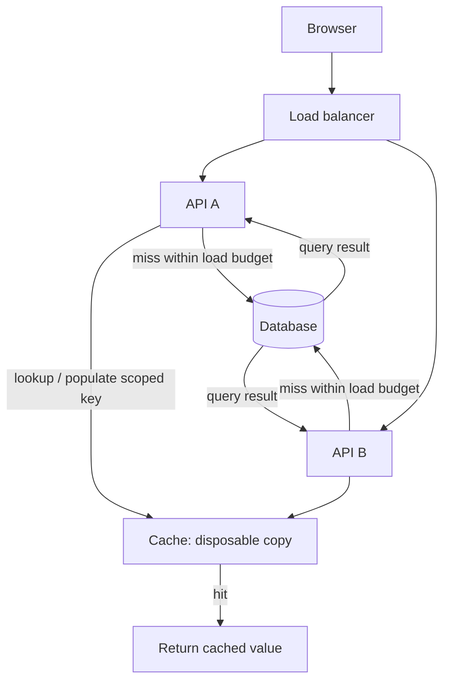
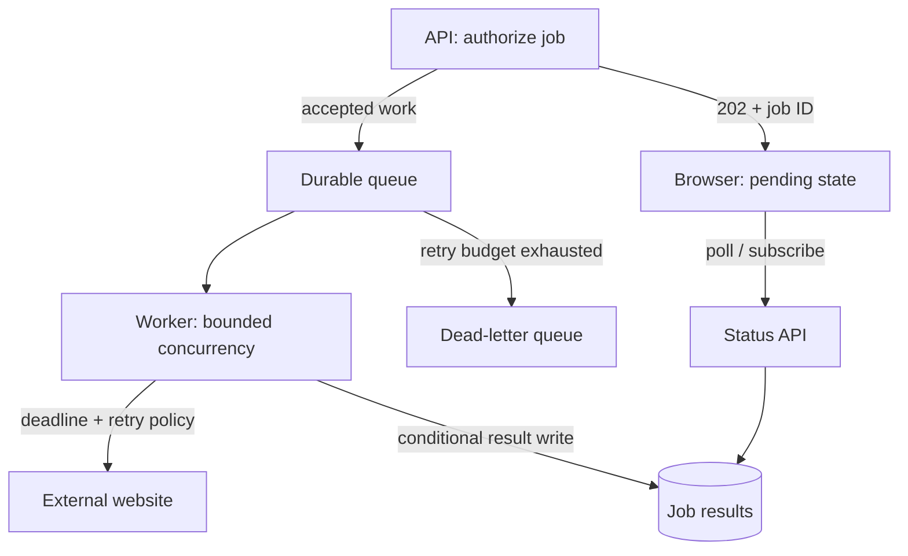
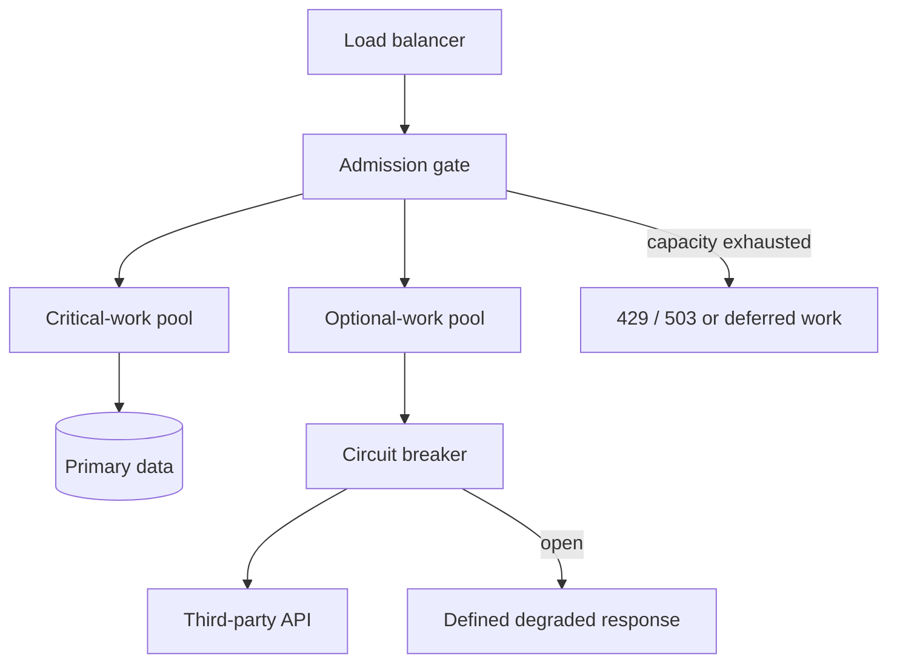

# Draw a bookmark request, then change its failure boundary

[Curriculum](../../README.md) · [System design under constraints](README.md)

## The application you are drawing

A member saves a documentation URL and later opens the shared reading list. The URL is the durable record. A remote title lookup is optional background work. The following four sketches progressively change that application: first persistence, then more reads, then queued work, then a slow dependency.

For each sketch, draw one success and the named failure. Label the actual request or record carried by each arrow. A database “commit” below means saving a transaction, not a Git commit. Your deliverable is an annotated diagram and the resulting user response. Use the [local reading-list starter](../../../examples/reading-list-starter/README.md) if you want to observe the initial HTTP behavior. The later sketches are proposed extensions, not services it already runs.

Draw from memory. Use **boxes for responsibilities**, **cylinders for durable state**, and **labeled arrows for data movement**. Start with the smallest design that meets the requirement. AWS names come after the mechanism.

## 1 · A bookmark must survive a restart

**Break it:** the commit succeeds, but the response disappears. Add an operation ID and decide where its result must be stored atomically.

## 2 · Read traffic grows

**Break it:** remove the cache. Can the database survive the bypass traffic? Add coalescing and admission limits where they actually coordinate work.

[Static view](../../../assets/learning/cache-expiry-still.svg)

## 3 · Refreshing a page takes seconds

**Break it:** the worker writes a result and crashes before acknowledgement. Trace the redelivery. Mark the narrow effect your idempotency record protects.

[Static view](../../../assets/learning/conditional-result-still.svg)

## 4 · A dependency becomes slow

**Break it:** both pools share the same database. Which failure can still cross your bulkhead?

## Translate the boxes into AWS

| Mechanism | Candidate AWS implementation | Decision you must still make |
|---|---|---|
| HTTP entry | ALB with ECS, or API Gateway with Lambda | Runtime and scaling model |
| Durable application state | RDS/Aurora or DynamoDB | Query patterns, invariants, consistency |
| Shared cache | ElastiCache | Staleness, eviction, outage behavior |
| Durable work queue | SQS + DLQ | Visibility, retries, ordering, concurrency |
| Object bytes | S3 | Key ownership, lifecycle, upload validation |
| Telemetry | CloudWatch and tracing instrumentation | User outcome, sampling, actionable alerts |

These are candidate mappings, not a requirement to use every service. Follow the [AWS labs](../03-infrastructure/aws/README.md) for implementation and current primary references.

## Interview rehearsal

1. Draw the happy path in two minutes.
2. Label the source of truth, trust boundaries, and resource limits.
3. Draw a timeout, duplicate, and slow dependency in another color.
4. Name the observable symptom and recovery action for each.
5. Remove one box. Explain what worsens and what becomes simpler.

**Junior:** prove one request and one invariant. **Senior:** quantify limits and recovery. **Staff:** add ownership, migration, regional failure, and operational cost.

[Concepts](mechanism-reference.md) · [Worked designs](../../../indexes/system-designs.md) · [Coding route](../../01-code/02-data-structures-algorithms/practice-sequence.md)
