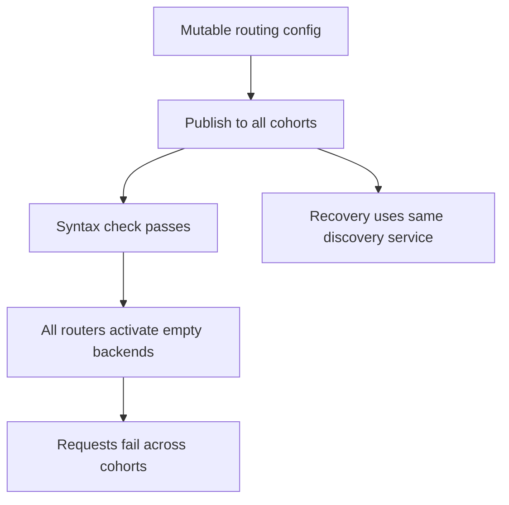
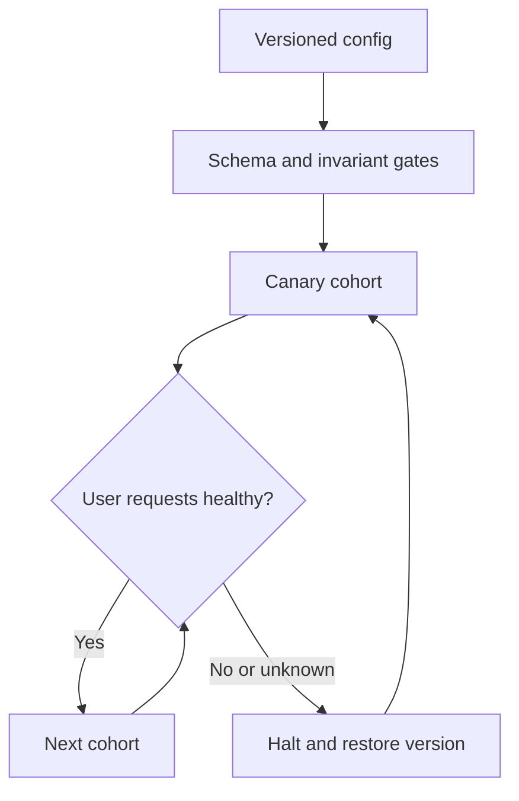
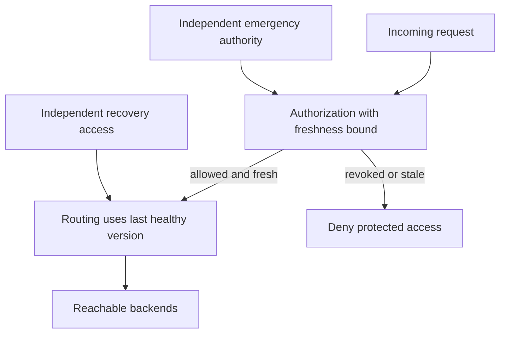

# Configuration is executable behavior

[Curriculum](../../../README.md) · [CI/CD and progressive delivery](../README.md)

> “Twenty routing cohorts accept configuration from one publisher. A syntactically valid update gives one cohort no reachable backends. Keep ordinary requests working, limit the rollout's exposure, and show how an emergency access revocation changes the fallback policy.”

Constructed interview brief; the reported event below is source context. Prerequisites: [contracts](../../../02-applications/01-backend/request-lifecycle.md) and [reliability](../../05-reliability/labs/reliability/README.md).

| Contract | Workload / expected outcome |
|---|---|
| Input | Versioned config, twenty cohorts, 1,000 total requests/s; canary carries 300/s |
| Normal behavior | Version 7 has reachable backends; valid version 8 replaces it only after health validation |
| Failure | Version 8 has `backends=[]` or unreachable targets → reject activation and keep routing version 7 |
| Rollout boundary | Missing health data stops promotion; cohort fraction is not request fraction |
| Excluded | Local exercise does not provision AppConfig or prove independence of actual production cohorts |

## Baseline to challenge

First restate which config fields affect routing versus authorization. Trace one request through version 7, then version 8. Locate the authority for activation and rollback; only then add staging. Calculate request exposure during detection and restoration, and name what an absent metric means. Attempt before opening the worked design.

**Real event:** GitHub, July 8, 2026. An automated metadata update changed a runtime value, disrupted discovery, and emptied router backend pools. GitHub restored configuration and service registration; its reported follow-up included immutable metadata, safer rollout, and better empty-pool detection. [Primary report, published August 12](https://github.blog/news-insights/company-news/github-availability-report-july-2026/).

**Recent solution evidence:** Cloudflare's May 1, 2026 update describes progressive configuration rollout, health gates, automatic rollback, and last-good configuration handling. It reports an April 7 recovery drill. This is a recent remediation report; the outages motivating that program were in 2025, outside our recent-incident window. [Primary update](https://blog.cloudflare.com/code-orange-fail-small-complete/).

**Takeaway:** A valid config file can still break service discovery. Validate behavior and contain rollout.

[Static diagram](../../../../assets/learning/config-cohorts-still.svg)

These diagrams use illustrative workloads. AWS mappings are our learning designs.

Work the example · AWS implementation · failure drill

## Worked design: a routing policy service

Suppose 20 isolated service cohorts read a routing configuration. All-at-once rollout exposes all 20 before a human can react. A one-cohort canary initially exposes 1/20 of cohorts. That is **not necessarily 5% of requests**: measure the cohort's actual traffic, tenant criticality, and shared dependencies.

Make the artifact immutable: version, schema, checksum, author, intended cohort, and timestamp. Validate nonempty backend sets, allowed destinations, and compatibility with both currently deployed parser versions. A healthy process must prove a real request through the new route. Pause promotion when health data is absent; absence of alarms is not evidence of health.

## AWS implementation exercise

Use **AWS AppConfig** for application configuration rollout, with a deployment strategy and CloudWatch alarms. Retain and validate configuration in the application before activating it. AppConfig does not automatically protect unrelated EC2 metadata mutations or arbitrary Terraform changes: those need their own staged infrastructure workflow. [AWS deployment behavior](https://docs.aws.amazon.com/appconfig/latest/userguide/appconfig-deploying.html).

Build a local parser with `schema_version`, `config_version`, and `backends`. Inject an empty list, an unsupported schema, and a well-formed but unreachable endpoint. Preserve the last-good version for ordinary routing when the replacement is unusable. Decide separately whether an authorization revocation may ever remain stale: continued access and continued availability have different consequences.

For a disposable AWS exercise: create an application, environment, hosted configuration profile, validator, deployment strategy, and an alarm monitoring actual canary failures. Give the environment a role able to read its alarm. Deploy a working version before a bad one. Record which hosts received it, when the alarm changed, whether rollback happened, and what happens if alarm data stops arriving. This is an implementation brief, not predeployed infrastructure.

## Proof, failure cases, and level expectations

| Level | Demonstrate | Above the baseline |
|---|---|---|
| Junior | Invalid config never replaces working state | Distinguish syntax, semantics, and reachability |
| Senior | Halt promotion on bad or missing telemetry; test recovery | Quantify exposure during alarm delay and long-lived connections |
| Staff | Independent recovery access, cohort ownership, audit trail | Show how correlated dependencies can defeat cohort isolation |

A rollback cannot undo already sent messages or external side effects. A last-good fallback cannot help a new instance that never had a valid configuration. Supply a tested bootstrap version or fail explicitly. Recovery tools should not depend entirely on the discovery service they repair.

**Changed requirement:** the update revokes a compromised tenant's access. Write the policy for stale configuration, expiry, and emergency revocation before implementing the fallback.

## Follow-ups that change the design

**Senior: skew and detection delay.** One of twenty cohorts carries 300 of 1,000 requests/s. A bad activation takes 60 seconds to detect and 20 to restore. Its traffic exposure bound is `300 × (60+20) = 24,000` requests under constant arrival assumptions, not 5% of fleet requests. Distinguish exposure from actual failures, and count sessions/long-lived connections separately. With no telemetry, promotion stays paused; a timer alone cannot establish recovery.

**Lead: revocation must take effect within five seconds.** A routing fallback retaining version 7 for sixty seconds cannot independently enforce that requirement. Keep the routing fallback scoped; require fresh authorization evidence or fail closed for the affected access boundary. State how the emergency authority remains reachable during discovery failure. Predict the stale decision before revealing the new boundary.

This is a build brief. Deliver (1) a parser with invalid-input fixtures, (2) an activation state machine plus last-good bootstrap test, (3) a simulated publisher with stop/promotion/rollback logs, and (4) the revocation freshness test. Expected checks: empty/unreachable replacement leaves routing at v7; a supported healthy v8 activates; stale authorization cannot survive its declared five-second bound. Your implementation command belongs in the submitted README; none is supplied by this page.

[Production casebook](../../../../indexes/production-cases.md) · [AWS implementation](../../03-infrastructure/aws/README.md)
