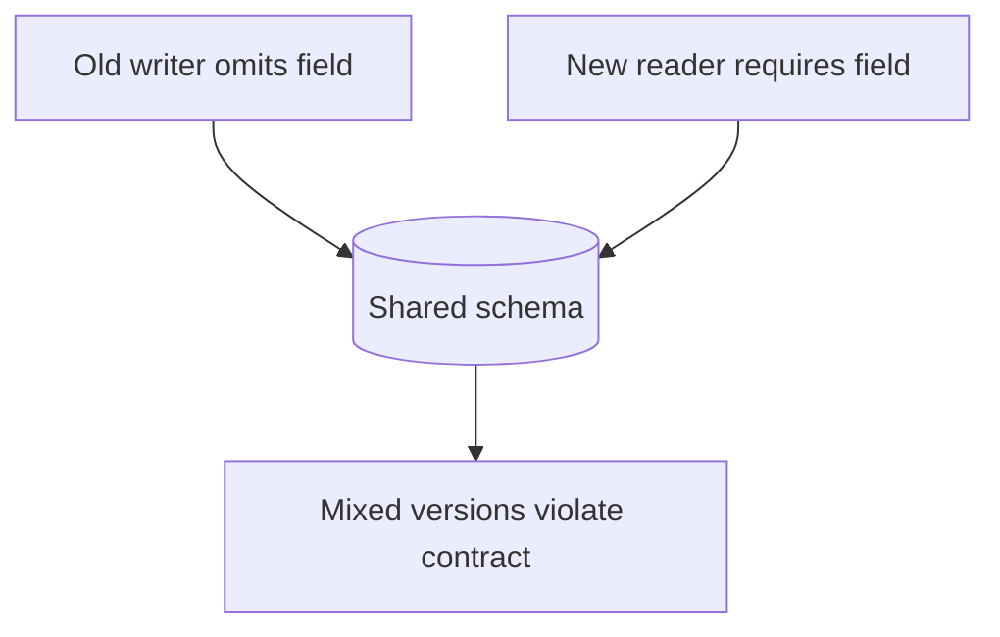
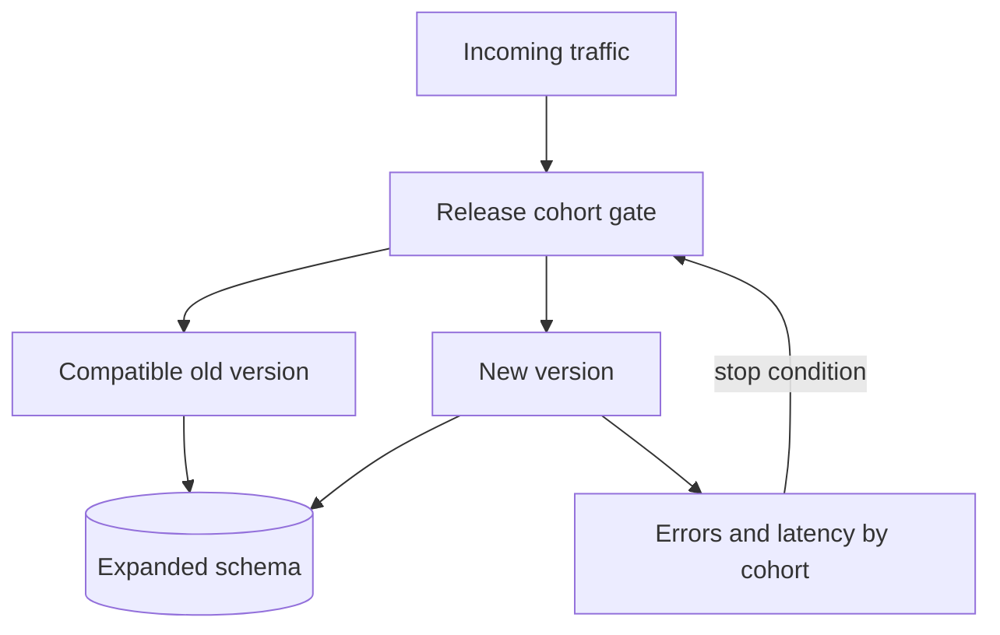
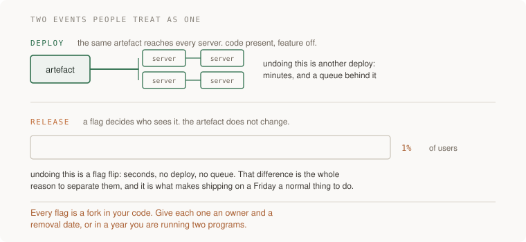
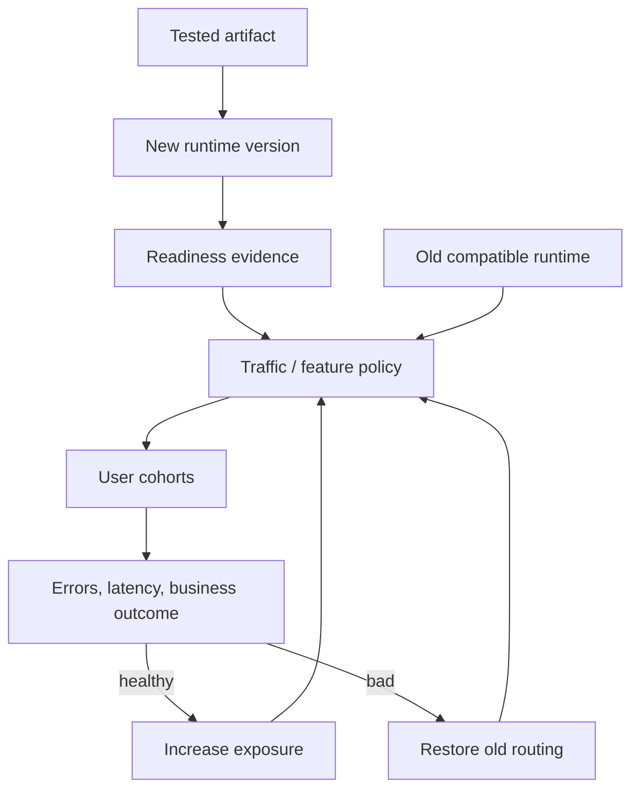

# Deploy compatible versions and control feature exposure

[Curriculum](../../README.md) · [Delivery and controlled rollouts](README.md)

> Project connection · feeds [Reading-list stage 2: operate and recover the application](../../../projects/reading-list/stages/02-it-survives/README.md)

## The release you need to make

An order API currently saves the purchaser’s address in `email`. You want to rename it to `contact_email`. Customers continue placing orders while servers update one at a time. For part of the rollout, old and new application versions read the same database.

A deploy replaces running code. It does not rewind records already written. Your task is to sequence this rename so both versions can serve during the supported rollback window, then explain when removing the old field becomes safe. This is a worked release plan for an application, not a request to add checks or approvals to this guide’s publishing pipeline.

### Make the incompatibility visible

These JSON objects illustrate the data each version expects. They are a proposed example, not a route already supplied in the repository.

```json
{"order_id":"o-42","email":"ana@example.org"}
```

If the new reader requires `contact_email`, that existing row is missing required data. Renaming the column immediately also breaks an old server still querying `email`.

| Moment | Required behavior |
|---|---|
| Old server writes during rollout | The new reader can still interpret its row |
| New server writes, then rolls back | The old reader can still interpret that row |
| A backfill stops halfway | Its checkpoint allows a safe restart |
| Old code and external consumers are retired | Removing the old field has an explicit owner and recovery plan |

Use the [configuration rollout case](cases/configuration-rollout.md) to follow one deployed change through mixed versions. For a running migration exercise, use the [local data migration fixture](../../04-scale-and-evolution/04-migrations/labs/recovery-migration/migration.md). Cloud release routing is a separate deployment choice.

## Plan for versions that coexist


> “Version B reads a new required field. Half our instances still run version A,
> which never writes it. We need to release without stopping traffic. What is
> your sequence, and what observation would stop the rollout?”

Delivery coordinates versions that coexist. Passing each version's isolated
tests does not prove the pair can safely share data or messages.

| Stage | Expected compatibility |
|---|---|
| Add optional field | A continues to work |
| Deploy B that tolerates missing field | A and B can serve together |
| Backfill and verify | Missing-field count reaches the agreed target |
| Require field, retire A | Old writers are prevented before enforcement |

**Ask first:** can A still be running in a job, mobile client, rollback artifact,
or another region? “All web pods updated” may not answer the question.



## Sequence the compatibility work

1. Expand the accepted contract before requiring new data. Specify defaults or
   read fallback deliberately; do not manufacture a misleading value.
2. Deploy a compatible reader/writer and observe errors by version and cohort.
3. Backfill with a restartable checkpoint and validate representative records,
   including the awkward historical rows.
4. Stop old writers, rehearse rollback boundaries, and only then contract the
   schema. Deleting data may require restore or forward repair instead of revert.

**Follow-up:** “Error rate rises only in the first one-percent cohort.” Draw
which traffic can be stopped while preserving an artifact and schema that work.



A strong answer distinguishes deploying code, exposing behavior, and enforcing a
new data contract. Lead depth adds the owner and completion criteria for each
stage, including consumers outside the releasing team.

## The principle behind the design

[Build once and supply configuration safely at runtime](../03-infrastructure/configuration-and-environments.md) made one deploy
reproducible. This section makes deploying so small, frequent and reversible
that it stops being an event — and treats the pipeline that does it as what it
is: the most privileged system you own. Two ideas carry everything. Change size affects diagnosis and recovery, while risk also depends on the behavior and data being changed. And putting code on
servers is a different event from putting a feature in front of users, which
you can control separately.

## Follow the failure through the system

The team ships every six weeks, "to limit risk". Release 4.2 is six weeks of
work: forty-odd changes, a schema migration, a pricing feature marketing has
already announced. It goes out Thursday evening. Friday morning, checkout
errors are climbing.

Which of the forty changes did it? Nobody knows; the diff is fourteen thousand
lines. Roll it all back, then — except the migration ran, the old code has
never seen the new schema, and rolling back the artefact without the schema is
a second incident on top of the first. So they debug forward, in production,
for most of a day, with the pricing launch broken in public.

The retrospective concludes the release was "too risky" and adds an approval
board and a stabilisation window. Deploys move to ten weeks apart, so the next
batch is bigger, so the next incident is worse — and the deploy machinery,
exercised five times a year, is rustier each time. Every step was locally
reasonable. The loop is a machine for maximising blast radius.

The same bug in a team that deploys many times a day is a different event: the
suspect is one small diff that landed an hour ago, the canary flags the error
rate while exposure is still 1%. Switching the flag off stops new exposure;
in-flight work and committed effects still need their own recovery plan. Small
batches help isolate a change, but do not make a dangerous change safe.

## Mechanisms and their limits

**Small batches make evidence easier to inspect.** A small change is usually
easier to review, diagnose and reverse than an unrelated bundle of changes.
Risk is not proportional to line count: one authorization rule or destructive
migration can have a large blast radius. Use independent tests, compatible
rollouts and a rehearsed recovery path; frequency alone proves none of these.

**Deploy and release are different events.** A *deploy* puts an artifact on
servers; a *release* exposes behavior to users. Compatible code can deploy with
a feature off, then a **canary** or percentage rollout can expose 1%, 10% and
100%, watching errors, latency and delayed jobs at each step. Deploying dark
still runs startup code and may change resource use: test that path too.



| Recovery action | What it changes | What it cannot undo |
|---|---|---|
| Turn the flag off | New requests use the supported control path after config propagation | An admitted job or committed row |
| Drain or cancel work | In-flight jobs follow their documented cancellation boundary | An external effect already committed |
| Repair effects | A versioned repair, refund or compensating event addresses persisted effects | Recall an email or erase an event another service consumed |

**A flag needs a lifecycle, not always a removal date.** A temporary release
flag has an owner, removal date and cleanup diff. A long-lived operational
control has an owner, review date and tests for both states. Keep the supported
paths and schema compatible throughout the declared rollback window. Retiring
the old path closes that window; document the repair/roll-forward plan first.

### Limit the deployment identity’s authority

A build can execute dependency scripts, plugins, and repository code. A deployment identity can change the running service. Keep those capabilities separate where untrusted changes could otherwise gain production access. Use immutable action revisions, scoped job permissions, and short-lived workload credentials when supported. A short-lived credential reduces exposure duration but can still do serious damage during its lifetime.

A merge queue evaluates combined changes before merging. It is one option for repositories that need that workflow, with waiting time and operational cost. It is not a prerequisite for every automatic publishing pipeline. This guide publishes from main without adding that gate.

Infrastructure code records the intended resources and permissions. Compare the proposed plan with current state. Differences can be intentional source changes, manual edits, or provider behavior. Review the cause rather than assuming every difference is unauthorized drift.

**Rollback is a feature you build, and it has a boundary.** Going back must be
one action, and rehearsed — a rollback nobody has run is a hope with a
runbook. But be precise about what rolls back: the artefact does; several
things never do. A migration that dropped a column cannot be un-run, which is
why schema changes are written **expand/contract** — add the new alongside the
old, ship code that works with both, remove the old only when nothing running
needs it, including versions supported during the rollback window. Sent
emails, charged cards, and events other systems already consumed do not roll
back either. The senior reviewer's question for every change: *if we roll this
back in an hour, what stays behind?*


## What good looks like

- Merging to main deploys, with no human running commands; deploys per week is
  a number you can state.
- Every third-party action is pinned to a commit SHA, CI reaches the cloud
  through OIDC, and the CI token is read-only by default. You can say what a
  pull-request author can reach, because you checked.
- A plan against live infrastructure comes back empty, and the infrastructure
  has been recreated from the repo at least once.
- You can deploy dark and release by percentage; the two events sometimes
  happen on different days, and that surprises nobody.
- Temporary release flags have owners and removal dates; operational flags
  have owners, review dates and tested enabled/disabled behavior.
- Rollback is one action; the last rehearsal has a date and a duration.
- Migrations are expand/contract: the previous version of the code runs
  against the current schema, and someone has proved it.

Done badly:

- Deploys have a calendar invite, a war room, and a person who "drives".
- `uses: something@v3` throughout, and a cloud key in CI secrets created two
  years ago that nobody dares rotate.
- The infrastructure repo describes what production looked like in March.
- Release means deploy: the only way to turn a feature off is to ship again.
- Flags named `temp_` or `new_` that are older than several employees' tenure.
- A rollback runbook that has never been run, and a migrations folder full of
  one-way doors.

## Use an assistant to investigate specific questions

**Request 1 — map the pipeline's privilege before touching it**

```
Here are my CI workflow files. Build a table, one row per job: what
secrets and credentials it can reach, what its token can write to,
and which third-party actions it runs — pinned to a tag, a branch,
or a full commit SHA.

Then answer as an attacker who controls the code in a pull request:
which of these jobs runs my code, and what do I walk away with?

Do not propose fixes until the map is complete.
```

*Why it is asked that way:* "map before fixes" stops the model skipping to
generic hardening advice, and the attacker question is the one that finds the
real problem — a job that runs untrusted PR code with secrets in reach. That
combination hides in plain sight in workflows everyone has read.

*What you should get back:* a table with at least one uncomfortable row. If
every row comes back safe, be suspicious: in most repos the honest answer is
that the test job runs arbitrary PR code, and the question is what else that
job can see.

*What to push back on:* "these actions are from reputable authors, so tags are
fine". A tag is a pointer someone else controls, and reputation does not
survive a compromised maintainer account. SHA or it is not pinned.

**Request 2 — the migration that survives a rollback**

```
I need to rename the column `email` to `contact_email` on a table
with live traffic. Write it as a sequence of separate deploys, with
one rule: at every step, both the currently deployed code and the
previous version run correctly against the current schema.

For each step, state what deploys, what migrates, and what breaks
if we roll back at exactly this point. If the answer is ever
"rollback breaks", identify the explicit compatibility-retirement gate and
the tested repair or roll-forward path. Before that gate, preserve rollback.
```

*Why:* the both-versions rule is the constraint doing the work. Without it you
get a single `ALTER TABLE ... RENAME` plus a code change in one deploy — which
works until the first rollback, which is exactly when it must not fail.

*What you should get back:* expand/contract — add the new column, dual-write,
backfill, move reads, stop writing the old, drop it in a later release — with
the rollback answer stated per step and the drop deliberately far from the
rename.

*What to push back on:* the migration and the code change riding in the same
step "for simplicity", and any backfill that locks the table while it runs.

**Request 3 — a flag born with its own funeral**

```
Put <this change> behind a feature flag. Requirements:

1. Off by default, and the old path is what runs if the flag system
   is unreachable.
2. One choke point: the flag is evaluated in exactly one place, not
   checked in every function that cares.
3. Next to the definition: owner, created date, removal date, and
   what done means — done is the flag deleted, not the flag at 100%.
4. Write the removal diff now, as a draft PR: the change that
   deletes the flag and the old path once the rollout has held.
```

*Why:* requirement 1 chooses the failure mode before it happens — a flag
service outage should degrade to yesterday's behaviour, not to a coin flip.
Requirement 4 is the one that changes behaviour months later: removal stops
being archaeology because the diff already exists.

*What to push back on:* the flag threaded through a dozen call sites. Every
extra check is a place the two paths can disagree, and a removal diff that
touches twelve files is a removal that will not happen.

## How you would know it is wrong

1. **Deploy a deliberately broken build** — crashes on start, or fails its
   health check — through the real pipeline, in a scratch environment. It
   should never take traffic: stopped at the health gate, or rolled back
   automatically. If the pipeline exits green while the broken build serves,
   your deploy verifies "the commands ran", not "the deploy worked".
2. **Find out what your CI token can actually reach.** Inspect permission metadata without printing a credential value. List what the cloud role allows, not what you meant it to allow. Then, from a pull-request branch in a sandbox, attempt
   one thing it should not be able to do. The gap between intended and actual
   is the finding.
3. **Roll back and time it**, from decision to the old version serving, with
   the person who built the pipeline on holiday. Minutes and one action is a
   pass. "First find the person who knows" is the red result, better read in a
   drill than an incident.
4. **Audit flags by age.** List every flag with its creation date. A flag
   older than six months with no owner and no removal date is not a rollout
   tool anymore; it is an unmerged fork of your product. Count them.
5. **Run a plan against live infrastructure** and read the diff. A difference may come from an intentional code change, provider behavior, defaults, or a manual edit. Explain each difference before applying it. A manual incident repair may need to be incorporated into the source.
6. **Manufacture the merge-queue failure.** Two branches: one renames a
   function, the other adds a call to the old name. Both pass CI alone. Put
   them through your merge process. If main ends up red, you have just watched
   the exact failure a merge queue exists to prevent, on demand, for free.

> The standing rule: before believing a green result, say what broken would
> have looked like. A pipeline that has never been seen to stop a bad build is
> not a gate. It is a corridor with green paint.

## Apply this lesson to the reading-list application

On **P2**, the reading list from P1 gets its delivery machinery:

- Merge-to-main deploys, and you did not run a command — the P2 checkbox, done
  properly.
- The pipeline hardened: every action pinned to a SHA, cloud access through
  OIDC with the old static key revoked, token read-only by default. One
  written paragraph: what a pull-request author can reach.
- The infrastructure described in the repo, destroyed and recreated once, and
  a plan that comes back empty afterwards.
- One real change shipped behind a flag: deployed dark, released at 1%, then
  10%, then everyone — and then the flag removed. The removal PR is part of
  the deliverable.
- One rollback drill, timed, written down.

**Acceptance criteria:**

- A deliberately broken build went through the pipeline and never served
  traffic; you watched it get stopped or rolled back, and can say which.
- The old cloud key is revoked and the deploy still works — both halves, as P2
  demands.
- A plan against the live infrastructure shows no changes.
- The flag is gone from the code, and you can point at the diff that removed
  it.
- The rollback time is a measured number, not an estimate.

## Terms used in this lesson

- **batch size** — how much change ships per deploy. One influence on review and recovery cost.
- **deploy** — putting a new artefact on servers. Says nothing about who sees
  it.
- **release** — routing users onto the new path. The event users experience.
- **progressive delivery** — releasing in slices — canary, percentages, flags —
  instead of to everyone at once.
- **canary** — the new version taking a small share of real traffic, watched
  against the old.
- **feature flag** — a runtime switch between code paths with a named owner
  and lifecycle: removal for temporary release flags, review for operational controls.
- **merge queue** — tests changes combined, in landing order, so main only
  receives what passed together.
- **infrastructure as code** — the repo as the description of reality, applied
  rather than clicked.
- **drift** — reality edited by hand until the description lies.
- **expand/contract** — schema change as add-alongside, migrate, remove-later,
  so the previous code version keeps running.
- **OIDC (workload identity)** — CI proving who it is per run and getting a
  short-lived credential, instead of storing a key.
- **roll forward** — fixing with a new small deploy instead of going back.
  Its usefulness depends on how quickly a compatible repair can be built and deployed.

---

**Not covered here:** deployment topologies in depth — blue-green, rolling,
in-place and their trade-offs; mobile releases, where the store controls the
deploy and flags stop being optional; versioned artefacts consumed by others —
libraries and APIs release on contracts, not traffic; and what happens when a
release goes wrong anyway — detection and response live in
[Set an error budget and bound retries during overload](../05-reliability/failure-budgets.md), and the supply chain beyond your own
pipeline in [Enforce who can act on each resource and what the server can reach](../../02-applications/05-security/trust-and-authorization.md).

[Learning sequence](../../README.md) · [Independent practice](../../../practice/interview-guide.md)

## Draw it from memory · Deploy and release are separate controls



**Redraw challenge:** Which new requests does flag-off redirect? Trace an admitted job, a committed new-schema row and an emitted event; give each a drain, cancel or repair outcome.



[Static view](../../../assets/learning/config-cohorts-still.svg)
