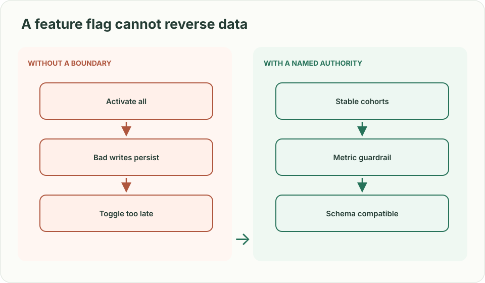
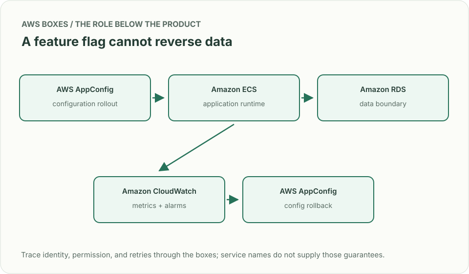
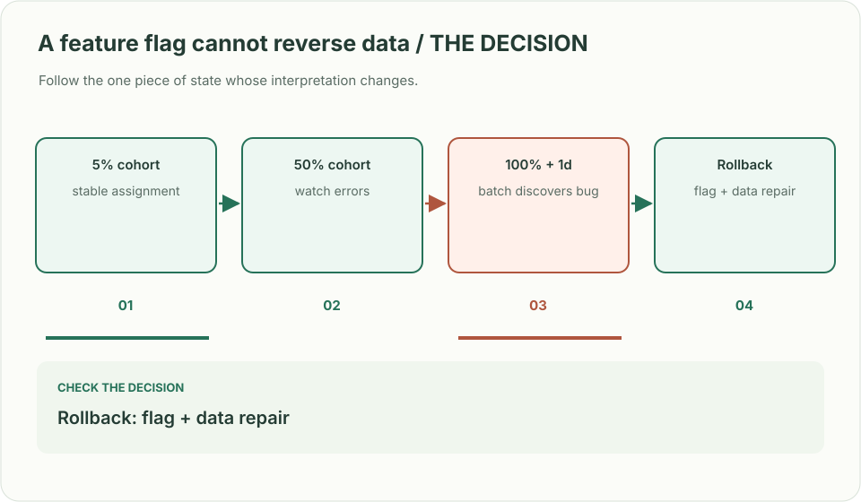

# Feature rollout: the switch that failed after 100%

> **Interviewer:** “A new checkout path works in staging. Release it to 5% of customers, then 50%, then everyone. A billing bug appears only after a full day. How do you make activation, observation, and rollback safe?”

**Your contract.** Use a stable customer assignment (not a fresh coin toss per request), a compatible control path during the rollback window, and a meaningful error signal. A percentage rollout alone cannot catch a bug that appears after a daily job runs. This is a constructed exercise.

| Situation | Expected behavior |
|---|---|
| One customer makes 20 requests at 5% | All requests take the same assigned path for this assignment salt |
| Failure starts at 50% | Stop new exposure after propagation; drain/cancel admitted work by contract and repair committed effects |
| Batch job runs 24 hours after 100% | Bake time or delayed gate catches the regression; recovery plan addresses writes already made |
| Control path schema was removed | Toggle cannot restore behavior; migration sequencing must have kept both paths compatible |



## Decide what the flag actually protects

Hash `(stable account ID, assignment salt)` into a fixed bucket. **Keep the salt unchanged across 5% → 50% → 100%**; the configuration revision changes the threshold, not the assignment. A new salt means an intentional new experiment. Use the trusted account identity rather than a browser-selected ID; define how account merges move membership. Separate deploying compatible code from activating the behavior. Store a validated configuration version, observe per-cohort error and conversion rates, and rollback on a **guardrail** signal. A flag reversal is not a data rollback: if the new path writes incompatible records, use expand–migrate–contract and a compensating workflow. Account for an alarm with no data before relying on it as a guardrail.

### A cohort you can reproduce

This is a routing bucket, not an authorization or randomness primitive. The
same account and salt map to the same integer on every runtime.

```python
import hashlib
import json

def bucket(account_id: str, assignment_salt: str) -> int:
    payload = json.dumps([account_id, assignment_salt],
                         ensure_ascii=False, separators=(",", ":")).encode("utf-8")
    return int.from_bytes(hashlib.sha256(payload).digest()[:8], "big") % 10000

accounts = [f"account-{i}" for i in range(1000)]
assigned = {a: bucket(a, "checkout-A") for a in accounts}
cohort_5 = {a for a, value in assigned.items() if value < 500}
cohort_50 = {a for a, value in assigned.items() if value < 5000}
assert cohort_5 and cohort_5 <= cohort_50
assert all(bucket(a, "checkout-A") == assigned[a] for a in accounts)
assert all(0 <= value < 10000 for value in assigned.values())
assert any(bucket(a, "checkout-B") != assigned[a] for a in accounts)
```

A 5% threshold is approximate over a finite population, not a promise of exactly
50 of these 1,000 accounts. Rolling back to 0% changes admission, not bucket
identity or already committed billing effects.



| AWS box | Job here | Alternative and deciding factor |
|---|---|---|
| AWS AppConfig (configuration rollout) | Validate, ramp, bake and revert flag versions | Homegrown flag service if targeting rules and audit needs exceed its features, with ownership cost |
| Amazon CloudWatch (metrics and alarms) | Evaluate cohort guardrails and trigger configured rollback | Existing observability platform with reliable cohort-aware telemetry and rollback wiring |
| Amazon ECS (application runtime) | Run both compatible code paths during exposure | AWS Lambda for stateless request processing and existing serverless deployment |
| Amazon RDS for PostgreSQL (relational database) | Keep both data representations compatible during migration | Amazon DynamoDB for a key-oriented model with conditional writes |

AWS AppConfig can roll back on configured CloudWatch alarms during deployment and bake time; it cannot reverse side effects already persisted by customers. Check alarm permissions and a measurable signal before turning on automatic rollback.



**Senior follow-up:** The 5% cohort sees an error increase but revenue improves. Define primary and guardrail measures, minimum sample size, and a decision rule rather than “watch the dashboard.”

**Staff follow-up:** Four services read different flag versions during the migration. Define global compatibility, blast-radius boundaries, release ownership, and a reversible migration window that spans both schema and behavior.

**Practice artifact:** Draw control plane, request path, and measurement path. Trace one customer across 5%, 50%, rollback, and next-day batch processing.

**Source boundary:** Original prompt. [AWS AppConfig rollback documentation](https://docs.aws.amazon.com/appconfig/latest/userguide/monitoring-deployments.html) establishes AWS behavior; a [May 2026 Meta ingestion migration](https://engineering.fb.com/2026/05/12/data-infrastructure/migrating-data-ingestion-systems-at-meta-scale/) illustrates why transition and rollback strategies matter, without implying Meta asks this question.
