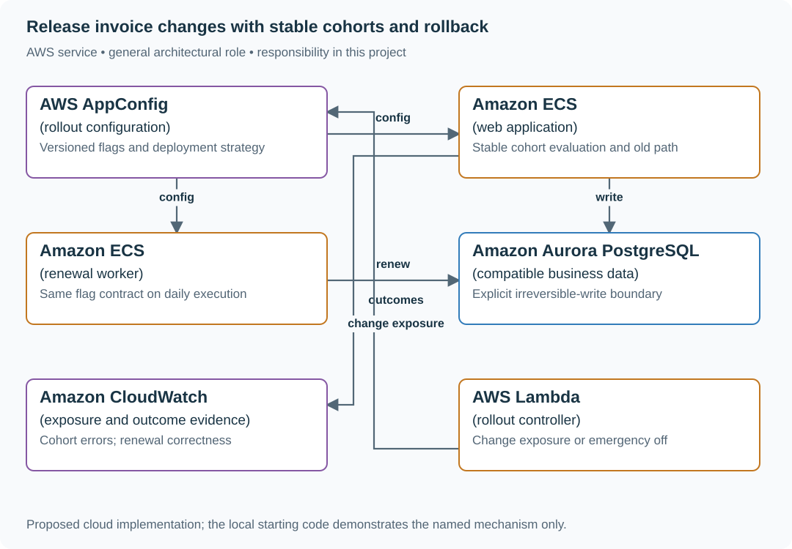
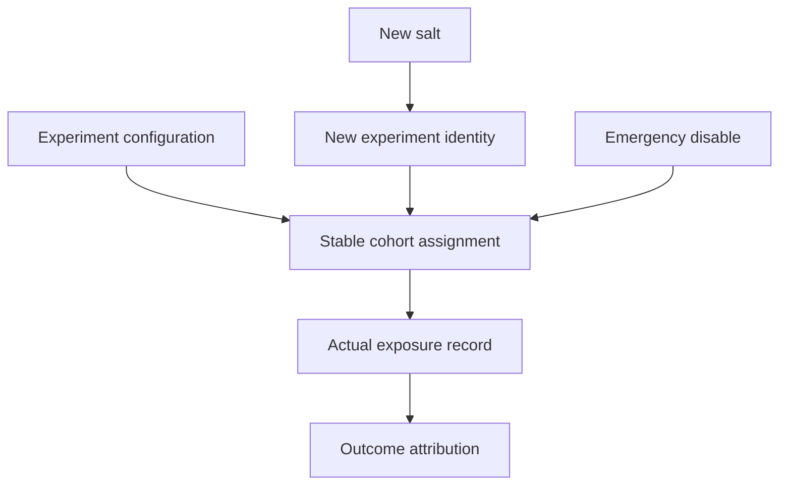

# Release invoice changes with stable cohorts and rollback

## Application background

A subscription product has a new way to calculate invoices. The team wants a small set of customers to use it first while everyone else keeps the old behavior. A feature setting decides which version each customer receives after the code is deployed.

Customers should not switch unpredictably between versions on every request. Also, an interactive purchase might run immediately while the monthly renewal job runs hours later. A healthy web request does not demonstrate that delayed work is healthy.

### Example walkthrough

| Action | Expected behavior |
|---|---|
| Customer 17 is assigned to the new calculation | Keep that assignment stable during the rollout. |
| The daily renewal worker runs later | Observe its results separately from web purchases. |
| The new calculation is wrong | Switch exposure back to compatible old behavior. |

A cohort is the selected group of customers. Deployment installs code. Rollout decides who uses a behavior. Rollback must consider any new data the code has already written.

## Your assignment

**Deliver:** Build stable customer selection for a new invoice calculation. Version the selection settings and demonstrate rollback for both immediate requests and delayed renewal jobs.

**Required behavior:** Evaluate a versioned flag against a stable subject identity. Exposure is deterministic for a given flag salt and subject. Turning the flag off restores the supported old path. It cannot undo irreversible writes already made by the new path.

The required first milestone is a working local implementation of the behavior above. The numbered implementation steps define the scope. The cloud architecture is a later extension, not something the starter has already provisioned.

## Get the code and run the supplied example

The code is in the public [junior-to-staff repository](https://github.com/Soulful-Iris/junior-to-staff). Install Git and Python 3.12+. No AWS account or Python packages are required for this first run. If you already have a checkout, use it and skip cloning.

```bash
git clone https://github.com/Soulful-Iris/junior-to-staff.git
cd junior-to-staff
python3 examples/architecture-starts/feature_rollout.py
```

**Supplied file:** [`examples/architecture-starts/feature_rollout.py`](https://github.com/Soulful-Iris/junior-to-staff/blob/main/examples/architecture-starts/feature_rollout.py). You can also [read or download the source here](../../../../examples/architecture-starts/feature_rollout.py).

This program is a **mechanism demonstration**: it runs the small scenario in one process and prints the result. It is not an HTTP service, a complete application, or an AWS deployment. A successful run demonstrates this mechanism only. It does not establish the workload or failure guarantees of the application you will build.

**Example output from the supplied run:**

Generated IDs and timestamps may differ. Compare the state transitions and outcomes.

```text
user-4 5% True 25% True repeat True
user-11 5% True 25% True repeat True
user-5 5% False 25% True repeat False
user-9 5% False 25% True repeat False
… (more output follows)
```

### Set up your implementation workspace

Create `work/feature-rollout/` in your checkout (or use a separate repository). Copy the supplied mechanism into that directory as `mechanism.py`, then extract its state transitions into functions you can call from your implementation. The record and module names below describe what you must implement. They are not a promise that files with those names already exist. Keep a `README.md` beside your implementation with its exact run commands and observed results.

## Local components and state to implement

This table names the records, interfaces or decision inputs for your deliverable. Unless a name is explicitly linked to supplied source above, it is something you create. Implement the local state transitions first, then connect the HTTP, storage or worker boundaries required by the steps.

| Record / module | Key or interface | Responsibility |
|---|---|---|
| flag_config | flag_id,version,salt,percentage,overrides | Deterministic exposure and explicit emergency control. |
| exposure_event | subject,flag_version,variant,path | Evidence of which behavior actually ran. |
| release_record | code_version,config_version,data_compatibility | Rollback boundary and owner. |

## Implement the assignment

### 1. Keep both paths compatible

Introduce the new code behind a flag while retaining the old reader/writer contract. Inventory web requests, scheduled jobs, retries and admin tools that use the behavior. Record any data change the old code cannot understand before calling the flag a rollback mechanism.

### 2. Assign and record stable cohorts

Hash a stable subject with a fixed flag salt. Increasing percentage should include the previous cohort. Record actual exposure at execution time, not only configuration assignment. Keep employee overrides and emergency-off precedence explicit.

### 3. Observe the relevant work cycle

Compare errors, latency and business outcomes for equivalent exposed/control cohorts. Wait through the daily renewal path and representative traffic before widening exposure. Low traffic may require a longer observation window rather than a claim that zero errors proves safety.

### 4. Exercise rollback and cleanup

Turn the flag off and confirm the old path processes records written during exposure. Reconcile external effects that cannot be undone. After adoption, remove dead code and retire the flag under a named owner/date so configurations do not accumulate indefinitely.

## Demonstrate the completed local result

| Action | Expected visible result |
|---|---|
| Run the starting program | Assignment repeats consistently, a larger rollout retains prior exposure, and 0% disables everyone. |
| Disable after a new-path write | The old path can still read/process the record or the documented repair is required. |
| Observe only daytime traffic | The rollout remains unproven for the midnight renewal path. |

**Handoff:** In your implementation README, include the start command, one successful operation, the failure case above and the resulting stored state or decision. State which dependencies are simulated. Someone with a fresh checkout should be able to reproduce this without your chat history.

## Workload assumptions and capacity decisions

These are constructed exercise assumptions. The stated workload is a design target. The local demonstration does not establish that throughput. Use the [estimation constants](../../../01-code/01-problem-solving/estimation-constants.md) to check units before choosing capacity.

| Input or objective | Calculation / consequence |
|---|---|
| 100,000 eligible accounts. 5% initial exposure | About 5,000 accounts, with random variation. Hash cohorts are not an exact-count allocation. |
| Daily renewal job | A ten-minute observation window cannot reveal a defect in a path that runs once per day. |
| One-minute configuration freshness bound | Record applied version and age. Define the fallback when refresh is stale. |

## Map the local implementation to AWS

**Deployment status: local only.** Running the supplied command creates no AWS resources and configures no cloud connections. The diagram is a proposed deployment of the completed application. Each box needs either a deployed runtime, a provisioned service or an explicitly external dependency.

Read the diagram by following the arrows from the entry point: application code accepts the request or event, the state owner commits it, and any worker produces the later result. The table ties those roles to code and adapter work. Multiple boxes do not imply multiple Python files already exist.



AppConfig distributes the policy. Application code evaluates exposure and preserves compatible behavior. A flag cannot reverse an external charge or repair incompatible stored data.

| Local responsibility | Cloud destination and role | Implementation still required |
|---|---|---|
| Local versioned configuration | AWS AppConfig: rollout configuration | Publish validated configuration versions and consume them with bounded caching and rollback behavior. |
| Application or worker process | Amazon ECS: web application | Build a container and task definition. Supply configuration, task roles and graceful shutdown behavior. |
| Application or worker process | Amazon ECS: renewal worker | Build a container and task definition. Supply configuration, task roles and graceful shutdown behavior. |
| Local records and transaction boundary | Amazon Aurora PostgreSQL: compatible business data | Write PostgreSQL schema/migrations and a database adapter. Configure credentials, connection limits and recovery. |
| Local counters, timestamps and diagnostic output | Amazon CloudWatch: exposure and outcome evidence | Emit bounded metrics and logs, build the named operational view and configure retention and access. |
| Python operation or worker function | AWS Lambda: rollout controller | Write a Lambda event adapter, package its dependencies and give its role only the required resource actions. |

### Provision resources, then connect the application

| Resource or boundary | Initial configuration and reason |
|---|---|
| Config consumer | Validate snapshots, expose applied version and keep a documented stale-config fallback. |
| Metrics | Record bounded variant/path labels and stable release identity. Protect personal cohort identifiers. |
| Rollback | Limit controller permissions to the relevant application/environment. Retain the prior valid configuration. |

Use one disposable AWS environment for the cloud exercise. Put the named resources in `infra/template.yaml` or your existing IaC tool, pass resource IDs through configuration, and scope each runtime role to its own tables, buckets and queues. The diagram is a design to implement. It is not a claim that these resources have been deployed. Record the commands you used to deploy and remove the exercise resources.

For concrete provisioning commands, configuration wiring and cleanup, use the [AWS foundation guide](../../../../examples/architecture-starts/infra/README.md). It includes a deployable table/queue/object-storage foundation and explains which application and service adapters you still implement.

A provisioned queue or table does not make the local program use it. Configure resource IDs in the deployed runtime, replace the local adapter, and replay the same successful and failing operation against that runtime. Record the deployed commit and observable result, then remove the disposable resources using your infrastructure tool.

## Extend the design after the baseline works
### Worked follow-up: Change experiment cohorts without mixing two experiments

A user who saw the treatment yesterday may become control today. Combining both exposures under one experiment name makes outcomes difficult to attribute and can hide incompatibility between services.

| Starting design | Changed requirement |
|---|---|
| One stable hash salt assigns users to a rollout cohort. | Changing the salt creates different assignments and must create a new experiment identity. |

**Revised architecture.** Follow the changed responsibility and failure path below. This is a design to implement. The supplied local example does not provision these components.



**What to implement.** Persist experiment ID, salt version, allocation and behavior version in configuration. Record actual exposure, not just eligibility. Treat a salt change as a new experiment and keep old outcome records attached to the original assignment. During a cross-service rollout, accept compatible configuration versions before increasing exposure. Retain an emergency disable independent of cohort assignment.

**Walk through the result.** Compute assignments for the same small user set under salts 1 and 2 and display who moved. An outcome caused by a salt-1 exposure remains in experiment 1. Roll one service back while another still runs the newer reader and demonstrate that the shared contract remains valid. Deliver the exposure record and version compatibility table.


Let product change the hash salt mid-rollout. Explain cohort churn and experiment contamination, then make salt changes an explicit new experiment rather than a harmless configuration edit.

<details>
<summary>Additional design cases, alternatives and original source notes</summary>


**Your contract.** Use a stable customer assignment (not a fresh coin toss per request), a compatible control path during the rollback window, and a meaningful error signal. A percentage rollout alone cannot catch a bug that appears after a daily job runs. This is a constructed exercise.

| Situation | Expected behavior |
|---|---|
| One customer makes 20 requests at 5% | All requests take the same assigned path for this assignment salt |
| Failure starts at 50% | Stop new exposure after propagation. Drain/cancel admitted work by contract and repair committed effects |
| Batch job runs 24 hours after 100% | Bake time or delayed gate catches the regression. Recovery plan addresses writes already made |
| Control path schema was removed | Toggle cannot restore behavior. Migration sequencing must have kept both paths compatible |

## Decide what the flag actually protects

Hash `(stable account ID, assignment salt)` into a fixed bucket. **Keep the salt unchanged across 5% → 50% → 100%**. The configuration revision changes the threshold, not the assignment. A new salt means an intentional new experiment. Use the trusted account identity rather than a browser-selected ID. Define how account merges move membership. Separate deploying compatible code from activating the behavior. Store a validated configuration version, observe per-cohort error and conversion rates, and rollback on a **guardrail** signal. A flag reversal is not a data rollback: if the new path writes incompatible records, use expand–migrate–contract and a compensating workflow. Account for an alarm with no data before relying on it as a guardrail.

### A cohort you can reproduce

This is a routing bucket, not an authorization or randomness primitive. The
same account and salt map to the same integer on every runtime.

```python
import hashlib
import json

def bucket(account_id: str, assignment_salt: str) -> int:
    payload = json.dumps([account_id, assignment_salt],
                         ensure_ascii=False, separators=(",", ":")).encode("utf-8")
    return int.from_bytes(hashlib.sha256(payload).digest()[:8], "big") % 10000

accounts = [f"account-{i}" for i in range(1000)]
assigned = {a: bucket(a, "checkout-A") for a in accounts}
cohort_5 = {a for a, value in assigned.items() if value < 500}
cohort_50 = {a for a, value in assigned.items() if value < 5000}
assert cohort_5 and cohort_5 <= cohort_50
assert all(bucket(a, "checkout-A") == assigned[a] for a in accounts)
assert all(0 <= value < 10000 for value in assigned.values())
assert any(bucket(a, "checkout-B") != assigned[a] for a in accounts)
```

A 5% threshold is approximate over a finite population, not a promise of exactly
50 of these 1,000 accounts. Rolling back to 0% changes admission, not bucket
identity or already committed billing effects.

| AWS box | Job here | Alternative and deciding factor |
|---|---|---|
| AWS AppConfig (configuration rollout) | Validate, ramp, bake and revert flag versions | Homegrown flag service if targeting rules and audit needs exceed its features, with ownership cost |
| Amazon CloudWatch (metrics and alarms) | Evaluate cohort guardrails and trigger configured rollback | Existing observability platform with reliable cohort-aware telemetry and rollback wiring |
| Amazon ECS (application runtime) | Run both compatible code paths during exposure | AWS Lambda for stateless request processing and existing serverless deployment |
| Amazon RDS for PostgreSQL (relational database) | Keep both data representations compatible during migration | Amazon DynamoDB for a key-oriented model with conditional writes |

AWS AppConfig can roll back on configured CloudWatch alarms during deployment and bake time. It cannot reverse side effects already persisted by customers. Check alarm permissions and a measurable signal before turning on automatic rollback.

**Senior follow-up:** The 5% cohort sees an error increase but revenue improves. Define primary and guardrail measures, minimum sample size, and a decision rule rather than “watch the dashboard.”

**Staff follow-up:** Four services read different flag versions during the migration. Define global compatibility, blast-radius boundaries, release ownership, and a reversible migration window that spans both schema and behavior.

**Practice artifact:** Draw control plane, request path, and measurement path. Trace one customer across 5%, 50%, rollback, and next-day batch processing.

**Source boundary:** Original prompt. [AWS AppConfig rollback documentation](https://docs.aws.amazon.com/appconfig/latest/userguide/monitoring-deployments.html) establishes AWS behavior. A [May 2026 Meta ingestion migration](https://engineering.fb.com/2026/05/12/data-infrastructure/migrating-data-ingestion-systems-at-meta-scale/) illustrates why transition and rollback strategies matter, without implying Meta asks this question.

</details>
