# 12 · Delivery — five projects

> Senior tier · each one an afternoon · read [the section](README.md) first

Five projects that turn deploying from an event into a habit, and all five are
built on the section's standing rule: **before believing a green result, say
what broken would have looked like.** A pipeline nobody has watched stop a bad
build is not a gate, it is a corridor with green paint.

You end up having manufactured a failure that two passing checks could not see,
mapped what a pull-request author can reach from your CI, renamed a column
without closing the door behind you, released to 1% and then deleted the flag,
and destroyed your infrastructure on purpose to find out whether the repository
was telling the truth.



---

### 1. The green that proved nothing

*You end up having watched your pipeline stop a broken build, and having made main go red on purpose with two checks that both passed.*

**Build**

Two experiments in one afternoon. First: push a deliberately broken build —
crashes on start, or fails its health check — through the real pipeline into a
scratch environment, and find out whether it ever takes traffic. Second:
manufacture the merge-queue failure with two branches that each pass alone and
break together.

**The thought process**

The first idea is the one the whole section rests on: **a check you have never
seen fail is not evidence.** Your pipeline is green every day. So is a pipeline
with its test step silently skipping, a health check that returns 200 before
the application has loaded, and a deploy step that reports success because the
*commands* ran. All four look identical from the outside. The only way to tell
them apart is to break something and watch.

Second, on the broken build specifically: **decide in advance where it should
be stopped.** At the test stage, at the health gate, or by automatic rollback
after it starts serving errors. Writing that prediction down first is what
makes the experiment informative — if it gets stopped somewhere else, or not at
all, you have learned something specific rather than "it worked".

Third, the merge-queue half. **"All checks passed" is a statement about a state
that may no longer exist.** Each pull request was tested against main as it
stood when that PR last updated, not as it will stand when the PR lands. Two
changes can each pass and fail combined — one renames a function, the other
adds a call to the old name. Both green. Main broken. Every check told the
truth.

Fourth: **this failure is free to manufacture**, which is unusual and worth
exploiting. You do not need to wait for it to happen to you. Two small
branches, ten minutes, and you get to watch the exact failure mode on demand —
and then watch a merge queue prevent it, which is the only way to actually
believe the queue is worth its latency.

**How to organise the prompts**

```
Build me a deliberately broken artefact for <my app>: one that passes
the build step, starts, and then fails its health check.

Then tell me, given my pipeline config, exactly where it SHOULD be
stopped and what I should see in the logs at that point.
```

Asking for the prediction before the run is what turns a test into an
experiment.

```
It got to <where it actually got to>. Explain the gap, and tell me
which specific setting let it through.
```

```
Now the merge-queue failure. Give me two minimal branches against my
repo: one renames a function, the other adds a call to the old name.
Each must pass CI independently.

Tell me what I should see when both land without a queue.
```

```
Enable a merge queue with my required checks. Put both branches
through it. Show me which one gets ejected and what the queue built
to find that out.
```

```
What class of failure does a merge queue still NOT catch? I want the
remaining gap named.
```

That last question is the honest close. A merge queue tests the combined
*code*; it does not test the combined *data*, or interactions with something
deployed separately.

**On AWS**

For the broken-build half, the concrete question is whether your deploy has a
real gate. On **ECS**, the gate is the target group health check plus the
service's deployment circuit breaker — which, with rollback enabled, returns
the service to the last healthy task definition automatically. That circuit
breaker is off unless you turned it on, and turning it on is the single change
that converts "the deploy reported success" into "the deploy verified
something".

On **Lambda**, the equivalent is a **CodeDeploy** deployment configuration with
a canary or linear traffic shift and a **CloudWatch alarm** wired as the
rollback trigger — the alarm is the gate, and a deployment with no alarm
attached cannot roll itself back no matter what the shift schedule says.

On **EC2** behind an **Application Load Balancer**, the gate is the target
group's health check, and the specific trap is a health check that hits `/`
and gets a 200 from a web server that has started while the application behind
it has not. Point it at an endpoint that checks the things the request path
needs — your database connection, your cache — and then break one of them and
confirm the target goes unhealthy.

Run the whole experiment in a scratch environment stamped from the same
**CloudFormation** or CDK template as production, which is project 5's work
paying off early.

**What productionising it means**

The pipeline has been seen to stop something, and you can say which stage did
it. The health check checks the things a real request needs, not just that a
process is listening. Automatic rollback is enabled and has fired at least once
in a drill. A merge queue is on for the branches that matter. And the broken
build experiment is repeatable, ideally quarterly, because a gate decays
quietly when nobody tests it.

**The learning**

Every green result has two explanations — the thing works, or the check cannot
see. Distinguishing them requires deliberately breaking something, which feels
wasteful and is the only evidence available. This is also the generalisable
version of the habit: for any check you rely on, ask what it would have shown
if the thing were broken, and if the answer is "the same", it proved nothing.

**How you would know it is wrong**

- If the broken build served traffic, your deploy verifies commands rather than outcomes. That is the finding; do not soften it.
- Compare where it was stopped to where you predicted. Being wrong is useful; not having predicted is not.
- After the merge queue is on, check what it actually builds. A queue that merges without building the combined branch is a queue in name.
- Check your health check endpoint. If it would return 200 with the database down, it is a liveness check standing in for a readiness check.
- Name one failure the merge queue cannot catch. If you cannot, you are trusting it further than it goes.

---

### 2. What a pull request can reach

*You end up with a table of every CI job's privilege, an honest paragraph about what a pull-request author can reach, and one thing closed.*

**Build**

Map your pipeline's privilege — per job, what secrets it can read, what its
token can write, which third-party actions it runs and how they are pinned.
Then answer the attacker's question: which jobs run code that arrives in a pull
request, and what do they walk away with. Then pin, scope, and federate.

**The thought process**

Start from the fact that makes this urgent: **the pipeline is the most
privileged system you own, and it runs code that arrives in pull requests.**
Test code, build plugins, dependency lifecycle scripts, third-party actions —
all of it executes with whatever that job can reach. Anyone who can influence
what it executes is one step from your cloud account.

Second, the specific combination to hunt for: **a job that runs untrusted code
and has secrets in reach.** This hides in plain sight because it is the test
job, which everybody has read a hundred times and nobody has read as an
attacker. The fix is usually structural — split the job so the privileged part
never sees pull-request code — rather than a permission tweak.

Third, on pinning: **a version tag is a pointer somebody else controls.** It
can be moved to point at new code after you reviewed it. A full commit SHA
cannot. Reputation of the author is not a defence, because the threat model is
a compromised maintainer account, which is exactly what has happened in the
real incidents. SHA or it is not pinned.

Fourth: **least privilege is per job, not per pipeline.** Default the token to
read-only and grant write scopes to the specific job that needs them. The
common shape — one broad token because it was easier — means every job inherits
the privilege of the most privileged one.

Fifth, and this is the one that actually reduces blast radius: **replace the
static cloud key with OIDC.** This is [11 · Security](../11-security/)'s
project 3 arriving from the delivery side, and the reason it belongs in both
sections is that it is simultaneously the biggest security win and the thing
that makes deploys simpler.

**How to organise the prompts**

```
Here are my CI workflow files. Build a table, one row per job: what
secrets and credentials it can reach, what its token can write to,
and which third-party actions it runs — pinned to a tag, a branch, or
a full commit SHA.

Then answer as an attacker who controls the code in a pull request:
which of these jobs runs my code, and what do I walk away with?

Do not propose fixes until the map is complete.
```

Map-before-fixes is what stops the answer becoming generic hardening advice.
The attacker framing is what finds the real problem.

```
For the jobs that run untrusted code: restructure so that job has no
secrets and no write permissions, and the privileged work happens in a
separate job that only runs on trusted refs.

Show me both workflow files, and tell me what I lose.
```

```
Pin every third-party action to a full commit SHA, keeping the version
in a trailing comment. Then tell me how I will know when each one has
a new release worth taking.
```

That second sentence is the part people skip, and it is why SHA pinning gets
reverted six months later — pinning without an update path becomes stale
dependencies, and then somebody unpins everything.

```
Print the actual permission set of the CI token in a job log, and list
what the cloud role actually allows — not what I meant it to allow.

Then give me one specific action it should NOT be able to do, that I
can attempt from a pull-request branch in a sandbox.
```

Attempting it is the point. The gap between intended and actual is the finding,
and you only see it by trying.

**On AWS**

The credential half is **GitHub Actions OIDC** exchanged for an IAM role, and
the whole security of it lives in the trust policy's condition on
`token.actions.githubusercontent.com:sub`. Pin it to your org and repository,
and if you want deploys to require review, pin it to a GitHub **environment**
and put the approval on that environment — that combination is the clean way to
say "only a deploy from the protected environment may assume the production
role".

Then bound it. An **IAM permissions boundary** on the CI role caps what it can
ever do regardless of what the attached policy says, which is the right control
for a role whose policy will accumulate over years. And separate roles per
environment: a CI role that can deploy to staging should not be able to touch
production, which means two roles and two trust conditions rather than one role
with a wildcard.

If you are running the pipeline inside AWS, **CodeBuild** and **CodePipeline**
inherit an IAM service role, and the same discipline applies with a different
surface — the build role is where over-permissioning hides, because it starts
broad to make things work and nobody narrows it afterwards.
**IAM Access Analyzer**'s unused-access findings will tell you which of its
permissions have never been exercised, which is the shortest path to a smaller
policy.

For artefacts: **ECR** with tag immutability on, so a tag cannot be moved to
point at a different image after it was approved — the registry-side version of
SHA pinning, and the same argument.

And keep **CloudTrail** on the CI role specifically. If the pipeline is your
most privileged system, its audit trail is the one you want when a question
arises, and a metric filter alarming on unexpected API calls from that role is
a cheap detection for exactly the compromise this project is about.

**What productionising it means**

Every third-party action is pinned to a SHA with a visible update path. The CI
token is read-only by default. Untrusted code and privileged credentials never
occupy the same job. The cloud path is OIDC with no long-lived key, the old key
is revoked, and the deploy still works — both halves. And there is a written
paragraph, in the repository, saying what a pull-request author can reach,
because the answer is not obvious and somebody will need it.

**The learning**

CI is a production system that most teams treat as a build tool, and the
asymmetry is stark: it holds the credentials to everything and it executes code
from strangers. Once you have read your own workflow as an attacker you cannot
unsee the test job, and you will never again assume a pipeline is safe because
its steps are familiar.

**How you would know it is wrong**

- Print what the CI token can actually do, not what you intended. The gap is the finding.
- Try one forbidden action from a pull-request branch in a sandbox. It must fail, and you should watch it fail.
- Grep for `@v` in your workflows. Every one is a pointer somebody else controls.
- Check whether any job both runs pull-request code and can read a secret. That is the row that matters.
- Revoke the old static key and run a deploy. If it still works, the key was not the path; if the deploy breaks, you found something still using it.

---

### 3. The rename that survives a rollback

*You end up having renamed a column under live traffic across several deploys, with a rollback at every step that does not break.*

**Build**

Rename a column on a table with traffic — `email` to `contact_email` — as a
sequence of separate deploys, under one rule: at every step, both the currently
deployed code and the previous version run correctly against the current
schema. Then actually roll back at two different points and confirm nothing
breaks.

**The thought process**

The first thing to understand is **why the obvious version is a trap.** One
deploy containing `ALTER TABLE ... RENAME` plus the code change works
perfectly, right up until the first rollback — which is exactly the moment it
must not fail. You roll the artefact back, the old code looks for a column that
no longer exists, and you now have two incidents.

Second, the rule that generates the whole solution: **the previous version of
the code must run against the current schema.** That single constraint forces
expand/contract without you having to remember the steps — add the new column
alongside the old, dual-write, backfill, move reads, stop writing the old, drop
it much later. Each step is safe because the schema is always a superset of
what any running code needs.

Third: **the drop is a separate decision, made much later, by a person.** The
contract phase is the dangerous one and there is no rush. Ship it weeks after
the expand, once you are sure nothing running needs the old column — and "sure"
means you checked, ideally by making the old column's reads observable before
you remove it.

Fourth, the operational detail that turns a good plan into an outage: **a
backfill that locks the table is an outage with a migration's name on it.**
Backfills run in batches, with a pause between them, and they are restartable
because they will be interrupted.

Fifth, the senior question for every change, not just migrations: **if we roll
this back in an hour, what stays behind?** A dropped column cannot be un-run.
Neither can a sent email, a charged card, or an event another system already
consumed. Rollback restores the artefact; it does not restore the world.

**How to organise the prompts**

```
I need to rename the column `email` to `contact_email` on a table with
live traffic. Write it as a sequence of separate deploys, with one
rule: at every step, both the currently deployed code and the PREVIOUS
version run correctly against the current schema.

For each step, state what deploys, what migrates, and what breaks if
we roll back at exactly this point. If the answer is ever "rollback
breaks", the sequence is wrong.
```

The both-versions rule is the constraint doing the work; without it you get one
deploy and a hidden one-way door.

```
Write the backfill as batched and restartable: batch size, pause,
where it records progress, and what happens if it is killed halfway.

Tell me how long it will take on a table of <N> rows and what lock it
takes, if any.
```

```
Before the contract step: how do I PROVE nothing is still reading the
old column? Give me something observable, not an argument.
```

This is the prompt that prevents the classic incident. The answer is usually a
log line or a metric on the old read path, left running for a week.

```
Now list everything in this change that rollback does NOT undo. Emails,
charges, events published to other systems, files written, caches
warmed — anything that leaves the database.
```

**On AWS**

Two AWS features change the economics of this project and both are worth
knowing by name.

**RDS Blue/Green Deployments** creates a synchronised staging copy of your
database, lets you apply the schema change and test against it with production
data, and then switches over in a way that is measured in seconds rather than a
maintenance window. It is the right tool for the class of change that is
genuinely hard to do online — and understanding when you *do not* need it,
because expand/contract handled it, is the more valuable half of the lesson.

**Aurora fast database cloning** is the cheaper rehearsal: a copy-on-write
clone of a multi-terabyte database in minutes, at almost no storage cost until
you start writing. That means "run the migration against production-sized data
first" stops being a thing you skip because it takes a day.

For the migration mechanics: run migrations as a **separate pipeline stage**
from the application deploy, not as a container start-up hook — a migration
that runs on every task start races itself when the service scales out. If you
are on ECS, a one-off task; on Lambda, a dedicated function; either way,
triggered deliberately.

Keep an eye on **RDS Performance Insights** during the backfill, because the
symptom of a badly batched backfill is not an error, it is everyone else's
queries getting slower. And set **CloudWatch** alarms on replica lag if you
have read replicas: a large backfill is the classic way to push replication lag
past the point where your reads start returning stale data.

For the "what does not roll back" list: anything you published to
**EventBridge** or **SNS** has been consumed by somebody, and anything in
**SQS** is already in flight. Those are the leftovers, and they are the reason
the question is worth asking every time.

**What productionising it means**

Migrations are expand/contract by default and somebody has proved the previous
code version runs against the current schema — by actually rolling back, not by
reasoning. Backfills are batched, restartable and observed. The contract step
is a separate, later deploy with evidence attached that nothing reads the old
column. And every change ships with an answer to "if we roll this back in an
hour, what stays behind".

**The learning**

A rollback is only cheap if you built it to be, and the thing that makes it
expensive is almost always a schema change that closed the door behind it. The
discipline is not "be careful with migrations", it is a mechanical rule — the
previous version must keep running — that removes the judgment call entirely.

**How you would know it is wrong**

- Roll back at two different points in the sequence and confirm nothing breaks. Reasoning about it is not the same as doing it.
- Check whether the migration and the code change ride in the same deploy. If they do, you have a one-way door.
- Time the backfill on production-sized data and watch everyone else's latency while it runs.
- Before the drop, ask for evidence that nothing reads the old column. An argument is not evidence; a metric at zero for a week is.
- Write the list of things rollback does not undo. If it is empty, you have not thought about the world outside the database.

---

### 4. One percent, then everyone, then the funeral

*You end up having released a change to 1% of traffic, promoted it, and deleted the flag — with the removal diff written before the rollout started.*

**Build**

Take one real change. Deploy it dark, release it at 1%, watch, go to 10%, go to
everyone, then remove the flag and the old path. Write the removal pull request
on day one, as a draft. Also: run a rollback drill and time it, from decision to
the old behaviour serving.

**The thought process**

The first thing that makes this work is **separating two events that usually
happen together.** A deploy puts an artefact on servers; a release routes users
onto the new path. Once they are separate, going back costs a flag flip in
seconds rather than an artefact move in minutes, and the cost of being wrong
shrinks to whatever slice was exposed.

Second, the flag's failure mode is a decision you make now: **if the flag
service is unreachable, what runs?** The answer must be the old path. A flag
that fails open is a release you did not choose, delivered at the worst
possible moment, and this is a two-line decision that people leave to a default.

Third: **one choke point.** The flag is evaluated in exactly one place, not
checked in every function that cares. Every extra check is a place the two
paths can disagree, and a removal diff touching twelve files is a removal that
will not happen.

Fourth, and this is the part that changes behaviour months later: **write the
removal diff on day one.** A flag is a fork in your code with a timer on it,
and the timer only works if the removal is already drafted. Done means the flag
is deleted, not the flag is at 100%. Without this you get the codebase where
nobody dares delete the `temp_` check from three years ago because nobody knows
who is still behind it.

Fifth: **decide what you are watching before you go to 1%.** A canary is only a
canary if there is a baseline and a comparison. "Watch the dashboard" is not a
promotion criterion; "error rate on the new path within X of the old, for Y
minutes" is.

**How to organise the prompts**

```
Put <this change> behind a feature flag. Requirements:

1. Off by default, and the old path runs if the flag system is
   unreachable.
2. One choke point: evaluated in exactly one place.
3. Next to the definition: owner, created date, removal date, and
   what done means — done is the flag deleted, not at 100%.
4. Write the removal diff now, as a draft PR: the change that deletes
   the flag and the old path.
```

Requirement 4 is the one that survives contact with a busy quarter.

```
Define the promotion criteria before the rollout: which metrics,
compared against what baseline, over what window, and what value
means stop.

Then tell me what this canary CANNOT detect at 1% of traffic.
```

That last question is important and rarely asked. At 1%, a rare error is
invisible, and slow data corruption is invisible at any percentage.

```
Write the rollback drill: how I turn this off, who can do it without
me, how long it takes, and how I confirm the old behaviour is actually
serving again.
```

```
The rollout has held for a week. Walk me through merging the removal
PR — what could still be behind the flag, and how I check before
deleting the old path.
```

**On AWS**

For the flag itself, **AWS AppConfig** is the managed answer, and it is
underused. It gives you feature flags with validators, a gradual deployment
strategy for the flag change itself, and — the part that matters — automatic
rollback of a configuration deployment when a **CloudWatch alarm** fires. That
is progressive delivery of your *configuration*, which is the layer most
outages actually come from. Against it: a third-party flag service has better
targeting and a nicer UI; the argument for AppConfig is that it is already in
your account and its rollback is wired to the same alarms as everything else.
If you use a vendor, instrument against the **OpenFeature** API so the vendor
is one config file rather than a thousand call sites.

For the traffic-shifting half, the service depends on your compute.
**Lambda** has weighted aliases, and **CodeDeploy** drives them with
predefined configurations like a 10% canary for five minutes, with a CloudWatch
alarm as the rollback trigger. **ECS** does blue/green through CodeDeploy with
a test listener, so you can send synthetic traffic to the new version before
any user reaches it. For anything behind an **Application Load Balancer**,
weighted target groups do percentage splits directly, which is the simplest
mechanism and the one to reach for first.

At the edge, **CloudFront** with a Lambda@Edge or CloudFront Function can route
a percentage of requests, which is the right layer when the change is in a
static front end rather than in your API.

The observability half is where this earns its keep: the promotion criterion
should be a **CloudWatch** comparison between the canary and the baseline, and
**CloudWatch Evidently**-style metric comparison or a simple metric-math alarm
on the difference is the mechanism. Tag the metrics by version so the
comparison is possible at all — a canary you cannot distinguish from the
baseline in your telemetry is not a canary, it is a hope.

**What productionising it means**

Deploy and release are separate and it surprises nobody when they happen on
different days. Every flag has an owner and a removal date, and the count of
live flags goes down as well as up. The flag fails to the old path. Promotion
criteria are written before the rollout and are a comparison, not a vibe. The
rollback time is a measured number with a date on it. And the removal PR is
merged, so the change is actually finished.

**The learning**

The thing that makes shipping safe is not care, it is the ability to undo
cheaply — and that ability is built, not wished for. The second half is less
obvious and costs more over time: every flag is an unmerged fork of your
product, and a team that creates flags faster than it deletes them has traded
release safety for a permanently more complicated codebase.

**How you would know it is wrong**

- Turn the flag off and time it, with the person who built it unavailable. Minutes and one action is a pass.
- Make the flag service unreachable and see what runs. If it is the new path, you chose a failure mode by accident.
- List every flag with its creation date. Anything older than six months with no owner is not a rollout tool any more.
- Check that the removal PR exists before the rollout starts. Afterwards is archaeology.
- Ask what the canary could not have detected at 1%. If the answer is "nothing", you are trusting it too far.

---

### 5. Destroy it and get it back

*You end up having deleted your infrastructure on purpose and rebuilt it from the repository — and with a plan that comes back empty afterwards.*

**Build**

Describe your infrastructure in code. Then destroy the non-production copy
entirely and recreate it from the repository, timing it and writing down every
manual step you had to take. Then run a plan against the live environment and
make the diff empty.

**The thought process**

The first thing to be clear about is **why this is the test.** Infrastructure
as code is not valuable because it automates clicking; it is valuable because
the description is reviewable, diffable, and *recreatable*. The only way to
know the description is true is to delete the thing it describes and build it
again. Everything short of that is a document you hope is accurate.

Second: **the manual steps you discover are the deliverable.** You will find
some — a DNS record made by hand, a certificate validated once, a secret
created in the console, a quota raised by a support ticket, an IAM role
somebody added during an incident. Each one is a line in the repository that
does not exist, and each one is a reason the recovery you planned in
[08 · System design](../08-system-design/) would have taken longer than you
said.

Third, **drift is the ongoing version of the same problem.** Someone fixes
production by hand at 2am — correctly, under pressure, and they were right to —
and now the description lies. The next apply either reverts their fix or fails
strangely. The discipline is not "never touch the console"; it is that a
non-empty plan is a finding, and hand-made changes get written back into code
the next morning.

Fourth, a decision to make explicitly rather than inherit: **which tool, and do
you know why.** Terraform has been under the Business Source License since
August 2023 — source-available, not open source — and HashiCorp has been part
of IBM since February 2025. OpenTofu is the Linux Foundation fork that kept
MPL 2.0 and has genuinely diverged rather than trailing. CloudFormation and CDK
are the AWS-native path with no licensing question and no state file to manage.
None of these is wrong. Not knowing which one you are on, and why, is.

Fifth: **state is the scary part.** The thing your infrastructure code manages
is usually stateless; the state file that tracks it is not, and losing it is a
worse day than losing the infrastructure. Where it lives, who can write it, and
whether it is locked are decisions to make on purpose.

**How to organise the prompts**

```
Here is my infrastructure. Write it as code, and separately list
everything that currently exists which you could NOT express — things
made by hand, things with no API, things that exist because of a
support ticket.

That second list is what I am actually asking for.
```

Asking for the gap explicitly is what stops you getting a confident template
that silently omits the four things that will block a rebuild.

```
Now the destroy-and-recreate plan for my non-production environment:
order of operations, what has to exist before what, what will take a
long time, and what I will have to do by hand.

Include how I get the data back, and be honest if the answer is that
I cannot.
```

```
I rebuilt it. Here is what I had to do manually: <list>. For each,
either express it in code, or tell me why it cannot be and what the
runbook line should say instead.
```

```
Run a plan against the live environment. Every non-empty item: is
this drift, or is my code wrong? Tell me which, and for the drift,
what somebody probably did and why.
```

The "what somebody probably did and why" framing matters. Drift is usually a
correct emergency fix, and treating it as a mistake is how you get people to
stop telling you about it.

**On AWS**

The comparison first, because this is the choice the project forces.
**CloudFormation** and **CDK** keep the state on AWS's side — no state file for
you to lose, no locking to configure, drift detection is a built-in API call,
and stack rollback on failure comes free. The costs are slower feedback and a
weaker story when part of your world is not AWS. **Terraform or OpenTofu** give
you one language across providers and a much better plan output, and charge you
the state file: where it lives (an **S3** bucket with versioning, plus DynamoDB
or S3 native locking), who can write it, and what happens when two people apply
at once.

For the drift half specifically: **CloudFormation drift detection** answers the
question directly for stacks, and **AWS Config** answers it continuously for
resources, with rules that tell you when a setting you closed has been reopened
— which is the failure mode of every control you fix once. Pairing Config rules
with the second-path list from [11 · Security](../11-security/) is the durable
version of that project.

The things that reliably do not come back automatically, so check for them
during the rebuild: **ACM certificates** need DNS validation records (and a
CloudFront certificate must live in us-east-1); **Route 53** hosted zones get
new nameservers if you recreate the zone rather than the records;
**Service Quotas** are at defaults in a fresh account or region;
**Secrets Manager** secrets are deliberately not in your template and need a
separate seeding path; and **S3 buckets** with data in them will refuse to
delete, which is a feature and will also stop your `destroy` halfway.

And use **Organizations** with a separate account for the scratch environment
if you can. Destroying a whole account's worth of infrastructure is much less
frightening when the blast radius has an account boundary around it, and
account-per-environment is the AWS-shaped answer to isolation generally.

**What productionising it means**

The repository describes reality and a plan against live comes back empty. The
environment has been recreated from scratch at least once and the time is
written down. The manual steps either moved into code or into a runbook line
with a name against them. Drift is checked continuously rather than discovered
during an apply. And the state file, if you have one, is versioned, locked, and
backed up — because it is the one piece of this that cannot be rebuilt from the
repository.

**The learning**

A description you have never tested is a document, not a description. The
destroy-and-recreate is uncomfortable for exactly the reason it is valuable: it
converts every assumption about your infrastructure into either a line of code
or a known gap, and there is no cheaper way to find out which of your
assumptions were wrong.

**How you would know it is wrong**

- Destroy and recreate. If you cannot bring yourself to do it in a scratch environment, that reluctance is the finding.
- Count the manual steps. Each one is a line in the repository that does not exist.
- Run a plan against live. Non-empty means reality was edited by hand and one of those lines is somebody's 2am fix.
- Time the rebuild and compare it to the RTO you wrote in [08 · System design](../08-system-design/). They are usually not the same number.
- Check where the state file lives and who can write it. If the answer is "a laptop", you have a single point of failure with no backup.
