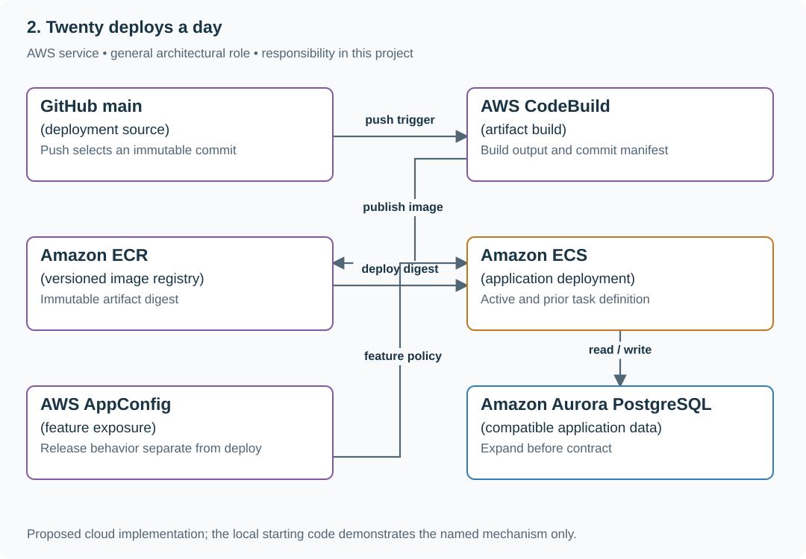

# 2. Twenty deploys a day

## What you are building

> Build a small reading-list service whose main branch deploys automatically. A new UI can be exposed separately from deployment, and rollback must restore a known artifact. The hard case is new data that an old application version cannot read.

**Working contract:** A push to main triggers build and deployment without a newly added test or approval gate. Record the deployed commit/artifact. Feature exposure and data compatibility are explicit application concerns, and rollback names the exact artifact/configuration it restores.

## Workload and the decisions it changes

These are constructed exercise assumptions. The large workload is a design target; the local demonstration does not establish that throughput. Use the [estimation constants](../../../01-code/01-problem-solving/estimation-constants.md) to check units before choosing capacity.

| Input or objective | Calculation / consequence |
|---|---|
| Twenty deployments/day | Artifact identity and one reliable rollback action matter more than a long manual release checklist. |
| 1% then 10% feature exposure | Record actual cohort behavior; code can already be deployed while the feature remains off. |
| Two supported code versions during rollout | Schema expansion must remain readable by both until the old version is retired. |

## Start with one working boundary

Run from the repository root with Python 3.12+:

```bash
python3 examples/architecture-starts/twenty_deploys_a_day.py
```

[Open the starting code](../../../../examples/architecture-starts/twenty_deploys_a_day.py). This is a runnable demonstration of the critical state boundary. The API, UI, cloud adapters and operating behavior below are the application you build around it.

| Record / module | Key or interface | Responsibility |
|---|---|---|
| release_manifest | commit,artifact_digest,config_version | Immutable identity of what is running. |
| active_release | environment,manifest_pointer | Atomic deployment switch and prior version. |
| compatibility_record | schema_version,supported_readers | Documents the first irreversible data boundary. |

## AWS implementation



The diagram is an AWS application deployment option. This guide’s existing push-to-main publishing remains intact. Building the site/application is necessary to produce deployable output; additional tests or approval gates are not added here.

## Build it in this order

### 1. Make main the deployment trigger

Build from the pushed commit and publish that immutable artifact. Record the commit in a version endpoint or release manifest. Avoid introducing unrelated checks, manual approvals or scheduled jobs into this guide’s publishing path.

### 2. Separate deployment from exposure

Keep a new optional UI path behind a versioned flag while both code versions understand stored data. Deploy the code first, then adjust exposure as a product operation. Disabling a flag stops new entry; it does not cancel work already running or undo external effects.

### 3. Practice one concrete rollback

Keep the prior artifact and configuration. Switch back using a documented command and inspect the actual version endpoint plus a create/read action. Measure elapsed recovery time. Restore compatible code without rebuilding a supposedly identical older artifact from changing dependencies.

### 4. Handle the data boundary honestly

Expand schema before using new fields, retain old readers/writers during the support window and remove old fields only after retirement. Once new data cannot be represented by old code, use a compatibility adapter or forward repair; an old container image cannot recreate dropped data.

## Infrastructure configuration

| Resource or boundary | Initial configuration and reason |
|---|---|
| Deployment identity | Scope repository/branch trust and environment permissions; untrusted code does not receive production credentials. |
| Artifacts | Tag for human readability but deploy by digest; retain the previous working artifact/configuration. |
| Database | Use compatible expansion and explicit retirement; keep backup/repair procedures independent of the deployment dashboard. |

Use one disposable AWS environment for the cloud exercise. Put the named resources in `infra/template.yaml` or your existing IaC tool, pass resource IDs through configuration, and scope each runtime role to its own tables, buckets and queues. The diagram is a design to implement; it is not a claim that these resources have been deployed. Record the commands you used to deploy and remove the exercise resources.

## Observe the result

| Action | Expected visible result |
|---|---|
| Run the starting program | Code rollback works with compatible fields; deleting title demonstrates the irreversible boundary. |
| Push a harmless visible change | The deployed commit and page/application output match the pushed artifact. |
| Disable the feature | New exposure stops while the deployed version remains unchanged. |

## The next design decision

An external effect completed before rollback. Define the reconciliation or compensation operation separately; switching code cannot reverse a sent email or completed payment.

<details>
<summary>Further constraints from the original project</summary>

## Follow-up 1 · A PR changes CI

**Changed requirement:** An untrusted pull request edits the deploy script. May it receive the production role? Predict which boundary must change before opening the design.

<details>
<summary>Expected reasoning and changed diagram</summary>

No. Run untrusted checks without privileged credentials; deploy only the reviewed immutable artifact from a protected workflow with narrowly scoped OIDC trust.

</details>

## Follow-up 2 · Rollback follows new writes

**Changed requirement:** The new version has accepted data the old reader cannot understand. What recovery remains? State what evidence would make you reject your first design.

<details>
<summary>Expected reasoning and changed diagram</summary>

Use a prebuilt compatibility adapter/reverse projection or fix forward; otherwise pause the new write path and reconcile. The rollout gate must test a v1 read of a v2 write, not merely version labels.

</details>

</details>
