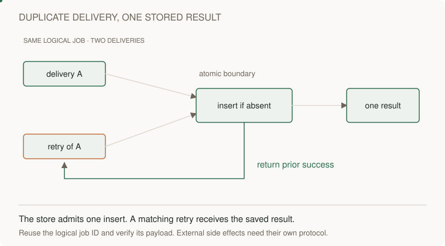

# Lab 1 · create once, then compare intent

[Curriculum](../../../README.md) · [Provision and operate application infrastructure on AWS](../README.md)

A “check then insert” sequence has a race: two callers can both observe absence. A conditional write evaluates absence at the storage boundary.


[Static diagram](../../../../assets/learning/conditional-result-still.svg)


Prerequisites: AWS CLI, credentials, selected region, and a unique disposable table name. Commands create billable resources. Run from a terminal where no table with this name already exists.

```bash
LAB_DATA_TABLE=interview-conditional-demo
aws dynamodb create-table --table-name "$LAB_DATA_TABLE" --billing-mode PAY_PER_REQUEST --attribute-definitions AttributeName=id,AttributeType=S --key-schema AttributeName=id,KeyType=HASH
aws dynamodb wait table-exists --table-name "$LAB_DATA_TABLE"
aws dynamodb put-item --table-name "$LAB_DATA_TABLE" --item '{"id":{"S":"bookmark-1"},"owner":{"S":"user-1"},"title":{"S":"First"},"version":{"N":"1"}}' --condition-expression 'attribute_not_exists(id)'
```

Repeat the put. Expect ConditionalCheckFailedException. Read the row; it must remain unchanged. This proves duplicate create is refused, not that every repeated HTTP request is automatically handled correctly.

Now edit only when owner and version match:

```bash
aws dynamodb update-item --table-name "$LAB_DATA_TABLE" --key '{"id":{"S":"bookmark-1"}}' --update-expression 'SET title = :title, version = :next' --condition-expression '#owner = :owner AND version = :expected' --expression-attribute-names '{"#owner":"owner"}' --expression-attribute-values '{":owner":{"S":"user-1"},":title":{"S":"Edited"},":expected":{"N":"1"},":next":{"N":"2"}}' --return-values ALL_NEW
```

Repeat it. The stale expected version must fail. In an application, derive owner from authenticated identity and use a version increment in the update rather than trusting a caller's next version. Add an index or alternate key design before claiming this id-only table can efficiently list an owner's bookmarks.

**Junior:** explain the conditional write. **Senior:** compare conflict versus missing/unauthorized responses and test two concurrent writers. **Staff:** design tenant key distribution and a compatible change to the access pattern.

Clean up:

```bash
aws dynamodb delete-table --table-name "$LAB_DATA_TABLE"
aws dynamodb wait table-not-exists --table-name "$LAB_DATA_TABLE"
```

[Queue lab uses this mechanism](labs/job-pipeline/README.md) · [AWS home](README.md)
