# Upload private object bytes directly and finalize application metadata

[Curriculum](../../../README.md) · [Provision and operate application infrastructure on AWS](../README.md)

## Application and assignment

A user attaches a file to a record. The API can authorize the operation and choose an object key without relaying the entire file through its process. A presigned URL grants temporary permission to upload to that key. The application still needs to decide whether the resulting object is ready to expose.

Run the supplied script to upload a tiny payload to a private disposable bucket and verify the bytes. Then design the owner-scoped upload session and conditional finalization described below. The script supplies the byte transfer, not a complete browser upload UI or metadata service.

## Starting contract

A metadata API can authorize an upload without proxying every byte. It returns a short-lived S3 capability for a specific object. The browser uploads directly and later asks the API to finalize the metadata.


[Static diagram](../../../../assets/learning/direct-upload-still.svg)


## Implement the byte path

Prerequisites: AWS CLI, Python with boto3 installed in a virtual environment, an explicitly selected region, and a globally unique disposable bucket name. The example uses us-east-1 to avoid the different create-bucket location syntax in other regions.

```bash
export LAB_UPLOAD_BUCKET=replace-with-your-globally-unique-lab-bucket
aws s3api create-bucket --bucket "$LAB_UPLOAD_BUCKET" --region us-east-1
aws s3api put-public-access-block --bucket "$LAB_UPLOAD_BUCKET" --region us-east-1 --public-access-block-configuration BlockPublicAcls=true,IgnorePublicAcls=true,BlockPublicPolicy=true,RestrictPublicBuckets=true
python -m venv .venv
. .venv/bin/activate
python -m pip install boto3
python curriculum/03-production/03-infrastructure/aws/upload_demo.py
```

The script uploads a tiny payload using a presigned PUT and verifies bytes with an authenticated GET. The URL is never printed. For a browser implementation, configure CORS for the precise frontend origin and required methods/headers; CORS is not authorization.

## The implementation you still need around the URL

Persist upload session id, owner, object key, expected metadata version, and expected size/checksum. Derive the key on the server. On finalize, authenticate ownership, verify the uploaded object, and conditionally advance the metadata version. S3 upload success alone is not application-level approval. Signed URLs can be reused until expiry and can overwrite the same key; unique keys and a finalization protocol avoid treating them as single-use tokens.

**Failure drill:** two sessions from metadata version 3 finalize concurrently; only one may become version 4. Simulate abandoned upload and cleanup. For large files, extend to multipart upload, resume, checksums, and aborting incomplete multipart sessions.

**Junior:** trace bytes versus metadata. **Senior:** implement finalization and concurrent-version tests. **Staff:** define regional constraints, retention/deletion guarantees, and ownership of cleanup.

## Clean up the exact object and bucket

```bash
aws s3api delete-object --bucket "$LAB_UPLOAD_BUCKET" --key learning/demo.txt --region us-east-1
aws s3api delete-bucket --bucket "$LAB_UPLOAD_BUCKET" --region us-east-1
```

If you added objects or versions, inspect and remove only your own lab data first. Do not use a shared bucket for this exercise.

[AWS home](README.md) · [File-sync design](../../../../indexes/system-designs.md)
