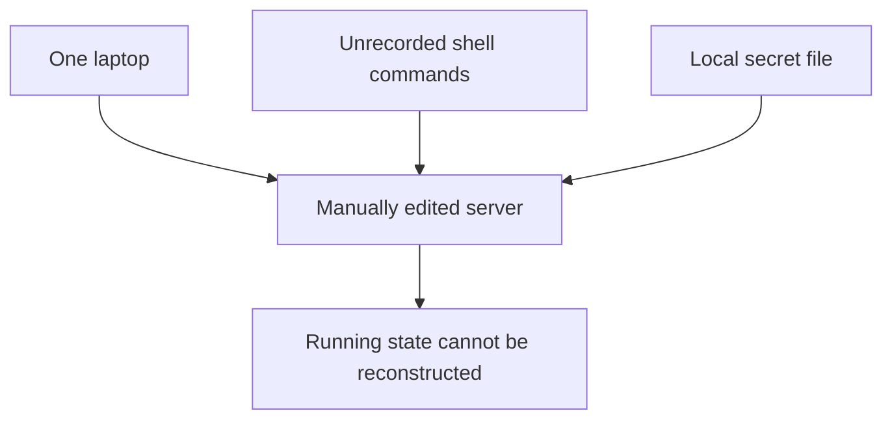
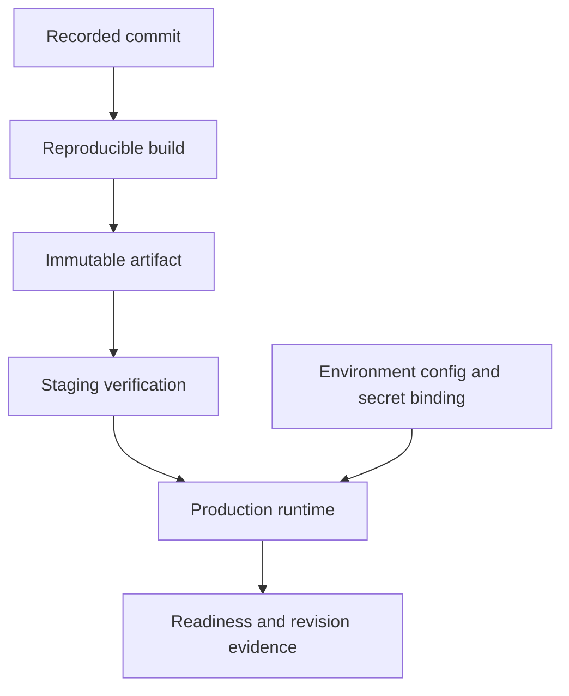
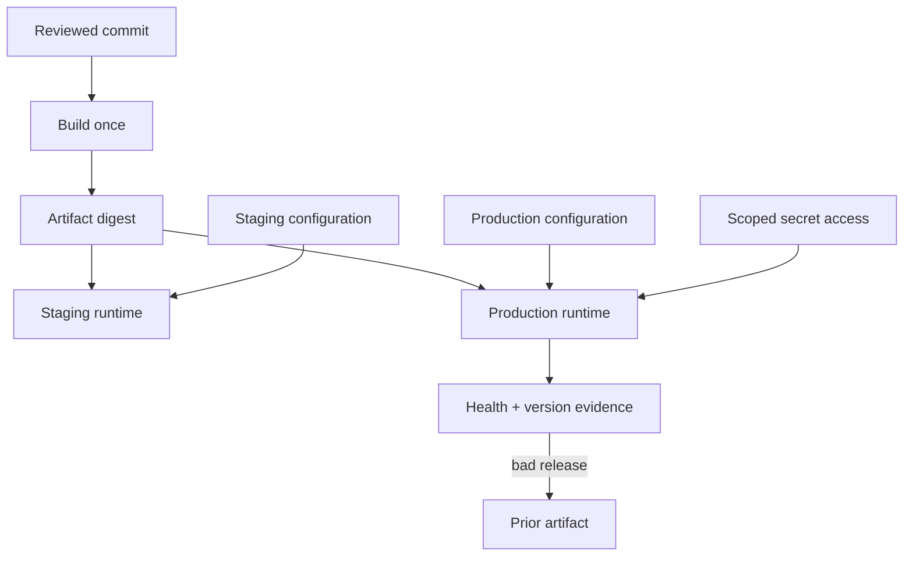

# Build once and supply configuration safely at runtime

[Curriculum](../../README.md) · [AWS infrastructure](README.md)

> Project connection · feeds [Reading-list stage 1: build the reading-list application](../../../projects/reading-list/stages/01-it-works/README.md) and sets up [Reading-list stage 2: operate and recover the application](../../../projects/reading-list/stages/02-it-survives/README.md)

## From a local application to a reproducible deployment

A teammate can run your bookmark API today. Tomorrow another teammate must run the same version with a different database, without copying your shell history or personal credentials. The problem is identifying three separate inputs: application code, environment configuration, and access credentials.

The [reading-list starter](../../../examples/reading-list-starter/README.md) already runs locally with Python and SQLite. Start there if you have no application. This lesson asks you to record what runs and how to reproduce it. An AWS container registry, database, and deployment service are a proposed next environment, not resources created by running that Python command.

### Describe a deployment before automating it

| Input | Example | May it vary between environments? |
|---|---|---|
| Built application | Container image digest `sha256:…` | Promote the same digest when checking the same release |
| Non-secret setting | `PORT=8080`, request timeout | Yes, with validation and a documented meaning |
| Database location | A local SQLite path or a hosted database address | Yes, but changing database technology also needs an application adapter |
| Credential | Runtime role or database password | Yes, supplied through a scoped credential path |
| Persistent data | Saved bookmark rows | It must outlive replacing an application process |

A Git commit identifies source. An artifact digest identifies the built bytes. A database transaction commit makes a database change durable according to its configured storage guarantees. They are different uses of the word “commit”.

Your output is a reproducible run/deploy procedure and a small configuration inventory. A second run should identify the same application version and preserve the intended data. The [AWS job pipeline lab](aws/labs/job-pipeline/README.md) is a separate supplied cloud implementation with its own setup and cleanup instructions.

## Record the source, artifact and runtime inputs


> “The app runs on one engineer's laptop. We need a teammate to deploy the same
> version tomorrow without their shell history or private configuration. What
> artifacts and checks make that possible?”

Shipping means connecting a known source revision to a running artifact and its
configuration. A successful manual command is only one observation.

| Given | Expected evidence |
|---|---|
| Source commit `abc123` | Build records that exact revision and dependency lock |
| Build artifact digest `D1` | Staging and production promote the same artifact |
| A changed secret | Rotation works without rebuilding source or committing the secret |
| A failed readiness check | New traffic is held back; the previous version remains available |

**Ask first:** what configuration varies by environment, what holds persistent
data, and can the old application still read the new schema?



## Reason through a reproducible release

1. Build an immutable artifact from a recorded commit. Rebuilding separately
   for each environment can introduce a different dependency or file.
2. Supply configuration and short-lived credentials at the appropriate boundary.
   Give the runtime only the permissions its operation needs.
3. Run a readiness check that reaches necessary dependencies. A process merely
   listening on a port has not proved it can serve the important request.
4. Rehearse rollback using a schema-compatible version and verify the actual
   running artifact, not just the pipeline's success badge.

**Follow-up:** “The deploy succeeded but database credentials were rotated.
Which part of your diagram should change?” The secret binding and its reload or
restart policy change; the application artifact need not.



In AWS terms, a container registry, deployment service, and secret store can fill
these roles. Choose their permissions and recovery behavior explicitly before
asking an AI to produce deployment configuration.

## The principle behind the design

Shipping is making the thing exist somewhere other than your laptop, in a way
anyone can repeat. Almost all of the difficulty is in three questions: what
exactly did I deploy, where did its configuration come from, and who can read
its secrets.

## Follow the failure through the system

The classic version is a deploy that works and nobody can reproduce. Somebody
ran a command on a server eight months ago, a file got edited in place, and the
running system no longer corresponds to anything in the repository. Nobody knows
which commit is live. The person who knows is on holiday.

A dependency installation can execute package scripts with the build process’s access. Keep production credentials out of untrusted build steps. If a credential is exposed, deleting the offending file does not revoke copies already taken. Rotation and investigation are separate recovery actions.

## Mechanisms and their limits

Three rules, and everything else is detail.


**1. Build once, promote the artefact.** You build a thing — a container image,
a bundle, a binary — exactly once, and that identical thing moves through your
environments. Record its digest. A production rebuild creates a new artifact
that needs its own verification; it does not inherit the earlier test result.

**2. Configuration comes from the environment, not the artefact.** The same
image points at a test database or the real one depending on what it is told at
start-up. Validate a typed configuration schema and test the important behavior
combinations. Prefer named capabilities (`require_tls`, `payments_enabled`) to
unexplained environment-name branches; legitimate production-only controls still
need tests using synthetic credentials and endpoints. An environment condition
is not automatically wrong, and injected config is not automatically tested.

| Same artifact digest | Configuration under test | Evidence |
|---|---|---|
| D1 | Payments disabled | No provider effect; explicit disabled response |
| D1 | Payments enabled, fake provider | Idempotent success, timeout and reconciliation |
| D1 | TLS required | Reject plaintext; valid TLS succeeds |

These tests exercise behavior without granting a test environment production access.

**3. Separate secret values from ordinary configuration.** Non-secret defaults and schemas can live in a file in the repo.
Secrets cannot, ever, not even briefly, not even in a private repo. They are
injected at run time from somewhere that can revoke them, and the number that
matters is not "is it encrypted" but **"how fast can I rotate it?"**


## What good looks like

- One documented command takes a clean clone to a running system.
- You can say exactly which commit is running, from the outside, without asking anyone.
- The same artefact runs in every environment; only the injected configuration differs.
- Secrets arrive at run time and can be rotated through a documented reload or restart procedure without editing application source.
- Dependencies are locked to exact versions and the lockfile is committed.
- Installs in CI use the lockfile strictly, and lifecycle scripts are off unless a specific package needs them.
- Rolling back is a thing you have actually done once, deliberately, rather than a thing you assume works.

Done badly:

- The deploy is a sequence of commands in somebody's shell history.
- Production has a hand-edited file that exists nowhere else.
- The `.env` file is in the repository. Or it was once, and it is still in the history, which is the same thing.
- Dependencies float on a range, so two installs a week apart give you different software.
- Nobody has ever rolled back, so nobody knows whether it works.
- A secret leaked and the response was to delete the file, not to rotate the key.

## Use an assistant to investigate specific questions

**Request 1 — make the path from clone to running explicit**

```
Write the deployment path for this project as a numbered list: what gets
built, what artefact that produces, where configuration comes from, and
where secrets come from.

Then tell me every step in that list a human currently has to do by hand,
and which of those is most likely to be done wrong at 2am.
```

*Why it is asked that way:* the second half is the part that matters. Any model
will produce a plausible deployment sequence; asking which step gets done wrong
under pressure gets you the risk ranking, which is what you would otherwise
learn the expensive way.

*What you should get back:* a short list with at least one honest "a person does
this by hand." If everything is claimed to be automated, check it, because it
almost certainly is not yet.

*Push back on:* any answer that puts secrets in the build. A secret baked into
an image is in the image forever, including in the layers you thought you
overwrote.

**Request 2 — the secrets audit, before you need it**

```
Find every place this project reads a secret. For each one, tell me where
the value comes from at run time, whether it would appear in a log or an
error message, and what I would have to do to rotate it.

If rotating any of them requires a code change, say which.
```

*Why:* "can I rotate this in five minutes" is the only question that matters
during an incident, and it is the one nobody asks beforehand. The log question
catches the common accident: a secret printed into a stack trace or a debug
line, which is how credentials most often escape without anyone attacking
anything.

*What you should get back:* a table. Record whether each credential is reloaded dynamically or requires a restart. A restart is a valid design when its interruption and propagation time meet the rotation requirement.

**Request 3 — the dependency review nobody does**

```
For each direct dependency, name its required behavior, release/provenance
controls, transitive dependencies, install scripts and maintenance status.

Compare keeping it with a local implementation of the same contract.
Include boundary tests and a maintenance owner; retaining it is a valid outcome.
```

*Why:* a lifecycle script runs arbitrary code on your machine at install time
with your credentials in the environment. Knowing which of your dependencies do
that turns an abstract supply-chain worry into a short, specific list. The last
question compares the actual contract, not line count. A tiny wrapper may rely
on years of compatibility and adversarial-input work.

*Push back on:* replacing cryptography, authentication or a parser because a
happy-path imitation fits in thirty lines. Small local code is useful when its
full contract is genuinely small, tested and maintained; either choice has costs.

## How you would know it is wrong

1. **Deploy from a clean clone on a machine that has never seen this project.** Not your laptop with its accumulated state. This finds the undocumented step.
2. **Ask the running system what it is.** Expose the commit hash at a health endpoint and check it matches what you think you shipped.
3. **Rotate one secret and see what breaks.** If the answer is "everything, for twenty minutes", that is your incident response time and you just measured it in daylight.
4. **Search the repository history, not just the working tree, for secrets.** A key deleted in a later commit is still in the history and still compromised.
5. **Install with the lockfile strictly and with lifecycle scripts disabled** and see whether the build still works. If it does, that is your CI setting from now on.
6. **Roll back on purpose, once.** Deploy, roll back, confirm the old version is serving. Then you know.
7. **Diff what you built against what is running.** They should be the same artefact. Surprisingly often they are not.

> The rule again, because it applies here too: **before believing a green
> deploy, say what it would have looked like if it had gone wrong.** A deploy
> script that exits 0 whether or not the new version is serving is not telling
> you anything.

## Apply this lesson to the reading-list application

On **P1**, add:

- A single documented command that takes a clean clone to a running system, and a second person (or a fresh directory) that proves it.
- Configuration read from the environment, with a committed example file listing every variable and no real values in it.
- A committed lockfile, and CI that installs from it strictly.
- A health endpoint that reports the running commit.
- One deliberate rollback, recorded: what you did, what you saw.

**Acceptance criteria:**

- A fresh clone in a new directory runs with one command and no undocumented steps.
- Review source and history for accidental secret exposure. If a credential was exposed, revoke or rotate it and investigate its use. A scan with no findings is useful evidence, not proof that no secret ever escaped.
- You can name the commit that is running by asking the system, not by remembering.
- You have rolled back at least once and written down what happened.

## Terms used in this lesson

- **artefact** — the built thing you deploy: an image, a bundle, a binary. Built once, promoted unchanged.
- **environment** — a place the artefact runs (local, staging, production), distinguished only by injected configuration.
- **configuration** — values that vary by environment and are not secret.
- **secret** — a value that grants access. Injected at run time, rotatable, never in the repo.
- **rotation** — replacing a secret with a new one. The only real response to exposure.
- **lockfile** — the resolved dependency versions and integrity information. It constrains installation, but platform inputs and build scripts can still affect resulting bytes.
- **lifecycle script** — code a package runs at install time. Convenient, and the main supply-chain execution path.
- **supply chain** — everything you did not write but do run. Larger than you think.
- **rollback** — returning to the previous known-good artefact. Only real once you have done it.
- **immutable** — never changed after creation. Immutability identifies stable bytes, while provenance and review establish why those bytes should be trusted.

---

**Not covered here:** infrastructure as code, progressive delivery (canaries and
feature flags), and deployment pipelines with real gates continue in
[Delivery and controlled rollouts](../02-delivery/README.md) and the [AWS implementation index](../../../indexes/aws.md). This section is the minimum that makes P1 reproducible by
somebody who is not you.

[Learning sequence](../../README.md) · [Independent practice](../../../practice/interview-guide.md)

## Draw it from memory · Draw what a deploy is allowed to read



**Redraw challenge:** Point to the immutable artifact and the environment-specific inputs. Which one changed?


[Static view](../../../assets/learning/traffic-shift-still.svg)
