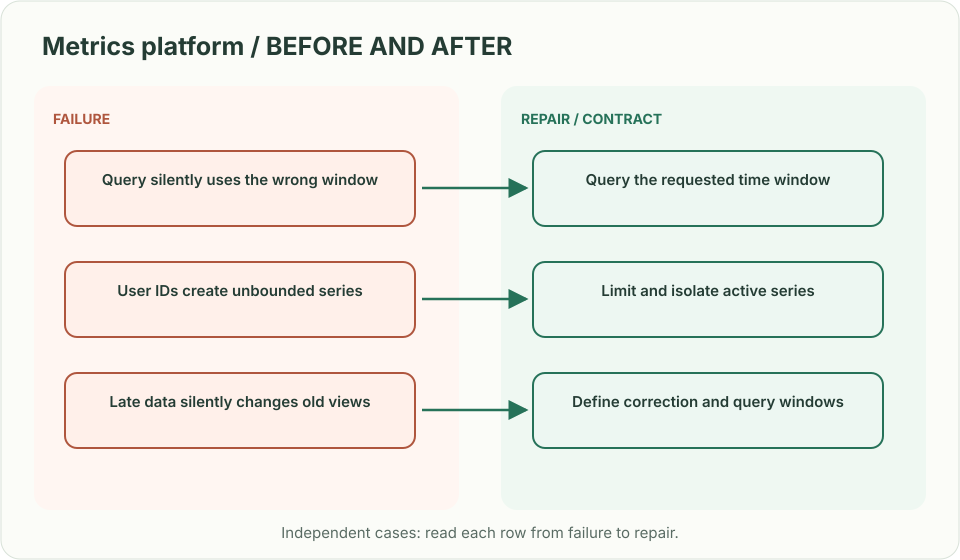
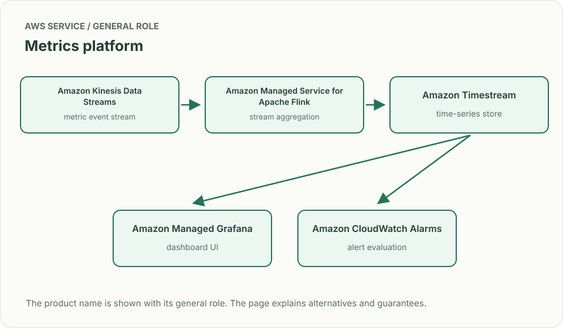
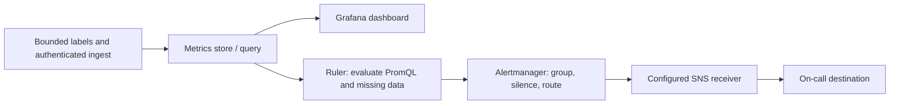
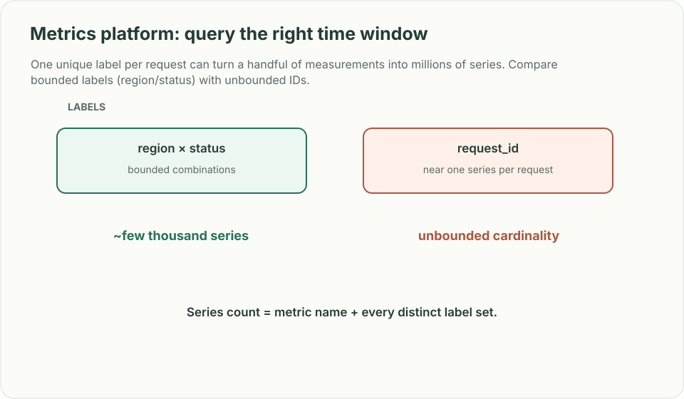

# Metrics platform: query the right time window

## What you are building

> Build the metrics service used by 300,000 hosts. Teams need recent dashboards and one year of downsampled capacity history. A developer accidentally adds request IDs as labels, causing the number of time series to explode.

**Working contract:** Accept timestamped numeric samples with a bounded label schema, serve recent range queries, and retain downsampled history with explicit aggregation semantics. Missing data remains missing; it is not automatically zero.

## Workload and the decisions it changes

These are constructed exercise assumptions. The large workload is a design target; the local demonstration does not establish that throughput. Use the [estimation constants](../../../01-code/01-problem-solving/estimation-constants.md) to check units before choosing capacity.

| Input or objective | Calculation / consequence |
|---|---|
| 300,000 hosts reporting every ten seconds | 30,000 host reports/s; at 100 series/report, three million samples/s. |
| 100 series/host | Thirty million active series before service labels and replicas; cardinality is a first-class capacity input. |
| One year of downsampled history | Preserve count/sum and suitable histogram data; averaging averages without weights gives wrong results. |

## Start with one working boundary

Run from the repository root with Python 3.12+:

```bash
python3 examples/architecture-starts/metrics_platform.py
```

[Open the starting code](../../../../examples/architecture-starts/metrics_platform.py). This is a runnable demonstration of the critical state boundary. The API, UI, cloud adapters and operating behavior below are the application you build around it.

| Record / module | Key or interface | Responsibility |
|---|---|---|
| sample | metric_name,label_set,timestamp,value | Typed metric semantics and bounded identity. |
| series_registry | tenant,label_fingerprint,last_seen | Cardinality budget and inactive-series policy. |
| rollups | series,time_bucket,count,sum,min,max | Explicit aggregate representation and retention tier. |

## AWS implementation


Prometheus-compatible storage handles recent operational queries; a separate rollup/archive path provides the stated long-term history. The diagram includes an ingestion adapter because a stream does not write itself into a metric store.

## Build it in this order

### 1. Define metric types and admission

Distinguish counters, gauges and histograms. Validate sample timestamps and allowed labels, enforce per-tenant active-series budgets and report rejected samples. Request IDs belong in trace/log context, not an unbounded metric dimension.

### 2. Build recent ingestion and queries

Batch samples, partition by stable series identity and handle retries according to the storage engine’s duplicate semantics. Bound query time range, series expansion and concurrent expensive queries. Measure ingestion delay independently from dashboard refresh time.

### 3. Downsample with valid algebra

Keep sum and count for weighted averages, and preserve the histogram representation needed for supported percentile queries. Counter resets require explicit handling. Store rollup generation and source coverage so a partial bucket is not presented as complete.

### 4. Plan retention and overload

Use hot retention for operational queries and S3-backed archived rollups for the year-long exercise. Verify managed-store retention/ingestion quotas rather than assuming every tier has the same limits. Degrade expensive historical queries before losing urgent recent ingestion.

## Infrastructure configuration

| Resource or boundary | Initial configuration and reason |
|---|---|
| Managed ingestion | Verify workspace quotas and supported ingestion APIs; a consumer adapter translates the stream to the required protocol. |
| Cardinality | Enforce budgets at ingestion and alert on growth rate before memory is exhausted. |
| Retention/query | Set each tier explicitly; wire a supported historical data source or query API for archived rollups. |

Use one disposable AWS environment for the cloud exercise. Put the named resources in `infra/template.yaml` or your existing IaC tool, pass resource IDs through configuration, and scope each runtime role to its own tables, buckets and queues. The diagram is a design to implement; it is not a claim that these resources have been deployed. Record the commands you used to deploy and remove the exercise resources.

## Observe the result

| Action | Expected visible result |
|---|---|
| Run the starting program | The correct weighted average is 19, not 55; request_id is rejected as a label. |
| Stop one host | The series shows a gap, not a fabricated zero. |
| Submit a cardinality burst | The tenant gets an explicit admission outcome while existing series continue. |

## The next design decision

Allow ad hoc labels for one debugging session. Design an expiring, separately budgeted diagnostic namespace so temporary investigation does not permanently multiply production series.

<details>
<summary>Additional design cases, alternatives and original source notes</summary>

> **Interviewer:** “Hundreds of thousands of hosts emit CPU, memory, throughput, and service metrics. Engineers build dashboards and alerts. One customer labels every request with a unique user ID.”

This is a **commonly listed system-design interview prompt** with a concrete practice contract. Assume 300,000 hosts, 10-second sampling and one-year retention for downsampled aggregates. Clarify service guarantees and a first version before filling the board with services.

| Situation | Input / condition | Expected result |
|---|---|---|
| Normal series | CPU by host and minute | Store/query an append-only time series efficiently. |
| Cardinality explosion | Label = unique request ID | Reject, cap, or isolate unbounded series before cost explodes. |
| Late sample | Host reconnects after 5 minutes | Backfill within a defined correction window. |
| No data | Critical service stops reporting | Alert on missing telemetry separately from threshold breach. |



## Think from the contract to the boxes

A metric identity is name plus label set; each distinct set creates another time series. Validate schema and cardinality at ingest, aggregate high-volume counters near the source, and separate high-resolution recent data from older rollups. Alert evaluation needs durable rules, missing-data semantics, and a notification path independent of the metrics query dashboard.

**First diagram:** Estimate series count from hosts × metrics × label combinations. Draw ingest, rollup, query and alert paths separately.



| AWS service / general role | Why it fits this design | Alternative and when it fits better |
|---|---|---|
| **Amazon Kinesis Data Streams** / metric event stream | Buffer high-rate metric batches and fan out consumers. | MSK where existing Kafka ecosystem and client guarantees dominate. |
| **Amazon Managed Service for Apache Flink** / stream aggregation | Window, downsample and compute event-time rollups. | Lambda for simpler low-state aggregation. |
| **Amazon Managed Service for Prometheus** / metrics store and PromQL query | Receive Prometheus remote-write samples and retain/query the configured window. | Amazon Timestream for InfluxDB for an InfluxDB-oriented workload; it is not the same API. Archive long-term rollups separately when retention requires it. |
| **Amazon Managed Grafana** / dashboard UI | Explore metrics and dashboard operational data. | Self-managed Grafana when plugins or tenancy controls require it. |
| **Managed Prometheus ruler + alert manager** / evaluation, then routing | The ruler evaluates PromQL; alert manager groups, deduplicates, silences and routes firing alerts to a configured SNS receiver. | Self-managed Prometheus-compatible rule evaluator plus Alertmanager. CloudWatch Alarms evaluate CloudWatch metrics, not an arbitrary external store directly. |

**Baseline data path:** agents validate/cardinality-limit samples, then remote-write
to Managed Prometheus. A Kinesis/Flink path is optional for raw metric events or
custom rollups; its consumer must explicitly convert output to a supported sink
format. Grafana queries the store; it is not the rule evaluator. Preserve
one-year aggregates in an explicitly configured store/archive, not an assumed
default retention setting.



**Trace the alarm:** threshold crosses → evaluator enters pending/firing → router
groups and sends → receiver records delivery → evaluator resolves → configured
resolved notification. Test silence and missing telemetry separately. Notification
deduplication is not a guarantee of exactly-once delivery to a person.

**Availability note, checked 2026-09-23:** AWS closed **Amazon Timestream for
LiveAnalytics** to new customers on June 20, 2025; existing eligible payer
accounts remain supported. It is not this new-account design’s baseline.
[AWS availability notice](https://docs.aws.amazon.com/timestream/latest/developerguide/AmazonTimestreamForLiveAnalytics-availability-change.html).
Managed Prometheus’s [ruler](https://docs.aws.amazon.com/prometheus/latest/userguide/AMP-Ruler.html)
and [alert manager](https://docs.aws.amazon.com/prometheus/latest/userguide/AMP-alert-manager.html)
have different responsibilities. Check the chosen region, quotas and account
permissions before provisioning; no account/region was deployed for this brief.

Service choice follows the contract: the box label gives the generic job, while the table explains the AWS product and a reasonable substitute. Name which component owns durable truth, where retries happen, and the guarantee each managed service does **not** provide by itself.



## Pressure-test the design

**Follow-up: One unique label per request can turn a handful of measurements into millions of series. Compare bounded labels (region/status) with unbounded IDs.**

**Senior expectation:** A region’s telemetry path is delayed but services are healthy. Keep ingestion lag, missing-data alerts, and service health independent so observability failure is visible.

**Staff expectation:** Set shared metric naming and cardinality budgets across many product teams. Define admission rules, exceptions, cost allocation, and safe dashboard/query isolation.

**Practice artifact:** Estimate series count from hosts × metrics × label combinations. Draw ingest, rollup, query and alert paths separately. Then trace every row in the table, draw one failure, and state what the customer observes. Suggested rehearsal: 35 minutes design, 10 minutes to challenge the guarantees.

**Evidence and origin:** The current community interview-question catalog lists monitoring-platform reports at Meta, LinkedIn, Stripe, MongoDB and others; it does not disclose when each interview happened. The entry does not show the interview date and is not a verified company rubric. The prompt contract, workload, outcomes, diagrams and solution here are original practice material. Treat company tags as reported sightings, not a prediction of your interview loop.

**Interview report listing:** [Open the community question entry](https://www.hellointerview.com/community/questions/metrics-monitoring-alerts/cm6k7xmwh024f11hvvc0uq1e5).

</details>
