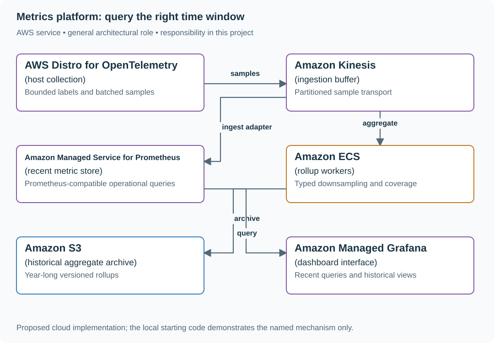

# Ingest and query metrics with bounded cardinality

## Application background

Infrastructure agents report timestamped measurements identified by metric names and labels. Dashboards query recent values; capacity planning reads coarser history.

This is a fictional engineering scenario. The workload figures later in the page are exercise assumptions, not measured production traffic.

## Your assignment

**Deliver:** A metric identity/admission policy, ingestion and aggregation path, and an operator response to an unexpected explosion in label combinations.

Build the metrics service used by 300,000 hosts. Teams need recent dashboards and one year of downsampled capacity history. A developer accidentally adds request IDs as labels, causing the number of time series to explode.

**Required behavior:** Accept timestamped numeric samples with a bounded label schema, serve recent range queries, and retain downsampled history with explicit aggregation semantics. Missing data remains missing; it is not automatically zero.

The required first milestone is a working local implementation of the behavior above. The numbered implementation steps define the scope; the cloud architecture is a later extension, not something the starter has already provisioned.

## Get the code and run the supplied example

The code is in the public [junior-to-staff repository](https://github.com/Soulful-Iris/junior-to-staff). Install Git and Python 3.12+. No AWS account or Python packages are required for this first run. If you already have a checkout, use it and skip cloning.

```bash
git clone https://github.com/Soulful-Iris/junior-to-staff.git
cd junior-to-staff
python3 examples/architecture-starts/metrics_platform.py
```

**Supplied file:** [`examples/architecture-starts/metrics_platform.py`](https://github.com/Soulful-Iris/junior-to-staff/blob/main/examples/architecture-starts/metrics_platform.py). You can also [read or download the source here](../../../../examples/architecture-starts/metrics_platform.py).

This program is a **mechanism demonstration**: it runs the small scenario in one process and prints the result. It is not an HTTP service, a complete application, or an AWS deployment. A successful run demonstrates this mechanism only; it does not establish the workload or failure guarantees of the application you will build.

**Example output from the supplied run:**

Generated IDs and timestamps may differ; compare the state transitions and outcomes.

```text
Unweighted average of averages: 55.0
Correct weighted average: 19.0
Rejected labels: ['request_id']
```

### Set up your implementation workspace

Create `work/metrics-platform/` in your checkout (or use a separate repository). Copy the supplied mechanism into that directory as `mechanism.py`, then extract its state transitions into functions you can call from your implementation. The record and module names below describe what you must implement; they are not a promise that files with those names already exist. Keep a `README.md` beside your implementation with its exact run commands and observed results.

## Local components and state to implement

This table names the records, interfaces or decision inputs for your deliverable. Unless a name is explicitly linked to supplied source above, it is something you create. Implement the local state transitions first, then connect the HTTP, storage or worker boundaries required by the steps.

| Record / module | Key or interface | Responsibility |
|---|---|---|
| sample | metric_name,label_set,timestamp,value | Typed metric semantics and bounded identity. |
| series_registry | tenant,label_fingerprint,last_seen | Cardinality budget and inactive-series policy. |
| rollups | series,time_bucket,count,sum,min,max | Explicit aggregate representation and retention tier. |

## Implement the assignment

### 1. Define metric types and admission

Distinguish counters, gauges and histograms. Validate sample timestamps and allowed labels, enforce per-tenant active-series budgets and report rejected samples. Request IDs belong in trace/log context, not an unbounded metric dimension.

### 2. Build recent ingestion and queries

Batch samples, partition by stable series identity and handle retries according to the storage engine’s duplicate semantics. Bound query time range, series expansion and concurrent expensive queries. Measure ingestion delay independently from dashboard refresh time.

### 3. Downsample with valid algebra

Keep sum and count for weighted averages, and preserve the histogram representation needed for supported percentile queries. Counter resets require explicit handling. Store rollup generation and source coverage so a partial bucket is not presented as complete.

### 4. Plan retention and overload

Use hot retention for operational queries and S3-backed archived rollups for the year-long exercise. Verify managed-store retention/ingestion quotas rather than assuming every tier has the same limits. Degrade expensive historical queries before losing urgent recent ingestion.

## Demonstrate the completed local result

| Action | Expected visible result |
|---|---|
| Run the starting program | The correct weighted average is 19, not 55; request_id is rejected as a label. |
| Stop one host | The series shows a gap, not a fabricated zero. |
| Submit a cardinality burst | The tenant gets an explicit admission outcome while existing series continue. |

**Handoff:** In your implementation README, include the start command, one successful operation, the failure case above and the resulting stored state or decision. State which dependencies are simulated. Someone with a fresh checkout should be able to reproduce this without your chat history.

## Workload assumptions and capacity decisions

These are constructed exercise assumptions. The stated workload is a design target; the local demonstration does not establish that throughput. Use the [estimation constants](../../../01-code/01-problem-solving/estimation-constants.md) to check units before choosing capacity.

| Input or objective | Calculation / consequence |
|---|---|
| 300,000 hosts reporting every ten seconds | 30,000 host reports/s; at 100 series/report, three million samples/s. |
| 100 series/host | Thirty million active series before service labels and replicas; cardinality is a first-class capacity input. |
| One year of downsampled history | Preserve count/sum and suitable histogram data; averaging averages without weights gives wrong results. |

## Map the local implementation to AWS

**Deployment status: local only.** Running the supplied command creates no AWS resources and configures no cloud connections. The diagram is a proposed deployment of the completed application. Each box needs either a deployed runtime, a provisioned service or an explicitly external dependency.

Read the diagram by following the arrows from the entry point: application code accepts the request or event, the state owner commits it, and any worker produces the later result. The table ties those roles to code and adapter work. Multiple boxes do not imply multiple Python files already exist.



Prometheus-compatible storage handles recent operational queries; a separate rollup/archive path provides the stated long-term history. The diagram includes an ingestion adapter because a stream does not write itself into a metric store.

| Local responsibility | Cloud destination and role | Implementation still required |
|---|---|---|
| Local timing and correlation events | AWS Distro for OpenTelemetry: host collection | Instrument runtime spans and configure collection/export; propagate parent and request identity across boundaries. |
| Local event sequence or input stream | Amazon Kinesis: ingestion buffer | Implement producer/consumer adapters, partition keys, durable acceptance and checkpoint/replay behavior. |
| Local metric samples | Amazon Managed Service for Prometheus: recent metric store | Configure scrape/remote-write and retention/query behavior; reject or constrain unbounded label identities at ingestion. |
| Application or worker process | Amazon ECS: rollup workers | Build a container and task definition; supply configuration, task roles and graceful shutdown behavior. |
| Local file, object fixture or exported payload | Amazon S3: historical aggregate archive | Implement upload/download and metadata adapters, scoped access, object naming, retention and incomplete-upload cleanup. |
| Local metrics report | Amazon Managed Grafana: dashboard interface | Connect the metric source and build symptom, capacity and recovery views with scoped access. |

### Provision resources, then connect the application

| Resource or boundary | Initial configuration and reason |
|---|---|
| Managed ingestion | Verify workspace quotas and supported ingestion APIs; a consumer adapter translates the stream to the required protocol. |
| Cardinality | Enforce budgets at ingestion and alert on growth rate before memory is exhausted. |
| Retention/query | Set each tier explicitly; wire a supported historical data source or query API for archived rollups. |

Use one disposable AWS environment for the cloud exercise. Put the named resources in `infra/template.yaml` or your existing IaC tool, pass resource IDs through configuration, and scope each runtime role to its own tables, buckets and queues. The diagram is a design to implement; it is not a claim that these resources have been deployed. Record the commands you used to deploy and remove the exercise resources.

For concrete provisioning commands, configuration wiring and cleanup, use the [AWS foundation guide](../../../../examples/architecture-starts/infra/README.md). It includes a deployable table/queue/object-storage foundation and explains which application and service adapters you still implement.

A provisioned queue or table does not make the local program use it. Configure resource IDs in the deployed runtime, replace the local adapter, and replay the same successful and failing operation against that runtime. Record the deployed commit and observable result, then remove the disposable resources using your infrastructure tool.

## Extend the design after the baseline works


Allow ad hoc labels for one debugging session. Design an expiring, separately budgeted diagnostic namespace so temporary investigation does not permanently multiply production series.

<details>
<summary>Additional design cases, alternatives and original source notes</summary>


This is a **commonly listed system-design interview prompt** with a concrete practice contract. Assume 300,000 hosts, 10-second sampling and one-year retention for downsampled aggregates. Clarify service guarantees and a first version before filling the board with services.

| Situation | Input / condition | Expected result |
|---|---|---|
| Normal series | CPU by host and minute | Store/query an append-only time series efficiently. |
| Cardinality explosion | Label = unique request ID | Reject, cap, or isolate unbounded series before cost explodes. |
| Late sample | Host reconnects after 5 minutes | Backfill within a defined correction window. |
| No data | Critical service stops reporting | Alert on missing telemetry separately from threshold breach. |

## Think from the contract to the boxes

A metric identity is name plus label set; each distinct set creates another time series. Validate schema and cardinality at ingest, aggregate high-volume counters near the source, and separate high-resolution recent data from older rollups. Alert evaluation needs durable rules, missing-data semantics, and a notification path independent of the metrics query dashboard.

**First diagram:** Estimate series count from hosts × metrics × label combinations. Draw ingest, rollup, query and alert paths separately.

| AWS service / general role | Why it fits this design | Alternative and when it fits better |
|---|---|---|
| **Amazon Kinesis Data Streams** / metric event stream | Buffer high-rate metric batches and fan out consumers. | MSK where existing Kafka ecosystem and client guarantees dominate. |
| **Amazon Managed Service for Apache Flink** / stream aggregation | Window, downsample and compute event-time rollups. | Lambda for simpler low-state aggregation. |
| **Amazon Managed Service for Prometheus** / metrics store and PromQL query | Receive Prometheus remote-write samples and retain/query the configured window. | Amazon Timestream for InfluxDB for an InfluxDB-oriented workload; it is not the same API. Archive long-term rollups separately when retention requires it. |
| **Amazon Managed Grafana** / dashboard UI | Explore metrics and dashboard operational data. | Self-managed Grafana when plugins or tenancy controls require it. |
| **Managed Prometheus ruler + alert manager** / evaluation, then routing | The ruler evaluates PromQL; alert manager groups, deduplicates, silences and routes firing alerts to a configured SNS receiver. | Self-managed Prometheus-compatible rule evaluator plus Alertmanager. CloudWatch Alarms evaluate CloudWatch metrics, not an arbitrary external store directly. |

**Baseline data path:** agents validate/cardinality-limit samples, then remote-write
to Managed Prometheus. A Kinesis/Flink path is optional for raw metric events or
custom rollups; its consumer must explicitly convert output to a supported sink
format. Grafana queries the store; it is not the rule evaluator. Preserve
one-year aggregates in an explicitly configured store/archive, not an assumed
default retention setting.

**Trace the alarm:** threshold crosses → evaluator enters pending/firing → router
groups and sends → receiver records delivery → evaluator resolves → configured
resolved notification. Test silence and missing telemetry separately. Notification
deduplication is not a guarantee of exactly-once delivery to a person.

**Availability note, checked 2026-09-23:** AWS closed **Amazon Timestream for
LiveAnalytics** to new customers on June 20, 2025; existing eligible payer
accounts remain supported. It is not this new-account design’s baseline.
[AWS availability notice](https://docs.aws.amazon.com/timestream/latest/developerguide/AmazonTimestreamForLiveAnalytics-availability-change.html).
Managed Prometheus’s [ruler](https://docs.aws.amazon.com/prometheus/latest/userguide/AMP-Ruler.html)
and [alert manager](https://docs.aws.amazon.com/prometheus/latest/userguide/AMP-alert-manager.html)
have different responsibilities. Check the chosen region, quotas and account
permissions before provisioning; no account/region was deployed for this brief.

Service choice follows the contract: the box label gives the generic job, while the table explains the AWS product and a reasonable substitute. Name which component owns durable truth, where retries happen, and the guarantee each managed service does **not** provide by itself.

## Pressure-test the design

**Follow-up: One unique label per request can turn a handful of measurements into millions of series. Compare bounded labels (region/status) with unbounded IDs.**

**Senior expectation:** A region’s telemetry path is delayed but services are healthy. Keep ingestion lag, missing-data alerts, and service health independent so observability failure is visible.

**Staff expectation:** Set shared metric naming and cardinality budgets across many product teams. Define admission rules, exceptions, cost allocation, and safe dashboard/query isolation.

**Practice artifact:** Estimate series count from hosts × metrics × label combinations. Draw ingest, rollup, query and alert paths separately. Then trace every row in the table, draw one failure, and state what the customer observes. Suggested rehearsal: 35 minutes design, 10 minutes to challenge the guarantees.

**Evidence and origin:** The current community interview-question catalog lists monitoring-platform reports at Meta, LinkedIn, Stripe, MongoDB and others; it does not disclose when each interview happened. The entry does not show the interview date and is not a verified company rubric. The prompt contract, workload, outcomes, diagrams and solution here are original practice material. Treat company tags as reported sightings, not a prediction of your interview loop.

**Interview report listing:** [Open the community question entry](https://www.hellointerview.com/community/questions/metrics-monitoring-alerts/cm6k7xmwh024f11hvvc0uq1e5).

</details>
