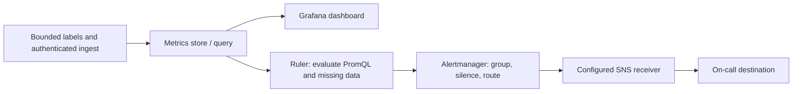

# Metrics platform: query the right time window

*Design brief · supplied diagrams and contracts, not a deployed metrics platform.*

> **Interviewer:** “Hundreds of thousands of hosts emit CPU, memory, throughput, and service metrics. Engineers build dashboards and alerts. One customer labels every request with a unique user ID.”

This is a **commonly listed system-design interview prompt** with a concrete practice contract. Assume 300,000 hosts, 10-second sampling and one-year retention for downsampled aggregates. Clarify service guarantees and a first version before filling the board with services.

| Situation | Input / condition | Expected result |
|---|---|---|
| Normal series | CPU by host and minute | Store/query an append-only time series efficiently. |
| Cardinality explosion | Label = unique request ID | Reject, cap, or isolate unbounded series before cost explodes. |
| Late sample | Host reconnects after 5 minutes | Backfill within a defined correction window. |
| No data | Critical service stops reporting | Alert on missing telemetry separately from threshold breach. |

## Think from the contract to the boxes

A metric identity is name plus label set; each distinct set creates another time series. Validate schema and cardinality at ingest, aggregate high-volume counters near the source, and separate high-resolution recent data from older rollups. Alert evaluation needs durable rules, missing-data semantics, and a notification path independent of the metrics query dashboard.

**First diagram:** Estimate series count from hosts × metrics × label combinations. Draw ingest, rollup, query and alert paths separately.

| AWS service / general role | Why it fits this design | Alternative and when it fits better |
|---|---|---|
| **Amazon Kinesis Data Streams** / metric event stream | Buffer high-rate metric batches and fan out consumers. | MSK where existing Kafka ecosystem and client guarantees dominate. |
| **Amazon Managed Service for Apache Flink** / stream aggregation | Window, downsample and compute event-time rollups. | Lambda for simpler low-state aggregation. |
| **Amazon Managed Service for Prometheus** / metrics store and PromQL query | Receive Prometheus remote-write samples and retain/query the configured window. | Amazon Timestream for InfluxDB for an InfluxDB-oriented workload; it is not the same API. Archive long-term rollups separately when retention requires it. |
| **Amazon Managed Grafana** / dashboard UI | Explore metrics and dashboard operational data. | Self-managed Grafana when plugins or tenancy controls require it. |
| **Managed Prometheus ruler + alert manager** / evaluation, then routing | The ruler evaluates PromQL; alert manager groups, deduplicates, silences and routes firing alerts to a configured SNS receiver. | Self-managed Prometheus-compatible rule evaluator plus Alertmanager. CloudWatch Alarms evaluate CloudWatch metrics, not an arbitrary external store directly. |

**Baseline data path:** agents validate/cardinality-limit samples, then remote-write
to Managed Prometheus. A Kinesis/Flink path is optional for raw metric events or
custom rollups; its consumer must explicitly convert output to a supported sink
format. Grafana queries the store; it is not the rule evaluator. Preserve
one-year aggregates in an explicitly configured store/archive, not an assumed
default retention setting.

**Trace the alarm:** threshold crosses → evaluator enters pending/firing → router
groups and sends → receiver records delivery → evaluator resolves → configured
resolved notification. Test silence and missing telemetry separately. Notification
deduplication is not a guarantee of exactly-once delivery to a person.

**Availability note, checked 2026-09-23:** AWS closed **Amazon Timestream for
LiveAnalytics** to new customers on June 20, 2025; existing eligible payer
accounts remain supported. It is not this new-account design’s baseline.
[AWS availability notice](https://docs.aws.amazon.com/timestream/latest/developerguide/AmazonTimestreamForLiveAnalytics-availability-change.html).
Managed Prometheus’s [ruler](https://docs.aws.amazon.com/prometheus/latest/userguide/AMP-Ruler.html)
and [alert manager](https://docs.aws.amazon.com/prometheus/latest/userguide/AMP-alert-manager.html)
have different responsibilities. Check the chosen region, quotas and account
permissions before provisioning; no account/region was deployed for this brief.

Service choice follows the contract: the box label gives the generic job, while the table explains the AWS product and a reasonable substitute. Name which component owns durable truth, where retries happen, and the guarantee each managed service does **not** provide by itself.

## Pressure-test the design

**Follow-up: One unique label per request can turn a handful of measurements into millions of series. Compare bounded labels (region/status) with unbounded IDs.**

**Senior expectation:** A region’s telemetry path is delayed but services are healthy. Keep ingestion lag, missing-data alerts, and service health independent so observability failure is visible.

**Staff expectation:** Set shared metric naming and cardinality budgets across many product teams. Define admission rules, exceptions, cost allocation, and safe dashboard/query isolation.

**Practice artifact:** Estimate series count from hosts × metrics × label combinations. Draw ingest, rollup, query and alert paths separately. Then trace every row in the table, draw one failure, and state what the customer observes. Suggested rehearsal: 35 minutes design, 10 minutes to challenge the guarantees.

**Evidence and origin:** The current community interview-question catalog lists monitoring-platform reports at Meta, LinkedIn, Stripe, MongoDB and others; it does not disclose when each interview happened. The entry does not show the interview date and is not a verified company rubric. The prompt contract, workload, outcomes, diagrams and solution here are original practice material. Treat company tags as reported sightings, not a prediction of your interview loop.

**Interview report listing:** [Open the community question entry](https://www.hellointerview.com/community/questions/metrics-monitoring-alerts/cm6k7xmwh024f11hvvc0uq1e5).
