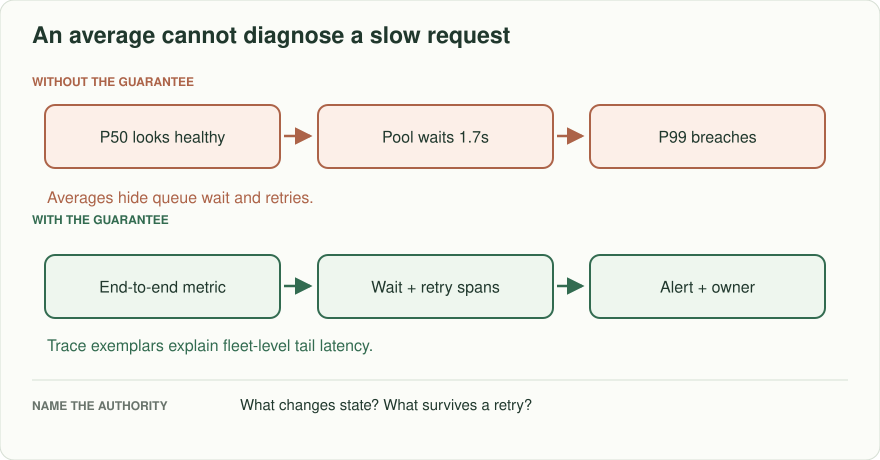
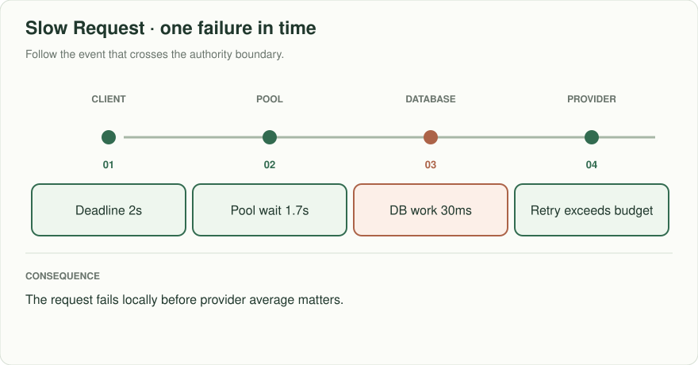
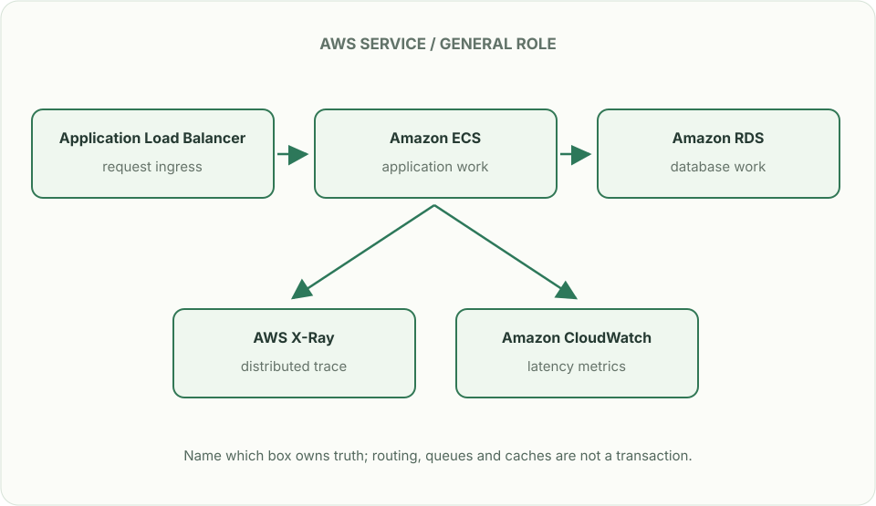

# Slow request: the healthy average hid a timeout

> **Interviewer:** “A checkout endpoint's P50 is 120 ms and its P99 is 9 seconds. The provider says their average is 40 ms. A deployment doubled retry attempts. Which request is actually slow, where does its time go, and which signal should page the owner?”

Constructed exercise. Assume 8,000 requests/minute, 4% of requests wait for a database connection, and a 2-second user-facing deadline. A distributed trace is a sample of a request, not a fleet-wide frequency estimate.

| Request | Observed path | Expected interpretation |
|---|---|---|
| A | queue 10 ms + DB 30 ms + provider 40 ms | Healthy baseline |
| B | queue 1.7 s + DB 30 ms + provider 40 ms | Wait dominates; provider average is irrelevant |
| C | provider 1.2 s + two retries of 1.2 s | User deadline exceeded; retry budget is misconfigured |
| D | no trace sampled, many clients fail | Metrics and logs still reveal scale of the incident |

## Partition elapsed time

At the ingress, record a trace ID and deadline. Propagate both through API, database calls, and provider requests. Tag spans with operation and status, not raw secrets or unbounded user IDs. Compare end-to-end latency histograms by endpoint and tenant class to selected exemplar traces. Distinguish pool wait, network, server time, retries, and time spent waiting in a queue. An average of 40 ms from a provider does not explain your 9-second P99 or exonerate your retry policy.

## Put the AWS names on the boxes

**Why these boxes, and what changes the choice:** CloudWatch holds fleet-level denominators and tail latency by route; X-Ray or an OpenTelemetry-compatible tracing stack identifies spans and queue wait. ALB timing is a separate boundary. A trace sample cannot substitute for complete request metrics.

Read the smaller label under each service first: it names the architectural job. Then ask whether that service supplies the guarantee in the problem, or simply moves work to the next box.

**Senior follow-up:** Sampling drops the failing request. Which RED metrics (rate, errors, duration) and structured logs can still show the blast radius? Alert on an error-budget burn or bounded tail-latency objective with low-traffic safeguards; include the deploy marker.

**Staff follow-up:** Three teams own different spans. Define trace context/version compatibility and the on-call handoff. Show how you would tell a local pool exhaustion from a downstream outage before rolling back or scaling the wrong component.

**Practice artifact:** Annotated trace waterfall, before/after request path, alert query including numerator and denominator, and a five-minute incident decision memo.

**AWS translation:** OpenTelemetry or X-Ray-compatible trace context across services, CloudWatch metrics/logs for fleet denominators, and explicit pool/queue wait instrumentation. A successful sampled trace does not prove all users are healthy.

**Source note:** Constructed numbers. The exercise practices causal diagnosis after the chapter's logs, metrics, and traces lesson.
