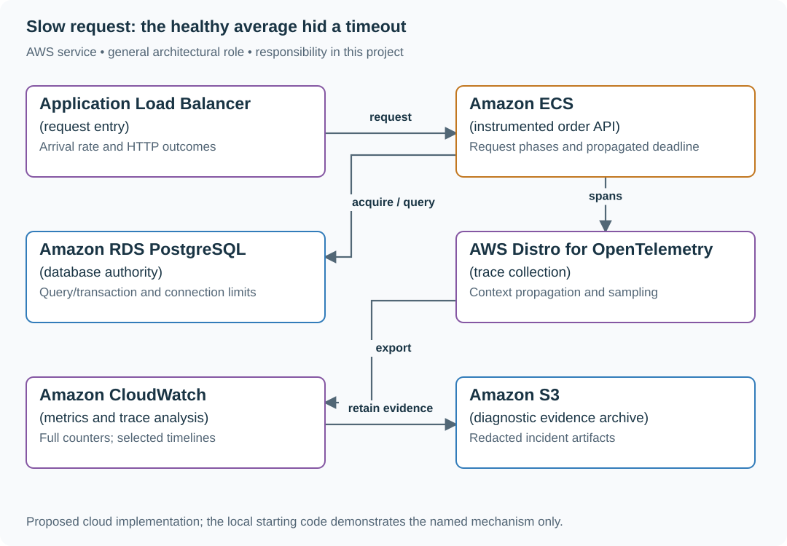

# Find database-pool waiting in slow API requests

## Application background

Customers say the order page sometimes takes two seconds to load. The database team sees that each query itself finishes quickly. Both observations can be true if a request waits a long time before it is allowed to send its query.

The application reuses a limited set of database connections called a connection pool. When all connections are busy, a new request waits for one. Measuring only the query misses that waiting time.

### Inspect the evidence before choosing a fix

This is output from the supplied local timing model, not a production incident log:

```text
p95 80 ms
p99 1900 ms
Slow request phases: {'pool_wait_ms': 1700, 'query_ms': 40, 'application_ms': 160} total 1900 ms
```

For this constructed sample, p95 means at least 95% of the requests took no more than 80 ms. p99 exposes the slower tail. The phase breakdown explains where that slow request spent its time.



A phase is one portion of the request, such as waiting, querying or building the response. Measuring each phase lets the diagnosis explain the customer's total delay.

## Your assignment

**Deliver:** Produce request timing records and a diagnosis that separates waiting for a connection from running a query and returning a response.

**Required behavior:** Record separate timed operations, called spans, for waiting, acquiring a connection, running the query and calling other services. Use all eligible request outcomes for latency/error metrics. A sample of detailed traces explains particular requests. Use the complete request counts when calculating rates and percentages.

The primary deliverable is the report or operational procedure named above, backed by a reproducible local demonstration. Build the smallest supporting code needed to make that evidence visible.

## Get the code and run the supplied example

The code is in the public [junior-to-staff repository](https://github.com/Soulful-Iris/junior-to-staff). Install Git and Python 3.12+. No AWS account or Python packages are required for this first run. If you already have a checkout, use it and skip cloning.

```bash
git clone https://github.com/Soulful-Iris/junior-to-staff.git
cd junior-to-staff
python3 examples/architecture-starts/slow_request.py
```

**Supplied file:** [`examples/architecture-starts/slow_request.py`](https://github.com/Soulful-Iris/junior-to-staff/blob/main/examples/architecture-starts/slow_request.py). You can also [read or download the source here](../../../../examples/architecture-starts/slow_request.py).

This program is a **mechanism demonstration**: it runs the small scenario in one process and prints the result. It is not an HTTP service, a complete application, or an AWS deployment. A successful run demonstrates this mechanism only. It does not establish the workload or failure guarantees of the application you will build.

**Example output from the supplied run:**

Generated IDs and timestamps may differ. Compare the state transitions and outcomes.

```text
p50 80 ms
p95 80 ms
p99 1900 ms
Slow request phases: {'pool_wait_ms': 1700, 'query_ms': 40, 'application_ms': 160} total 1900 ms
```

### Set up your implementation workspace

Create `work/slow-request/` in your checkout (or use a separate repository). Copy the supplied mechanism into that directory as `mechanism.py`, then extract its state transitions into functions you can call from your implementation. The record and module names below describe what you must implement. They are not a promise that files with those names already exist. Keep a `README.md` beside your implementation with its exact run commands and observed results.

## Local components and state to implement

This table names the records, interfaces or decision inputs for your deliverable. Unless a name is explicitly linked to supplied source above, it is something you create. Implement the local state transitions first, then connect the HTTP, storage or worker boundaries required by the steps.

| Record / module | Key or interface | Responsibility |
|---|---|---|
| request_metrics | route,outcome,duration_histogram | Complete eligible denominator and tail distribution. |
| trace_spans | trace_id,parent_id,phase,duration | Causal timeline for selected requests. |
| pool_state | active,idle,waiting,acquire_timeout | Evidence connecting latency to resource contention. |

## Implement the assignment

### 1. Reproduce one slow request locally

Add a request ID and monotonic timestamps around admission, connection acquisition and SQL execution. Use a deliberately small pool and a long-lived transaction to create waiting. Capture a single request timeline before changing pool size.

### 2. Separate denominator from explanation

Record a histogram and outcome counter for every eligible request. Sample traces with an explicit policy and retain slow/error examples when possible. Never compute a service success rate by counting only the traces retained by sampling.

### 3. Fix the constraining resource

Inspect transaction duration, leaked connections and downstream concurrency. A larger pool can merely move waiting into the database and increase contention. Bound acquisition time and propagate the remaining request deadline so work stops when the response can no longer succeed.

### 4. Compare after the change

Repeat the same arrival pattern and report p50/p95/p99, pool wait, database active connections and completed throughput. Keep the slow trace as evidence of causality rather than presenting a dashboard screenshot without a workload description.

## Demonstrate the completed local result

| Action | Expected visible result |
|---|---|
| Run the starting program | p95 is 80 ms while p99 is 1,900 ms. Most slow time is pool waiting. |
| Hold a database connection | The acquisition span grows even if the eventual SQL is fast. |
| Reduce leaked/long transactions | Tail latency improves without assuming an unlimited database pool. |

**Handoff:** In your implementation README, include the start command, one successful operation, the failure case above and the resulting stored state or decision. State which dependencies are simulated. Someone with a fresh checkout should be able to reproduce this without your chat history.

## Workload assumptions and capacity decisions

These are constructed exercise assumptions. The stated workload is a design target. The local demonstration does not establish that throughput. Use the [estimation constants](../../../01-code/01-problem-solving/estimation-constants.md) to check units before choosing capacity.

| Input or objective | Calculation / consequence |
|---|---|
| 8,000 requests/minute | About 133 requests/s average. Bursts and concurrent occupancy matter for pool sizing. |
| 4% wait for a database connection | p95 can look healthy while p99 is poor. Inspect tail latency and pool-wait duration. |
| Two-second end-to-end deadline | Every queue and downstream call consumes the same budget. Independent two-second timeouts exceed it. |

## Map the local implementation to AWS

**Deployment status: local only.** Running the supplied command creates no AWS resources and configures no cloud connections. The diagram is a proposed deployment of the completed application. Each box needs either a deployed runtime, a provisioned service or an explicitly external dependency.

Read the diagram by following the arrows from the entry point: application code accepts the request or event, the state owner commits it, and any worker produces the later result. The table ties those roles to code and adapter work. Multiple boxes do not imply multiple Python files already exist.



The collector transports evidence. It does not decide what counts as a request. Instrumenting pool acquisition exposes waiting that a query-duration-only dashboard misses.

| Local responsibility | Cloud destination and role | Implementation still required |
|---|---|---|
| Local HTTP listener | Application Load Balancer: request entry | Deploy a service behind a target group, configure health checks and bounded connection/request behavior. |
| Application or worker process | Amazon ECS: instrumented order API | Build a container and task definition. Supply configuration, task roles and graceful shutdown behavior. |
| Local records and transaction boundary | Amazon RDS PostgreSQL: database authority | Write PostgreSQL schema/migrations and a database adapter. Configure credentials, connection limits and recovery. |
| Local timing and correlation events | AWS Distro for OpenTelemetry: trace collection | Instrument runtime spans and configure collection/export. Propagate parent and request identity across boundaries. |
| Local counters, timestamps and diagnostic output | Amazon CloudWatch: metrics and trace analysis | Emit bounded metrics and logs, build the named operational view and configure retention and access. |
| Local file, object fixture or exported payload | Amazon S3: diagnostic evidence archive | Implement upload/download and metadata adapters, scoped access, object naming, retention and incomplete-upload cleanup. |

### Provision resources, then connect the application

| Resource or boundary | Initial configuration and reason |
|---|---|
| Application pool | Explicit maximum connections and acquisition deadline. Total fleet pools must fit the database budget. |
| Telemetry | Bound label cardinality and scrub SQL parameters/tokens. Do not sample away aggregate request counters. |
| Deadline | Use monotonic elapsed time locally and propagate a bounded remaining budget across service calls. |

Use one disposable AWS environment for the cloud exercise. Put the named resources in `infra/template.yaml` or your existing IaC tool, pass resource IDs through configuration, and scope each runtime role to its own tables, buckets and queues. The diagram is a design to implement. It is not a claim that these resources have been deployed. Record the commands you used to deploy and remove the exercise resources.

For concrete provisioning commands, configuration wiring and cleanup, use the [AWS foundation guide](../../../../examples/architecture-starts/infra/README.md). It includes a deployable table/queue/object-storage foundation and explains which application and service adapters you still implement.

A provisioned queue or table does not make the local program use it. Configure resource IDs in the deployed runtime, replace the local adapter, and replay the same successful and failing operation against that runtime. Record the deployed commit and observable result, then remove the disposable resources using your infrastructure tool.

## Extend the design after the baseline works


Only one tenant produces the slow tail. Add bounded tenant-tier or targeted diagnostic analysis without turning every tenant and request ID into permanent metric labels.

<details>
<summary>Additional design cases, alternatives and original source notes</summary>


Constructed exercise. Assume 8,000 requests/minute, 4% of requests wait for a database connection, and a 2-second user-facing deadline. A distributed trace is a sample of a request, not a fleet-wide frequency estimate.

| Request | Observed path | Expected interpretation |
|---|---|---|
| A | queue 10 ms + DB 30 ms + provider 40 ms | Healthy baseline |
| B | queue 1.7 s + DB 30 ms + provider 40 ms | Wait dominates. Provider average is irrelevant |
| C | provider 1.2 s + two retries of 1.2 s | User deadline exceeded. Retry budget is misconfigured |
| D | no trace sampled, many clients fail | Metrics and logs still reveal scale of the incident |

## Partition elapsed time

At the ingress, record a trace ID and deadline. Propagate both through API, database calls, and provider requests. Use bounded metric labels such as route and status class. Spans may include a permitted pseudonymous tenant/user ID when diagnosis requires it. Define indexing, sampling, retention and access controls. Never record secrets or raw sensitive URLs. Compare end-to-end latency histograms by endpoint and tenant class to selected exemplar traces. Distinguish pool wait, network, server time, retries, and time spent waiting in a queue. An average of 40 ms from a provider does not explain your 9-second P99 or exonerate your retry policy.

## Put the AWS names on the boxes

**Why these boxes, and what changes the choice:** CloudWatch holds fleet-level denominators and tail latency by route. X-Ray or an OpenTelemetry-compatible tracing stack identifies spans and queue wait. ALB timing is a separate boundary. A trace sample cannot substitute for complete request metrics.


**Senior follow-up:** Sampling drops the failing request. Which RED metrics (rate, errors, duration) and structured logs can still show the blast radius? Alert on an error-budget burn or bounded tail-latency objective with low-traffic safeguards. Include the deploy marker.

**Staff follow-up:** Three teams own different spans. Define trace context/version compatibility and the on-call handoff. Show how you would tell a local pool exhaustion from a downstream outage before rolling back or scaling the wrong component.

**Practice artifact:** Annotated trace waterfall, before/after request path, alert query including numerator and denominator, and a five-minute incident decision memo.

**AWS translation:** OpenTelemetry or X-Ray-compatible trace context across services, CloudWatch metrics/logs for fleet denominators, and explicit pool/queue wait instrumentation. A successful sampled trace does not prove all users are healthy.

**Source note:** Constructed numbers. The exercise practices causal diagnosis after the chapter's logs, metrics, and traces lesson.

</details>
