# 10 · Observability — five projects

> Senior tier · each one an afternoon · read [the section](README.md) first

Five projects that end in evidence rather than dashboards: a trace that
survives a queue, a stopwatch time for finding a failure you were not told
about, a series count you can predict, a sampling topology that does not
fragment when you run a second collector, and a bill you can attribute.

The through-line is the section's test — **can you explain the last weird
thing one user experienced without shipping new code to find out?** Every
project here moves that answer closer to yes, and project 2 measures it.



---

### 1. One request's story, all the way across the queue

*You end up able to paste one trace id into one search and see every span and every log line that one request caused, including the work that happened minutes later on another machine.*

**Build**

Instrument one service with OpenTelemetry — traces, metrics, structured logs —
and propagate context across every boundary including the queue in both
directions. Then prove it: pick one real request, follow it to the worker, and
walk back from one of its log lines to the trace and the user.

**The thought process**

The first decision is **where the id is born**. It has to be created at the
edge, before anything can fail, and it has to be the same id the trace uses —
not a second correlation id you invented alongside it. Two ids means two
searches and a join you do by eye at 3am.

Second: **HTTP propagation is nearly free and queue propagation is not.**
Automatic instrumentation handles inbound and outbound HTTP because the
context has an obvious home: a header. A queue message has no header slot you
did not build, so the context must be put *into the message* by the producer
and pulled out by the consumer. This is the hop that is missing in almost
every system I have looked at, and it is exactly the hop where the interesting
latency lives.

Third, and it is a genuine modelling question: **is the worker's work a child
span or a linked trace?** A child span keeps one tree and makes the queue wait
visible as a gap, which is what you want when the work is part of serving the
user. A *span link* is the right answer when one message fans out to many
consumers, or when the delay is hours and a single trace would be absurd.
Picking child-span by default is right for a work queue; knowing links exist
is what stops you forcing the wrong shape later.

Fourth: **logs are only telemetry once they carry the id.** A structured log
without a trace id is a diary entry — true, timestamped, about somebody, and
connectable to nothing.

**How to organise the prompts**

```
Instrument this service with OpenTelemetry: traces, metrics, logs.

Rules:
- Application code imports the OpenTelemetry API only. No vendor SDK
  outside one exporter config file.
- Propagate context across every boundary: inbound HTTP, outbound
  HTTP, the database, and the queue in BOTH directions.
- Every log line is structured and carries the trace id.

Show me where in the code the context enters the queue message and
where it comes back out.
```

The last line is the acceptance test. Ask for instrumentation and you get
instrumentation; ask to be shown the queue hop and you find out whether it was
done.

```
Should the worker's span be a child of the producer's span, or a
linked trace? Argue both for MY case — one message, one consumer,
seconds of delay — and tell me what each choice makes easy to see and
what it hides.
```

```
Now break it on purpose: drop the context from the message. Show me
what the trace looks like before and after, and what specifically
becomes unanswerable.
```

Breaking it deliberately is what turns "there is a trace id in the message"
into knowing what its absence costs. It also proves your instruments can tell
propagation from coincidence — two traces that happen to be adjacent in time
look fine on a dashboard.

```
Take one real request id from my logs. Walk me from that log line to
the trace, to the slowest span, to the attributes on that span. If any
step requires a second search or a manual join, tell me which.
```

**On AWS**

The AWS-native path for OpenTelemetry is **AWS Distro for OpenTelemetry
(ADOT)** — an upstream distribution, so you are still writing against the
OpenTelemetry API and your code stays portable, which is the rule that matters.
On Lambda it ships as a layer; on ECS and EKS it runs as a sidecar or
daemonset collector.

Where the data lands is the choice worth understanding. **X-Ray** is the
long-standing AWS trace backend and it is cheap and adequate for exactly this
project. **CloudWatch Application Signals** is the newer, higher-level layer
built on OpenTelemetry that gives you service-level views and SLO tracking
without wiring dashboards by hand — the reason to know it by name is that it
is the answer to "we have traces but nobody looks at them". Against those:
sending OTLP to a third-party backend, which you may well want later, and the
argument for ADOT now is that switching is a config file rather than a rewrite.

For the queue hop specifically, **SQS** gives you message *attributes*, which
is where the `traceparent` belongs — not in the body, because the body is your
domain payload and putting transport metadata in it couples the two. If you
are on **EventBridge**, the trace context goes in the event `detail` or a
dedicated field, and EventBridge does not do it for you.

For logs: emit JSON to **CloudWatch Logs** and query with **Logs Insights**,
whose `filter` on a trace id field is the whole "walk back from a log line"
workflow. If you want metrics out of the same write, **EMF** (embedded metric
format) lets one structured log line produce CloudWatch metrics — one write,
both signals.

**What productionising it means**

Every request has an id created at the edge, and it is the trace id rather
than a second one. The id appears on every log line, every span, and every
error report, including the ones from the worker on the other side of the
queue. The exporter is configured in exactly one file. And somebody who is not
you can go from a user complaint to that user's trace without asking you how.

**The learning**

The correlation id is the whole product. Traces, logs and metrics are three
views of the same events, and what makes them a system rather than three tools
is that one id joins them — which means the id's weakest hop is the system's
weakest hop, and the weakest hop is always the one without a header slot.

**How you would know it is wrong**

- Drop the traceparent on one hop and watch the trace split in two. If it looks identical, nothing was propagating and you were reading coincidence.
- Follow one request to the worker. If the worker's spans carry a different trace id, the queue hop is not instrumented no matter what the code says.
- Grep for a log line written during an error. If it has no trace id, that is the line you will be reading at 3am.
- Check the imports in application code. Any vendor SDK outside the exporter config is portability you have already lost.
- Ask someone else to find a specific request from its id, without help. Time them.

---

### 2. The fire drill

*You end up with a stopwatch time: how long it took you to name a failure nobody told you about, using telemetry alone.*

**Build**

Have someone — a colleague, or a script you wrote a week ago and forgot the
details of — break exactly one of three things without telling you which. Find
it from telemetry alone, no ssh, no grepping boxes. Time yourself. Then fix
whatever made it slow and run it again.

**The thought process**

The first thing to get right is **the drill has to be blind.** If you know
what was broken you will confirm it in ninety seconds and learn nothing. The
value is entirely in the search path: which dashboard you opened first, where
you got stuck, what you wished existed.

Second: **pick failures that are different shapes.** A dependency that hangs,
a query that got slow for one class of input, and a queue consumer that
stopped — those three exercise different instruments. Hanging shows up in
duration and nothing else; the slow query shows up only if you have
per-route or per-attribute detail; the stalled consumer is invisible in every
signal except queue age, and that is the point of including it.

Third, and this is the finding almost everybody gets: **the time is spent
navigating, not diagnosing.** You will know what is wrong within two minutes
of seeing the right chart, and you will spend eleven minutes finding the right
chart. That tells you the fix is an entry point — one dashboard that answers
"what is unusual right now" — rather than more instrumentation.

Fourth: **record what you wished existed, during the drill, not after.** The
list is the real output. Afterwards you will rationalise; in the moment you
will write "I could not tell whether this was all users or one user", which
is a specific, buildable thing.

**How to organise the prompts**

Half of this project is not prompting — it is you, a stopwatch, and your own
instruments. The prompts are for designing the drill and for fixing what it
found.

```
Design three failures I can inject into <my system> that are
DIFFERENT SHAPES from a telemetry point of view: one that shows up in
latency only, one that shows up only in a specific slice, and one that
is invisible except in queue age.

For each: how to inject it, how to stop it, and what the "correct"
diagnosis is so somebody can mark my answer.
```

Asking for the marking key up front is what makes it a drill rather than an
exploration.

```
Here is the path I actually took to find it, in order: <your notes>.
Where did I waste time, and what single dashboard or saved query would
have collapsed the first four steps into one?
```

```
Build that entry point: one view that answers "what is unusual right
now" for this system. Tell me what it deliberately leaves out, because
a view with everything on it is the same as no view.
```

```
Now the honest question: which of my three failures would still be
hard to find, and what is missing from my instrumentation that would
fix it?
```

**On AWS**

For injecting the failures: **AWS Fault Injection Service** with a
**CloudWatch alarm** as the stop condition, which is what makes running this
outside a sandbox defensible. For the "one slice only" failure, the cheapest
injection is usually a feature flag or an environment variable rather than
infrastructure.

For finding them, the instruments map onto the three shapes. Latency-only:
**CloudWatch** `TargetResponseTime` on the ALB at `p99`, not average — the
average is the section's opening failure. One slice only: this is where
**CloudWatch Contributor Insights** earns its place, because it answers "which
dimension value is responsible for most of this" directly, which is the
question you are actually asking and the one a dashboard of aggregates cannot
answer. Invisible except in queue age: **SQS**
`ApproximateAgeOfOldestMessage`, which almost nobody graphs and which is the
only signal that distinguishes "a small queue draining fine" from "a small
queue that has been stuck for forty minutes".

For the entry point, **CloudWatch Application Signals** gives you a
service map and per-operation health without assembling it by hand, and
**Amazon Managed Grafana** over **Amazon Managed Service for Prometheus** is
the answer if your metrics already live in Prometheus and you want the
dashboarding to be somebody else's problem.

And the one to set up before you need it: a **CloudWatch Synthetics** canary
running the user's actual journey every minute. Its value in a drill is that
it fails when users would fail, which is a different statement from any
component-level metric and is often the first honest signal.

**What productionising it means**

The drill is scheduled rather than heroic — quarterly, with a different person
injecting each time. The wished-for list from each drill becomes work. The
entry-point dashboard exists and is the link in the alert body. And the time
is recorded, so you can see whether it is getting better, which is the only
observability metric that means anything.

**The learning**

Observability is not measured by how much you record, it is measured in
minutes — the minutes between "something is wrong" and "I know what". Once you
have timed yourself you stop evaluating instrumentation by coverage and start
evaluating it by whether it shortened that number.

**How you would know it is wrong**

- If you knew which failure it was before opening a dashboard, the drill was not blind. Redo it with someone else choosing.
- If the answer came from ssh or from reading code, your instruments failed regardless of what the dashboards showed.
- Count the clicks from alert to root cause. More than five and you have a navigation problem, not a data problem.
- Run the same drill after building the entry point. No improvement means you built the wrong view.
- Include one failure that only queue age reveals. If your drill does not have one, it is flattering you.

---

### 3. The cardinality budget

*You end up able to state your active series count, predict what a new label would do to it, and be right within ten percent.*

**Build**

Inventory every custom metric you emit, with its labels and each label's
number of possible values. Compute the total series. Then predict what adding
one more label would do, add it in a test environment, and check.

**The thought process**

The first thing to internalise is that **a metric is not one thing in
storage.** It is one time series per combination of label values, and the
combinations multiply. Four methods times twenty routes times five status
classes is four hundred series from one metric name, and that is the healthy
case.

Second: **the bill scales with active series, not with traffic.** This is the
counterintuitive part and the reason a quiet service can cost more than a busy
one. A service serving a million requests across four hundred series is cheap;
a service serving a thousand requests across four hundred thousand series is
not.

Third, the rule that follows: **metric labels are for bounded dimensions you
group by.** Method, route, status class, region. Anything unbounded — user id,
request id, raw URL with its path parameters — belongs on spans and logs,
where you sample and query, rather than on series, where you multiply. The
trap is that the unbounded label is always the one you want most, because it
is the one that answers "which user".

Fourth, and this is what makes the trap survivable: **the answer to "which
user" is a different tool, not a different label.** Contributor Insights,
wide events, or a query over sampled spans all answer it without creating a
series per user. Knowing that means you can say no to the label without saying
no to the question.

Fifth: **route templating is where it leaks.** `/users/1234/posts` as a label
value is a user id wearing a costume. If your framework labels by raw path
rather than by matched route, you have an unbounded label and it does not look
like one.

**How to organise the prompts**

```
List every metric this service emits, with its labels. For each
label, tell me the number of possible values, and how you worked that
number out.

Compute the total active series. Flag anything you could not bound.
```

Making it show how it derived each count is what catches the optimistic ones —
"status class: 5" is checkable, "route: about 20" needs looking at.

```
Find the labels that are unbounded but do not look unbounded: raw
paths, error messages as label values, anything derived from user
input.
```

This is the prompt that finds the real problem. Nobody labels a metric
`user_id` on purpose.

```
For each unbounded thing I actually want to know — "which user is
slow", "which URL errors most" — tell me where that question should be
answered instead: spans, logs, or a top-K tool. Give me the query.
```

```
I am adding <label> to <metric>. Predict the new total series count
and show the arithmetic. I am going to check.
```

Then go and check, because the prediction being wrong is the finding.

**On AWS**

CloudWatch's pricing shape makes this concrete: **custom metrics** bill per
metric per month, where a "metric" is a unique name-plus-dimension
combination — which is the same multiplication under a different word. So a
custom metric split by a high-cardinality dimension is an invoice rather than
an insight, and you can see this coming before it arrives.

The tool that dissolves the trap is **CloudWatch Contributor Insights**: it
computes top-N contributors from log data, so "which user id accounts for most
of the errors" is answered without a series per user. That is the single most
useful thing to know in this project, because it is the reason you can refuse
the label.

**EMF** is the other half: one structured log line with high-cardinality
fields *plus* a declared set of low-cardinality metric dimensions. You get
bounded metrics for alerting and unbounded fields for investigation, from one
write, which is exactly the split the section argues for.

If your metrics live in **Amazon Managed Service for Prometheus**, the number
to watch is active series against your workspace limits, and the lever is
relabel rules dropping labels at ingest — worth knowing because it lets you
fix a cardinality mistake without redeploying the application.

And for logs, which is where the unbounded data now lives: set a **retention
policy** on every log group. The default is to keep forever, and log
*ingestion* plus indefinite storage is the line item that surprises people.
The **Infrequent Access** log class and exporting cold logs to **S3** for
**Athena** queries are the two standard ways to keep the data without paying
hot-storage rates for it.

**What productionising it means**

The series inventory is a file in the repository and it is checked when
metrics change — ideally by a test that fails when a metric gains a label
nobody reviewed. Routes are labelled by matched template, never raw path. The
top three contributors to the telemetry bill are named. And somebody can
answer "what would happen if we added this label" with arithmetic rather than
with a shrug.

**The learning**

The expensive dimension is always the one you want most, and the discipline is
not refusing the question but moving it to a tool that answers it without
multiplying. Once you have seen one metric become four million series you stop
thinking of labels as free description and start thinking of them as a
storage decision, which is what they are.

**How you would know it is wrong**

- Look up your active series count. If nobody knows it, you are not managing the bill, you are receiving it.
- Predict the effect of one new label, then add it and measure. Off by 10x means the label was not bounded.
- Search your metric labels for anything derived from user input, including raw URL paths. There is usually one.
- Check whether your charts have quiet holes. A vendor silently dropping series at a limit looks exactly like a metric that stopped mattering.
- Ask where "which user is affected" gets answered. If the answer is "add a label", the lesson has not landed.

---

### 4. Tail sampling that survives a second collector

*You end up with a two-layer collector topology where a trace does not fragment when three collectors are running, and dashboards that do not picture your sampling policy.*

**Build**

Implement tail sampling — keep every error, everything over a latency
threshold, one percent of the rest — with the routing layer that makes it
actually work at more than one collector. Then prove two things: a trace
stays whole with three collectors running, and your rate metrics match the
unsampled truth.

**The thought process**

Start from why tail beats head for this. **Head sampling decides at the start
of a trace, before anything has gone wrong**, so it is blind to exactly the
property you want to sample on. It is cheap and stateless and it will throw
away the trace you needed. Tail sampling decides once the trace is complete,
which is the right decision at the right time and is expensive for a specific,
structural reason.

That reason is the second thing: **tail sampling is stateful.** The policy
needs every span of a trace in one place to evaluate it, so every span with
the same trace id must reach the same collector instance. With one collector
this is free and invisible. With two, traces fragment silently — you get half
a trace, evaluated against a policy that never saw the error span, and you
throw away the half that mattered. The standard answer is two layers: a
stateless layer that load-balances **by trace id**, then a layer that buffers
complete traces and applies the policy.

Third, and this is the trap that quietly ruins dashboards for months:
**compute span metrics before the sampling decision.** If your request rate,
error rate and latency are derived from the traces that *survived* tail
sampling — which keeps 100% of errors and 1% of successes — then your error
rate reads enormously high, your request rate reads low, and your latency
reads slow. The dashboard is a picture of your sampling policy. Derive the
metrics from the full span stream in the first layer and drop only the traces.

Fourth: **decide what a restart costs.** A collector buffering incomplete
traces loses them when it restarts. That is acceptable and should be written
down, because otherwise somebody will spend a day investigating a gap that was
a deployment.

**How to organise the prompts**

```
Design tail sampling for this system at <N> requests/second.
Policy: 100% of traces containing an error, 100% slower than
<threshold>, 1% of the rest.

Show the collector topology as CONFIGURATION, not prose. The policy
needs every span of a trace in one place: show how spans reach the
same collector instance when there are three collectors, and what
happens to in-flight traces when one restarts.
```

"Configuration, not prose" is the load-bearing phrase. Prose will happily
describe a single collector as though it scaled; a config file has to say
which processor does the routing.

```
Where are request rate, error rate and latency computed in this
topology? Show me why the sampling decision cannot bias them.

If they are computed after the sampler, say so plainly and tell me
what my error-rate chart would read during a normal hour.
```

Asking for the wrong-case number is what makes the bias concrete. "Error rate
would read around 50% when it is really 0.4%" is a sentence you remember.

```
Now the cost side: what does this topology cost to run compared to
head sampling at the same keep rate, and what do I get for it?
```

```
Write the verification: how do I PROVE a trace stayed whole with three
collectors running, rather than assuming it?
```

**On AWS**

Run the collectors as **ADOT Collector** on **ECS/Fargate** or as a deployment
on **EKS**, with the first layer being the OpenTelemetry `loadbalancing`
exporter routing by trace id and the second layer running the
`tail_sampling` processor. That first layer is the piece people omit, and it
is the difference between a design that works on one instance and one that
works.

Behind it, **X-Ray** has its own sampling rules configured centrally, which is
a genuinely useful alternative: rules are changed in the console without
redeploying, which matters during an incident when you want to turn sampling
up. The trade is that X-Ray's model is closer to head sampling with reservoir
rules than to a full tail policy, so it is less precise about "keep everything
slow". Knowing which you have is the point.

For the span-metrics half, the `spanmetrics` connector in the collector's
first layer produces rate, error and duration from the full stream before
anything is dropped; send those to **CloudWatch** or to **Amazon Managed
Service for Prometheus**. **CloudWatch Application Signals** does this
derivation for you and is the lower-effort route if you have not already
committed to Prometheus.

One operational note specific to AWS: put the collectors behind an
**Application Load Balancer** and you must be careful that the load balancing
happens on trace id at the OTLP layer, not round-robin at the connection
layer — an ALB distributing gRPC streams evenly is precisely the thing that
fragments traces, and it will look like it is working.

**What productionising it means**

The policy is written down: what is always kept, what fraction of the rest,
where the decision happens. The routing layer exists and somebody has verified
it with more than one collector running. Metrics are derived before sampling
and there is a note in the runbook saying so. Collector restarts are known to
lose in-flight traces and that is documented rather than investigated
repeatedly. And the keep rate is reviewed when volume changes, because 1% of
ten times the traffic is a different bill.

**The learning**

Sampling is not a cost control bolted onto tracing, it is a decision about
which evidence you will still have when you need it — and the honest version
of that decision is stateful, which is why the naive implementation works
perfectly until the day you scale out. This is also the cleanest example in
the guide of a system that is silently wrong: fragmented traces and biased
dashboards both look exactly like working ones.

**How you would know it is wrong**

- Run three collectors and check a trace stayed whole. Fragmentation is invisible unless you look for it.
- Compare a dashboard's error rate against the raw pre-sampling error count for the same hour. Divergence means your metrics are computed after the sampler.
- Restart a collector under load and see what happens to in-flight traces. Then check whether anyone would have known.
- Take a known-slow request and confirm its trace was kept. A policy that keeps errors but misses slow successes is half a policy.
- Multiply your keep rate by ten times the traffic and look at the number. Decide now rather than on the invoice.

---

### 5. The one user whose week was broken

*You end up having answered a question nobody anticipated — for one named user, over a past week — without deploying anything.*

**Build**

Take a real or realistic complaint of the shape "this has been failing for me
all week" and answer it entirely from telemetry that already exists. Find the
user's requests, find the failures, find the cause, and state what fraction of
users were affected. If you cannot, the gap you hit is the project's output.

**The thought process**

The first thing that makes this hard is that **aggregate health is the wrong
instrument.** A 0.4% error rate is normal and is also exactly what one
completely broken user looks like in a population of a few hundred. Every
dashboard will be green and every dashboard will be correct. The question is
not "is the system healthy" but "is this person's system healthy", and those
need different data.

Second: **you need to get from a human identifier to a technical one.** An
email address to a user id to a set of request ids to traces. Every step in
that chain is a place the trail goes cold, and the commonest break is the
first one — nothing in your telemetry knows the email.

Third, and this is where sampling comes back to bite: **the trace you need may
have been dropped.** If the failure was an error, tail sampling kept it. If
the failure was *slow but successful*, or a wrong answer returned with a 200,
it is in the 1%. That is a real limitation and knowing it beforehand is better
than discovering it mid-investigation.

Fourth: **finish with the blast radius.** Having found the cause for one user,
the next question is always how many others. That is a different query — from
the causal attribute back out to a population — and being able to run it in
both directions is what separates an answer from an anecdote.

Fifth, the honest framing: **this project is allowed to fail.** Hitting a wall
at step two is a legitimate and useful result, because the wall is a specific
missing field and now you know which one.

**How to organise the prompts**

```
A user reports: "saving has failed for me all week." I have <these
telemetry systems>. Write the investigation as an ordered sequence of
queries — the literal query at each step — starting from an email
address.

At each step, say what I have after it and what would make the trail
go cold there.
```

The "what would make the trail go cold" clause is what turns this from a
recipe into a map of your own gaps.

```
Step 2 failed for me — nothing in my telemetry maps an email to a user
id. What is the smallest change that fixes this permanently, and where
does it belong: a span attribute, a log field, or a separate lookup?

Tell me the cardinality consequence of each option.
```

Making it price the fix against project 3's lesson is the point. The wrong
answer here is a metric label.

```
I found the cause: <what you found>. Now run it backwards — write the
query that tells me how many OTHER users hit the same thing this week,
and what it costs to run over a week of data.
```

```
Which failures in my system would this investigation NOT have found?
Specifically: what is invisible because it succeeded, because it was
sampled away, or because nobody recorded the attribute that mattered.
```

That is the most valuable prompt in this section. Every observability setup
has a class of invisible failure and most teams have never named theirs.

**On AWS**

The identity hop first, because it is where people stop: put the user id on
the **span** as an attribute and in the **structured log**, never as a metric
label — this is project 3's rule, and this project is where you feel why the
rule is worth keeping. The email to user-id mapping usually should *not* be in
telemetry at all; it belongs in your own database, and the investigation
starts with one query against it.

For the search itself: **CloudWatch Logs Insights** with a `filter` on the
user-id field over a week, then `stats count() by bin(1h)` to see the shape of
her week. **X-Ray** or **Application Signals** to open the slow traces the
logs point at. For "how many others", **Contributor Insights** answers
top-contributors directly, and a Logs Insights `stats count_distinct(user_id)`
answers the population question.

Cost and retention are a real constraint here and they are the reason this can
fail: if your log retention is seven days you cannot answer a question about
last week, and that setting was chosen by a default rather than a decision.
The pattern worth adopting is a **subscription filter** to
**Kinesis Data Firehose** landing structured logs in **S3**, queried with
**Athena** — cold, cheap, slow, and available for months, which is exactly the
right profile for "what happened to this user in March". The hot store answers
today; S3 plus Athena answers history.

One more that is underused: **RDS Performance Insights** can tell you which
query was slow *on which replica* during a window, which is the shape of the
section's opening story — one bad plan on one replica, invisible in the
aggregate.

**What productionising it means**

There is a documented path from a support ticket to a trace, and somebody who
is not you has followed it. The user id is on spans and logs and is not a
metric label. Log retention is a decision with a number attached, and the cold
path exists for questions older than the hot window. And the class of
invisible failure is written down, because the most dangerous gap is the one
nobody has named.

**The learning**

Averages are the enemy of the individual user, and most monitoring is
averages. The move from monitoring to observability is exactly the move from
"how is the system" to "how is this request", and you find out which one you
have the first time somebody asks about a person rather than a percentage.

**How you would know it is wrong**

- Try it with a real complaint. If you had to deploy anything to answer it, you had monitoring.
- Check whether the trail goes cold at the identity hop. It usually does, and that is the first fix.
- Run the blast-radius query. An answer for one user without a population count is an anecdote.
- Ask what your retention window is, then ask what fraction of complaints arrive after it. If the second number is not zero, your history is a gap.
- Name one class of failure this investigation could never find. If you cannot, you have not looked hard enough at your own instruments.
