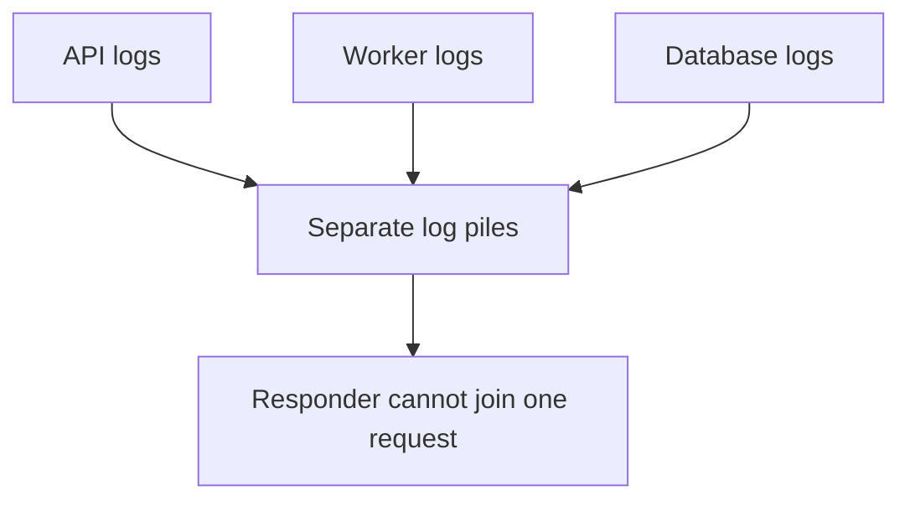
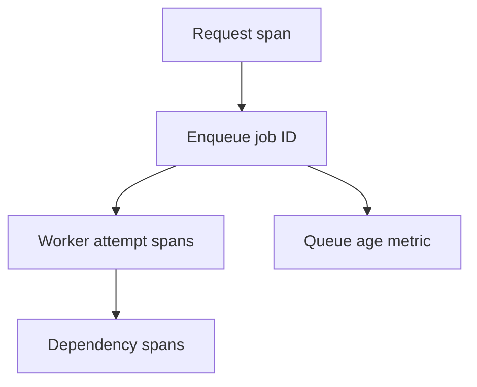
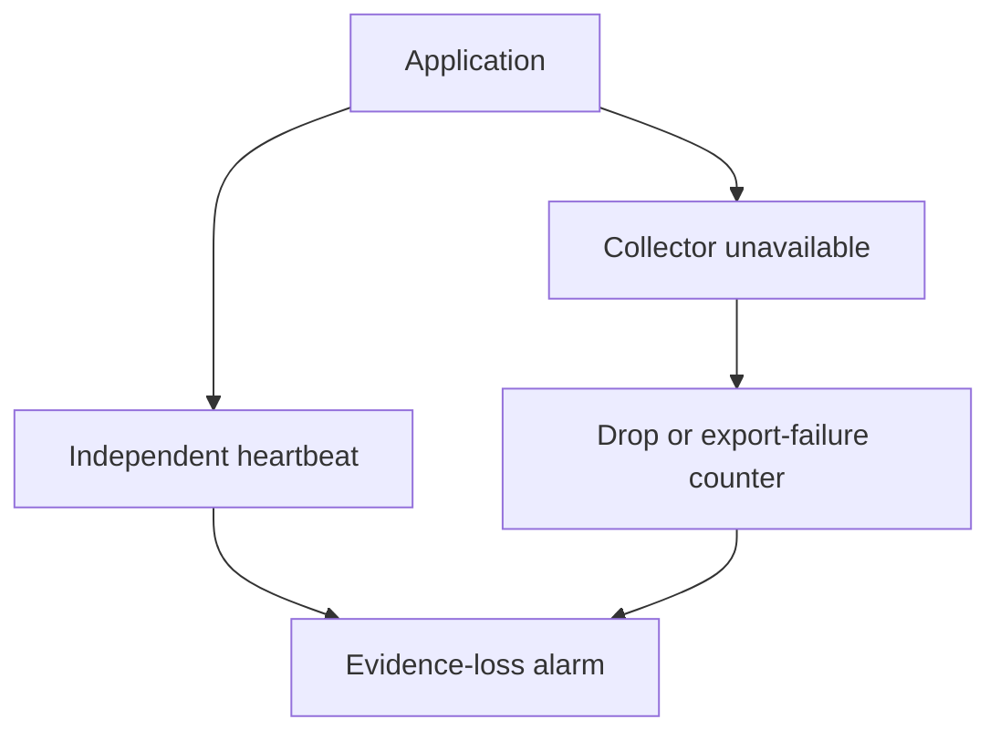

# 3. Debuggable at three in the morning

[Curriculum](../../../README.md) · [Observability](../README.md) · [Project index](../../../../indexes/projects.md)

## The reviewer's brief

> At 03:00 an unfamiliar responder sees rising failures. They must decide whether one tenant or everyone is affected, what changed, and where time is spent. Supply enough evidence to act without a redeploy. Which signal is missing today?

This is a **constructed practice brief**, not an attributed company question.
Prerequisites: [project index](../../../../indexes/projects.md) and [prerequisite lesson](../../01-system-design/design-method.md). This page is a build brief; it does not ship a runnable application. The original build and prompt sequence below defines the implementation checkpoints.

| Case | Exact input or workload | Expected outcome |
|---|---|---|
| Small example | Failure starts 03:00:00, first qualifying metric 03:00:30, alert delivered 03:01:10. | Measured detection time is 70 seconds; show collection and alert-delivery contributions separately. |
| Boundary / failure | Only one user ID is affected but metrics aggregate all traffic. | Use bounded cohort metrics plus trace/log queries by ID; do not create one unbounded metric series per user. |
| Scope | Request-weighted SLO with explicit missing-data and no-traffic behavior. | Explain any additional assumption before implementing it. |

<!-- project-expectation:start -->

## What you are expected to hand over

**The finished artifact:** Telemetry good enough that an unfamiliar person can answer "what happened to this request?" without adding a log line and redeploying — plus an SLO, an alert that fires once and usefully, and a measured detection time.

Treat that sentence as a review contract, not an inspiration. A reviewable
submission contains all of the following:

- the narrow working slice or decision artifact described above, reproducible
  from a clean checkout with assumptions stated;
- captured proof of the normal flow **and** the boundary/failure row above;
- tests, probes, or metrics that can go red when the important guarantee breaks;
- a short decision record naming ownership, excluded scope, and the first
  operational limit; and
- a changed contract, diagram, and new evidence for each follow-up—not only a
  paragraph claiming the original design still works.

### How the review conversation gets harder

| Review gate | The interviewer changes | Expected response |
|---|---|---|
| Baseline | Run the small example from the table above. | Demonstrate the observable outcome end to end and identify which boundary owns it. |
| Failure | Reproduce the boundary/failure row above. | Show the failure before the fix, then prove the protected behavior without hiding the error. |
| Senior · An async boundary appears | The user request ends before the worker starts. Which trace relationship do you preserve? Predict which boundary must change before opening the design. | Link the enqueue span to the job and each worker attempt. Show queue wait separately from execution; a retry must not overwrite the first attempt’s evidence. |
| Lead · Telemetry disappears | The collector fails while the application continues. How does the responder distinguish healthy traffic from silence? State what evidence would make you reject your first design. | Use an independently observed heartbeat and delivery/drop counters, and state what remains unknowable. Do not score undefined good/total as 100% availability. |
| Evidence | A reviewer asks, “How do you know?” | Build in three stops: reproduce the small case and baseline failure; implement the protected boundary; then replay both changed requirements with captured outputs. |
| Handoff | The author is unavailable and the environment is new. | Another engineer can run, observe, break, and recover the artifact from the repository evidence. |

Before implementation, say the baseline invariant, the owner of each piece of
state, and what the user sees when the named dependency or assumption fails. That
five-minute explanation is part of the project: if it is vague, the build is not
ready to begin.

<!-- project-expectation:end -->

Before looking at the guidance, state the invariant in one sentence and trace the example. In interview practice, implement or sketch independently, then reveal the reasoning. During AI-assisted practice, use the prompts below and verify each checkpoint before the next request.

## Baseline and the failure to explain



Collecting more uncorrelated data does not answer the four incident questions. Choose evidence from the actual decisions the responder must make.

<details>
<summary>Reveal the approach and decisions</summary>

Propagate request/job/attempt IDs, measure spans and outcomes, and attach deployment markers. The invariant is trustworthy attribution with explicit sampling gaps. Budget cardinality, retention and sensitive fields before exporting telemetry.

</details>

## Follow-up 1 · An async boundary appears

**Changed requirement:** The user request ends before the worker starts. Which trace relationship do you preserve? Predict which boundary must change before opening the design.

<details>
<summary>Expected reasoning and changed diagram</summary>

Link the enqueue span to the job and each worker attempt. Show queue wait separately from execution; a retry must not overwrite the first attempt’s evidence.



</details>

## Follow-up 2 · Telemetry disappears

**Changed requirement:** The collector fails while the application continues. How does the responder distinguish healthy traffic from silence? State what evidence would make you reject your first design.

<details>
<summary>Expected reasoning and changed diagram</summary>

Use an independently observed heartbeat and delivery/drop counters, and state what remains unknowable. Do not score undefined good/total as 100% availability.



</details>

## Evidence to bring to review

Build in three stops: reproduce the small case and baseline failure; implement the protected boundary; then replay both changed requirements with captured outputs. Record commands, fixtures, and observed results in your implementation README. A diagram is a prediction until those checks run.

**Senior expectation:** Have an unfamiliar reviewer explain a failure from supplied evidence. **Additional lead scope:** Own observability cost, redaction and missing-evidence response. Completion demonstrates practice evidence; it does not establish interview readiness or multi-team delivery experience.

## Build and prompt sequence

*Somebody who did not build it can find out what happened.*

**Build**

Telemetry good enough that an unfamiliar person can answer "what happened to
this request?" without adding a log line and redeploying — plus an SLO, an alert
that fires once and usefully, and a measured detection time.

**The thought process**

Start with the question, not the tooling: **what will you want to ask at 3am?**
Usually "is it everyone or one person", "since when", "what changed", and "which
component". Instrument to answer those four, and you will have skipped the phase
where you collect a lot of data that answers none of them.

Then the trap that gets everybody: **cardinality**. A label with a user id in it
multiplies your time series by your user count, and the bill arrives before the
insight does. The rule worth internalising early is that high-cardinality
identifiers belong on traces and in logs, not on metrics.

Third: **the alert is a design problem, not a threshold.** An alert that fires
for every blip trains people to ignore it, and then a real one arrives inside
that noise. Decide what is worth waking somebody for, in advance, while calm.

**How to organise the prompts**

```
Here is my system. I want to answer four questions during an incident:
is it everyone or one person, since when, what changed, and which
component.

Tell me the minimum instrumentation that answers all four. Then tell me
what I would be collecting that answers none of them.
```

```
Add tracing so one request is followed end to end, including the
outbound call, with a correlation id that appears in every log line for
that request.

Show me a single trace that crosses every component.
```

```
Define one SLO for the thing users care about. Write the error-budget
policy as rules — what happens at 75% spent, what happens at 25% — and
tell me what would have to be true for me to actually honour it.
```

```
Now break it on purpose and time me. From the moment it broke to the
moment something told me: what is the number, and where did the time go?
```

That number is the deliverable. Everything else in this project exists to make
it smaller.

**On AWS**

Instrument with **OpenTelemetry** rather than a vendor SDK, then choose where it
goes. **AWS Distro for OpenTelemetry** as the collector, with
**CloudWatch** plus **X-Ray** as the destination if you want everything inside
AWS and billed in one place. The argument for a third-party backend is query
power; the argument for CloudWatch is that alarms, dashboards and logs are
already there and already integrated with the things that would act on them.

Watch the cost shape: CloudWatch bills custom metrics per metric per month, so
cardinality is money, not just performance. **CloudWatch Logs Insights** for
ad-hoc queries, with a retention policy set deliberately — the default of
"forever" is a slowly growing bill nobody notices.

For the alert itself: a **CloudWatch alarm** on the SLO's burn rate, into
**SNS**, into wherever you actually look. And alarm on **missing data**, not just
on breaching thresholds, because a component that stopped reporting looks
identical to one that is healthy.

**What productionising it means**

A person who did not build it can follow one request end to end. The SLO has a
written policy that somebody has agreed to. Alerts fire once per incident rather
than once per minute. The telemetry bill is known and bounded. And the detection
time has been measured, not estimated.

**The learning**

The gap between "it broke" and "we knew" is the number that decides how bad an
incident is, and it is the only part you can shrink before anything goes wrong.
Everything else in observability is in service of that one measurement.

**How you would know it is wrong**

- Break something and time the gap. Then do it again after your changes and compare.
- Hand the telemetry to somebody unfamiliar and ask them to explain a slow request. Watch without helping.
- Count your active time series. Then add a label and predict the new count before looking.
- Stop a component entirely. Something must notice the silence.
- Check one trace actually crosses a service boundary rather than stopping at the edge.

**Stage it**

1. The four questions, and the minimum instrumentation that answers them.
2. One trace, end to end, with a correlation id in every log.
3. An SLO, a burn-rate alert, and a written budget policy.
4. A measured detection time, before and after.

---

[Back to the ordered project index](../../../../indexes/projects.md)
