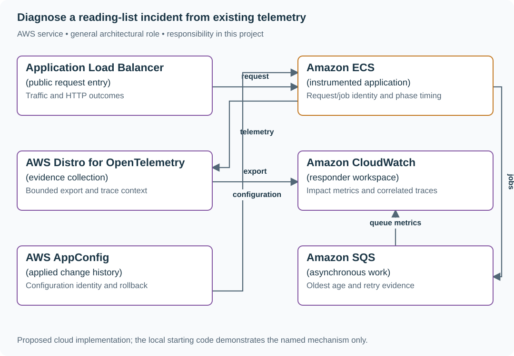

# Diagnose a reading-list incident from existing telemetry

## Application background

At 03:00, an engineer is called because people cannot use part of the reading list. The engineer did not write the service and cannot interview its author. They need to determine which users are affected and whether the failure happens while saving links, fetching titles or returning responses.

A recent configuration change may be responsible even if no code changed. The service needs enough existing diagnostic information to connect the user symptom to the failing step and the active configuration.

### Example walkthrough

| Action | Expected behavior |
|---|---|
| Users report missing titles | Compare title failures with successful bookmark saves. |
| Failures begin after configuration version 8 | Find which requests and jobs used that version. |
| Restore the previous configuration | Observe successful user work before declaring recovery. |

Logs record individual events. Metrics summarize counts or timings. Request and job IDs connect the related events so the responder can follow one operation through the system.

## Your assignment

**Deliver:** Build the diagnostic views and short runbook an unfamiliar responder needs. Demonstrate how they locate and reverse a controlled configuration failure using existing evidence.

**Required behavior:** Provide request/outcome metrics, correlated diagnostic events, selected traces and release/configuration identity. The runbook begins from user impact and links to evidence for scope, change and dependency behavior.

The required first milestone is a working local implementation of the behavior above. The numbered implementation steps define the scope. The cloud architecture is a later extension, not something the starter has already provisioned.

## Get the code and run the supplied example

The code is in the public [junior-to-staff repository](https://github.com/Soulful-Iris/junior-to-staff). Install Git and Python 3.12+. No AWS account or Python packages are required for this first run. If you already have a checkout, use it and skip cloning.

```bash
git clone https://github.com/Soulful-Iris/junior-to-staff.git
cd junior-to-staff
python3 examples/architecture-starts/debuggable_at_three_in_the_morning.py
```

**Supplied file:** [`examples/architecture-starts/debuggable_at_three_in_the_morning.py`](https://github.com/Soulful-Iris/junior-to-staff/blob/main/examples/architecture-starts/debuggable_at_three_in_the_morning.py). You can also [read or download the source here](../../../../examples/architecture-starts/debuggable_at_three_in_the_morning.py).

This program is a **mechanism demonstration**: it runs the small scenario in one process and prints the result. It is not an HTTP service, a complete application, or an AWS deployment. A successful run demonstrates this mechanism only. It does not establish the workload or failure guarantees of the application you will build.

**Example output from the supplied run:**

Generated IDs and timestamps may differ. Compare the state transitions and outcomes.

```text
{'collection_s': 30, 'alert_delivery_and_evaluation_s': 40, 'detection_s': 70, 'mitigation_after_alert_s': 60}
One user story: [{'request': 'r7', 'job': 'j9', 'attempt': None, 'event': 'accepted'}, {'request': 'r7', 'job': 'j9', 'attempt': 2, 'event': 'worker_timeout'}]
```

### Run the application you will extend

The [reading-list API setup guide](../../../../examples/reading-list-starter/README.md) gives you a real local HTTP server, SQLite database, save/list/edit requests and controlled title success/timeout behavior. Start it in one terminal and send the documented `curl` requests from another. Read that setup before following the implementation steps below. The demo above isolates this lesson's mechanism. The server is where you integrate it.

For a first run, start this in **terminal 1** from the repository root:

```bash
python3 examples/reading-list-starter/app.py --db /tmp/reading-list.sqlite3
```

In **terminal 2**, save one bookmark with a controlled title timeout:

```bash
curl -i http://127.0.0.1:8080/bookmarks \
  -H 'X-Demo-User: alice' -H 'Content-Type: application/json' \
  -d '{"url":"https://example.com/docs","title_mode":"timeout"}'
```

Expect **201 Created**, a bookmark `id` and `title_status: "timeout"`. The URL is persisted despite the title failure. This is the supplied baseline. The assignment adds the behavior described above. The lookup is a fixture, so no external website is contacted. For members Bob or Ben in a scenario, use the starter's second demo identity `bob`. Alice or Ana corresponds to `alice`.

Work in your own branch or copy `examples/reading-list-starter/` to `work/debuggable-at-three-in-the-morning/`. `app.py` exists in that directory. Add the modules named below there as you separate HTTP, storage and background work. The server has demo membership, not production authentication.

## Local components and state to implement

This table names the records, interfaces or decision inputs for your deliverable. Unless a name is explicitly linked to supplied source above, it is something you create. Implement the local state transitions first, then connect the HTTP, storage or worker boundaries required by the steps.

| Record / module | Key or interface | Responsibility |
|---|---|---|
| service_overview | eligible,outcome,latency,queue_age | User impact and operating saturation. |
| release_context | commit,config_version,started_at | What changed around the incident. |
| request_story | request_id,job_id,attempt_id,phase | Correlated synchronous and asynchronous evidence. |

## Implement the assignment

### 1. Instrument one real user journey

Record save/list outcomes and complete-request latency, then add dependency and pool/queue phases. Include deployed commit and applied configuration version in diagnostic context. Keep aggregate counters unsampled. Traces explain selected requests.

### 2. Build an impact-first dashboard

Show request success, tail latency, queue age and saturation for bounded route/tier/region groups. Provide a query path from a user-supplied response ID to redacted logs and traces. Do not create a permanent metric label for every user or request.

### 3. Write an executable runbook

Start with confirm impact, identify scope, inspect recent changes, locate the constrained dependency and choose a reversible mitigation. Give exact dashboard/query/configuration links and the expected observation after each action. An instruction to check logs is not enough.

### 4. Keep telemetry failure visible

Track collector/export failures and last-observed data independently. Distinguish no eligible traffic from missing instrumentation. Preserve bounded local buffering and dropped-event counters so diagnostic outages do not exhaust application memory.

## Demonstrate the completed local result

| Action | Expected visible result |
|---|---|
| Run the starting program | Detection is 70 seconds, not 30. Request r7 links to worker attempt 2. |
| Fail only one cohort | The responder can isolate it without adding a new metric label per user. |
| Stop telemetry export | Missing evidence is visible separately from healthy application traffic. |

**Handoff:** In your implementation README, include the start command, one successful operation, the failure case above and the resulting stored state or decision. State which dependencies are simulated. Someone with a fresh checkout should be able to reproduce this without your chat history.

## Workload assumptions and capacity decisions

These are constructed exercise assumptions. The stated workload is a design target. The local demonstration does not establish that throughput. Use the [estimation constants](../../../01-code/01-problem-solving/estimation-constants.md) to check units before choosing capacity.

| Input or objective | Calculation / consequence |
|---|---|
| Impact starts 03:00:00. Metric at 03:00:30. Alert at 03:01:10 | Detection is 70 seconds: 30 seconds collection plus 40 seconds evaluation/delivery. |
| One affected user among 100,000 | Global averages may hide impact. Use targeted logs/traces and bounded cohort dimensions. |
| Async job after HTTP response | Preserve request→job→attempt identity. One HTTP span cannot cover the whole lifecycle honestly. |

## Map the local implementation to AWS

**Deployment status: local only.** Running the supplied command creates no AWS resources and configures no cloud connections. The diagram is a proposed deployment of the completed application. Each box needs either a deployed runtime, a provisioned service or an explicitly external dependency.

Read the diagram by following the arrows from the entry point: application code accepts the request or event, the state owner commits it, and any worker produces the later result. The table ties those roles to code and adapter work. Multiple boxes do not imply multiple Python files already exist.



Observability is useful when it answers a responder’s concrete decision. Collectors and dashboards transport/present evidence, while application instrumentation supplies the missing causal boundaries.

| Local responsibility | Cloud destination and role | Implementation still required |
|---|---|---|
| Local HTTP listener | Application Load Balancer: public request entry | Deploy a service behind a target group, configure health checks and bounded connection/request behavior. |
| Application or worker process | Amazon ECS: instrumented application | Build a container and task definition. Supply configuration, task roles and graceful shutdown behavior. |
| Local timing and correlation events | AWS Distro for OpenTelemetry: evidence collection | Instrument runtime spans and configure collection/export. Propagate parent and request identity across boundaries. |
| Local counters, timestamps and diagnostic output | Amazon CloudWatch: responder workspace | Emit bounded metrics and logs, build the named operational view and configure retention and access. |
| Local versioned configuration | AWS AppConfig: applied change history | Publish validated configuration versions and consume them with bounded caching and rollback behavior. |
| Local pending-work collection | Amazon SQS: asynchronous work | Publish committed job intent, consume messages and persist deduplication/ownership state. Add visibility, retry and dead-letter handling. |

### Provision resources, then connect the application

| Resource or boundary | Initial configuration and reason |
|---|---|
| Telemetry access | Restrict diagnostic readers and redact tokens/content. Preserve enough IDs for correlation. |
| Metric dimensions | Route, outcome, tier and region are bounded. User-specific investigation uses queries. |
| Recovery access | Keep configuration rollback and runbook access available when the normal app is failing. |

Use one disposable AWS environment for the cloud exercise. Put the named resources in `infra/template.yaml` or your existing IaC tool, pass resource IDs through configuration, and scope each runtime role to its own tables, buckets and queues. The diagram is a design to implement. It is not a claim that these resources have been deployed. Record the commands you used to deploy and remove the exercise resources.

For concrete provisioning commands, configuration wiring and cleanup, use the [AWS foundation guide](../../../../examples/architecture-starts/infra/README.md). It includes a deployable table/queue/object-storage foundation and explains which application and service adapters you still implement.

A provisioned queue or table does not make the local program use it. Configure resource IDs in the deployed runtime, replace the local adapter, and replay the same successful and failing operation against that runtime. Record the deployed commit and observable result, then remove the disposable resources using your infrastructure tool.

## Extend the design after the baseline works


The mitigation lowers alert delay but leaves backlog drain unchanged. Report faster detection separately from recovery. Do not claim the entire incident became shorter without measuring it.

<details>
<summary>Additional design reasoning and requirement changes</summary>

## Follow-up 1 · An async boundary appears

**Changed requirement:** The user request ends before the worker starts. Which trace relationship do you preserve? Predict which boundary must change before opening the design.

<details>
<summary>Expected reasoning and changed diagram</summary>

Link the enqueue span to the job and each worker attempt. Show queue wait separately from execution. A retry must not overwrite the first attempt’s evidence.

</details>

## Follow-up 2 · Telemetry disappears

**Changed requirement:** The collector fails while the application continues. How does the responder distinguish healthy traffic from silence? State what evidence would make you reject your first design.

<details>
<summary>Expected reasoning and changed diagram</summary>

Use an independently observed heartbeat and delivery/drop counters, and state what remains unknowable. Do not score undefined good/total as 100% availability.

</details>

</details>
