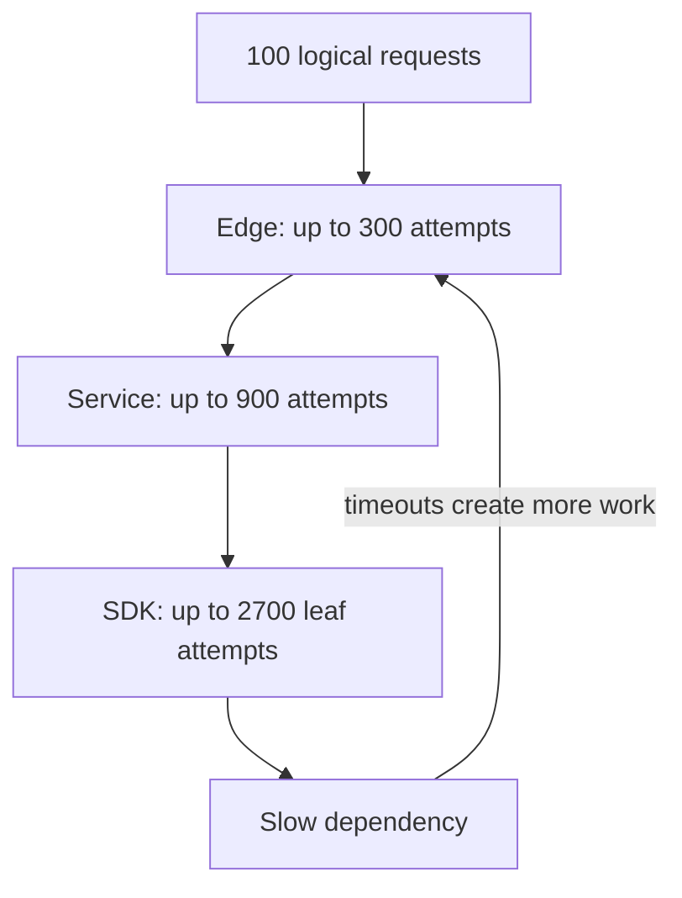
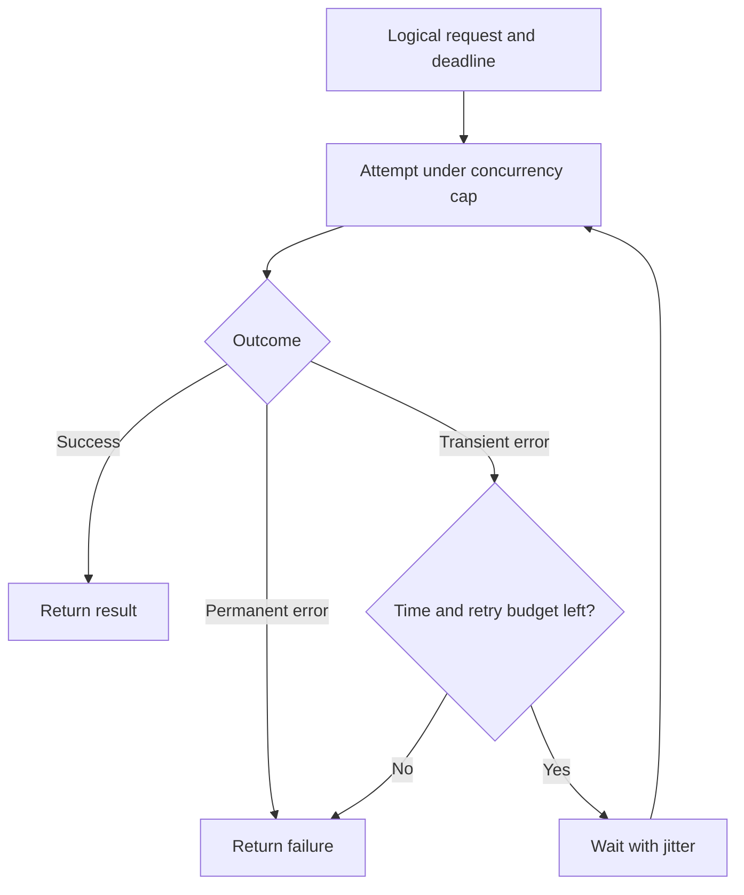
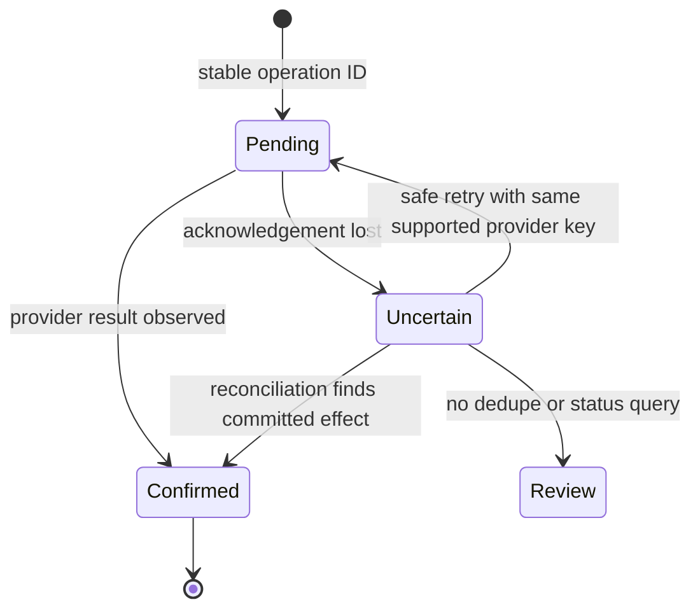

# Retries spend the capacity needed for recovery

[Curriculum](../../../README.md) · [Set reliability objectives and recover from failures](../README.md)

> “A click calls three services. Each owner configured three attempts because transient failures seemed harmless. Under dependency overload, 100 clicks create far more work. Bound total attempts and elapsed time; then handle a timeout after a payment has already committed.”

Constructed interview brief; source facts below are separate. Prerequisites: [retry arithmetic](../labs/reliability/README.md) and stable operation identities.

| Contract | Workload / expected outcome |
|---|---|
| Original operation | 100 logical requests, three total attempts at three nested layers |
| Failure input | Every attempt reaches the leaf and fails transiently → at most 2,700 leaf attempts |
| Improved budget | 100 originals/s plus dependency-wide 20 retries/s → at most 120 offered attempts/s |
| Boundary | Three attempts includes the original; three retries means four attempts |
| Deadline | Remaining 1,500 ms; required wait 1,000 ms and attempt 500 ms fits exactly; 1,499 does not |
| Excluded | Local arithmetic does not implement a distributed quota or prove a remote write did not happen |

## Baseline to challenge

Name the logical request and each attempt counter. Trace one full failure path; multiply only layers reached on that path. Identify the retry owner, the deadline owner and the quota scope. Test retry denial as deliberately as success, then measure useful completions after removing the trigger. Attempt before opening the worked design.

**Real event:** GitHub, August 17, 2026. Load-balancer and service-mesh limits were exceeded; a client retry bug amplified authentication traffic. GitHub reduced retry pressure and blocked the triggering requests during recovery. Its follow-up includes scaling and retry-policy repairs. [Primary report, published September 9](https://github.blog/news-insights/company-news/github-availability-report-august-2026/).

**Takeaway:** Retry delay controls when; retry budgets control how much. Define one owner.

[Static diagram](../../../../assets/learning/retry-tree-still.svg)

These diagrams use illustrative workloads. AWS mappings are our learning designs.

Work the example · AWS implementation · failure drill

## Calculate amplification before choosing an SDK policy

Our toy call graph has three layers, each allowing three total attempts, including its original attempt. If every failure traverses all layers, one user request can create `3 × 3 × 3 = 27` leaf attempts. For 100 requests, that is 2,700 attempts. This is a worst-case bound, not a measurement from GitHub. Many real failures stop earlier.

Choose one layer to own retries for a dependency. Give each logical request one absolute deadline; attempts consume the remaining time rather than resetting the clock. Also cap concurrent requests and the aggregate retry rate. An attempt limit per request still permits a huge storm across a million requests.

## AWS implementation exercise

For an ECS or Lambda handler calling DynamoDB, inspect the SDK's own retry behavior before adding an outer retry loop. Set a bounded SDK policy and explicit request timeouts. In Python botocore, `Config(retries={"mode": "standard", "total_max_attempts": 3})` means three total attempts. Application concurrency, deadline propagation, and retry-rate protection remain separate responsibilities. [AWS SDK retry settings](https://docs.aws.amazon.com/sdkref/latest/guide/feature-retry-behavior.html).

Use DynamoDB throttling as a test classification, and inject a deterministic timeout in a fake client locally. Do not retry validation errors or access denial indefinitely. For SQS workers, account for SDK attempts, Lambda invocation retries through message visibility, and redrive count as separate layers. The [queue lab](../../03-infrastructure/aws/labs/job-pipeline/README.md) makes the durable result conditional so a lost acknowledgement does not create a second result item.

**Toy budget:** base arrival rate 100/s, retry allowance 20/s, downstream safe capacity 150/s. Maximum admitted offered load is 120/s if the budget is enforced globally for this dependency. If 20 processes each independently allow 20 retries/s, the aggregate bound is 500/s. Specify whether a budget is global, per instance, or partitioned.

## Operational evidence

Track logical requests separately from attempts: `attempts / logical_requests`, retries denied, deadline exhaustion, in-flight calls, downstream throttles, and successful user outcomes. If attempts fall while successful outcomes rise, shedding useless work can be helping. A falling error count alone may simply mean you stopped accepting users.

| Level | Demonstrate | Above the baseline |
|---|---|---|
| Junior | Distinguish retryable from permanent errors | Explain uncertain outcome after a timeout |
| Senior | Bound amplification and total elapsed time | Test overload recovery and aggregate budgets |
| Staff | Assign retry ownership across teams | Prevent heterogeneous clients from bypassing dependency budgets |

**Changed requirement:** a payment provider times out after charging the customer. Use a stable provider idempotency key and reconciliation query when supported; a local retry counter cannot establish what happened remotely. If no deduplication or status query exists, represent an uncertain outcome for reconciliation instead of claiming exactly-once execution.

## Follow-ups that change the design

**Senior: conditional 429.** Use the 1,500 ms remaining-time example above. Retry only with safe repeat semantics, a token and the required wait plus bounded call time. At 1,499 ms, return/degrade without another attempt. A 400 validation failure or 403 denial does not enter this transient loop. The [executable policy fixtures](../labs/reliability/test_model.py) test all three exclusions and budget exhaustion.

**Lead: the payment succeeded but acknowledgement was lost.** A stable provider key can collapse repeated attempts when the provider supports it; otherwise an uncertain local outcome must trigger reconciliation, not an invented failure followed by a new payment. Predict the action after the timeout before reading the state transitions.

For the cross-team version, twenty independently enforced 20/s budgets permit `100+20×20=500/s`. A 150/s dependency cannot accept that bound. Partition a total 20/s retry allowance, or enforce one authoritative budget near the dependency; define behavior when budget coordination fails. A per-client SDK bucket is not that authority.

Run `python -m unittest discover -s curriculum/03-production/05-reliability/labs/reliability -p 'test_*.py' -v` from the repository root. These local models verify counts and policy, not remote payment behavior. For the build extension, submit logs linking logical ID to attempt ID, a lost-ack test and an explicit uncertain-state recovery; never present a fake client as a real provider guarantee.

[Production casebook](../../../../indexes/production-cases.md) · [AWS implementation](../../03-infrastructure/aws/README.md)
