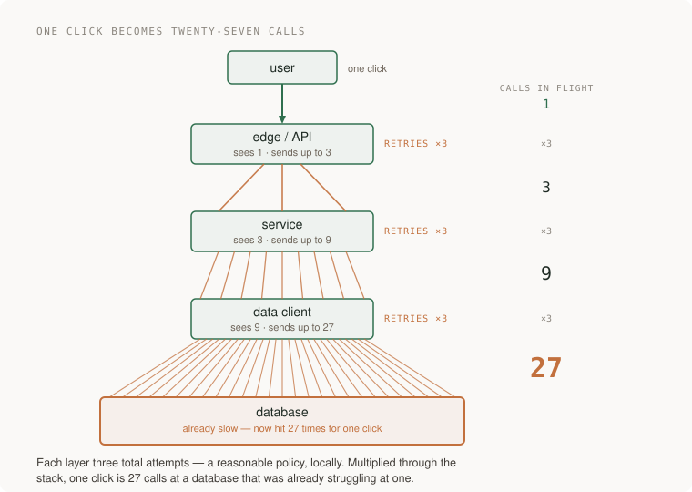
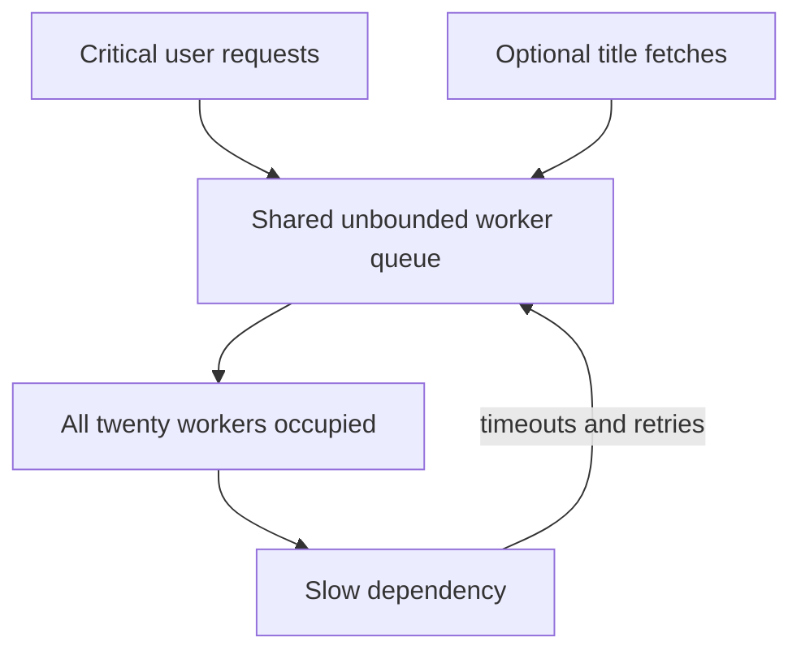
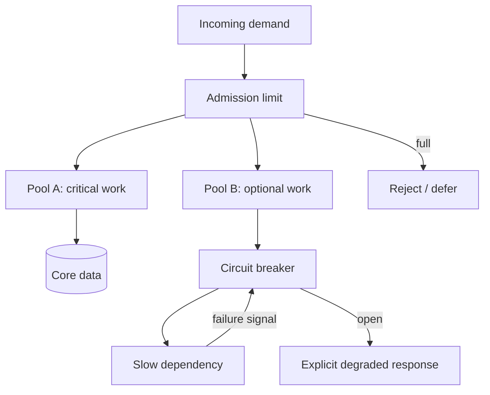
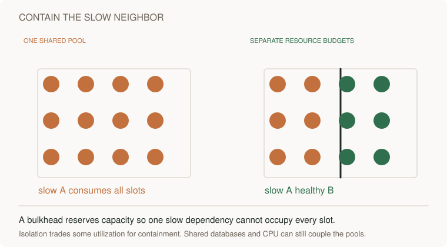

# Set an error budget and bound retries during overload

[Curriculum](../../README.md) · [Set reliability objectives and recover from failures](README.md)

> Project connection · feeds [Reading-list stage 3: measure the application under load](../../../projects/reading-list/stages/03-under-load/README.md)

## Keep saving bookmarks while optional work slows down

The reading-list application stores a URL when someone clicks Save. It also fetches the remote page’s title so the list can display “Database setup guide” instead of a long address. Saving the URL is the essential action. Fetching its title can finish later or report that it is unavailable.

In this constructed scenario, twenty worker slots are shared by work that calls a dependency. A call normally takes 200 ms, then starts taking two seconds. Each occupied slot finishes work more slowly, and retries add more attempts. A timeout can limit one wait while an unbounded queue still grows behind it.

Your task is to define successful user work, allocate its failure allowance, and choose explicit admission, waiting, and retry limits. First calculate the small example below. Then use the [local reliability lab](labs/reliability/README.md), whose deterministic model lets you inspect request counts and attempt counts separately. Those model outputs do not measure a deployed AWS fleet.

### Distinguish one user action from its attempts

A single Save is one eligible user event. An original dependency call plus two retries is three attempts for that event. If the save misses its agreed deadline, a later successful retry does not retroactively make that user experience fast.


> “Our reading-list service has twenty workers. Dependency calls rise from 200 ms to two seconds, and retries keep arriving after recovery. Preserve bounded latency and useful throughput. Which counters would distinguish user requests from attempts?”

This opening scenario is constructed practice. Start with the contract before tuning retries:

| Input / boundary | Expected result |
|---|---|
| 1,000,000 eligible requests; 10,000 fail in one minute | 99% request success, ten times the 99.9% request budget |
| Twenty independent slots; 200 ms mean service | Ideal ceiling 100/s; at two seconds, 10/s |
| Three total attempts at three layers | At most 27 dependency attempts; includes the original |
| All traffic critical; 120/s offered, 100/s capacity | At least 20/s refused, deferred within bounds, or outside the latency objective |
| No eligible requests | Unknown SLI; absence of traffic is not proof of health |

Work in this order: name the eligible user event; aggregate counters; trace the attempt tree; calculate the capacity and waiting-work budget; bound intake and deadlines; then measure recovery with fresh arrivals still present. Run the [arithmetic and incident exercises](labs/reliability/README.md) for exact assertions and a separate assessor key.

## The principle behind the design

Reliability is not uptime you hope for. It is behaviour you designed for the
moments when part of the system is failing — and part of it always is. The
senior version has numbers: how much failure is allowed, what happens when the
allowance runs out, how long each call waits, and who gets dropped first when
there is not enough system to go around.

## Follow the failure through the system

The following timeline is a constructed illustration, not a measured incident.

At 02:10 the database slows down — a backup job, a bad plan, it barely matters.
Calls that took 20ms take two seconds. The data layer times out and retries,
three attempts. The service above it: three attempts. The edge: three. One
click has become twenty-seven queries, aimed at a database that was struggling
with one.

At 02:40 someone kills the backup job. The database is healthy again. The
outage continues, because the load is no longer coming from users: timeouts
breed retries, retries breed load, load breeds timeouts. At 04:55 someone
disables retries at the edge; everything recovers in ninety seconds.

The review will call the database the cause. It was only the trigger. The
outage was designed in months earlier, one locally reasonable retry policy at a
time.

## Mechanisms and their limits

Five ideas, one discipline: **decide the failure behaviour on a calm afternoon,
or the system decides it during the incident.**

### A budget you spend, and a policy someone signed

Choose a measurable SLO with stakeholders — for example, 99.9% of requests succeed within
500ms, over 30 days. The **error budget** is 0.1% of eligible requests: with
1,000,000 requests, 1,000 may fail that combined success-and-latency condition.
The familiar 43.2 minutes is the budget for a *time-based* 99.9% availability
SLO over 30 days. These units are not interchangeable when traffic varies.
[Google's SLO workbook](https://sre.google/workbook/implementing-slos/) describes
request-based good-event ratios; checked 2026-09-22.

A written error-budget policy names the actions, exceptions and decision owner when the budget is consumed. A release freeze is one possible policy; do not copy another service's risk tolerance without agreement.

Burn rate is `(bad / eligible) / (1 - SLO)`. At a 99.9% SLO, a 1.44% error ratio is burn 14.4. The familiar “2% of a 30-day budget in an hour” shortcut assumes comparable traffic rates; compute bad-request counts against the actual request allowance when traffic varies. [Google's alerting chapter](https://sre.google/workbook/alerting-on-slos/) supplies multi-window examples; it is historical technical guidance, not recent hiring evidence.

An ordinary `short_alarm AND long_alarm` fires only while both are true and clears when **either** is false. Holding until both recover is a different stateful latch. Missing traffic/telemetry needs an explicit unknown-data policy. The [truth-table tests](labs/reliability/test_model.py) cover both recovery directions and the separate latch.

### Every call has a timeout; you chose it or inherited it

A network client may inherit a timeout or wait without a finite bound. Inspect the actual connect, read and whole-operation settings. For a constructed latency distribution, a timeout at p99.9 excludes roughly the slowest 0.1% of observed calls. Treat that as a starting tradeoff, then account for connection setup, network variability and the total user deadline; validate against fresh traces rather than assuming the historical percentile is a guarantee. Too long, and a slow dependency holds
threads hostage while work queues behind them. Too short, and you kill work
that would have succeeded — then, worse, retry it.

### Retries are multiplication

A retry is extra load, added at the exact moment the system said it has too
much. One layer retrying is a tool; several layers retrying is a weapon pointed
inward:



The drawing has **three total attempts per layer**, including the original.
Three *retries* after the original would mean four total attempts and `4³ = 64`
leaves. Count actual SDK semantics, not a configuration label alone.

Nobody writes 27 into a config. Three teams each write 3. Prefer **one deliberate
retry owner**. When another layer is necessary, derive the whole attempt tree: two
application attempts × three SDK attempts permit six dependency attempts, not two.
The remaining end-to-end deadline may stop it earlier. Name per-operation attempt
limits, per-process concurrency/rate limits and any fleet-wide budget separately.
A shared provider idempotency key prevents duplicate effects only under that
provider’s scope and retention contract; it does not eliminate request load.

Cap even that layer. A circuit breaker can stop calls while a dependency is unhealthy; test its closed, open and probing transitions. A retry token bucket limits retry work. Their scopes differ: a per-SDK-client bucket does not enforce a fleet-wide dependency budget. [AWS retry documentation](https://docs.aws.amazon.com/sdkref/latest/guide/feature-retry-behavior.html) describes SDK behavior; publication age unknown, accessed 2026-09-22. Inspect your pinned SDK and service-specific errors.

Do not blanket-retry all 4xx errors or forbid them all. A 429 throttle may be retryable when server-directed delay, remaining deadline, attempt limit, idempotency and retry budget allow. Validation/access errors normally require a changed request or corrected authorization. An expired deadline or empty budget stops even a 429 retry. Add jitter where callers would otherwise synchronize; it spreads work in time but does not cap total work.

**Only retry a side effect if doing it twice equals doing it once.** Hence the
**idempotency key**: the client mints one key per logical operation and sends
it with every attempt; the server stores key → result and replays it on
duplicates. Without one, a retry is not "try again"; it is "maybe charge them
twice".

### Degradation is a mode you design

When demand exceeds capacity, define which work to admit and what refusal means. In a constructed service with capacity 100/s, 80 critical/s and 40 bulk/s, admit all critical work and at most 20 bulk/s. If critical demand rises to 120/s, at least 20 critical/s must be refused, deferred within a finite waiting budget, or miss the objective. That is a capacity failure, not automatically a classification bug.

Separate worker pools can protect critical work from optional dependencies, but shared database/CPU limits still couple them. Choose thresholds from measured useful throughput and latency; CPU percentages and another company's incident outcomes are not universal settings. Count eligible refusals in the user-facing SLI.

### The failure that outlives its cause

The opening story has a name: **metastable failure**, from [Bronson, Aghayev, Charapko and Zhu’s 2021 paper](https://sigops.org/s/conferences/hotos/2021/papers/hotos21-s11-bronson.pdf), historical mechanism context outside this review’s recent-evidence window. A system is *stable* while it absorbs
shocks, *vulnerable* when it runs fine without headroom, and *metastable* when
a **trigger** tips it into a failure that a **sustaining loop** keeps alive
after the trigger is gone. Retries are the canonical loop; cold caches the
sneaky one — every miss costs more than a hit, so a flushed cache cuts capacity
exactly when load is highest. Waiting does not help — recovery is deliberate
loop-breaking: shed load, switch retries off, restart with intake throttled.
Everything else in this section is loop prevention.

Source provenance and retracted original claims are recorded in the [claim ledger](../../../docs/research/claim-ledger.md).


## What good looks like

- Every outbound call has an explicit timeout, and a sentence says why that value.
- An SLO someone outside engineering agreed to, and a one-page policy with named actions and authority.
- Alerts are burn rates over paired windows; the last page matched real user harm.
- A named retry owner and a measured end-to-end attempt budget, including SDK
  and proxy behavior; extra layers need an explicit combined budget.
- Every retried side effect carries an idempotency key, and a test submits a duplicate.
- A written shed order: which classes drop first, at what signal, what the caller sees.

Done badly, you see:

- "We target 99.99%" and nobody can say what happens when it is missed.
- Retries in the HTTP client, the mesh and the application, set by three people who never met.
- A circuit breaker whose open state has never once been exercised.
- Postmortems that stop at the trigger and never name the loop that kept it down three more hours.

## Use an assistant to investigate specific questions

**Request 1 — the policy, not the maths**

```
Our SLO: 99.9% of requests succeed in under 500ms, over rolling 30 days.

Write the one-page error-budget policy to go with it: tiered actions as
the budget burns (at 50%, at 100%, and for any single incident burning
20%), who can declare a release freeze and who can lift it, what still
ships during one, and where disagreement escalates.

Then define the alerts as burn rates — a fast-burn page and a slow-burn
ticket, each with paired long and short windows — showing the arithmetic
from SLO to threshold.

Do not propose loosening the SLO.
```

*Why it is asked that way:* the freeze, the names and the exceptions change
behaviour; the maths does not, and they are the part teams skip. The last line
blocks the easy out: a loosened target makes any policy painless.

*What you should get back:* thresholds paired with actions a person could
refuse to perform, and arithmetic you can recompute: under the constant-traffic teaching assumption, 2% of a 30-day budget in one hour corresponds to burn 14.4. Recompute with observed request counts when traffic varies. Numbers that do not recompute were pattern-matched.

*Push back on:* actions that are sentiments. "Prioritise reliability" freezes
nothing; every tier needs a change someone can point at.

**Request 2 — the outbound-call audit**

```
Find every network call in this codebase — HTTP, database, cache, queue.

For each call site: the timeout and WHERE it comes from (our code, or a
library default — name the default's actual value), every layer that
retries it (our code, client library, mesh), and whether it is
idempotent by nature, idempotent via a key, or not.

Fix nothing. Give me the table, worst rows first.
```

*Why:* "name the default's actual value" does the work — it forces a look at
what the library really does, and stacked retry layers are what reading one
file never shows.

*What you should get back:* a complete call-site inventory with evidence, including clean results if the policies are already correct. Seed a hidden retry layer in a test fixture to check whether the audit would detect it.

*Push back on:* "safe to retry" on a write with no dedupe mechanism named, and
"default" in the timeout column without a number — it did not check.

**Request 3 — design the shed, then hunt the loop**

```
Same system. Design its degradation mode:

1. Sort every endpoint into CRITICAL / DEGRADED / BEST_EFFORT / BULK.
   Justify surprising placements.
2. Pick the utilisation signal and a shed threshold per class, and say
   what a shed request returns to its caller.
3. Now run the film backwards: the database is pinned at 100% for five
   minutes, then fully recovers. Trace what every retry policy, cache
   and queue does during and after, and say whether load returns to
   baseline on its own. If not, name the loop.
```

*Why:* part 3 demands the sustaining loop by mechanism, answerable only from
the configuration part 2 must live with.

*What you should get back:* a justified classification and an explicit capacity calculation, including a run where every request is legitimately CRITICAL. Name a concrete loop or show evidence for bounded recovery, caches and client retry queues included.

*Push back on:* shedding at random rather than by class, and any "it recovers
cleanly" that never says what queued retries and cold caches do in minute six.

## How you would know it is wrong

1. **The kill test.** Stop a dependency for sixty seconds, restore it. If load
   does not return to baseline within minutes, on its own, you have a
   sustaining loop — a metastable system, found in the afternoon instead of at
   2am.
2. **Count the amplification.** Slow the database, send exactly one request at
   the top, and count arrivals at the bottom in the query log. The number must
   match the derived tree and remaining deadline, including SDK attempts.
   A larger count reveals an unaccounted layer or an incorrect budget.
3. **The duplicate test.** The same side-effecting request twice with one
   idempotency key: exactly one effect. With two keys: exactly two. The second
   half matters: a dedupe that swallows everything is broken in the other
   direction.
4. **Fire the pager on purpose.** Inject errors just above the fast-burn
   threshold: a page must arrive; stop them and it must clear within the short
   window. An alert that has never fired is a hypothesis.
5. **Ask when the policy last changed a plan.** If the budget has been
   exhausted and nothing froze, you have arithmetic, not a policy.
6. **Shed under load and diff the classes.** Past the threshold, lower-priority work should shed first while critical demand remains within measured capacity. Repeat above critical capacity and verify explicit bounded refusal; both classes may then degrade.

## Apply this lesson to the reading-list application

On **P3**, the reading list meets load. From this section:

- A one-page SLO and error-budget policy for the core action: tiered actions,
  your own name in the freeze rule.
- Burn-rate alerts — fast-burn page, slow-burn ticket, paired windows — and a
  drill log showing each fired once.
- A timeout inventory: every outbound call, its value, chosen or inherited — no
  "default" without the number.
- Prefer one retry owner; explicitly bound any additional layer. Record the
  total attempt/deadline budget, limiter scope and idempotency key on adding a URL.
- Two classes — user actions CRITICAL, title fetching BULK — one threshold
  shedding BULK first, and a load test showing the availability curves
  separating.
- A game day: kill the fetch dependency for one minute, once with retries
  stacked at two layers, once with your real config, and record what load does
  *after* the trigger is removed. The difference between those two graphs is
  this whole section.

**Acceptance criteria:**

- The kill test meets its stated recovery envelope: measure spare throughput, queue age and any required operator action. Do not promise automatic recovery without implementing and testing it.
- Disabling the dedupe turns the duplicate test red.
- The worst-case number of database calls for one click is written down, and
  the measured amplification matches it.

## Terms used in this lesson

- **SLO** — the target on a measurement (the SLI) over a window.
- **error budget** — one minus the SLO: the failure you are allowed to spend.
- **error-budget policy** — the written rules for what happens as it burns; the freeze lives here.
- **burn rate** — bad-event ratio divided by the allowed bad-event ratio; sustained rate 1 matches the SLO error allowance.
- **retry storm** — retries stacking across layers until the system attacks its own dependency.
- **jitter** — deliberate randomness on timers so synchronised things stop arriving together.
- **token-bucket retry limiter** — a scoped retry allowance; depletion stops retries. Refill and costs depend on implementation.
- **circuit breaker** — fail fast after repeated failure, probe to recover; modal, so test every mode.
- **idempotency key** — a client-minted id for one logical operation, so twice equals once.
- **load shedding** — refusing chosen work so the important work survives.
- **metastable failure** — an outage that outlives its cause, held up by a sustaining loop.

---

**Not covered here:** observability — how you would see any of these numbers —
is its own senior section; so are queues and backpressure. Capacity planning,
autoscaling, multi-region failover and incident response are out; chaos
engineering appears only as this section's game day.

[Learning sequence](../../README.md) · [Independent practice](../../../practice/interview-guide.md)

## Baseline to challenge · One pool shares the failure



Predict the result after optional work slows: a timeout does not cap queued work, and critical requests wait behind it. Now redraw admission and separate pools. At the same time, calculate whether critical traffic itself fits the remaining capacity; isolation cannot promise an unlimited critical tier.

## Draw it from memory · Contain a slow dependency



**Redraw challenge:** Trace why a timeout alone cannot protect an unbounded shared pool.



[Static view](../../../assets/learning/bulkhead-still.svg)
