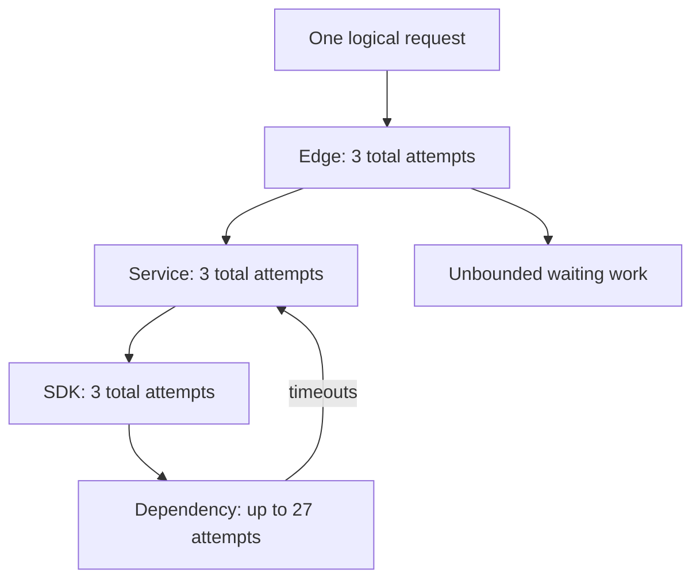
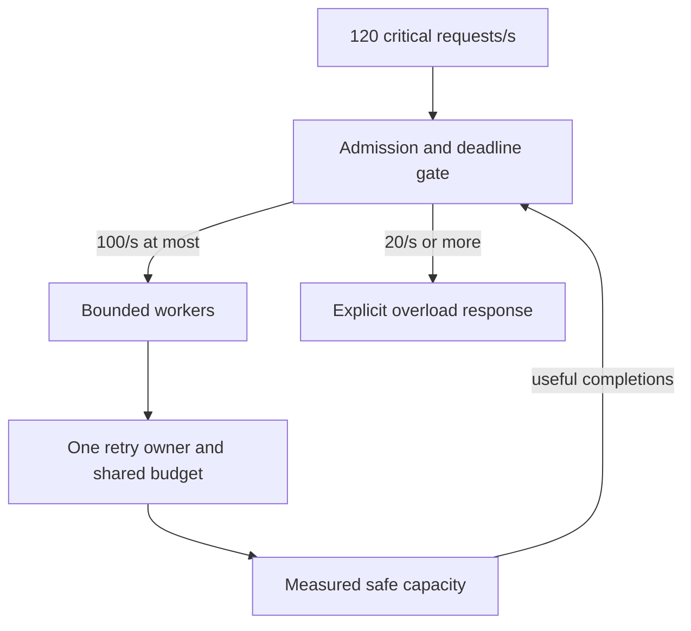

# Calculate error budgets, retry amplification and recovery capacity

[Curriculum](../../../../README.md) · [Set reliability objectives and recover from failures](../../README.md)

## Application and assignment

A service counts successful user requests, but its dependencies count every attempt, including retries. During an outage those numbers diverge. A retry can add load without completing another user action, and a restored dependency can still face a large backlog.

Calculate the examples before consulting the supplied arithmetic model. Your output is a set of denominators, attempt counts, and bounded recovery decisions. This is a local policy model with synthetic values, not a cloud load benchmark.

## Contract and starting evidence

> “Our API has twenty worker slots. A dependency slows from 200 ms to two seconds. A dashboard says availability is acceptable, but users cannot finish requests. Show whether that conclusion follows from the counters; then contain the overload without pretending capacity is unlimited.”

Constructed practice, not a company interview. Prerequisites: ratios, Boolean AND/OR, and [the reliability chapter](../../failure-budgets.md). Do the arithmetic independently before running the reference.

| Contract | Teaching input | Expected behavior |
|---|---|---|
| Request SLI | 990,000 good/eligible requests, then 10,000 failures in one minute | 99% success; 10 times a 0.1% request budget consumed |
| Missing traffic | Zero eligible requests | Unknown SLI, not a fabricated 100% |
| Alert | Both burn windows ≥14.4 | Fire; ordinary AND clears when either recovers |
| Capacity | 120 critical/s, 100 service slots completed/s | At least 20 critical/s cannot be served immediately |
| Retries | Three layers × three total attempts | At most 27 leaf attempts; three retries each means 64 |
| Excluded | Actual SDK, distributed quota, cloud load test | Reference is exact arithmetic and policy, not a production implementation |

## A method you can repeat

1. Name the user-visible event, eligibility rule, time window, and denominator. Count original operations separately from retries. A timeout is not proof a write failed.
2. Sum good and eligible counts before dividing. Do not average minute-level percentages when traffic varies. At a 99.9% target, 1,000,000 eligible requests permit 1,000 bad events. Ten thousand bad events spend ten budgets even if concentrated in one minute.
3. Draw where attempts multiply and where work waits. Compute offered work, measured useful completions, and the maximum from concurrency/service time. The maximum assumes independent slots and constant service time; it is not a latency percentile guarantee.
4. Bound intake, queue age, retry work, and deadlines. Preserve stable IDs for side effects. Refusal is explicit; it must count in the user-facing SLI if the operation is eligible.
5. Recompute recovery spare capacity. Removing a trigger does not empty a queue. Measure whether a proposed fix improves useful completions, not merely whether fewer errors reach a dashboard.

### Initial mechanism: local policies multiply



Three total attempts are **one original plus two retries**. The preserved [original illustration](../../../../../assets/diagrams/retry-amplification.svg) says “retries three times” while drawing a 27-leaf tree. Read that drawing as three total attempts at each layer; three retries would give `4 × 4 × 4 = 64`.

### Follow-up: every request is critical

Before revealing the design, calculate refusal when demand is 120/s and safe capacity is 100/s. A label cannot manufacture the missing 20/s. Queuing postpones the decision only while the waiting-time and memory budgets permit.



**429 is conditional, not permission to loop forever.** The toy policy retries 429/502/503/504 only when safe to repeat, a retry token remains, and server wait plus attempt time fits the remaining deadline. For a 1,500 ms deadline, 1,000 ms wait and 500 ms attempt fit exactly; 1,499 ms does not. Ordinary 400/401/403/404/422 do not trigger the same retry. Service-specific error codes can require a different policy. [AWS SDK retry semantics](https://docs.aws.amazon.com/sdkref/latest/guide/feature-retry-behavior.html) are live technical documentation, publication age unknown; accessed 2026-09-22. Pin and inspect the actual SDK version before applying its defaults.

## Alert recovery is a truth table

Burn is `(bad / eligible) / (1 - SLO)`, a dimensionless ratio. A burn of 14.4 over one hour corresponds to 2% of a 30-day budget **under constant traffic-rate assumptions**. Exact request-budget consumption is bad requests divided by the request allowance for that window; variable traffic breaks the simple elapsed-time shortcut.

| Short alarm | Long alarm | Ordinary AND | Previously fired latch: hold until both clear |
|---|---|---|---|
| true | true | true | true |
| false | true | false | true |
| true | false | false | true |
| false | false | false | false |

The last column is a different stateful policy. Test its transitions and reset ownership separately. Missing metrics is a third state; the supplied model returns unknown unless a known false makes AND false. An independent missing-telemetry alert is a product decision. Multi-window examples come from [Google's SLO alerting chapter](https://sre.google/workbook/alerting-on-slos/), historical technical guidance, not recent interview evidence.

## Run and change the inputs

From the repository root, Python 3.10+; no dependencies or network:

```bash
python -m unittest discover -s curriculum/03-production/05-reliability/labs/reliability -p 'test_*.py' -v
```

Expected: eight tests pass, including calculations loaded directly from the incident CSV. They exercise unequal traffic, missing data, both AND recovery directions, a separate latch, retry units, status classification, budget exhaustion, priority overload, and finite versus impossible drain. The countermodels explicitly contradict the failed prose guarantees.

A 20-slot service at 200 ms has an ideal 100/s ceiling. At 2 seconds it has 10/s. With open arrivals of 80/s for one minute, the ideal queue grows by `(80-10)×60 = 4,200`. Restoring 100/s leaves 20/s spare, so draining takes 210 seconds. Twenty closed-loop load clients instead self-throttle to 10/s while waiting: a stable test queue does not represent the open workload.

**Senior follow-up:** impose a 500 ms total deadline. Which queued work is already useless, and how does dropping it change the drain equation? Report discarded logical operations as failures rather than counting them as fast successes. **Lead follow-up:** twenty teams each configure 20 retries/s. At 100 original/s, total allowed demand is 500/s, not 120/s. Allocate a dependency-wide budget and specify enforcement when teams cannot share a coordinator.

Next: [the unseen incident](incident.md). Acceptance is a written calculation and safe mitigation grounded in evidence; running supplied tests alone does not assess independent performance.
