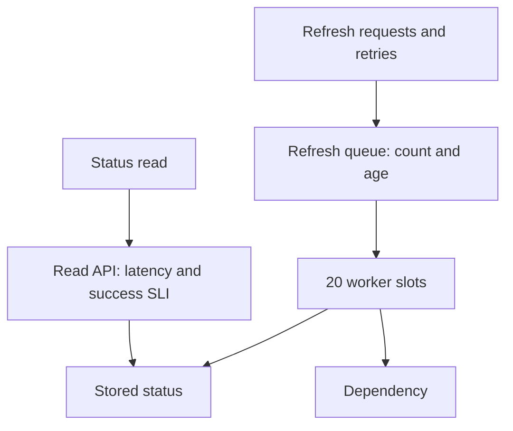
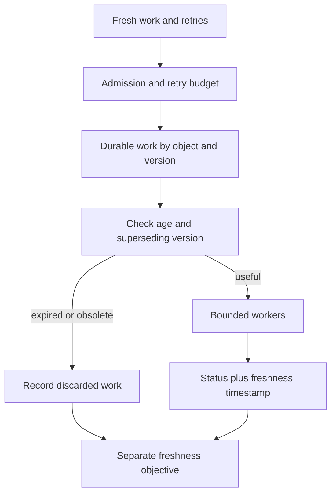

# Incident desk: the page cleared, the queue did not

[Curriculum](../../../../README.md) · [Set reliability objectives and recover from failures](../../README.md)

> “You are on call for a status API with an asynchronous refresh queue. At minute four the dependency recovers. The queue keeps growing. At minute six a paired-window page clears. Decide what to do next and what you can actually conclude about the cause.”

**Unseen constructed assessment.** Read [raw metrics](incident.csv) and [sample logs](incident.log); do not open [the assessor key](incident-assessor.md) until after your attempt. Nothing here is a provider's production telemetry. Prerequisite: [reliability arithmetic](README.md).

| Input | Contract |
|---|---|
| API SLO | 99.9% good eligible status reads; a good read succeeds within 500 ms |
| Queue | Refresh attempts, a different unit from reads; `queue_items` is end-of-minute state |
| Measurements | Rates are minute averages; latency is p95, not mean; logs are sampled |
| Page at minute 4 | Short = minutes 3–4, long = minutes 0–4, both burn ≥14.4 |
| Page at minute 6 | Short = minutes 5–6, long = minutes 2–6, same threshold |
| Success | Calculate both decisions; propose bounded recovery and name missing evidence |
| Excluded | Guessing an actual incident or a definitive root cause from incomplete telemetry |

## Baseline: two user-visible clocks

Take 35 minutes. First distinguish observation from inference. Then calculate the two burn windows, attempt amplification, queue growth in minutes 2–4, and drain time after minute 5. Do not substitute p95 for mean service time when estimating throughput; use measured completions for this dataset. Explain why “API reads recovered” and “work is fresh” are different claims.

**Worked format example, unrelated to the answer:** 10 bad of 2,000 eligible reads gives a 0.5% error ratio and burn 5 at a 99.9% SLO. Failure case: an empty window is unknown and must not silently satisfy an SLO.

## Change the requirements before opening the key

The oldest useful refresh may be 120 seconds old; expired work may be discarded, but newer jobs for the same object must survive. Draw where age is checked and how users see freshness. Predict whether faster consumers alone fix a dependency with no spare capacity.

Follow-ups: all new work is critical and arrives at 120/s while completion capacity is 100/s; then one of four teams refuses to disable its client retry loop. Quantify the deficit and propose an enforceable dependency boundary. Your plan must include a stop condition, a recovery-access owner, and the measurements that would reverse the action.

Submit your calculations and incident note before checking the key. This is an evidence exercise, not an executable distributed service. The neighboring arithmetic tests verify equations; the key scores reasoning and safe action independently.
