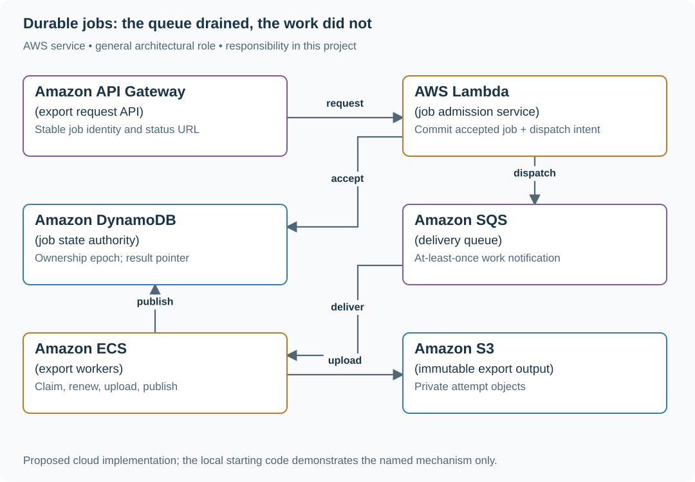

# Build restartable CSV export jobs

## Application background

An accountant clicks Export invoices in a billing dashboard. Producing the CSV might take a minute, so making the browser wait for the entire file is inconvenient. The API should instead return a job ID that the accountant can use to check progress.

A separate process called a worker reads the job, creates the file and marks it ready. The job record must remain available if either process stops. A repeated message must not let two workers publish conflicting results.

### Watch two workers attempt the same job



The numbers 1 and 2 identify successive owners of the same job, not two different exports. The diagram shows why checking ownership only when work starts is insufficient.

Durable means the accepted work survives a process restart. A lease gives one worker temporary ownership, and a fencing value lets storage reject a late result from an older owner.

## Your assignment

**Deliver:** Build an export request, a background worker and a status/download interface. Keep accepted work across restarts and prevent a worker that no longer owns the job from publishing its result.

**Required behavior:** POST /exports with a tenant-scoped request ID returns 202 plus a stable job URL after durable acceptance. GET /exports/{id} returns accepted, running, succeeded, failed or cancelled. Expose a download URL only after the current worker has saved a completed result record.

The required first milestone is a working local implementation of the behavior above. The numbered implementation steps define the scope. The cloud architecture is a later extension, not something the starter has already provisioned.

## Get the code and run the supplied example

The code is in the public [junior-to-staff repository](https://github.com/Soulful-Iris/junior-to-staff). Install Git and Python 3.12+. No AWS account or Python packages are required for this first run. If you already have a checkout, use it and skip cloning.

```bash
git clone https://github.com/Soulful-Iris/junior-to-staff.git
cd junior-to-staff
python3 examples/architecture-starts/durable_jobs.py
```

**Supplied file:** [`examples/architecture-starts/durable_jobs.py`](https://github.com/Soulful-Iris/junior-to-staff/blob/main/examples/architecture-starts/durable_jobs.py). You can also [read or download the source here](../../../../examples/architecture-starts/durable_jobs.py).

This program is a **mechanism demonstration**: it runs the small scenario in one process and prints the result. It is not an HTTP service, a complete application, or an AWS deployment. A successful run demonstrates this mechanism only. It does not establish the workload or failure guarantees of the application you will build.

**Example output from the supplied run:**

Generated IDs and timestamps may differ. Compare the state transitions and outcomes.

```text
published
stale publication rejected
Visible result: job7/5/result new worker bytes
```

### Set up your implementation workspace

Create `work/durable-jobs/` in your checkout (or use a separate repository). Copy the supplied mechanism into that directory as `mechanism.py`, then extract its state transitions into functions you can call from your implementation. The record and module names below describe what you must implement. They are not a promise that files with those names already exist. Keep a `README.md` beside your implementation with its exact run commands and observed results.

## Local components and state to implement

This table names the records, interfaces or decision inputs for your deliverable. Unless a name is explicitly linked to supplied source above, it is something you create. Implement the local state transitions first, then connect the HTTP, storage or worker boundaries required by the steps.

| Record / module | Key or interface | Responsibility |
|---|---|---|
| jobs | tenant,request_id,job_id,state,epoch | Durable status and ownership authority. |
| attempt_objects | job_id/epoch/checksum | Immutable bytes. Uploading is not publishing. |
| result_pointer | job_id → object_key,checksum,size | Updated only by the current ownership epoch. |

## Implement the assignment

### 1. Accept durably

Commit job identity and dispatch intent in one database transaction. A lost response followed by the same request ID returns the original job. Queue publication happens from the outbox. A queue message is a request to advance a job, not its authoritative status.

### 2. Claim and renew ownership

Store an incrementing epoch with lease expiry. Claim using a conditional update. Renew only the matching epoch. SQS visibility reduces concurrent work but cannot prevent every duplicate. A worker must stop publishing if renewal or the conditional ownership check fails.

### 3. Publish an immutable result

Upload to an attempt-specific object key. Conditionally write succeeded and the object pointer under the current epoch. Acknowledge the queue message after that commit. If redelivered, read completed state and acknowledge without generating another visible result.

### 4. Operate a bounded service

Reject new work with Retry-After once admitted backlog exceeds the product’s wait budget. Add cancellation and tenant fairness. Garbage-collect unreferenced attempt objects only after active leases and retry windows. Authorize current access when issuing a download.

## Demonstrate the completed local result

| Action | Expected visible result |
|---|---|
| Run the starting program | Epoch 5 publishes. The late epoch 4 attempt is rejected. |
| Kill the worker after upload | A retry may produce an orphan object, but users see one committed result. |
| Limit the pool to 50 workers | At 500 arrivals/min the oldest-job age grows. Admission eventually closes at the declared bound. |

**Handoff:** In your implementation README, include the start command, one successful operation, the failure case above and the resulting stored state or decision. State which dependencies are simulated. Someone with a fresh checkout should be able to reproduce this without your chat history.

## Workload assumptions and capacity decisions

These are constructed exercise assumptions. The stated workload is a design target. The local demonstration does not establish that throughput. Use the [estimation constants](../../../01-code/01-problem-solving/estimation-constants.md) to check units before choosing capacity.

| Input or objective | Calculation / consequence |
|---|---|
| 500 exports/min. 20 seconds mean service | 500 / 60 × 20 ≈ 167 busy worker slots at steady state, before spare capacity. |
| 50 worker slots | Capacity is 150/min. Backlog grows 350/min under the stated ordinary load. |
| 40,000 requests in one minute | Admission must reject or defer beyond an explicit backlog budget. An unbounded queue is not extra processing capacity. |

## Map the local implementation to AWS

**Deployment status: local only.** Running the supplied command creates no AWS resources and configures no cloud connections. The diagram is a proposed deployment of the completed application. Each box needs either a deployed runtime, a provisioned service or an explicitly external dependency.

Read the diagram by following the arrows from the entry point: application code accepts the request or event, the state owner commits it, and any worker produces the later result. The table ties those roles to code and adapter work. Multiple boxes do not imply multiple Python files already exist.



SQS can redeliver, so DynamoDB owns job state and the publication condition. ECS accommodates longer exports. Short bounded jobs could run in Lambda. S3 stores complete bytes, while the conditional result pointer decides which bytes users receive.

| Local responsibility | Cloud destination and role | Implementation still required |
|---|---|---|
| Local HTTP boundary or the endpoint you will add | Amazon API Gateway: export request API | Create routes and an integration. Translate requests and responses and configure identity validation. |
| Python operation or worker function | AWS Lambda: job admission service | Write a Lambda event adapter, package its dependencies and give its role only the required resource actions. |
| Local dictionary, SQLite records or state model | Amazon DynamoDB: job state authority | Design partition/sort keys and write a storage adapter with conditional updates or transactions. Python state and SQL are not uploaded as a database. |
| Local pending-work collection | Amazon SQS: delivery queue | Publish committed job intent, consume messages and persist deduplication/ownership state. Add visibility, retry and dead-letter handling. |
| Application or worker process | Amazon ECS: export workers | Build a container and task definition. Supply configuration, task roles and graceful shutdown behavior. |
| Local file, object fixture or exported payload | Amazon S3: immutable export output | Implement upload/download and metadata adapters, scoped access, object naming, retention and incomplete-upload cleanup. |

### Provision resources, then connect the application

| Resource or boundary | Initial configuration and reason |
|---|---|
| DynamoDB jobs | Conditional claims/publication. Durable request identity. Strongly consistent ownership reads where required. |
| SQS | Start visibility at 60 s for 20 s average work and renew for longer jobs. Set a finite redrive policy and a DLQ repair procedure. |
| ECS workers | Bound worker count by database and export-source capacity, not queue depth alone. Keep job deadlines below lease-renewal safety margins. |
| S3 | Private immutable attempt keys. Result pointer stored separately. Lifecycle only for proven orphan/expired output. |

Use one disposable AWS environment for the cloud exercise. Put the named resources in `infra/template.yaml` or your existing IaC tool, pass resource IDs through configuration, and scope each runtime role to its own tables, buckets and queues. The diagram is a design to implement. It is not a claim that these resources have been deployed. Record the commands you used to deploy and remove the exercise resources.

For concrete provisioning commands, configuration wiring and cleanup, use the [AWS foundation guide](../../../../examples/architecture-starts/infra/README.md). It includes a deployable table/queue/object-storage foundation and explains which application and service adapters you still implement.

A provisioned queue or table does not make the local program use it. Configure resource IDs in the deployed runtime, replace the local adapter, and replay the same successful and failing operation against that runtime. Record the deployed commit and observable result, then remove the disposable resources using your infrastructure tool.

## Extend the design after the baseline works


Add data erasure while an export is running. Define how the worker discovers cancellation, how the current pointer is revoked, and how object cleanup is proven without assuming that queue cancellation stops an already running process.

<details>
<summary>Additional design cases, alternatives and original source notes</summary>


Assume 500 ordinary exports/minute, 20-second average processing time, and a 60-second API request timeout. The job should survive a worker crash. Accepted means durably recorded, not completed.

| Input / state | Expected result |
|---|---|
| Client retries create after lost reply with same key | One logical job. Stable status URL |
| Worker writes file, then crashes | Later worker checks committed output. Does not send two invoices/files |
| Worker is stuck forever | Visibility expires. Bounded retries and DLQ plus an operator repair path |
| 40,000 requests in 60 seconds | Admit within capacity or return an explicit overload outcome. Backlog is measurable |

## Keep job truth separate from message delivery

Create a durable job record keyed by customer and request identity. Record ACCEPTED, RUNNING, SUCCEEDED or FAILED with attempt/lease information. Queue messages ask workers to make progress. Status comes from the job store. Write each attempt to an **immutable** object key such as `job/attempt-id/checksum`. Never overwrite a shared `job/result.csv`. A delivery may repeat while an earlier worker is running. Publish `{object_key, checksum, size}` together with SUCCEEDED in a conditional job-store update requiring the current ownership generation. Readers follow only that committed pointer, not a guessed object name or listing. Reject stale pointer updates even when their object upload succeeded. If a side effect cannot be idempotent, reconcile it explicitly.

### Pause the old worker at the dangerous boundary

| Step | Authoritative result | Object state |
|---|---|---|
| A claims generation 4, then pauses | RUNNING, generation 4 | No published output |
| Lease expires. B claims generation 5 | RUNNING, generation 5 | B writes immutable object B |
| B publishes under generation 5 | SUCCEEDED → B, checksum B | B is reachable |
| A resumes and uploads object A | Still SUCCEEDED → B | A is an orphan. It cannot overwrite B |
| A tries generation-4 publication | Conditional update fails | Readers still obtain B’s bytes |

Crash after uploading but before publishing leaves a complete orphan, not a
partial result. A retry first reads current job truth. A duplicate completed
message is acknowledged without another effect. Garbage collection excludes
committed pointers and active attempts, and waits beyond the retry/lease window.
Recheck current read permission before issuing an output download.

The bars show a trend, not a measured forecast. At the stated steady rates the backlog grows by **350 jobs each minute**. After ten minutes that is 3,500 waiting jobs before cancellations, retries, or changes in service time. An overload policy must address admitted work before the oldest age runs away.

## Put the AWS names on the boxes

**Why these boxes, and what changes the choice:** SQS buffers accepted jobs but redelivers on a lost acknowledgement. DynamoDB stores stable job IDs and conditional status. S3 holds private immutable attempt objects. The job-store generation check publishes the winning pointer. Existence alone does not prove ownership or the right bytes. ECS can replace Lambda for jobs that exceed its duration or memory envelope.


**Senior follow-up:** At 500/min and 20 seconds per job, Little's-law concurrency estimate is roughly 167 occupied worker slots for zero queue growth at steady load. If the system can run only 50 tasks, derive the queue growth and make the wait visible. Apply per-tenant fairness and a bounded retention/expiry policy.

**Staff follow-up:** A customer requests data deletion while an export waits or runs. Decide which step authorizes the read, how to revoke or cancel the output, and what audit record survives deletion without retaining private data. Show the repair path after an entire Region disappears.

**Practice artifact:** State machine, duplicate timeline, backlog calculation, cancellation test, and operations panel with oldest-job age, retry count, completion lag, and DLQ volume.

**AWS translation:** SQS standard queues can redeliver and occasionally reorder. Tune visibility timeout, DLQ policy, and worker concurrency. Store authoritative jobs in DynamoDB/RDS and outputs in private S3. Read [SQS standard delivery](https://docs.aws.amazon.com/AWSSimpleQueueService/latest/SQSDeveloperGuide/standard-queues.html) and [visibility timeout](https://docs.aws.amazon.com/AWSSimpleQueueService/latest/SQSDeveloperGuide/sqs-visibility-timeout.html).

**Source note:** Constructed exercise. Service delivery facts come from AWS documentation.

</details>
