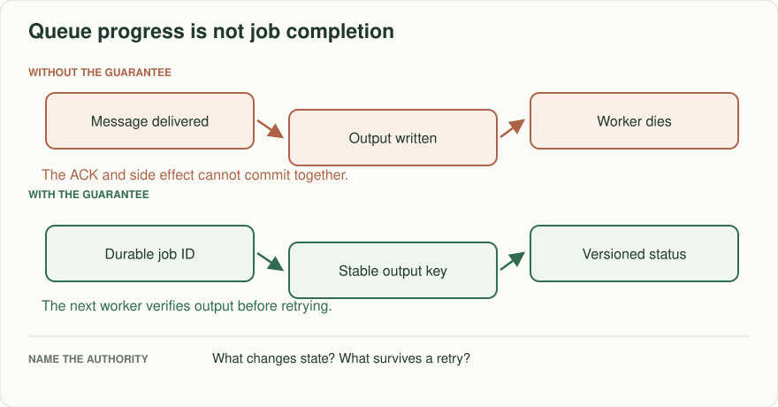
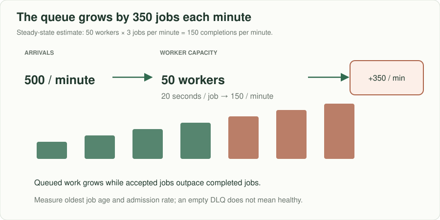
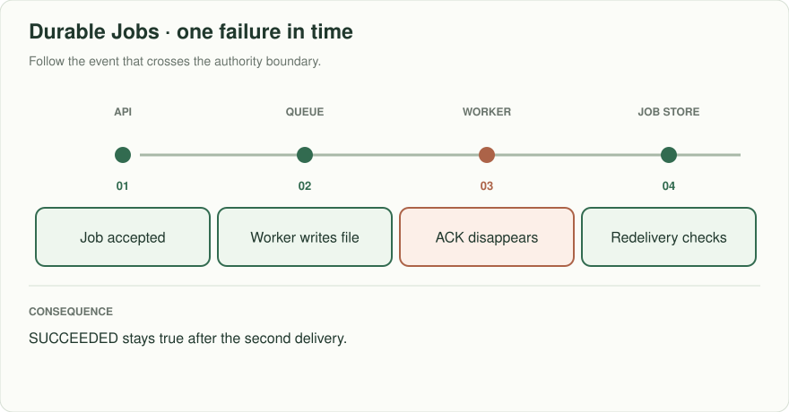
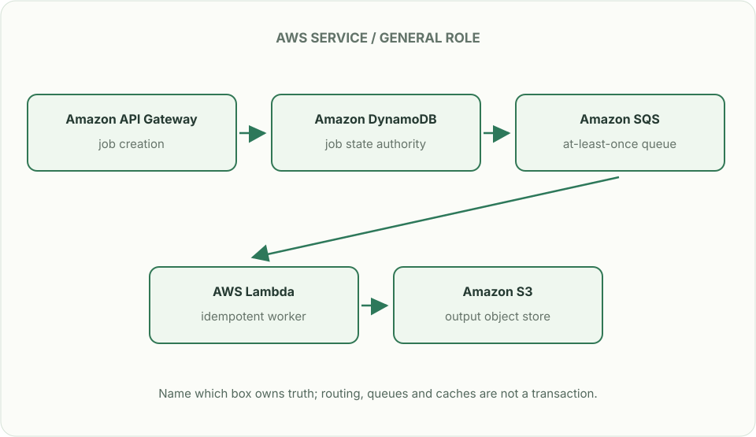

# Durable jobs: the queue drained, the work did not

> **Interviewer:** “Users request a CSV export. The API returns ‘accepted’ and puts a job on a queue. A worker writes the file, then dies before acknowledging the message. A second worker receives it. Later one customer sends 40,000 exports in a minute. Make completion, retries, and overload observable.”

Assume 500 ordinary exports/minute, 20-second average processing time, and a 60-second API request timeout. The job should survive a worker crash; accepted means durably recorded, not completed.

| Input / state | Expected result |
|---|---|
| Client retries create after lost reply with same key | One logical job; stable status URL |
| Worker writes file, then crashes | Later worker checks committed output; does not send two invoices/files |
| Worker is stuck forever | Visibility expires; bounded retries and DLQ plus an operator repair path |
| 40,000 requests in 60 seconds | Admit within capacity or return an explicit overload outcome; backlog is measurable |

## Keep job truth separate from message delivery

Create a durable job record keyed by customer and request identity; record ACCEPTED, RUNNING, SUCCEEDED or FAILED with attempt/lease information. Queue messages ask workers to make progress; status comes from the job store. Write each attempt to an **immutable** object key such as `job/attempt-id/checksum`; never overwrite a shared `job/result.csv`. A delivery may repeat while an earlier worker is running. Publish `{object_key, checksum, size}` together with SUCCEEDED in a conditional job-store update requiring the current ownership generation. Readers follow only that committed pointer, not a guessed object name or listing. Reject stale pointer updates even when their object upload succeeded. If a side effect cannot be idempotent, reconcile it explicitly.

### Pause the old worker at the dangerous boundary

| Step | Authoritative result | Object state |
|---|---|---|
| A claims generation 4, then pauses | RUNNING, generation 4 | No published output |
| Lease expires; B claims generation 5 | RUNNING, generation 5 | B writes immutable object B |
| B publishes under generation 5 | SUCCEEDED → B, checksum B | B is reachable |
| A resumes and uploads object A | Still SUCCEEDED → B | A is an orphan; it cannot overwrite B |
| A tries generation-4 publication | Conditional update fails | Readers still obtain B’s bytes |

Crash after uploading but before publishing leaves a complete orphan, not a
partial result. A retry first reads current job truth; a duplicate completed
message is acknowledged without another effect. Garbage collection excludes
committed pointers and active attempts, and waits beyond the retry/lease window.
Recheck current read permission before issuing an output download.

The bars show a trend, not a measured forecast. At the stated steady rates the backlog grows by **350 jobs each minute**; after ten minutes that is 3,500 waiting jobs before cancellations, retries, or changes in service time. An overload policy must address admitted work before the oldest age runs away.

## Put the AWS names on the boxes

**Why these boxes, and what changes the choice:** SQS buffers accepted jobs but redelivers on a lost acknowledgement. DynamoDB stores stable job IDs and conditional status; S3 holds private immutable attempt objects; the job-store generation check publishes the winning pointer. Existence alone does not prove ownership or the right bytes. ECS can replace Lambda for jobs that exceed its duration or memory envelope.

Read the smaller label under each service first: it names the architectural job. Then ask whether that service supplies the guarantee in the problem, or simply moves work to the next box.

**Senior follow-up:** At 500/min and 20 seconds per job, Little's-law concurrency estimate is roughly 167 occupied worker slots for zero queue growth at steady load. If the system can run only 50 tasks, derive the queue growth and make the wait visible. Apply per-tenant fairness and a bounded retention/expiry policy.

**Staff follow-up:** A customer requests data deletion while an export waits or runs. Decide which step authorizes the read, how to revoke or cancel the output, and what audit record survives deletion without retaining private data. Show the repair path after an entire Region disappears.

**Practice artifact:** State machine, duplicate timeline, backlog calculation, cancellation test, and operations panel with oldest-job age, retry count, completion lag, and DLQ volume.

**AWS translation:** SQS standard queues can redeliver and occasionally reorder; tune visibility timeout, DLQ policy, and worker concurrency. Store authoritative jobs in DynamoDB/RDS and outputs in private S3. Read [SQS standard delivery](https://docs.aws.amazon.com/AWSSimpleQueueService/latest/SQSDeveloperGuide/standard-queues.html) and [visibility timeout](https://docs.aws.amazon.com/AWSSimpleQueueService/latest/SQSDeveloperGuide/sqs-visibility-timeout.html).

**Source note:** Constructed exercise; service delivery facts come from AWS documentation.
