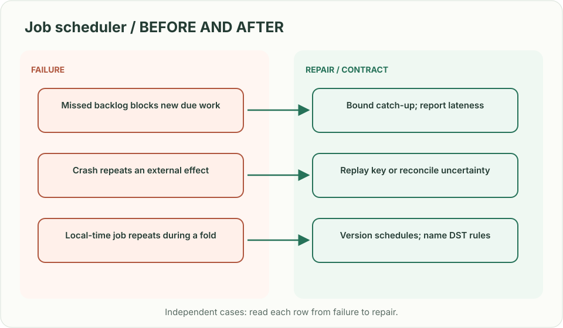
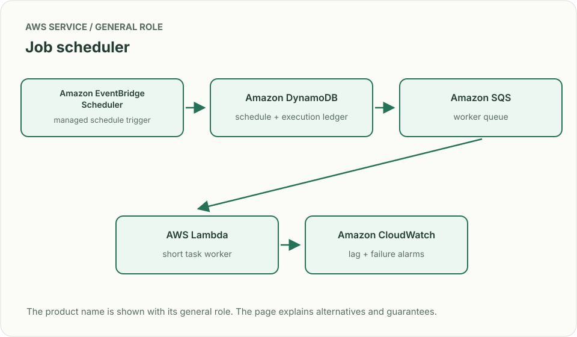
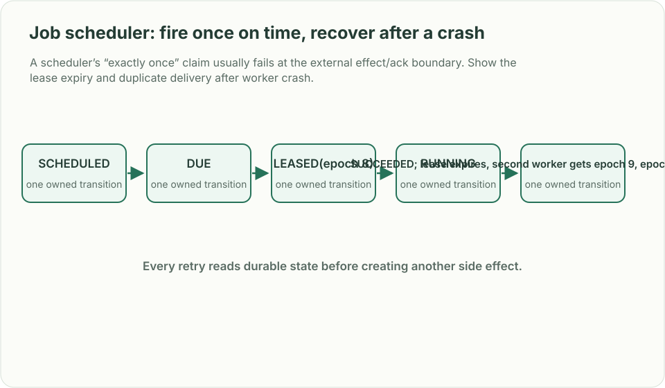

# Job scheduler: fire once on time, recover after a crash

> **Interviewer:** “Customers schedule one-time and recurring jobs. Workers can crash after doing the work but before acknowledging it. Schedule accuracy is one minute; a retry must not silently perform a financial action twice.”

This is a **commonly listed system-design interview prompt** with a concrete practice contract. Assume 10,000 jobs/s at peak, 50 million future schedules and execution history retained for one year. Clarify service guarantees and a first version before filling the board with services.

| Situation | Input / condition | Expected result |
|---|---|---|
| Due now | Job time = 12:00; worker polls 12:00:03 | Dispatch within stated one-minute tolerance. |
| Worker crash | Side effect committed, ACK lost | Redelivery uses idempotency key or reconciles result. |
| Recurring job | Hourly schedule around DST | State whether schedule follows UTC or local wall clock. |
| Cancel race | Cancel arrives as job is claimed | One versioned state transition decides whether execution may start. |

## Think from the contract to the boxes

Separate the schedule definition, due-time index, execution record and worker queue. Partition by due-time bucket to find work efficiently, but spread hot minutes and large tenants. Claim a job with a lease and fencing/version token; if a worker outlives the lease, it cannot overwrite a newer result. Exactly-once side effects need downstream idempotency or reconciliation, not a queue label.

**First diagram:** Draw scheduled → due → leased → running → succeeded/retry/dead-letter states and mark the crash window.

| AWS service / general role | Why it fits this design | Alternative and when it fits better |
|---|---|---|
| **Amazon EventBridge Scheduler** / managed schedule trigger | Use for service-managed schedules with supported precision and scale. | Custom time-bucket index when per-tenant fairness or finer semantics are required. |
| **Amazon DynamoDB** / schedule + execution ledger | Store schedule versions, leases and idempotent state. | Aurora for transactional complex recurring rules. |
| **Amazon SQS** / worker queue | Buffer due executions with retry and DLQ handling. | Kinesis for ordered event streams rather than independent tasks. |
| **AWS Lambda** / short task worker | Run bounded jobs with simple concurrency controls. | ECS for long jobs or custom worker pools. |
| **Amazon CloudWatch** / lag + failure alarms | Track due-to-start delay, oldest due item and retry outcomes. | Existing telemetry system with the same latency denominator. |

Service choice follows the contract: the box label gives the generic job, while the table explains the AWS product and a reasonable substitute. Name which component owns durable truth, where retries happen, and the guarantee each managed service does **not** provide by itself.

## Pressure-test the design

**Follow-up: A scheduler’s “exactly once” claim usually fails at the external effect/ack boundary. Show the lease expiry and duplicate delivery after worker crash.**

**Senior expectation:** A 10-minute backlog follows an outage. Calculate drain capacity, prioritize overdue/tenant work, and avoid retrying a dependency already saturated.

**Staff expectation:** Thousands of teams share the scheduler. Set noisy-neighbor quotas, migration and versioning rules, service SLOs, and a contract for jobs that cannot be safely retried.

**Practice artifact:** Draw scheduled → due → leased → running → succeeded/retry/dead-letter states and mark the crash window. Then trace every row in the table, draw one failure, and state what the customer observes. Suggested rehearsal: 35 minutes design, 10 minutes to challenge the guarantees.

**Evidence and origin:** The current community interview-question catalog lists a distributed job-scheduler prompt at Robinhood, DoorDash, NVIDIA, Airbnb and other companies; the listed interview dates are not supplied. The entry does not show the interview date and is not a verified company rubric. The prompt contract, workload, outcomes, diagrams and solution here are original practice material. Treat company tags as reported sightings, not a prediction of your interview loop.

**Interview report listing:** [Open the community question entry](https://www.hellointerview.com/community/questions/job-scheduler-cron-history/cm7w828yv00sejmejlmofwtvp).
