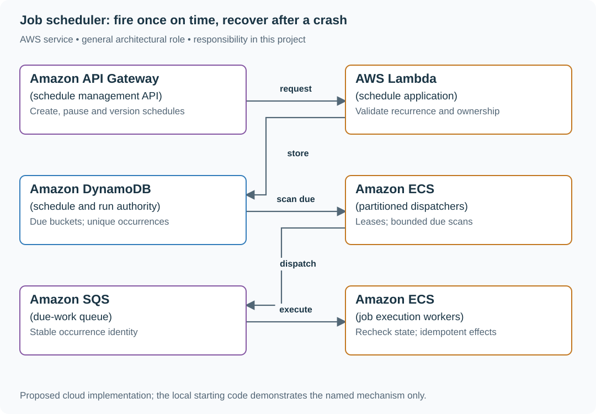

# Schedule reports without duplicate logical runs

## Application background

A customer wants a sales report every weekday at 09:00 in their local time zone. They save that preference once. Each morning, the application must turn it into one specific report run with its own progress and result.

The saved preference is the schedule. Tuesday's report is an occurrence of that schedule. Restarting the scheduler or receiving the same queue message twice must not accidentally create two Tuesday reports.

### Example walkthrough

| Action | Expected behavior |
|---|---|
| Save a weekday 09:00 schedule for Europe/London | Record the local time and time zone. |
| Tuesday 09:00 becomes due | Create one run identified by the schedule and that occurrence. |
| The scheduler restarts and finds Tuesday due again | Find the existing run instead of creating another one. |

Keep schedule identity separate from run identity. Retries are attempts to finish the same run, not new scheduled occurrences.

## Your assignment

**Deliver:** Build saved schedules, records for their individual runs and a process that starts due work. Show that a restart does not create two runs for the same occurrence.

**Required behavior:** POST /schedules stores a timezone-aware schedule and version. Each due occurrence has identity (schedule_id, version, scheduled_at). Pausing a schedule stops new admissions. It does not undo an external action, such as an email, that already occurred.

The required first milestone is a working local implementation of the behavior above. The numbered implementation steps define the scope. The cloud architecture is a later extension, not something the starter has already provisioned.

## Get the code and run the supplied example

The code is in the public [junior-to-staff repository](https://github.com/Soulful-Iris/junior-to-staff). Install Git and Python 3.12+. No AWS account or Python packages are required for this first run. If you already have a checkout, use it and skip cloning.

```bash
git clone https://github.com/Soulful-Iris/junior-to-staff.git
cd junior-to-staff
python3 examples/architecture-starts/job_scheduler.py
```

**Supplied file:** [`examples/architecture-starts/job_scheduler.py`](https://github.com/Soulful-Iris/junior-to-staff/blob/main/examples/architecture-starts/job_scheduler.py). You can also [read or download the source here](../../../../examples/architecture-starts/job_scheduler.py).

This program is a **mechanism demonstration**: it runs the small scenario in one process and prints the result. It is not an HTTP service, a complete application, or an AWS deployment. A successful run demonstrates this mechanism only. It does not establish the workload or failure guarantees of the application you will build.

**Example output from the supplied run:**

Generated IDs and timestamps may differ. Compare the state transitions and outcomes.

```text
old-dispatcher created run
new-dispatcher existing run
[('report-7', 2, '2026-01-10T09:00:00Z', 'accepted')]
```

### Set up your implementation workspace

Create `work/job-scheduler/` in your checkout (or use a separate repository). Copy the supplied mechanism into that directory as `mechanism.py`, then extract its state transitions into functions you can call from your implementation. The record and module names below describe what you must implement. They are not a promise that files with those names already exist. Keep a `README.md` beside your implementation with its exact run commands and observed results.

## Local components and state to implement

This table names the records, interfaces or decision inputs for your deliverable. Unless a name is explicitly linked to supplied source above, it is something you create. Implement the local state transitions first, then connect the HTTP, storage or worker boundaries required by the steps.

| Record / module | Key or interface | Responsibility |
|---|---|---|
| schedules | id,version,next_due,time_zone,enabled | Customer intent and recurrence policy. |
| occurrences | schedule_id,version,scheduled_at | Unique logical run regardless of dispatcher retries. |
| leases | partition,epoch,expires_at | Dispatcher ownership. Stale owners cannot advance a partition checkpoint. |

## Implement the assignment

### 1. Implement one-time scheduling

Store UTC instants and an indexed next_due field. Query bounded due ranges and atomically create the unique occurrence plus delivery intent. Advance next_due only in the same transactional decision. A missed scan must be recoverable from durable state.

### 2. Handle recurrence explicitly

Store IANA timezone and local recurrence separately from computed UTC occurrences. Decide how a nonexistent daylight-saving time is skipped and which ambiguous occurrence is chosen. Editing a schedule creates a version so old messages cannot silently use new parameters.

### 3. Partition dispatch

Bucket near-term due times and shard each bucket by stable schedule hash. Lease partitions with incrementing epochs. Workers condition checkpoint updates on that epoch. Size buckets so an hour boundary does not send all work to one hot key.

### 4. Define overdue policy

Choose catch-up-all, latest-only or expire for each job type. Display scheduled time, admitted time and started time. A report may tolerate delay. A reservation-expiry action must check current state even if its timer fires late.

## Demonstrate the completed local result

| Action | Expected visible result |
|---|---|
| Run the starting program | Two dispatchers create one logical occurrence. |
| Pause dispatch for 60 seconds | Overdue age rises. Recovery follows the chosen catch-up/expiry policy. |
| Edit a schedule while a message waits | The worker identifies the old version and follows its documented cancellation rule. |

**Handoff:** In your implementation README, include the start command, one successful operation, the failure case above and the resulting stored state or decision. State which dependencies are simulated. Someone with a fresh checkout should be able to reproduce this without your chat history.

## Workload assumptions and capacity decisions

These are constructed exercise assumptions. The stated workload is a design target. The local demonstration does not establish that throughput. Use the [estimation constants](../../../01-code/01-problem-solving/estimation-constants.md) to check units before choosing capacity.

| Input or objective | Calculation / consequence |
|---|---|
| 10,000 due jobs/s at peak | A one-minute dispatcher outage creates 600,000 overdue occurrences before new arrivals. |
| 50 million future jobs | At 512 bytes each, about 25.6 GB of raw scheduling metadata before indexes and replicas. |
| One year of run history | Retain compact run evidence separately from payloads. Estimate from the actual average run rate, not peak. |

## Map the local implementation to AWS

**Deployment status: local only.** Running the supplied command creates no AWS resources and configures no cloud connections. The diagram is a proposed deployment of the completed application. Each box needs either a deployed runtime, a provisioned service or an explicitly external dependency.

Read the diagram by following the arrows from the entry point: application code accepts the request or event, the state owner commits it, and any worker produces the later result. The table ties those roles to code and adapter work. Multiple boxes do not imply multiple Python files already exist.



This design builds the scheduling index explicitly to expose dispatch ownership and occurrence identity. EventBridge Scheduler can remove substantial control-plane work for suitable workloads. It does not remove downstream idempotency or product decisions about late runs.

| Local responsibility | Cloud destination and role | Implementation still required |
|---|---|---|
| Local HTTP boundary or the endpoint you will add | Amazon API Gateway: schedule management API | Create routes and an integration. Translate requests and responses and configure identity validation. |
| Python operation or worker function | AWS Lambda: schedule application | Write a Lambda event adapter, package its dependencies and give its role only the required resource actions. |
| Local dictionary, SQLite records or state model | Amazon DynamoDB: schedule and run authority | Design partition/sort keys and write a storage adapter with conditional updates or transactions. Python state and SQL are not uploaded as a database. |
| Application or worker process | Amazon ECS: partitioned dispatchers | Build a container and task definition. Supply configuration, task roles and graceful shutdown behavior. |
| Local pending-work collection | Amazon SQS: due-work queue | Publish committed job intent, consume messages and persist deduplication/ownership state. Add visibility, retry and dead-letter handling. |
| Application or worker process | Amazon ECS: job execution workers | Build a container and task definition. Supply configuration, task roles and graceful shutdown behavior. |

### Provision resources, then connect the application

| Resource or boundary | Initial configuration and reason |
|---|---|
| DynamoDB | Separate future schedule lookup from occurrence identity. Conditional writes and transactional outbox publication are required. |
| ECS dispatchers | Multiple replicas, partition leases, bounded scan pages and clock-skew monitoring. |
| SQS + workers | Retries retain occurrence identity. Workers validate schedule version and use effect-specific idempotency. |
| EventBridge Scheduler alternative | Prefer a managed scheduler if its current limits, timing precision and cancellation semantics satisfy the product. Evaluate quotas before adopting at this scale. |

Use one disposable AWS environment for the cloud exercise. Put the named resources in `infra/template.yaml` or your existing IaC tool, pass resource IDs through configuration, and scope each runtime role to its own tables, buckets and queues. The diagram is a design to implement. It is not a claim that these resources have been deployed. Record the commands you used to deploy and remove the exercise resources.

For concrete provisioning commands, configuration wiring and cleanup, use the [AWS foundation guide](../../../../examples/architecture-starts/infra/README.md). It includes a deployable table/queue/object-storage foundation and explains which application and service adapters you still implement.

A provisioned queue or table does not make the local program use it. Configure resource IDs in the deployed runtime, replace the local adapter, and replay the same successful and failing operation against that runtime. Record the deployed commit and observable result, then remove the disposable resources using your infrastructure tool.

## Extend the design after the baseline works


Allow a customer to move a recurring schedule between timezones. Specify whether already materialized occurrences keep their original instant. Show the state and version boundary that prevents both versions from sending the same report.

<details>
<summary>Additional design cases, alternatives and original source notes</summary>


This is a **commonly listed system-design interview prompt** with a concrete practice contract. Assume 10,000 jobs/s at peak, 50 million future schedules and execution history retained for one year. Clarify service guarantees and a first version before filling the board with services.

| Situation | Input / condition | Expected result |
|---|---|---|
| Due now | Job time = 12:00. Worker polls 12:00:03 | Dispatch within stated one-minute tolerance. |
| Worker crash | Side effect committed, ACK lost | Redelivery uses idempotency key or reconciles result. |
| Recurring job | Hourly schedule around DST | State whether schedule follows UTC or local wall clock. |
| Cancel race | Cancel arrives as job is claimed | One versioned state transition decides whether execution may start. |

## Think from the contract to the boxes

Separate the schedule definition, due-time index, execution record and worker queue. Partition by due-time bucket to find work efficiently, but spread hot minutes and large tenants. Claim a job with a lease and fencing/version token. If a worker outlives the lease, it cannot overwrite a newer result. Exactly-once side effects need downstream idempotency or reconciliation, not a queue label.

### Define the occurrence before dispatch

An occurrence key is `(schedule_id, schedule_version, intended_fire_instant)`,
not a worker attempt ID. Store the timezone and recurrence rule that produced
that instant. For a wall-clock schedule, define spring gaps and autumn folds.
this exercise skips nonexistent local times and runs once at the first instant
for a repeated local time. A fixed UTC interval has different semantics.

| Race / outage | Chosen baseline contract |
|---|---|
| Trigger delivered twice | Conditional create of the occurrence and its dispatch outbox. One execution record |
| Schedule edited | New version governs future occurrences. Old pending occurrences are explicitly cancelled or retained by the edit request |
| Cancel races claim | Versioned transition decides admission. Cancelling a running job is cooperative, not an undo of a payment |
| Ten minutes missed | Caller chooses skip, coalesce-to-latest, or bounded catch-up. Record omitted occurrences rather than silently losing them |
| Retry is too old | Stop at the occurrence’s maximum retry age. Reconcile uncertain effects before any manual replay |

**Catch-up arithmetic:** at 10,000 arrivals/s, a ten-minute outage leaves
6,000,000 occurrences. With 12,000 useful completions/s and live arrivals still
at 10,000/s, spare capacity is 2,000/s: drain takes **3,000 seconds (50 minutes)**,
ignoring retries and service-time variation. At equal arrival/service rates the
backlog never drains. One-minute due-to-start accuracy is breached during this
recovery. Admission limits and misfire policy must say which work is deferred.

Rehearse a gap, a fold, duplicate dispatch, an edit/cancel race and that backlog
with new arrivals continuing. Count intended, executed, skipped and reconciled
occurrences separately from worker attempts.

**First diagram:** Draw scheduled → due → leased → running → succeeded/retry/dead-letter states and mark the crash window.

| AWS service / general role | Why it fits this design | Alternative and when it fits better |
|---|---|---|
| **Amazon EventBridge Scheduler** / managed schedule trigger | Use for service-managed schedules with supported precision and scale. | Custom time-bucket index when per-tenant fairness or finer semantics are required. |
| **Amazon DynamoDB** / schedule + execution ledger | Store schedule versions, leases and idempotent state. | Aurora for transactional complex recurring rules. |
| **Amazon SQS** / worker queue | Buffer due executions with retry and DLQ handling. | Kinesis for ordered event streams rather than independent tasks. |
| **AWS Lambda** / short task worker | Run bounded jobs with simple concurrency controls. | ECS for long jobs or custom worker pools. |
| **Amazon CloudWatch** / lag + failure alarms | Track due-to-start delay, oldest due item and retry outcomes. | Existing telemetry system with the same latency denominator. |

Service choice follows the contract: the box label gives the generic job, while the table explains the AWS product and a reasonable substitute. Name which component owns durable truth, where retries happen, and the guarantee each managed service does **not** provide by itself.

## Pressure-test the design

**Follow-up: A scheduler’s “exactly once” claim usually fails at the external effect/ack boundary. Show the lease expiry and duplicate delivery after worker crash.**

**Senior expectation:** A 10-minute backlog follows an outage. Calculate drain capacity, prioritize overdue/tenant work, and avoid retrying a dependency already saturated.

**Staff expectation:** Thousands of teams share the scheduler. Set noisy-neighbor quotas, migration and versioning rules, service SLOs, and a contract for jobs that cannot be safely retried.

**Practice artifact:** Draw scheduled → due → leased → running → succeeded/retry/dead-letter states and mark the crash window. Then trace every row in the table, draw one failure, and state what the customer observes. Suggested rehearsal: 35 minutes design, 10 minutes to challenge the guarantees.

**Evidence and origin:** The current community interview-question catalog lists a distributed job-scheduler prompt at Robinhood, DoorDash, NVIDIA, Airbnb and other companies. The listed interview dates are not supplied. The entry does not show the interview date and is not a verified company rubric. The prompt contract, workload, outcomes, diagrams and solution here are original practice material. Treat company tags as reported sightings, not a prediction of your interview loop.

**Interview report listing:** [Open the community question entry](https://www.hellointerview.com/community/questions/job-scheduler-cron-history/cm7w828yv00sejmejlmofwtvp).

</details>
