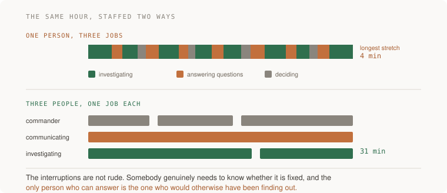

# 20 · Risk and incidents — five projects

> Staff tier · each one an afternoon · read [the section](README.md) first

Five projects, and the first four all end in a number: your detection time, the
longest uninterrupted stretch your investigator got, the count of "should" in
your postmortem, and the percentage of past action items that were actually
done. The fifth ends in a policy that has bound something.

The through-line is that incidents are the normal operating condition and the
difference between teams is entirely in the first hour and the month after. Both
of those are measurable, and almost nobody measures them.



---

### 1. The two timestamps

*You end up with a detection time in minutes for a real incident, and an honest answer to whether a human or a machine noticed first.*

**Build**

Take a real incident — recent, yours, or one you can reconstruct from logs.
Produce two timestamps: when the system broke, and when a human first knew.
Compute the gap. Then work out what would have made that gap smaller, and build
one of them.

**The thought process**

The first idea is that **the detection gap is usually the largest of the four
and is the only one you can shrink by work done in advance.** Mitigation and
repair happen under pressure with the clock running. Detection is bought
beforehand, cheaply, and it is where the leverage is.

Second, the single most important fact this project surfaces: **if a customer
told you, that number is the whole finding** and the rest of the postmortem is
detail. Being told by a user is not a small operational gap — it means your
instruments cannot see the thing your users experience, which is
[10 · Observability](../../02-senior/10-observability/)'s entire argument
arriving as a specific failure.

Third, why the two timestamps have to be separated deliberately: **a narrative
absorbs them.** Once somebody starts explaining what happened, "broke" and
"knew" merge into "we had an incident at about half past two", and the gap — the
most actionable number in the whole document — disappears into prose. Extract
both before anybody has a theory.

Fourth: **"broke" is often earlier than you think.** The moment the system
started failing for somebody is usually before the moment it started failing
loudly. Look for the first affected request, not the first alert, and be
prepared for the honest answer to be "we do not have the data to say", which is
itself the finding.

Fifth: **build one detection improvement, not five.** The action item everybody
writes is "add alerting", and the useful version names the signal, the
threshold, and what it would have said. One real alert that would have fired is
worth more than a list.

**How to organise the prompts**

```
Here are the logs, alerts and deploys from the incident window.

Build a timeline: what happened and when. Mark separately the moment
the system broke and the moment a human first knew.

Do not propose a cause yet.
```

The last line is the instruction. A cause offered early becomes the frame
everything else is read through.

```
For "broke": find the earliest evidence of user-visible failure, not
the first alert. If the data cannot support a time, say so plainly
rather than estimating.
```

```
For this failure, what check would have caught it before a user did?
Be specific: what would it measure, what threshold, and what would it
have said.

Then tell me what that check would cost — in noise as well as money.
```

The cost question is what stops you adding ten alerts nobody will trust.

```
Would that check have fired for the last three incidents too, or only
this one? A check that catches exactly one historical failure is a
memorial, not a detector.
```

**On AWS**

The detection gap has one answer that beats all the others for a user-facing
system: **CloudWatch Synthetics canaries.** A canary runs the actual user
journey — sign in, load the page, save the thing — on a schedule from outside
your system, and it fails when users would fail. That is a different statement
from any component-level metric, and it is very often the difference between a
machine noticing and a customer noticing.

For the reconstruction half, three sources do most of the work and they
complement each other. **CloudTrail** tells you what changed and who changed
it, which is how you correlate the break to a deploy or a console action.
**AWS Config**'s configuration timeline is the underused one: it shows a
resource's state at any past moment and what changed it, which answers "was
this security group always like that" in seconds. And **CloudWatch Logs
Insights** over the window gives you the first failing request, which is your
"broke" timestamp.

Do not skip the **AWS Health Dashboard**. Some of your incidents are AWS's, and
personal health events are delivered through **EventBridge** — wiring those
into wherever your team talks means an AWS-side issue announces itself rather
than being discovered by a two-hour investigation.

For the detection improvement, the shapes worth knowing: a **composite alarm**
so a page requires two signals to agree (see
[09 · Reliability](../../02-senior/09-reliability/)), **CloudWatch anomaly
detection** for metrics with a daily shape where a static threshold does not
work, and — the setting people miss — **treat missing data as breaching** on at
least your critical alarm, because a component that stopped emitting looks
identical to a healthy one and "no data" is the shape of the worst outages.

**What productionising it means**

Both timestamps are recorded for every incident, as a field rather than as
prose, so the gap can be tracked over time. A canary runs the real user journey
and its failure is a page. Health events arrive automatically. Detection time
is a number the team knows, like deploy frequency — and it is going down,
because that is the only evidence that any of this worked.

**The learning**

The most valuable number in an incident is the one nobody writes down: how long
it was broken before anybody knew. It is the largest gap, it is the cheapest to
shrink, and it is the one that is invisible in a narrative — which is why
extracting it mechanically, before any theory, is the first move.

**How you would know it is wrong**

- If you cannot produce both timestamps, that gap is unmeasured, which usually means it is large.
- Check who noticed. A customer telling you is the finding, not a detail in the timeline.
- Look for "broke" being the first alert rather than the first failure. Those are different times and the difference is the point.
- Ask whether your new check would have fired for the previous three incidents. If not, it is a memorial.
- Confirm your critical alarm treats missing data as breaching. Otherwise silence reads as health.

---

### 2. The game day, with the roles split

*You end up having broken something on purpose in daylight, with three named people doing three jobs, and a measured longest-uninterrupted-stretch for the person investigating.*

**Build**

Pick a failure. Schedule an hour. Assign three roles explicitly — one runs it,
one communicates outward, one investigates — and break the thing. Time how long
the investigator went without being interrupted. Write down everything that
surprised you.

**The thought process**

The first idea is why this is worth an hour of three people's time: **the first
time the failover is used should not be the day it is needed.** Every recovery
mechanism you have not exercised has something wrong with it, and the things
that surprise you in daylight are the things that would have surprised you at
3am with less light and fewer people.

Second, the role split, which is the part small teams resist: **one person
cannot do two of these jobs at once.** The commander decides what happens next.
The communicator answers "is it fixed yet" so the investigator is not
interrupted. The investigator investigates. The common failure is the best
engineer doing all three, badly, while being interrupted — and the interruptions
are not rude, they are somebody genuinely needing to know.

Third: **the commander should not have their hands in the system.** This is the
rule people break first and it is the most costly, because the person typing
cannot also be tracking time, deciding whether to escalate, and noticing that
the current theory has been wrong for twenty minutes.

Fourth, and this is the rule the game day exists to rehearse: **mitigate before
you diagnose.** Roll back, fail over, shed load, turn the feature off.
Understanding why happens afterwards, in daylight, with the site up. The
instinct to find the cause first is engineering curiosity arriving at exactly
the wrong moment, and it has to be rehearsed against because it is so natural.

Fifth: **measure something.** Time to mitigation, longest uninterrupted stretch
for the investigator, number of times the commander had to ask for information
twice. Without a number the game day becomes a story people tell rather than a
practice that improves.

**How to organise the prompts**

```
Design a game day for <my system>. Propose three failures of different
shapes, and for each: how to inject it, the stop condition, what the
correct mitigation is, and what I should measure.

I want failures where the right first move is to mitigate without
understanding.
```

That last line picks failures that actually rehearse the discipline.

```
Write the role card for each of the three roles: what this person
does, what they do NOT do, and the sentence they say when somebody
asks them to do the other job.

Keep each under six lines — nobody reads a role card during an
incident.
```

The "sentence they say" is oddly practical. "I am running this, ask me in ten
minutes" is a thing people need permission to say.

```
Write the runbook for the mitigation as numbered steps somebody who
has never done it can follow. Assume they do not have my shell
history.
```

```
Here is what happened: <notes>. What surprised us, and for each
surprise, is the fix a code change, a runbook change, or an alerting
change?

Sort them, because those go to different places.
```

**On AWS**

For injecting failures, **AWS Fault Injection Service** is the purpose-built
tool and the specific reason to prefer it over a script that kills things is
the **stop condition**: an experiment can be wired to a CloudWatch alarm that
halts and rolls back automatically. That is what makes running one outside a
sandbox defensible. It ships with scenarios for the failures you actually want
to rehearse, including an Availability Zone power interruption and cross-region
connectivity loss.

The highest-value single drill remains an **RDS failover** triggered on
purpose — `reboot-db-instance --force-failover` or `failover-db-cluster` — for
the reasons in [13 · Data at scale](../../02-senior/13-data-at-scale/): you
learn your real failover time, that your pool does not reconnect the way you
assumed, and that something caches DNS past its TTL.

For the roles and the process, **AWS Systems Manager Incident Manager** is the
AWS service almost nobody knows exists and it does exactly this job: response
plans, on-call schedules with escalation, automatic engagement from a CloudWatch
alarm, a chat channel created per incident, and a post-incident analysis
template afterwards. Even if you end up using something else, reading its model
is a fast education in what the pieces are.

And the runbook should be executable where it can be: an **SSM Automation
document** is a runbook that runs, with parameters and approval steps, which
means the mitigation is a button rather than a sequence somebody types
correctly at 3am. Runbooks that are prose decay; runbooks that execute get
tested every time they run.

**What productionising it means**

Game days are scheduled rather than heroic, with a different person injecting
each time. Roles are assigned before the incident, not negotiated during it,
and the on-call rota says who commands. Mitigations are runbooks, ideally
executable ones. Surprises are sorted into code, runbook and alerting changes
and land in the right backlogs. And the measurements are kept, so you can see
whether the next one is better.

**The learning**

Everything you have not rehearsed is a hypothesis, including your own
behaviour. The specific thing a game day teaches that nothing else does is how
badly one person performs at three jobs — you can be told it, and you will not
believe it until you have watched the investigator get interrupted every four
minutes by a question somebody genuinely needed answered.

**How you would know it is wrong**

- Time the investigator's longest uninterrupted stretch. If nobody measured it, the role split was nominal.
- Check whether the commander touched the system. If they did, you had two investigators and no commander.
- Ask whether anybody diagnosed before mitigating. That instinct needs rehearsing against, not condemning.
- Count the surprises. Zero means the failure was too gentle or too familiar.
- Ask who would run it if it happened right now, and whether that person knows.

---

### 3. The postmortem with no "should" in it

*You end up with a postmortem containing several contributing factors, no sentence in which a person should have done something differently, and a timeline with the detection gap in minutes.*

**Build**

Write a postmortem for a real incident. Timeline first. Contributing factors,
plural, none of them a person. Then search the document for the word "should"
and rewrite every instance as a property of the system.

**The thought process**

The first thing to be clear about is that **blameless is a method, not a
courtesy.** If people are protecting themselves you get a story rather than a
timeline, and the story will be wrong in exactly the places that matter most —
the moments where somebody was confused, or did the obvious thing that turned
out to be wrong. Those moments are the most informative content available and
they are the first casualty of blame.

Second: **"human error" is never a root cause; it is where the investigation
stopped.** The follow-up question is always available — what made that mistake
easy, and what made its consequence invisible? A person typed the wrong thing
into a prompt that did not confirm, against a system that applied it
immediately, with no diff shown and no undo. There are four system properties
in that sentence and none of them is a person.

Third, and this is why the section insists on plural: **real incidents have
several causes that only combine to matter.** Any one of them alone would have
been fine. Banning single-cause answers forces you to describe the system
rather than to find the weakest link, and the system is what you can change.

Fourth, the concrete test: **search for "should".** Every "somebody should have
noticed" marks a place where the investigation stopped early, and every one can
be rewritten. "The on-call should have checked the queue depth" becomes "queue
depth was not on the dashboard the alert linked to". The second version has a
fix in it.

Fifth: **the timeline goes first and the theory goes second.** Writing the
analysis before the timeline is complete means the timeline gets assembled to
support the theory, which is a thing that happens without anybody intending it.

**How to organise the prompts**

```
Given this timeline, list the contributing factors. Plural. For each
one, say what would have had to be different for the incident not to
happen, or to have been caught sooner.

Do not name a single root cause, and do not list anything a person
should have done differently.
```

Banning single-cause answers gets you the system; banning "somebody should
have" gets you the mechanism instead of the blame.

```
Here is my draft. Find every sentence that implies a person should
have acted differently, including the polite ones. Quote each, and
rewrite it as a property of the system.
```

The polite ones are the hard ones. "Additional care would have caught this" is
blame with a suit on.

```
For each contributing factor, classify the fix: code, configuration,
alerting, runbook, or process. Then tell me which one is least likely
to actually happen and why.
```

```
Read this as somebody who joins the team in a year and has no context.
What would they not understand? What jargon needs expanding?
```

A postmortem's second audience is the future, and that audience has no context
at all.

**On AWS**

The timeline is the part that is tedious to assemble by hand and largely
automatable on AWS.

**CloudTrail** gives you every API call with a timestamp and a principal, which
is how you find the deploy, the manual console change, or the scaling action
that coincided with the break. **AWS Config**'s configuration timeline shows a
resource's exact state before and after, which settles "was it always
configured that way" without argument. **CloudWatch Logs Insights** over the
window gives you the application's own account, and if you followed
[10 · Observability](../../02-senior/10-observability/) you can pivot from a
trace id to everything one request did.

**Systems Manager Incident Manager** produces a post-incident analysis with the
timeline partly pre-populated from the alarms and actions it recorded during
the incident, plus an action-item tracker attached to the incident rather than
living in a separate document — which is directly aimed at project 4's problem.

One AWS-specific contributing factor worth looking for every time, because it
is common and invisible: **a quota.** A **Service Quotas** limit reached during
the incident — Lambda concurrency, API Gateway throttling, an ENI limit — shows
up as throttling rather than errors and reads as "it got slow" in the timeline.
Check the quota metrics for the window before concluding it was load.

**What productionising it means**

Postmortems have a template with the timeline first and the two timestamps as
fields. They are written within days, while people remember, and the
factual-review pass is separate from the analysis pass. Contributing factors
are plural by policy. They are searchable and cross-referenced, because the
value of the second one is noticing it is the first one again. And they are
readable by somebody with no context, because that is who will read them.

**The learning**

The purpose of a postmortem is not to record what happened, it is to change
something — and the thing that most reliably prevents change is an explanation
that terminates at a person, because a person is not a mechanism you can fix.
Rewriting every "should have" into a system property is a mechanical trick that
produces a genuinely different document.

**How you would know it is wrong**

- Search for "should". Every instance is a place the investigation stopped early.
- Count the contributing factors. One means you found the weakest link, not the system.
- Check that the timeline came before the analysis. Otherwise it was assembled to fit.
- Give it to somebody with no context and ask what they do not understand.
- Look for a quota in the window. It is a common contributing factor that reads as load.

---

### 4. The action items nobody checked

*You end up with a percentage: how many action items from your last three postmortems were actually done. That number is your real learning rate.*

**Build**

Pull the action items from the last three postmortems. For each, find out
whether it was done. Compute the percentage. Then pick the most valuable
undone one, give it an owner and a date, and finish it — with a commit or a
config change to point at.

**The thought process**

The first thing this project does is embarrassing and useful: **most
organisations have a stack of excellent postmortems and an unexamined backlog
of their action items.** The quality of the writing is not the measure. The
percentage completed is, and almost nobody has computed it, which means almost
nobody knows their learning rate.

Second, why they do not get done, and it is structural rather than moral:
**the action item is created at the moment of maximum motivation and executed
at a moment of minimum.** By the time it reaches the top of a backlog, the
incident is four weeks old, the pain has faded, and there is something with a
launch attached competing with it. Nothing about that is fixable by caring more.

Third, what actually helps: **an owner and a date, and somebody who checks.**
Unowned, it is a wish. The checking is the part that is always missing — an
action item that nobody ever revisits is indistinguishable from one that was
never written.

Fourth, the triage that makes the list honest: **some action items should be
closed as "not doing", deliberately.** A list of forty open items from two
years of incidents is not a backlog, it is a monument. Going through and
explicitly declining some is what makes the remaining ones credible — and a
risk consciously accepted and written down is a legitimate engineering
position. The same risk unexamined is negligence, and the only difference is
that somebody decided.

Fifth: **prefer items that remove the possibility over items that add
vigilance.** "Add a check that prevents this configuration" beats "add a
warning to the runbook", which beats "be careful". The first survives everybody
leaving.

**How to organise the prompts**

```
Here are the action items from my last three postmortems: <list>.

For each, help me determine whether it was done — what evidence would
exist in the repository, the infrastructure, or the alerting config if
it had been.
```

Asking for the evidence rather than the status is what prevents this becoming a
self-report.

```
Compute the completion rate. Then group the undone ones by why they
were not done: too big, no owner, overtaken by other work, or nobody
actually believed in it.
```

The fourth category is real and worth admitting to.

```
For each undone item, classify it: does it remove the possibility of
the failure, detect it faster, or ask somebody to be more careful?

Rank them by that order, because that is the order of durability.
```

```
Which of these should I close as "not doing"? For each, write the
one-sentence justification that would make that an accepted risk
rather than an oversight.
```

**On AWS**

Two things make this trackable rather than aspirational.

**Systems Manager Incident Manager** attaches action items to the incident
record itself with owners, which removes the most common failure mode —
the item existing only inside a document. If you are not using it, the
equivalent discipline is that every action item becomes a ticket at the moment
it is written, with the incident linked, and the postmortem contains the ticket
ids rather than prose.

And for the "remove the possibility" class, which is the one worth prioritising:
on AWS these are usually **AWS Config** rules or **Organizations** service
control policies. An incident caused by a publicly readable bucket ends with
Block Public Access enforced at the account level, not with a note about being
careful. An incident caused by an untagged resource ends with a Config rule. An
incident caused by a change in an unapproved region ends with an SCP. Those are
action items that stay done, which is the property the other kinds lack.

The verification is also mechanical: a Config rule's compliance status *is* the
evidence that the action item was completed and is still true, which is
strictly better than a closed ticket. A closed ticket says somebody did
something once.

**What productionising it means**

Action items are tickets with owners and dates at the moment they are written.
Somebody reviews the open ones on a schedule — monthly is enough — and the
review includes closing things as "not doing" with a reason. The completion
rate is computed and known. And the preference for removing possibility over
adding vigilance is explicit, so the list does not fill up with warnings nobody
will read.

**The learning**

The output of an incident is not a document, it is a change — and the
percentage of action items completed is the only honest measure of whether your
organisation learns from failure. It is a number you can compute in an
afternoon, almost nobody has, and it is usually lower than everyone would
guess.

**How you would know it is wrong**

- Compute the percentage from evidence, not from ticket status. A closed ticket is not a fix.
- Check the last three postmortems, not the last one. One is an anecdote.
- Look for repeated action items across incidents. The same item written twice means it was never done.
- Count how many items remove possibility versus add vigilance. Vigilance items expire when people leave.
- Ask who reviews open items and when. If the answer is nobody, the writing was the whole activity.

---

### 5. The error budget policy that binds

*You end up with a written policy naming consequences, agreed in advance, that has actually been invoked at least once.*

**Build**

Write the error-budget policy: what happens at 75% of the budget spent, and
what happens when it is exhausted. Get it agreed by the people it would bind.
Then wait for it to trigger — or simulate the trigger — and follow it. Record
what happened when it bound something for the first time.

**The thought process**

The first idea is what makes this a staff tool rather than an SRE one: **an
error budget converts a recurring argument into a decision made once.** "Should
we ship faster or be more careful?" is a conflict between people with different
incentives, re-run every quarter, won by whoever is more persuasive that week.
With a budget, the answer is a number both sides already agreed to, and the
argument happens once, calmly, in advance.

Second, the requirement that makes it real: **the policy has to bind
somebody.** "When the budget is spent we will focus on reliability" is a
sentence. "When the budget is spent, feature work stops until it recovers" is a
policy. The honest question — and you should ask it of yourself first — is
whether you would actually do that in a week when something else is due.

Third, and it follows directly: **pick a target you would honour rather than
one that sounds serious.** 99.9% over thirty days is about 43 minutes of
allowed failure. 99.99% is four minutes, you will breach it in the first week,
and then you will stop looking — which is strictly worse than a target you keep.

Fourth: **the agreement has to happen while everyone is calm**, and with the
people who will be inconvenienced. A policy written by engineering and
announced to product is a policy that gets renegotiated at the exact moment it
first applies, which is the moment it was for.

Fifth, the test that the section gives: **a policy that has never been invoked
is a document, not a policy.** If your budget has never been exhausted, either
your target is too lax to mean anything or you have been lucky — and either way
you have no evidence the mechanism works. Simulating the invocation, in a
meeting, with the actual people, is a legitimate way to find out.

**How to organise the prompts**

```
My SLO is <target> over <window>. Convert that to a budget in minutes
and show the arithmetic.

Then write the error-budget policy as rules with thresholds and
consequences: what happens at 75% spent, and what happens at
exhaustion.
```

```
For each consequence, tell me what would have to be true
organisationally for it to actually happen. Who has to agree, and what
would they be giving up?

If a consequence needs somebody's permission that I do not have, say
so.
```

This is the prompt that separates a policy from a wish. Most drafts contain at
least one consequence the author cannot actually cause.

```
Now the objections. Write the case against this policy as the product
lead would make it, at their strongest. What are they right about?
```

```
Simulate the invocation: the budget is exhausted on a Tuesday and
there is a launch on Friday. Write the conversation — what I say, what
they say, and what the policy says happens.

Tell me where it breaks.
```

Rehearsing the difficult conversation before it exists is the most useful thing
here, because the policy will first apply at the least convenient possible
moment and that is not a coincidence.

**On AWS**

The budget has to be visible and the visibility has to be automatic, or the
policy depends on somebody remembering to look during a week when they would
rather not.

**CloudWatch Application Signals** has native SLO support — you define the
objective, and it tracks attainment and the remaining error budget, with
burn-rate alarms. That is the lowest-effort path from "we have an SLO" to "the
budget is a number on a dashboard everybody can see". If you built the SLI by
hand in [09 · Reliability](../../02-senior/09-reliability/), the budget is
metric math over your good and total counters, and the same dashboard applies.

Put the budget remaining on the dashboard people already look at — not a
reliability dashboard nobody opens — and alarm at 75% through **SNS** to the
channel where work gets discussed. The alarm firing at 75% is what makes the
conversation happen before the exhaustion rather than after.

Two AWS-shaped notes on scope. First, **not all of your budget is yours**: an
AWS service issue spends your budget too, and your policy should say whether
that counts. There is no right answer — counting it keeps the number honest
about user experience, excluding it keeps it actionable — but deciding in
advance prevents an argument at the worst time. **AWS Health** events are how
you attribute it.

Second, if you run multiple services, budgets are per user-facing journey, not
per component. A component at 99.5% behind a journey that is 99.95% is fine;
publishing per-component budgets produces a lot of numbers nobody can act on,
which is the observability cardinality mistake wearing reliability clothes.

**What productionising it means**

The budget is visible weekly, not during incidents, and on a dashboard people
already use. There is an alarm at 75%. The policy names consequences somebody
has agreed to, in writing, and those people were in the room. The treatment of
provider-caused unavailability is decided. And it has been invoked once — for
real or rehearsed — so you know what happens when it binds.

**The learning**

An error budget is not a reliability target, it is a permission to fail a
specific amount, and that inversion is what makes it useful politically. Its
value to a staff engineer is not the number — it is that a recurring argument
between two groups with different incentives becomes a decision made once, by
people who were calm, and applied by a rule rather than by whoever argues
better.

**How you would know it is wrong**

- Check whether the policy has ever been invoked. If not, it is a document.
- Ask yourself honestly whether you would freeze feature work. If the answer is no, adjust the target rather than the honesty.
- Compute the budget in minutes and say it out loud. Absurdly generous or impossibly tight both mean the target is wrong.
- Find out whether the people it binds were in the room when it was written. Announced policies get renegotiated at first contact.
- Decide whether provider outages count. Not deciding means arguing about it during one.

[Curriculum](../../README.md) · [Reliability and incident response](README.md)

Read [the section](failure-budgets.md) first. Work in this order; each project isolates one skill. Each link opens one complete build brief with a concrete contract, a baseline, two changed requirements, and the original staged AI prompts.

These are five project briefs, not five supplied applications. All prompts are constructed practice.

### 1. The SLO you would actually honour

[The SLO you would actually honour](projects/01-the-slo-you-would-actually-honour.md) — Keep the error-budget unit aligned with the SLI denominator.

### 2. The alert that fires when it matters and not before

[The alert that fires when it matters and not before](projects/02-the-alert-that-fires-when-it-matters-and-not-before.md) — Specify the Boolean alert state separately from recovery policy.

### 3. The retry storm you build on purpose

[The retry storm you build on purpose](projects/03-the-retry-storm-you-build-on-purpose.md) — Count actual attempts and protect the effect boundary.

### 4. Shedding the right thing

[Shedding the right thing](projects/04-shedding-the-right-thing.md) — Prioritize finite capacity without promising impossible service.

### 5. The failure that will not recover

[The failure that will not recover](projects/05-the-failure-that-will-not-recover.md) — Find and break the loop that prevents recovery.
