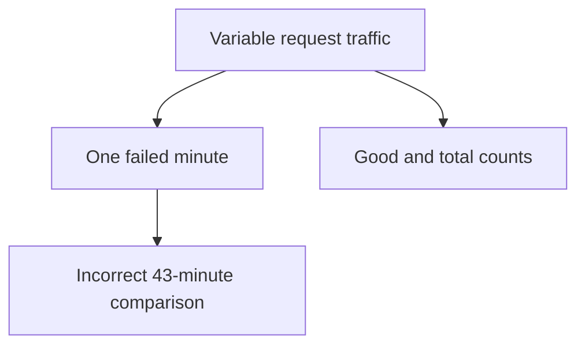
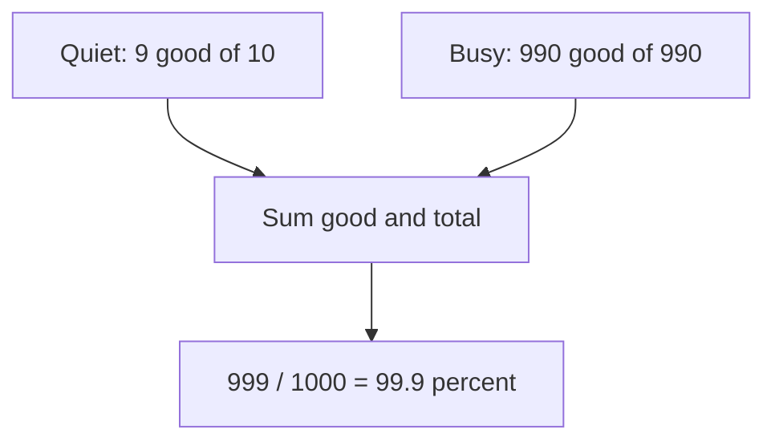
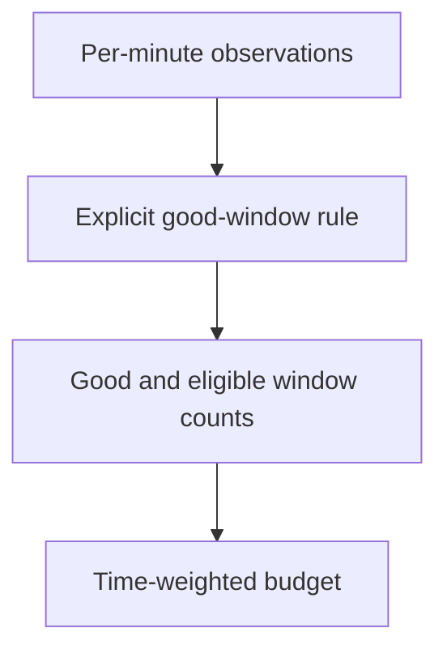

# 1. The SLO you would actually honour

[Curriculum](../../../README.md) · [Reliability and incident response](../README.md) · [Project index](../../../../indexes/projects.md)

## The reviewer's brief

> Product asks for 99.9% successful bookmark saves over thirty days. Traffic spikes during one failed minute. Decide whether the service met its objective and what work should pause. What exactly counts as an eligible request?

This is a **constructed practice brief**, not an attributed company question.
Prerequisites: [the section](../failure-budgets.md). This page is a build brief; it does not ship a runnable application. The original build and prompt sequence below defines the implementation checkpoints.

| Case | Exact input or workload | Expected outcome |
|---|---|---|
| Small example | 1,000,000 eligible requests, 10,000 failures concentrated in one minute; objective 99.9%. | Observed success 99%; budget 1,000 failures; 10× budget consumed. One minute does not imply the request SLO passed. |
| Boundary / failure | Zero eligible requests in a reporting interval. | Ratio is undefined; display no eligible traffic and use a separate missing-telemetry signal. |
| Scope | Request-weighted availability; time-weighted 43.2 minutes at 99.9% is a different SLI. | Explain any additional assumption before implementing it. |

<!-- project-expectation:start -->

## What you are expected to hand over

**The finished artifact:** Pick the single thing users care about most in your system — the list loading, the item saving — and define an SLO for it: a metric, a target, and a window. Then write the error-budget policy: what happens at 50% of the budget spent and at 75% spent (25% left).

Treat that sentence as a review contract, not an inspiration. A reviewable
submission contains all of the following:

- the narrow working slice or decision artifact described above, reproducible
  from a clean checkout with assumptions stated;
- captured proof of the normal flow **and** the boundary/failure row above;
- tests, probes, or metrics that can go red when the important guarantee breaks;
- a short decision record naming ownership, excluded scope, and the first
  operational limit; and
- a changed contract, diagram, and new evidence for each follow-up—not only a
  paragraph claiming the original design still works.

### How the review conversation gets harder

| Review gate | The interviewer changes | Expected response |
|---|---|---|
| Baseline | Run the small example from the table above. | Demonstrate the observable outcome end to end and identify which boundary owns it. |
| Failure | Reproduce the boundary/failure row above. | Show the failure before the fix, then prove the protected behavior without hiding the error. |
| Senior · Traffic is uneven | A quiet interval has 1/10 failures and a busy interval has 0/990. Is mean interval success 95%? Predict which boundary must change before opening the design. | No: total success is 999/1000=99.9%. Sum counts before dividing; averaging percentages gives the quiet interval unjustified weight. |
| Lead · Product wants a time SLO | The requirement becomes “the service is usable in 99.9% of one-minute windows.” What changes? State what evidence would make you reject your first design. | Define a good window and its probing/traffic rule, then count eligible windows. Thirty days contain 43,200 minutes, yielding 43.2 bad-window minutes at 0.1%; state discrete rounding and no-traffic treatment. |
| Evidence | A reviewer asks, “How do you know?” | Build in three stops: reproduce the small case and baseline failure; implement the protected boundary; then replay both changed requirements with captured outputs. |
| Handoff | The author is unavailable and the environment is new. | Another engineer can run, observe, break, and recover the artifact from the repository evidence. |

Before implementation, say the baseline invariant, the owner of each piece of
state, and what the user sees when the named dependency or assumption fails. That
five-minute explanation is part of the project: if it is vague, the build is not
ready to begin.

<!-- project-expectation:end -->

Before looking at the guidance, state the invariant in one sentence and trace the example. In interview practice, implement or sketch independently, then reveal the reasoning. During AI-assisted practice, use the prompts below and verify each checkpoint before the next request.

## Baseline and the failure to explain



Converting a request ratio directly to wall-clock minutes assumes traffic weighting that has not been established.

<details>
<summary>Reveal the approach and decisions</summary>

Define eligible/good counts, measurement boundary and exclusions before selecting the target. Compute budget as total×(1−target), then agree operational consequences. The invariant is a numerator and denominator with matching population, window and units.

</details>

## Follow-up 1 · Traffic is uneven

**Changed requirement:** A quiet interval has 1/10 failures and a busy interval has 0/990. Is mean interval success 95%? Predict which boundary must change before opening the design.

<details>
<summary>Expected reasoning and changed diagram</summary>

No: total success is 999/1000=99.9%. Sum counts before dividing; averaging percentages gives the quiet interval unjustified weight.



</details>

## Follow-up 2 · Product wants a time SLO

**Changed requirement:** The requirement becomes “the service is usable in 99.9% of one-minute windows.” What changes? State what evidence would make you reject your first design.

<details>
<summary>Expected reasoning and changed diagram</summary>

Define a good window and its probing/traffic rule, then count eligible windows. Thirty days contain 43,200 minutes, yielding 43.2 bad-window minutes at 0.1%; state discrete rounding and no-traffic treatment.



</details>

## Evidence to bring to review

Build in three stops: reproduce the small case and baseline failure; implement the protected boundary; then replay both changed requirements with captured outputs. Record commands, fixtures, and observed results in your implementation README. A diagram is a prediction until those checks run.

**Senior expectation:** Compute variable-traffic and empty-window cases correctly. **Additional lead scope:** Agree a budget policy with owners who can actually pause releases. Completion demonstrates practice evidence; it does not establish interview readiness or multi-team delivery experience.

## Supplied mechanism practice

- [Runnable reliability arithmetic and incident lab](../labs/reliability/README.md) — includes its own run command, fixtures and validation limits.

These exercises verify specific boundaries; completing their reference tests does not implement or assess the full project.

## Build and prompt sequence

*You end up with one number, a written policy, and an honest answer about whether you would keep to it.*

**Build**

Pick the single thing users care about most in your system — the list loading,
the item saving — and define an SLO for it: a metric, a target, and a window.
Then write the error-budget policy: what happens at 50% of the budget spent and at 75% spent (25% left).

**The thought process**

The first decision is **what to measure**, and the instinct is wrong. Engineers
reach for uptime of the process, which is a fact about your infrastructure.
Users experience whether their request succeeded quickly. So the metric is
almost always a ratio of good requests to total, measured at the edge, where
"good" is a definition you have to write down — and writing it down is most of
the work.

Second: **the target is a budget with units.** For this request-based SLI,
99.9% permits 0.1% of eligible requests to fail: 1,000 failures out of a million.
Ten thousand failures in one busy minute consume ten such budgets. The familiar
43.2 minutes over thirty days belongs to a time-weighted objective with a defined
good-window rule; it is not a valid conversion of arbitrary request traffic.
Choose a target based on user need, measured feasibility and agreed consequences.

Third, and this is where most SLOs quietly die: **the policy has to bind
somebody.** "When the budget is spent we will focus on reliability" is a
sentence. "When the budget is spent, feature work stops until it recovers" is a
policy — and the honest question is whether you, personally, would do that on a
week when something else is due. If the answer is no, pick a target you would
honour rather than one that sounds serious.

**How to organise the prompts**

```
Here is my system. Propose three candidate SLIs for the thing users care
about most, each as a precise ratio: what counts as good, what counts as
total, and where it is measured.

For each, tell me what it would MISS — a real user-visible failure that
this indicator would score as fine.
```

That last question is the one that matters. Every indicator has a blind spot,
and knowing it beforehand is the difference between a number you trust and one
you defend.

```
For the SLI I picked, implement it: a metric emitted at the edge, with
good and total counted separately so I can see both.

Do not compute the ratio in the application — emit the counts and let
the query do the arithmetic.
```

Why that constraint: a precomputed ratio cannot be re-sliced later. Counts can.

```
Write the error-budget policy as rules with thresholds and
consequences. Then tell me, for each consequence, what would have to be
true organisationally for it to actually happen.
```

**On AWS**

Emit the counts as **CloudWatch** metrics from the edge — if you are behind an
**Application Load Balancer** you already have `RequestCount` and
`HTTPCode_Target_5XX_Count`, which provide a useful partial view. Include
load-balancer failures, eligibility, latency and semantic outcomes as required;
target 5xx alone does not cover every failed user request. That is the "why this service" answer:
it exists already and it is measured outside your process, so it keeps working
when your process does not.

**CloudWatch metric math** computes the ratio at query time from the two counts,
which is exactly the split above. For anything richer — per-endpoint, per-user-
class — use a **metric filter** on structured logs, or emit your own metrics with
**EMF** (embedded metric format), which lets you write one structured log line
and have CloudWatch extract metrics from it. EMF is the underrated one here: one
write, both signals, no separate metrics client.

Watch the cost shape: custom metrics bill per metric per month, so an SLI split
by a high-cardinality dimension is a bill rather than an insight. Start with two
counters.

**What productionising it means**

The SLI is measured where the user is, not inside the process. The target is a
number you would honour and have written down. The policy names consequences
somebody has agreed to. And the budget is visible somewhere you look weekly, not
somewhere you look during an incident.

**The learning**

An SLO is not a reliability target, it is a *permission to fail a specific
amount* — and that inversion is what makes it useful. Without a budget, every
failure is a crisis and reliability work never ends; with one, you know whether
you have room.

**How you would know it is wrong**

- Break the thing on purpose and check the SLI moved. An indicator that does not notice your deliberate failure is measuring something else.
- Find a real user-visible failure your SLI scores as fine. There is always one — name it.
- Compute the request budget from eligible total and allowed error fraction. Test unequal traffic intervals and zero eligible requests; do not average interval ratios or substitute outage minutes.
- Ask whether the agreed owner can enforce the budget policy. Revise an unrealistic policy transparently; do not silently loosen the target after a breach.

---

[Back to the ordered project index](../projects.md)
