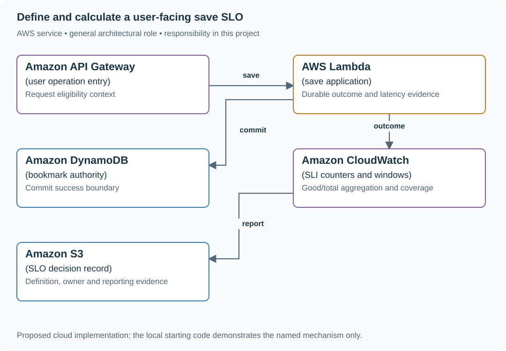

# Define and calculate a user-facing save SLO

## Application background

The reading-list team promises that users can save bookmarks reliably. To make that promise measurable, define what counts as one eligible save and what response counts as success. The target in this exercise is 99.9% successful eligible saves over thirty days.

Counting requests is different from counting minutes. One bad minute during a busy launch can affect more people than many quiet minutes. The calculation should represent the user operations covered by the promise.

### Example walkthrough

| Action | Expected behavior |
|---|---|
| Observe 10,000 eligible save requests | The 99.9% objective allows 10 unsuccessful requests in that population. |
| A busy minute contains 200 failures | Count those failed saves, not just one bad minute. |
| Some requests have no recorded outcome | Apply an explicit missing-data rule. |

An SLO is a service-level objective, the stated reliability target. The error budget is the amount of unsuccessful work allowed by that target over its measurement window.

### Sizing that affects this decision

For one million eligible requests and a 99.9% success objective, the allowed failed-request count is 1,000. An observed 10,000 failures uses ten times that budget and means 99% success. This is a request-based objective, so the annual downtime table is not its denominator.

These are exercise assumptions. The [estimation reference](../../../01-code/01-problem-solving/estimation-constants.md) explains the units and approximations. They do not establish the local demo's measured capacity.

## Your assignment

**Deliver:** Define which save requests count, what success means and how missing outcomes are treated. Calculate the request-based reliability result and remaining error budget.

**Required behavior:** Write the eligibility rule, success definition, measurement point and reporting window. The request-based SLO uses summed good and total requests, including declared timeout/server-failure outcomes. Missing telemetry and zero traffic are explicit states.

The primary deliverable is the report or operational procedure named above, backed by a reproducible local demonstration. Build the smallest supporting code needed to make that evidence visible.

## Get the code and run the supplied example

The code is in the public [junior-to-staff repository](https://github.com/Soulful-Iris/junior-to-staff). Install Git and Python 3.12+. No AWS account or Python packages are required for this first run. If you already have a checkout, use it and skip cloning.

```bash
git clone https://github.com/Soulful-Iris/junior-to-staff.git
cd junior-to-staff
python3 examples/architecture-starts/01_the_slo_you_would_actually_honour.py
```

**Supplied file:** [`examples/architecture-starts/01_the_slo_you_would_actually_honour.py`](https://github.com/Soulful-Iris/junior-to-staff/blob/main/examples/architecture-starts/01_the_slo_you_would_actually_honour.py). You can also [read or download the source here](../../../../examples/architecture-starts/01_the_slo_you_would_actually_honour.py).

This program is a **mechanism demonstration**: it runs the small scenario in one process and prints the result. It is not an HTTP service, a complete application, or an AWS deployment. A successful run demonstrates this mechanism only. It does not establish the workload or failure guarantees of the application you will build.

**Example output from the supplied run:**

Generated IDs and timestamps may differ. Compare the state transitions and outcomes.

```text
{'success': 0.99, 'allowed_failures': 1000.0, 'budget_used': 10.0}
{'success': 0.999, 'allowed_failures': 1.0, 'budget_used': 1.0}
{'state': 'no eligible traffic'}
```

### Set up your implementation workspace

Create `work/01-the-slo-you-would-actually-honour/` in your checkout (or use a separate repository). Copy the supplied mechanism into that directory as `mechanism.py`, then extract its state transitions into functions you can call from your implementation. The record and module names below describe what you must implement. They are not a promise that files with those names already exist. Keep a `README.md` beside your implementation with its exact run commands and observed results.

## Local components and state to implement

This table names the records, interfaces or decision inputs for your deliverable. Unless a name is explicitly linked to supplied source above, it is something you create. Implement the local state transitions first, then connect the HTTP, storage or worker boundaries required by the steps.

| Record / module | Key or interface | Responsibility |
|---|---|---|
| sli_event | operation,eligible,good,measurement_time | One agreed outcome per logical request. |
| slo_window | start,end,good,total,missing_coverage | Aggregated evidence and coverage. |
| budget_policy | objective,owner,response_actions | What the team changes when reliability degrades. |

## Implement the assignment

### 1. Choose the user operation

Define save success as a durable accepted bookmark within the agreed latency bound. State how invalid input, authentication failure, duplicate retries and dependency timeouts count. Do not remove failures from the denominator merely because they are inconvenient.

### 2. Instrument at the outcome boundary

Emit good and eligible counts where the request’s visible result is known. Reconcile client timeouts and server completion according to the chosen user-facing definition. Record telemetry coverage. A missing counter interval is not automatically zero errors.

### 3. Calculate the rolling window

Sum counts across instances and intervals before dividing. Handle counter resets and late data explicitly. Show budget remaining and consumption rate with the raw denominator so small samples are not mistaken for strong evidence.

### 4. Agree on an actionable response

Name owners for reliability work, risky feature exposure and dependency remediation when the budget is exhausted. Keep the SLO as an operating decision for the application. The supplied local example does not add a publishing gate.

## Demonstrate the completed local result

| Action | Expected visible result |
|---|---|
| Run the starting program | One million requests and 10,000 failures show 99% success and 10× budget use. |
| Use unequal traffic intervals | Sum counts before calculating the ratio. |
| Observe zero traffic | Display no eligible traffic rather than 100% success. |

**Handoff:** In your implementation README, include the start command, one successful operation, the failure case above and the resulting stored state or decision. State which dependencies are simulated. Someone with a fresh checkout should be able to reproduce this without your chat history.

## Workload assumptions and capacity decisions

These are constructed exercise assumptions. The stated workload is a design target. The local demonstration does not establish that throughput. Use the [estimation constants](../../../01-code/01-problem-solving/estimation-constants.md) to check units before choosing capacity.

| Input or objective | Calculation / consequence |
|---|---|
| 1,000,000 eligible requests. 10,000 failures | 99% observed success, not 99.9%. |
| 99.9% objective | Error budget is 1,000 failures. 10,000 failures consume ten times that budget. |
| Quiet interval 1/10 failures. Busy interval 0/990 | Overall failure rate is 1/1,000 = 0.1%, not the mean of interval percentages. |

## Map the local implementation to AWS

**Deployment status: local only.** Running the supplied command creates no AWS resources and configures no cloud connections. The diagram is a proposed deployment of the completed application. Each box needs either a deployed runtime, a provisioned service or an explicitly external dependency.

Read the diagram by following the arrows from the entry point: application code accepts the request or event, the state owner commits it, and any worker produces the later result. The table ties those roles to code and adapter work. Multiple boxes do not imply multiple Python files already exist.



The database commit helps define durable success, while the request outcome determines what the user experienced. A CloudWatch ratio is only meaningful after those semantics are agreed.

| Local responsibility | Cloud destination and role | Implementation still required |
|---|---|---|
| Local HTTP boundary or the endpoint you will add | Amazon API Gateway: user operation entry | Create routes and an integration. Translate requests and responses and configure identity validation. |
| Python operation or worker function | AWS Lambda: save application | Write a Lambda event adapter, package its dependencies and give its role only the required resource actions. |
| Local dictionary, SQLite records or state model | Amazon DynamoDB: bookmark authority | Design partition/sort keys and write a storage adapter with conditional updates or transactions. Python state and SQL are not uploaded as a database. |
| Local counters, timestamps and diagnostic output | Amazon CloudWatch: SLI counters and windows | Emit bounded metrics and logs, build the named operational view and configure retention and access. |
| Local file, object fixture or exported payload | Amazon S3: SLO decision record | Implement upload/download and metadata adapters, scoped access, object naming, retention and incomplete-upload cleanup. |

### Provision resources, then connect the application

| Resource or boundary | Initial configuration and reason |
|---|---|
| Metrics | Complete eligible counters with bounded labels and reset-aware aggregation. |
| Definition | Version changes to eligibility/latency rules. Do not silently rewrite historical meaning. |
| Reporting | Explicit no-traffic and missing-data states. Retain the counts behind percentages. |

Use one disposable AWS environment for the cloud exercise. Put the named resources in `infra/template.yaml` or your existing IaC tool, pass resource IDs through configuration, and scope each runtime role to its own tables, buckets and queues. The diagram is a design to implement. It is not a claim that these resources have been deployed. Record the commands you used to deploy and remove the exercise resources.

For concrete provisioning commands, configuration wiring and cleanup, use the [AWS foundation guide](../../../../examples/architecture-starts/infra/README.md). It includes a deployable table/queue/object-storage foundation and explains which application and service adapters you still implement.

A provisioned queue or table does not make the local program use it. Configure resource IDs in the deployed runtime, replace the local adapter, and replay the same successful and failing operation against that runtime. Record the deployed commit and observable result, then remove the disposable resources using your infrastructure tool.

## Extend the design after the baseline works


Product instead wants 99.9% of one-minute windows to be usable. Define usable per window and the low-traffic rule. That is a different SLO with a different denominator.

<details>
<summary>Additional design reasoning and requirement changes</summary>

## Follow-up 1 · Traffic is uneven

**Changed requirement:** A quiet interval has 1/10 failures and a busy interval has 0/990. Is mean interval success 95%? Predict which boundary must change before opening the design.

<details>
<summary>Expected reasoning and changed diagram</summary>

No: total success is 999/1000=99.9%. Sum counts before dividing. Averaging percentages gives the quiet interval unjustified weight.

</details>

## Follow-up 2 · Product wants a time SLO

**Changed requirement:** The requirement becomes “the service is usable in 99.9% of one-minute windows.” What changes? State what evidence would make you reject your first design.

<details>
<summary>Expected reasoning and changed diagram</summary>

Define a good window and its probing/traffic rule, then count eligible windows. Thirty days contain 43,200 minutes, yielding 43.2 bad-window minutes at 0.1%. State discrete rounding and no-traffic treatment.

</details>

## Supplied mechanism practice

- [Runnable reliability arithmetic and incident lab](../labs/reliability/README.md) — includes its own run command, fixtures and validation limits.

These exercises verify specific boundaries. Completing their reference tests does not implement or assess the full project.

</details>
