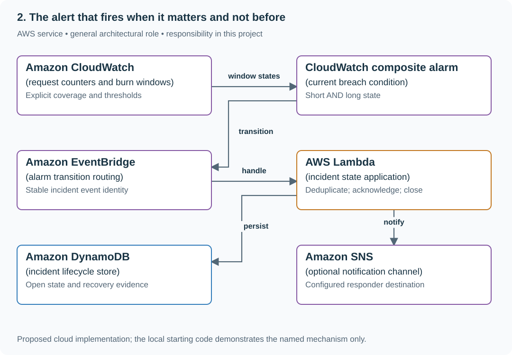

# 2. The alert that fires when it matters and not before

## What you are building

> Build alert logic for the save SLO. A page should require both short and long windows to burn too fast, but the incident owner wants the incident to remain open until both recover and someone acknowledges it. These are two different state rules.

**Working contract:** The current composite alarm is short_breach AND long_breach. The incident record is a separate latch with its own closure rule. Missing data has an explicit outcome and never silently becomes healthy.

## Workload and the decisions it changes

These are constructed exercise assumptions. The stated workload is a design target; the local demonstration does not establish that throughput. Use the [estimation constants](../../../01-code/01-problem-solving/estimation-constants.md) to check units before choosing capacity.

| Input or objective | Calculation / consequence |
|---|---|
| 99.9% objective; 0.9% observed failure rate | Burn rate is 0.009 / 0.001 = 9× sustainable consumption. |
| States F/F, T/F, T/T, F/T | AND alarm outputs F, F, T, F; either false operand clears the composite. |
| Short five-minute and long one-hour teaching windows | Choose thresholds from response goals and traffic; these are exercise settings, not universal paging defaults. |

## Start with one working boundary

Run from the repository root with Python 3.12+:

```bash
python3 examples/architecture-starts/02_the_alert_that_fires_when_it_matters_and_not_before.py
```

[Open the starting code](../../../../examples/architecture-starts/02_the_alert_that_fires_when_it_matters_and_not_before.py). This is a runnable demonstration of the critical state boundary. The API, UI, cloud adapters and operating behavior below are the application you build around it.

| Record / module | Key or interface | Responsibility |
|---|---|---|
| burn_window | good,total,coverage,error_fraction | Request-weighted consumption estimate. |
| composite_alarm | short_breach,long_breach,state | Current Boolean condition. |
| incident | opened_at,acknowledged,recovery_evidence,state | Human-owned lifecycle independent of alarm clearing. |

## AWS implementation



The composite expresses current metric truth; the incident store expresses the team’s response lifecycle. Separating them prevents confusing an alarm recovery with completed incident work.

## Build it in this order

### 1. Calculate burn from counts

Divide observed error fraction by the allowed error fraction, using summed counts and explicit coverage. Separate no traffic from no telemetry. Keep window lengths and thresholds versioned so responders can explain why a page fired.

### 2. Implement the Boolean alarm

Feed the four state pairs into the rule and inspect exact transitions. Debounce or evaluation periods, if used, are additional documented behavior. Do not describe an AND rule as requiring both inputs to recover before it clears.

### 3. Implement incident ownership separately

Open an incident on qualifying breach, deduplicate repeated notifications and record acknowledgement. Close only under the product’s chosen condition, here both windows normal plus acknowledgement. Keep this state in an incident record rather than hidden in alert wording.

### 4. Cover sustained consumption and silence

A 9× slow burn may deserve owned work even if it misses the fast-page threshold. Add a lower-severity policy and separate missing-telemetry signal. Demonstrate the notification timeline manually; do not install recurring checks in this repository.

## Infrastructure configuration

| Resource or boundary | Initial configuration and reason |
|---|---|
| Alarm configuration | State missing-data behavior explicitly and retain threshold/window version. |
| Incident state | Idempotent transition identity; acknowledgement does not erase active breach evidence. |
| Notifications | Deduplicate and route to a named owner; configuring actual recipients is outside this local lesson run. |

Use one disposable AWS environment for the cloud exercise. Put the named resources in `infra/template.yaml` or your existing IaC tool, pass resource IDs through configuration, and scope each runtime role to its own tables, buckets and queues. The diagram is a design to implement; it is not a claim that these resources have been deployed. Record the commands you used to deploy and remove the exercise resources.

For concrete provisioning commands, configuration wiring and cleanup, use the [AWS foundation guide](../../../../examples/architecture-starts/infra/README.md). It includes a deployable table/queue/object-storage foundation and explains which application and service adapters you still implement.

## Observe the result

| Action | Expected visible result |
|---|---|
| Run the starting program | The alarm clears at F/T while the incident remains open until acknowledged full recovery. |
| Stop counters | Missing telemetry is distinct from no errors. |
| Hold a sustained 0.9% failure rate | The lower-severity policy records 9× burn rather than ignoring it. |

## The next design decision

An acknowledgement arrives before metrics recover. Keep it recorded, but do not close until the separately defined recovery condition becomes true.

<details>
<summary>Further constraints from the original project</summary>

## Follow-up 1 · Operations wants a hold

**Changed requirement:** Keep the incident open until both windows recover and an owner acknowledges. How do you implement that? Predict which boundary must change before opening the design.

<details>
<summary>Expected reasoning and changed diagram</summary>

Add an explicit incident state distinct from the composite. Enter on AND breach; leave only on both-normal plus acknowledgment. Test both recovery orders and acknowledge-before-recovery.

</details>

## Follow-up 2 · Slow burn still matters

**Changed requirement:** A sustained 0.9% error rate never reaches the fast-page threshold. May it be ignored? State what evidence would make you reject your first design.

<details>
<summary>Expected reasoning and changed diagram</summary>

At a 99.9% objective it burns at 9× the sustainable rate. Add a lower-severity sustained condition with its own windows and owner; a nonpaging incident may still consume the entire budget.

</details>

## Supplied mechanism practice

- [Runnable reliability arithmetic and incident lab](../labs/reliability/README.md) — includes its own run command, fixtures and validation limits.

These exercises verify specific boundaries; completing their reference tests does not implement or assess the full project.

</details>
