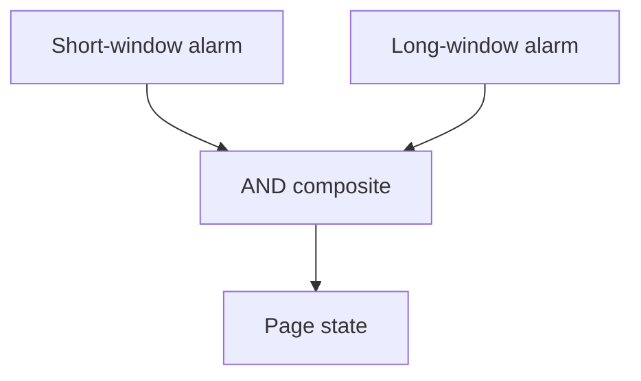
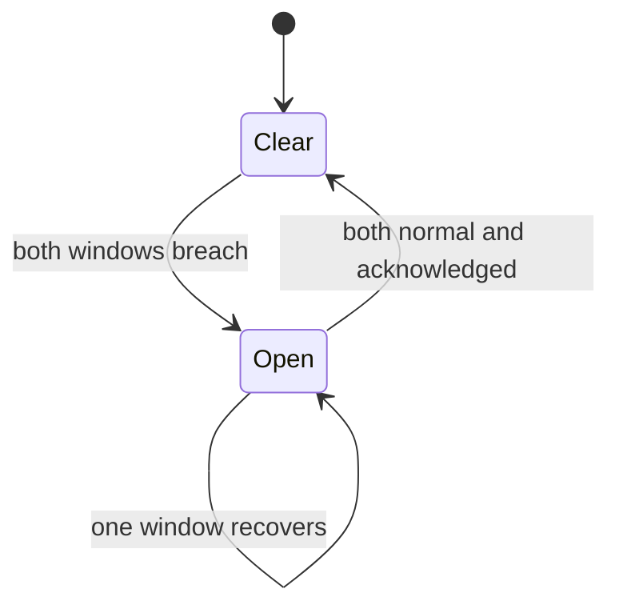
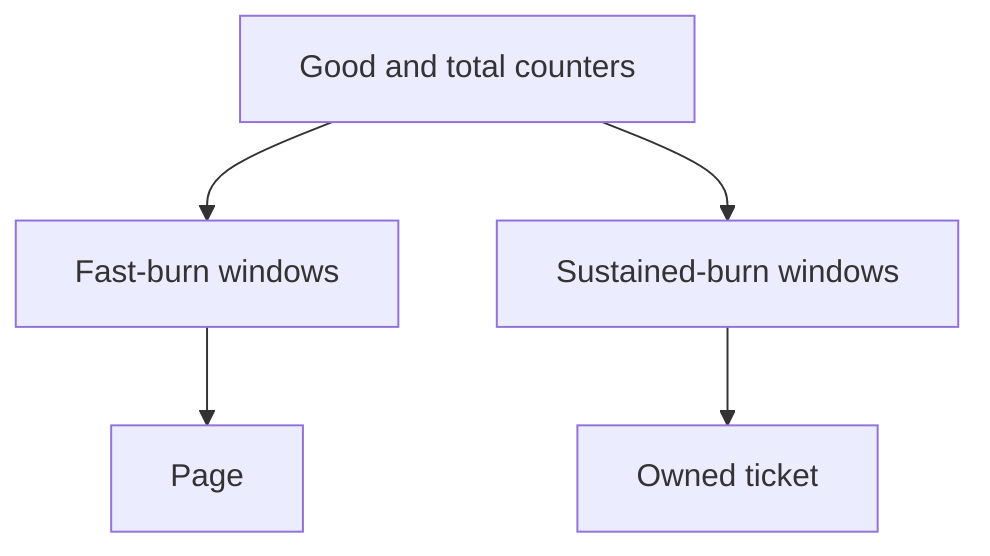
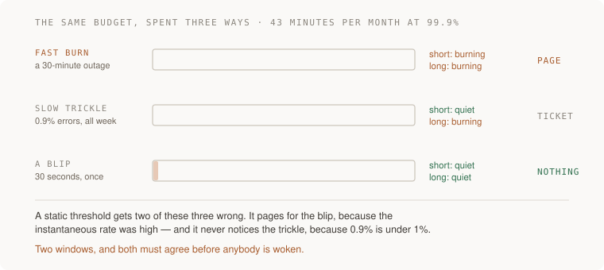

# 2. The alert that fires when it matters and not before

[Curriculum](../../../README.md) · [Reliability and incident response](../README.md) · [Project index](../../../../indexes/projects.md)

## The reviewer's brief

> Your SLO alert pages only when short and long windows both burn too fast. The short window recovers while the long window remains bad. An operator expects the page to stay active. Which rule did you implement?

This is a **constructed practice brief**, not an attributed company question.
Prerequisites: [the section](../failure-budgets.md). This page is a build brief; it does not ship a runnable application. The original build and prompt sequence below defines the implementation checkpoints.

| Case | Exact input or workload | Expected outcome |
|---|---|---|
| Small example | States `(short,long)`: `(false,false)`, `(true,false)`, `(true,true)`, `(false,true)`. | Ordinary AND gives false, false, true, false; either false operand clears the composite. |
| Boundary / failure | Missing counters are interpreted as zero errors. | Report missing data explicitly; distinguish absent traffic from broken telemetry. |
| Scope | Teaching thresholds; paging, tickets and incident closure are separate policies. | Explain any additional assumption before implementing it. |

Before looking at the guidance, state the invariant in one sentence and trace the example. In interview practice, implement or sketch independently, then reveal the reasoning. During AI-assisted practice, use the prompts below and verify each checkpoint before the next request.

## Baseline and the failure to explain



An AND condition controls current alarm state, not an incident latch. Both operands need to be true to fire; both do not need to become false to clear.

<details>
<summary>Reveal the approach and decisions</summary>

Calculate burn from the request error ratio divided by allowed error fraction. Choose windows for response speed and noise rejection, then state recovery logic. The invariant is that every alarm transition follows the documented Boolean or state-machine rule.

</details>

## Follow-up 1 · Operations wants a hold

**Changed requirement:** Keep the incident open until both windows recover and an owner acknowledges. How do you implement that? Predict which boundary must change before opening the design.

<details>
<summary>Expected reasoning and changed diagram</summary>

Add an explicit incident state distinct from the composite. Enter on AND breach; leave only on both-normal plus acknowledgment. Test both recovery orders and acknowledge-before-recovery.



</details>

## Follow-up 2 · Slow burn still matters

**Changed requirement:** A sustained 0.9% error rate never reaches the fast-page threshold. May it be ignored? State what evidence would make you reject your first design.

<details>
<summary>Expected reasoning and changed diagram</summary>

At a 99.9% objective it burns at 9× the sustainable rate. Add a lower-severity sustained condition with its own windows and owner; a nonpaging incident may still consume the entire budget.



</details>

## Evidence to bring to review

Build in three stops: reproduce the small case and baseline failure; implement the protected boundary; then replay both changed requirements with captured outputs. Record commands, fixtures, and observed results in your implementation README. A diagram is a prediction until those checks run.

**Senior expectation:** Trace every truth-table case, both recovery orders and no-data behavior. **Additional lead scope:** Own incident lifecycle independently of individual alarm states. Completion demonstrates practice evidence; it does not establish interview readiness or multi-team delivery experience.

## Supplied mechanism practice

- [Runnable reliability arithmetic and incident lab](../labs/reliability/README.md) — includes its own run command, fixtures and validation limits.

These exercises verify specific boundaries; completing their reference tests does not implement or assess the full project.

## Build and prompt sequence



*You end up with an alert that caught a fast burn and stayed quiet through a slow one.*

**Reading the retained illustration:** its window picture is illustrative; use
the explicit truth table and separate incident latch above for clearing. A slow
burn may warrant a ticket even when it does not meet the fast-page threshold.

**Build**

Replace a static threshold alert with a multi-window, multi-burn-rate alert on
the SLO from project 1, then prove it both ways: fire it with a fast burn, and
confirm it stays quiet through a trickle that does not threaten the budget.

**The thought process**

Start from what is wrong with thresholds. "Alert if error rate is above 1%"
fires on a thirty-second blip that costs you nothing, and stays quiet through a
0.9% error rate that eats your whole month's budget in a week. It is measuring
the wrong quantity: you care about **how fast the budget is being spent**, not
the instantaneous rate.

That gives you burn rate — spending at 14.4x the sustainable rate exhausts a
thirty-day budget in about two days. And then the second decision, which is the
clever part of the standard approach: **two windows.** A short one so you notice
quickly, a long one so a blip in the short window does not page anybody. Both
must be burning for it to fire. An ordinary AND composite clears when either
window is no longer in ALARM. If the incident must remain open until both
recover, implement the separate latch/acknowledgment policy shown above.

Third: **what severity, and who gets woken.** A fast burn is a page. A slow burn
is a ticket. Conflating them is how alerts become noise, and an alert people
have learned to ignore is worse than no alert because it occupies the space where
a real one would have been noticed.

**How to organise the prompts**

```
Here is my SLO: <target> over <window>. Explain burn rate for this
specific budget, with the arithmetic: at what multiple is the whole
budget gone in two days, and in one hour?

Then propose a two-window alert and tell me what each window is FOR.
```

Making it show the arithmetic for your own numbers is what turns a borrowed
recipe into something you can defend.

```
Implement it. Then simulate two scenarios against the implementation:
a sharp 30-minute outage, and a steady 0.9% error rate lasting a week.

For each, tell me whether it fires, when, and at what severity.
```

```
Now show me the case where this alert is WRONG — a real failure it would
miss, or a harmless event it would page for. I want the blind spot, not
reassurance.
```

**On AWS**

A **CloudWatch alarm** on a **metric math** expression over the good/total
counters, with two alarms — a short-window and a long-window — combined in a
**composite alarm** so the page only fires when both are in ALARM. That
composite alarm is the specific feature that makes this pattern easy on AWS and
is worth knowing by name; without it you end up with two noisy alarms and a
human doing the AND.

Route it through **SNS** to wherever you actually look. And the setting people
miss: **choose missing-data behavior explicitly**. A ratio with no eligible traffic
is undefined, not automatically a service failure. Monitor heartbeat/export
freshness separately; use breaching for a signal whose expected emission has
actually stopped. Test both absence of traffic and absence of telemetry.

Why not a third-party alerting service: you may well want one eventually for
on-call rotation and escalation, and that is what they are for. The argument for
staying in CloudWatch while learning is that the alarm sits next to the metric it
watches, so there is one fewer system to keep in sync.

**What productionising it means**

The alert has fired on a real or simulated fast burn, and you have watched it
stay quiet through a slow one. Severities are split: page for fast, ticket for
slow. Missing data alarms. And the runbook link is in the alert body, because an
alert that says only "SLO burn rate high" at 3am is a puzzle rather than a page.

**The learning**

Alerting is a design problem, not a threshold. The question is never "what value
is bad" but "what pattern is worth a human being awake", and burn rate is the
first formulation of that which actually survives contact with a noisy system.

**How you would know it is wrong**

- Fire it deliberately with a sharp burst. Time how long until the alert arrives.
- Run a slow trickle that does not threaten the budget. It must stay quiet.
- Stop emitting the metric entirely. It must alarm on missing data.
- Read the alert body as somebody woken by it. Does it say what is burning, how fast, and where to look?

---

[Back to the ordered project index](../projects.md)
