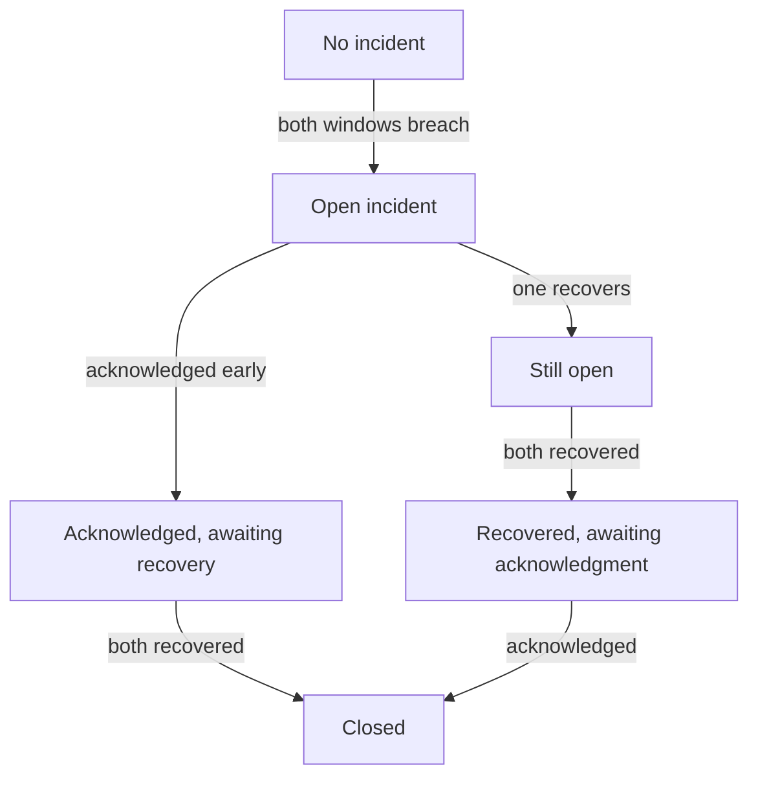

# Implement burn-rate alert and incident state rules

## Application background

A team has defined how reliable bookmark saves should be. It now needs to decide when failures are serious enough to notify an on-call engineer. One brief spike and a sustained outage should not automatically produce the same response.

The alert compares recent failure rates over a short window and a longer window. Once an incident is open, it also needs recovery and acknowledgement rules. Deciding to open an incident and deciding to close it are different actions.

### Example walkthrough

| Action | Expected behavior |
|---|---|
| The short window is bad but the long window is healthy | Do not open an incident under the declared two-window rule. |
| Both windows exceed the failure-spending threshold | Open the incident. |
| Both windows recover but nobody acknowledges the incident | Keep the incident state consistent with the declared closure rule. |

Burn rate describes how quickly failures spend the allowed error budget. An incident is the tracked response to that signal, including ownership and closure.

## Your assignment

**Deliver:** Implement the two-window rule for opening an alert and the separate rule for closing its incident. Demonstrate both using a sequence of degraded and recovered periods.

**Required behavior:** The current composite alarm is short_breach AND long_breach. The incident record is a separate latch with its own closure rule. Missing data has an explicit outcome and never silently becomes healthy.

The required first milestone is a working local implementation of the behavior above. The numbered implementation steps define the scope. The cloud architecture is a later extension, not something the starter has already provisioned.

## Get the code and run the supplied example

The code is in the public [junior-to-staff repository](https://github.com/Soulful-Iris/junior-to-staff). Install Git and Python 3.12+. No AWS account or Python packages are required for this first run. If you already have a checkout, use it and skip cloning.

```bash
git clone https://github.com/Soulful-Iris/junior-to-staff.git
cd junior-to-staff
python3 examples/architecture-starts/02_the_alert_that_fires_when_it_matters_and_not_before.py
```

**Supplied file:** [`examples/architecture-starts/02_the_alert_that_fires_when_it_matters_and_not_before.py`](https://github.com/Soulful-Iris/junior-to-staff/blob/main/examples/architecture-starts/02_the_alert_that_fires_when_it_matters_and_not_before.py). You can also [read or download the source here](../../../../examples/architecture-starts/02_the_alert_that_fires_when_it_matters_and_not_before.py).

This program is a **mechanism demonstration**: it runs the small scenario in one process and prints the result. It is not an HTTP service, a complete application, or an AWS deployment. A successful run demonstrates this mechanism only. It does not establish the workload or failure guarantees of the application you will build.

**Example output from the supplied run:**

Generated IDs and timestamps may differ. Compare the state transitions and outcomes.

```text
{'short': False, 'long': False, 'alarm': False, 'incident_open': False}
{'short': True, 'long': False, 'alarm': False, 'incident_open': False}
{'short': True, 'long': True, 'alarm': True, 'incident_open': True}
{'short': False, 'long': True, 'alarm': False, 'incident_open': True}
… (more output follows)
```

### Set up your implementation workspace

Create `work/02-the-alert-that-fires-when-it-matters-and-not-before/` in your checkout (or use a separate repository). Copy the supplied mechanism into that directory as `mechanism.py`, then extract its state transitions into functions you can call from your implementation. The record and module names below describe what you must implement. They are not a promise that files with those names already exist. Keep a `README.md` beside your implementation with its exact run commands and observed results.

## Local components and state to implement

This table names the records, interfaces or decision inputs for your deliverable. Unless a name is explicitly linked to supplied source above, it is something you create. Implement the local state transitions first, then connect the HTTP, storage or worker boundaries required by the steps.

| Record / module | Key or interface | Responsibility |
|---|---|---|
| burn_window | good,total,coverage,error_fraction | Request-weighted consumption estimate. |
| composite_alarm | short_breach,long_breach,state | Current Boolean condition. |
| incident | opened_at,acknowledged,recovery_evidence,state | Human-owned lifecycle independent of alarm clearing. |

## Implement the assignment

### 1. Calculate burn from counts

Divide observed error fraction by the allowed error fraction, using summed counts and explicit coverage. Separate no traffic from no telemetry. Keep window lengths and thresholds versioned so responders can explain why a page fired.

### 2. Implement the Boolean alarm

Feed the four state pairs into the rule and inspect exact transitions. Debounce or evaluation periods, if used, are additional documented behavior. Do not describe an AND rule as requiring both inputs to recover before it clears.

### 3. Implement incident ownership separately

Open an incident on qualifying breach, deduplicate repeated notifications and record acknowledgement. Close only under the product’s chosen condition, here both windows normal plus acknowledgement. Keep this state in an incident record rather than hidden in alert wording.

### 4. Cover sustained consumption and silence

A 9× slow burn may deserve owned work even if it misses the fast-page threshold. Add a lower-severity policy and separate missing-telemetry signal. Demonstrate the notification timeline manually. Do not install recurring checks in this repository.

## Demonstrate the completed local result

| Action | Expected visible result |
|---|---|
| Run the starting program | The alarm clears at F/T while the incident remains open until acknowledged full recovery. |
| Stop counters | Missing telemetry is distinct from no errors. |
| Hold a sustained 0.9% failure rate | The lower-severity policy records 9× burn rather than ignoring it. |

**Handoff:** In your implementation README, include the start command, one successful operation, the failure case above and the resulting stored state or decision. State which dependencies are simulated. Someone with a fresh checkout should be able to reproduce this without your chat history.

## Workload assumptions and capacity decisions

These are constructed exercise assumptions. The stated workload is a design target. The local demonstration does not establish that throughput. Use the [estimation constants](../../../01-code/01-problem-solving/estimation-constants.md) to check units before choosing capacity.

| Input or objective | Calculation / consequence |
|---|---|
| 99.9% objective. 0.9% observed failure rate | Burn rate is 0.009 / 0.001 = 9× sustainable consumption. |
| States F/F, T/F, T/T, F/T | AND alarm outputs F, F, T, F. Either false operand clears the composite. |
| Short five-minute and long one-hour teaching windows | Choose thresholds from response goals and traffic. These are exercise settings, not universal paging defaults. |

## Map the local implementation to AWS

**Deployment status: local only.** Running the supplied command creates no AWS resources and configures no cloud connections. The diagram is a proposed deployment of the completed application. Each box needs either a deployed runtime, a provisioned service or an explicitly external dependency.

Read the diagram by following the arrows from the entry point: application code accepts the request or event, the state owner commits it, and any worker produces the later result. The table ties those roles to code and adapter work. Multiple boxes do not imply multiple Python files already exist.


The composite expresses current metric truth. The incident store expresses the team’s response lifecycle. Separating them prevents confusing an alarm recovery with completed incident work.

| Local responsibility | Cloud destination and role | Implementation still required |
|---|---|---|
| Local counters, timestamps and diagnostic output | Amazon CloudWatch: request counters and burn windows | Emit bounded metrics and logs, build the named operational view and configure retention and access. |
| Local boolean alert conditions | CloudWatch composite alarm: current breach condition | Translate measured window conditions into alarm expressions. Keep incident acknowledgement and closure as explicit state. |
| Local event dispatch | Amazon EventBridge: alarm transition routing | Define event rules/targets and delivery failure handling. Persist logical event/run identity in the application. |
| Python operation or worker function | AWS Lambda: incident state application | Write a Lambda event adapter, package its dependencies and give its role only the required resource actions. |
| Local dictionary, SQLite records or state model | Amazon DynamoDB: incident lifecycle store | Design partition/sort keys and write a storage adapter with conditional updates or transactions. Python state and SQL are not uploaded as a database. |
| Local notification output | Amazon SNS: optional notification channel | Wire the alert topic and destination, define ownership and observe failed delivery. |

### Provision resources, then connect the application

| Resource or boundary | Initial configuration and reason |
|---|---|
| Alarm configuration | State missing-data behavior explicitly and retain threshold/window version. |
| Incident state | Idempotent transition identity. Acknowledgement does not erase active breach evidence. |
| Notifications | Deduplicate and route to a named owner. Configuring actual recipients is outside this local lesson run. |

Use one disposable AWS environment for the cloud exercise. Put the named resources in `infra/template.yaml` or your existing IaC tool, pass resource IDs through configuration, and scope each runtime role to its own tables, buckets and queues. The diagram is a design to implement. It is not a claim that these resources have been deployed. Record the commands you used to deploy and remove the exercise resources.

For concrete provisioning commands, configuration wiring and cleanup, use the [AWS foundation guide](../../../../examples/architecture-starts/infra/README.md). It includes a deployable table/queue/object-storage foundation and explains which application and service adapters you still implement.

A provisioned queue or table does not make the local program use it. Configure resource IDs in the deployed runtime, replace the local adapter, and replay the same successful and failing operation against that runtime. Record the deployed commit and observable result, then remove the disposable resources using your infrastructure tool.

## Extend the design after the baseline works


An acknowledgement arrives before metrics recover. Keep it recorded, but do not close until the separately defined recovery condition becomes true.

<details>
<summary>Follow-up scenarios and worked designs</summary>

## Follow-up 1 · Operations wants a hold

**Changed requirement:** Keep the incident open until both windows recover and an owner acknowledges. How do you implement that?

<details>
<summary>Worked design and implementation</summary>

Add an explicit incident state distinct from the composite. Enter on AND breach. Leave only on both-normal plus acknowledgment. Test both recovery orders and acknowledge-before-recovery.

**Use incident state, not only an alarm expression.** Store incident ID, open time, recovery state and acknowledgment time. Open when both burn windows breach. Keep the incident open when only one recovers. Close only after both recover and acknowledgment has occurred.

Walk three sequences: acknowledge first, short window recovers first, and long window recovers first. Each must produce the same closure rule. Hand over the transition table and avoid sending a second incident notification for every repeated breach.

**Revised flow.** These are proposed components to implement, not extra services started by the supplied demo.



</details>

## Follow-up 2 · Slow burn still matters

**Changed requirement:** A sustained 0.9% error rate never reaches the fast-page threshold. May it be ignored?

<details>
<summary>Worked design and implementation</summary>

At a 99.9% objective it burns at 9× the sustainable rate. Add a lower-severity sustained condition with its own windows and owner. A nonpaging incident may still consume the entire budget.

**Calculate the sustained impact.** An allowed error fraction of 0.1% and observed 0.9% gives burn rate nine. If sustained uniformly, that consumes a thirty-day request-based budget in roughly 3.3 days at comparable traffic. A fast-page threshold can intentionally ignore brief small errors while a slower rule still creates owned work.

Add a lower-severity sustained condition with its own observation windows and missing-data policy. Deliver a timeline where the fast rule stays quiet but the slow rule opens an incident. Specify who responds and when, rather than generating an unowned dashboard warning.

</details>

## Supplied mechanism practice

- [Runnable reliability arithmetic and incident lab](../labs/reliability/README.md) — includes its own run command, fixtures and validation limits.

These exercises verify specific boundaries. Completing their reference tests does not implement or assess the full project.

</details>
