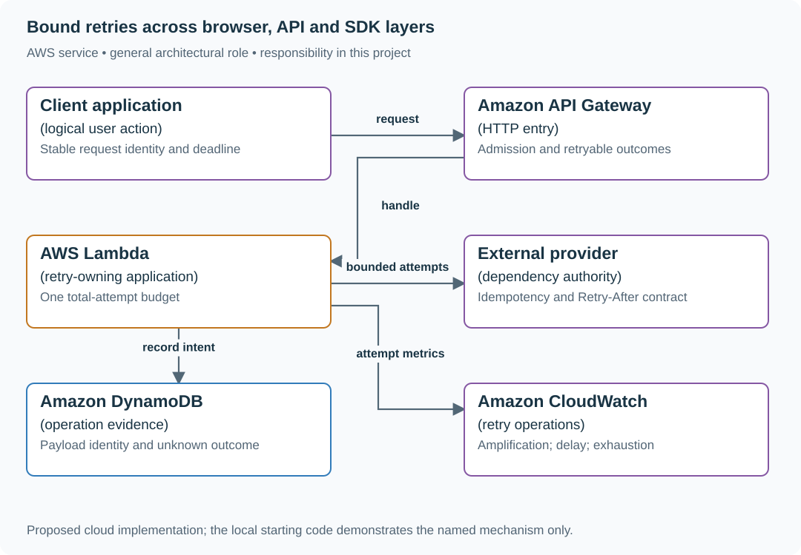

# Bound retries across browser, API and SDK layers

## Application background

A user presses Save once in a reading-list app. When a dependency is unavailable, the browser tries again. The API handler also retries, and its dependency library has retries of its own. One visible user action can therefore produce many calls to the failing service.

Retries can help after a brief interruption, but uncoordinated layers multiply work. They can also repeat a write whose success response was lost. First count the calls, then choose which layer should own the retry decision.

### Count the calls caused by one operation

The supplied model prints:

```text
3 total attempts per layer -> 27 dependency attempts
4 total attempts per layer -> 64 dependency attempts
Start another attempt: False
```

There are three retrying layers. The first line is `3 × 3 × 3`, counting the original call among each layer's attempts. In the final line, only 500 ms remain but the suggested retry wait is 2,000 ms, so another attempt cannot fit the original deadline.

Retry amplification is this multiplication of calls. A retry budget limits the total extra work, and idempotency prevents repeated attempts from creating repeated effects.

## Your assignment

**Deliver:** Count the dependency calls caused by one user operation. Revise the retry policy so one layer owns a bounded budget, preserves the original deadline and avoids repeated write effects.

**Required behavior:** One layer owns the retry budget for a logical operation. Count total attempts explicitly, preserve the original deadline and operation identity, and retry writes only under a verified idempotency/reconciliation contract.

The required first milestone is a working local implementation of the behavior above. The numbered implementation steps define the scope. The cloud architecture is a later extension, not something the starter has already provisioned.

## Get the code and run the supplied example

The code is in the public [junior-to-staff repository](https://github.com/Soulful-Iris/junior-to-staff). Install Git and Python 3.12+. No AWS account or Python packages are required for this first run. If you already have a checkout, use it and skip cloning.

```bash
git clone https://github.com/Soulful-Iris/junior-to-staff.git
cd junior-to-staff
python3 examples/architecture-starts/03_the_retry_storm_you_build_on_purpose.py
```

**Supplied file:** [`examples/architecture-starts/03_the_retry_storm_you_build_on_purpose.py`](https://github.com/Soulful-Iris/junior-to-staff/blob/main/examples/architecture-starts/03_the_retry_storm_you_build_on_purpose.py). You can also [read or download the source here](../../../../examples/architecture-starts/03_the_retry_storm_you_build_on_purpose.py).

This program is a **mechanism demonstration**: it runs the small scenario in one process and prints the result. It is not an HTTP service, a complete application, or an AWS deployment. A successful run demonstrates this mechanism only. It does not establish the workload or failure guarantees of the application you will build.

**Example output from the supplied run:**

Generated IDs and timestamps may differ. Compare the state transitions and outcomes.

```text
3 total attempts per layer -> 27 dependency attempts
4 total attempts per layer -> 64 dependency attempts
Start another attempt: False
Bounded jitter delays ms: [130, 60, 260, 29, 214]
```

### Set up your implementation workspace

Create `work/03-the-retry-storm-you-build-on-purpose/` in your checkout (or use a separate repository). Copy the supplied mechanism into that directory as `mechanism.py`, then extract its state transitions into functions you can call from your implementation. The record and module names below describe what you must implement. They are not a promise that files with those names already exist. Keep a `README.md` beside your implementation with its exact run commands and observed results.

## Local components and state to implement

This table names the records, interfaces or decision inputs for your deliverable. Unless a name is explicitly linked to supplied source above, it is something you create. Implement the local state transitions first, then connect the HTTP, storage or worker boundaries required by the steps.

| Record / module | Key or interface | Responsibility |
|---|---|---|
| retry_policy | owner_layer,max_total_attempts,deadline | One bounded operation budget. |
| attempt_record | operation_id,attempt,reason,scheduled_delay | Explains amplification and exhaustion. |
| effect_identity | operation_id,payload_hash,provider_key | Deduplicates safe external writes or supports reconciliation. |

## Implement the assignment

### 1. Measure actual amplification

Attach one logical operation ID across browser, API and SDK. Count attempts at each layer and compare to user actions. Inspect SDK defaults rather than assuming the retry loop visible in application code is the only one.

### 2. Assign one retry owner

Disable or constrain nested retries so the total budget is explicit. Use a maximum total-attempt count, shared deadline and bounded exponential backoff with jitter. Stop when Retry-After exceeds remaining time. Do not start work that cannot contribute to the response.

### 3. Preserve write identity

Reuse one provider idempotency key for an exact write intent and reject changed payload under that key. A timeout after a successful provider commit is unknown, not definitely failed. Reconcile before switching providers or creating another operation.

### 4. Observe recovery under load

Use a finite local fault window and compare request count, attempt timing, useful throughput and queue age. A circuit breaker can reduce doomed calls, but half-open probes must also be bounded so recovery does not release every waiting client at once.

## Demonstrate the completed local result

| Action | Expected visible result |
|---|---|
| Run the starting program | The two configurations produce 27 and 64 attempts. A two-second Retry-After cannot fit 500 ms remaining. |
| Lose a successful write response | The retry uses the same intent identity and resolves the original effect. |
| Recover 1,000 clients together | Jitter and bounded probes spread attempts within the configured budget. |

**Handoff:** In your implementation README, include the start command, one successful operation, the failure case above and the resulting stored state or decision. State which dependencies are simulated. Someone with a fresh checkout should be able to reproduce this without your chat history.

## Workload assumptions and capacity decisions

These are constructed exercise assumptions. The stated workload is a design target. The local demonstration does not establish that throughput. Use the [estimation constants](../../../01-code/01-problem-solving/estimation-constants.md) to check units before choosing capacity.

| Input or objective | Calculation / consequence |
|---|---|
| Three layers × three total attempts each | Worst-case 3³ = 27 dependency attempts for one user action. |
| Three retries plus initial attempt at each layer | Four total attempts/layer gives 4³ = 64, not 27. |
| 1,000 clients with identical backoff | Even a bounded attempt count can create synchronized recovery bursts. Spread timing with jitter. |

## Map the local implementation to AWS

**Deployment status: local only.** Running the supplied command creates no AWS resources and configures no cloud connections. The diagram is a proposed deployment of the completed application. Each box needs either a deployed runtime, a provisioned service or an explicitly external dependency.

Read the diagram by following the arrows from the entry point: application code accepts the request or event, the state owner commits it, and any worker produces the later result. The table ties those roles to code and adapter work. Multiple boxes do not imply multiple Python files already exist.



The API and SDK are separate retry layers even when they run in one process. Explicit ownership makes the worst-case dependency load calculable.

| Local responsibility | Cloud destination and role | Implementation still required |
|---|---|---|
| Local caller or request sequence | Client application: logical user action | Implement user-visible request identity, bounded retry/deadline behavior and explicit rejection/degraded states. |
| Local HTTP boundary or the endpoint you will add | Amazon API Gateway: HTTP entry | Create routes and an integration. Translate requests and responses and configure identity validation. |
| Python operation or worker function | AWS Lambda: retry-owning application | Write a Lambda event adapter, package its dependencies and give its role only the required resource actions. |
| Controlled dependency fixture | External provider: dependency authority | Implement bounded provider calls with explicit success, failure and unknown-outcome semantics. |
| Local dictionary, SQLite records or state model | Amazon DynamoDB: operation evidence | Design partition/sort keys and write a storage adapter with conditional updates or transactions. Python state and SQL are not uploaded as a database. |
| Local counters, timestamps and diagnostic output | Amazon CloudWatch: retry operations | Emit bounded metrics and logs, build the named operational view and configure retention and access. |

### Provision resources, then connect the application

| Resource or boundary | Initial configuration and reason |
|---|---|
| SDK settings | Set retry mode/count deliberately and document whether configuration means retries or total attempts. |
| Timeouts | Share the original deadline and cap queue/backoff time. Cancel abandoned work where supported. |
| Provider state | Persist operation identity before the call and retain it for the required retry horizon. |

Use one disposable AWS environment for the cloud exercise. Put the named resources in `infra/template.yaml` or your existing IaC tool, pass resource IDs through configuration, and scope each runtime role to its own tables, buckets and queues. The diagram is a design to implement. It is not a claim that these resources have been deployed. Record the commands you used to deploy and remove the exercise resources.

For concrete provisioning commands, configuration wiring and cleanup, use the [AWS foundation guide](../../../../examples/architecture-starts/infra/README.md). It includes a deployable table/queue/object-storage foundation and explains which application and service adapters you still implement.

A provisioned queue or table does not make the local program use it. Configure resource IDs in the deployed runtime, replace the local adapter, and replay the same successful and failing operation against that runtime. Record the deployed commit and observable result, then remove the disposable resources using your infrastructure tool.

## Extend the design after the baseline works


The provider’s idempotency retention expires before your retry horizon. Shorten the automatic retry window or add a provider lookup/reconciliation path. Do not assume an old key remains deduplicated forever.

<details>
<summary>Additional design reasoning and requirement changes</summary>

## Follow-up 1 · Every client starts together

**Changed requirement:** A dependency recovers and 1,000 clients have identical backoff. Does the request count alone reveal the risk? Predict which boundary must change before opening the design.

<details>
<summary>Expected reasoning and changed diagram</summary>

Plot attempt timestamps as well as counts. Full jitter spreads retries, while an admission limit bounds total downstream concurrency. Jitter does not create extra capacity or serialize one key.

</details>

## Follow-up 2 · The first write succeeded

**Changed requirement:** The provider performed a write before the response disappeared. What determines retry safety? State what evidence would make you reject your first design.

<details>
<summary>Expected reasoning and changed diagram</summary>

For local effects, atomically persist operation identity, payload and result with the effect. For a remote effect, use its idempotency/status protocol or reconcile an unknown outcome. Compare duplicate conflicting payloads before replay.

</details>

## Supplied mechanism practice

- [Runnable reliability arithmetic and incident lab](../labs/reliability/README.md) — includes its own run command, fixtures and validation limits.

These exercises verify specific boundaries. Completing their reference tests does not implement or assess the full project.

</details>
