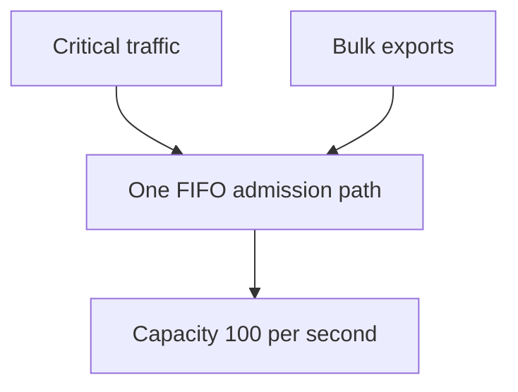
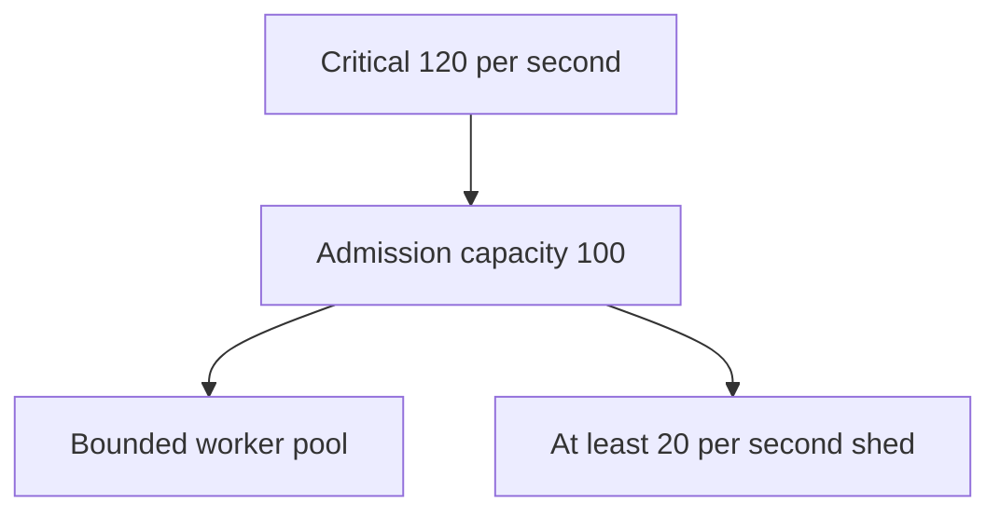
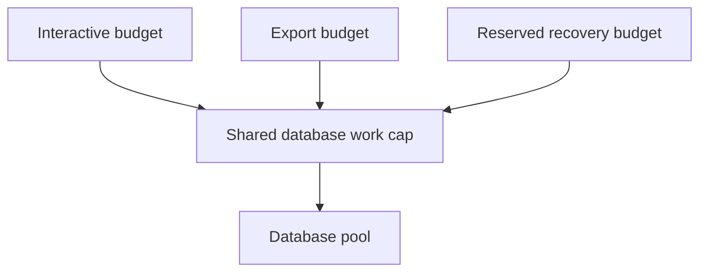

# 4. Shedding the right thing

[Curriculum](../../../README.md) · [Reliability and incident response](../README.md) · [Project index](../../../../indexes/projects.md)

## The reviewer's brief

> Your service can complete 100 equal-cost requests per second. Interactive saves matter more than exports, but now critical traffic alone reaches 120/s. Preserve resource bounds and explain the user outcome. Can priority create capacity?

This is a **constructed practice brief**, not an attributed company question.
Prerequisites: [the section](../failure-budgets.md). This page is a build brief; it does not ship a runnable application. The original build and prompt sequence below defines the implementation checkpoints.

| Case | Exact input or workload | Expected outcome |
|---|---|---|
| Small example | 80 critical + 50 bulk requests/s; capacity 100/s; no waiting budget. | Admit 80 critical and at most 20 bulk; shed at least 30 bulk requests/s. |
| Boundary / failure | 120 critical requests/s with capacity 100/s. | At least 20 critical requests/s must be shed or queued within a stated finite deadline; refusing them is not automatically a classification bug. |
| Scope | Equal-cost teaching requests; real admission also considers concurrency and work cost. | Explain any additional assumption before implementing it. |

## See the first reviewable result

**First slice:** Present two traffic classes to a 100-request/s service: 80 critical and 50 bulk per second. **Show:** 80 critical admitted, at most 20 bulk admitted, at least 30 bulk explicitly rejected with retry guidance. Increase critical traffic to 120/s and document what happens when even the high-priority class cannot fit; no design creates extra capacity.

<!-- project-expectation:start -->

## What you are expected to hand over

**The finished artifact:** Classify your requests into three priorities, then shed the lowest first when the system is short of capacity. Load it until shedding starts, and verify from the outside that the high-priority class kept working.

Bring a runnable slice or decision artifact, its normal output, and a captured
failure from the examples above. Include one check that turns red when the guarantee
breaks, the state owner, and the first operational limit. For each follow-up,
change the diagram **and** the evidence before claiming the design still works.

### How the review conversation gets harder

| Review gate | The interviewer changes | Expected response |
|---|---|---|
| Baseline | Run the small example from the cases above. | Demonstrate the observable outcome end to end and identify which boundary owns it. |
| Failure | Reproduce the boundary/failure case above. | Show the failure before the fix, then prove the protected behavior without hiding the error. |
| Senior · Critical traffic exceeds capacity | All 120 requests/s are critical. How does the design remain live? Predict which boundary must change before opening the design. | Reserve a bounded critical queue only if the latency budget allows it, then shed excess. Record denied critical work explicitly; inspect absolute arrival/capacity evidence before blaming classification. |
| Lead · Work costs differ | An export takes 100 times the database work of a save. Are request-count limits enough? State what evidence would make you reject your first design. | Use separate concurrency/work budgets and per-tenant fairness. The shared database budget constrains all classes; protect control and recovery operations too. |
| Evidence | A reviewer asks, “How do you know?” | Build in three stops: reproduce the small case and baseline failure; implement the protected boundary; then replay both changed requirements with captured outputs. |
| Handoff | The author is unavailable and the environment is new. | Another engineer can run, observe, break, and recover the artifact from the repository evidence. |

Before implementation, say the baseline invariant, the owner of each piece of
state, and what the user sees when the named dependency or assumption fails. That
five-minute explanation is part of the project: if it is vague, the build is not
ready to begin.

<!-- project-expectation:end -->

Before looking at the guidance, state the invariant in one sentence and trace the example. In interview practice, implement or sketch independently, then reveal the reasoning. During AI-assisted practice, use the prompts below and verify each checkpoint before the next request.

## Baseline and the failure to explain



Without reserved budgets, a bulk burst can occupy every slot before critical work arrives. With only critical overload, ranking cannot eliminate the shortage.

<details>
<summary>Reveal the approach and decisions</summary>

Agree classes and deadline policy before implementation, then enforce admission before expensive work. The invariant is bounded active/queued work with honest per-class outcomes. A 429/503 must be quick and carry actionable retry guidance when applicable.

</details>

## Follow-up 1 · Critical traffic exceeds capacity

**Changed requirement:** All 120 requests/s are critical. How does the design remain live? Predict which boundary must change before opening the design.

<details>
<summary>Expected reasoning and changed diagram</summary>

Reserve a bounded critical queue only if the latency budget allows it, then shed excess. Record denied critical work explicitly; inspect absolute arrival/capacity evidence before blaming classification.



</details>

## Follow-up 2 · Work costs differ

**Changed requirement:** An export takes 100 times the database work of a save. Are request-count limits enough? State what evidence would make you reject your first design.

<details>
<summary>Expected reasoning and changed diagram</summary>

Use separate concurrency/work budgets and per-tenant fairness. The shared database budget constrains all classes; protect control and recovery operations too.



</details>

## Evidence to bring to review

Build in three stops: reproduce the small case and baseline failure; implement the protected boundary; then replay both changed requirements with captured outputs. Record commands, fixtures, and observed results in your implementation README. A diagram is a prediction until those checks run.

**Senior expectation:** Test mixed load and all-critical overload with bounded queue age. **Additional lead scope:** Own product priorities and fairness under unavoidable refusal. Completion demonstrates practice evidence; it does not establish interview readiness or multi-team delivery experience.

## Supplied mechanism practice

- [Runnable reliability arithmetic and incident lab](../labs/reliability/README.md) — includes its own run command, fixtures and validation limits.

These exercises verify specific boundaries; completing their reference tests does not implement or assess the full project.

## Build and prompt sequence

*You end up having refused work under pressure, on purpose, and confirmed the right class suffered.*

**Build**

Classify your requests into three priorities, then shed the lowest first when the
system is short of capacity. Load it until shedding starts, and verify from the
outside that the high-priority class kept working.

**The thought process**

The first decision is the product one: **what are the classes?** A person loading
their own list is not the same as a background refresh or a bulk export. Writing
that ranking down is a statement about who your system is for when it cannot
serve everybody, and it is much easier to make calmly in advance than during an
incident.

Then the mechanism question: **shed on what signal?** CPU, queue depth, latency,
or a concurrency limit. Each has a failure mode — CPU lags the actual problem,
latency is already-too-late, concurrency limits are crude but honest and
immediate. Picking is the engineering.

Third, and it is the part that makes shedding humane: **a shed request must get
an honest answer.** A 429 with a retry-after header tells a client what to do. A
hanging connection tells it nothing and holds a resource while doing so. Shedding
fast is what makes it work; shedding *politely* is what makes it usable.

**How to organise the prompts**

```
Here are the kinds of request my system serves. Propose three priority
classes and place each kind in one.

For each class, say what the user experiences when it is shed, and who
would complain first.
```

```
Implement shedding on <signal>. When shedding, the lowest class gets a
a prompt 429 or 503 according to our contract, with retry guidance where
applicable. Preserve higher classes while their offered work fits reserved
capacity; when they exceed it, enforce their finite queue/admission policy too.

Then show me the code path that decides, and tell me what it costs to
evaluate on every request.
```

That last clause matters: a classifier that costs a database lookup is a new
dependency in your hottest path.

```
Now load it past its capacity. Report, from the OUTSIDE: what each class
experienced, and whether any high-priority request was refused.

If high-priority work was refused, compare its offered cost with available
capacity. Refusal below the promised reservation indicates a defect; above
capacity, verify the documented overload policy and resource bounds.
```

**On AWS**

Several layers can shed and they are not equivalent. **API Gateway** has usage
plans and throttling per key, which is the cheapest place to stop a flood because
it happens before your compute runs. An **Application Load Balancer** routes to targets but does not implement
your application’s per-class admission or latency policy. Keep a bounded
limiter at the service boundary instead of assuming target overload fails fast. **WAF** rate-based rules act earlier still and are the right answer to
abuse rather than to legitimate overload — that distinction is the one to be able
to make.

For priority *within* your own traffic, the honest answer is that you implement
it: a concurrency limiter in your handler with per-class budgets. On **Lambda**,
**reserved concurrency** per function provides a concurrency partition
if you split classes across functions — which is a genuine architectural reason
to split, and one of the better ones.

**What productionising it means**

The classes exist in code, not in a document. Shed responses carry retry-after
and are fast. There is a metric for shed-by-class, so you can see it happening.
And you have watched a real load test confirm the high class survived, because
classification bugs are invisible until exactly the moment they matter.

**The learning**

Capacity is finite and something will be refused. The only choice you have is
whether the refusal is chosen or arbitrary — and a system without a ranking
refuses whatever happens to arrive when the queue is full, which is usually the
person who cares most.

**How you would know it is wrong**

- Load past capacity and verify the *low* class is what suffered.
- Check the shed response: status, retry-after, and how fast it came back.
- Measure the classifier's own cost per request.
- Shed 100% and confirm the system stays up and recovers when load drops.

---

[Back to the ordered project index](../projects.md)
