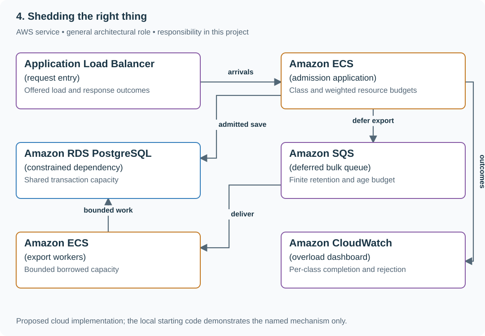
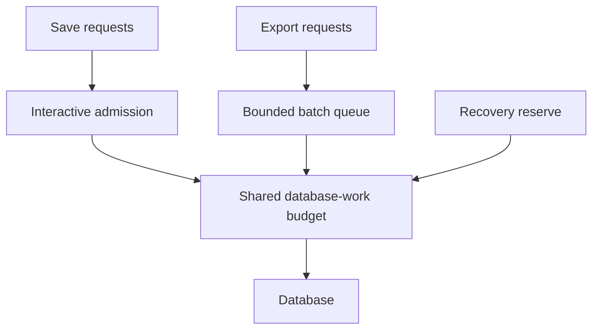

# Prioritize API work within a fixed capacity budget

## Application background

People use a reading-list API both to save individual bookmarks and to export many records. During a busy period, exports can occupy workers that interactive users need. The service must decide which operations to admit while keeping its waiting area finite.

In this exercise, total capacity is 100 equal-cost requests per second. Prioritizing saves helps when exports cause the excess. It cannot make every save succeed if saves alone reach 120 per second.

### Example walkthrough

| Action | Expected behavior |
|---|---|
| Interactive saves and exports together exceed capacity | Reduce or reject export work according to policy. |
| Interactive saves alone reach 120 per second | Reject some saves with a clear response. |
| Traffic falls below capacity | Let useful waiting work drain instead of admitting unlimited new work. |

Admission is the decision to let a request start or wait. Priority changes who receives scarce capacity, not how much capacity exists.

## Your assignment

**Deliver:** Build capacity allocation and finite waiting limits for saves and exports. Show which requests are rejected, including when critical traffic alone exceeds capacity.

**Required behavior:** Keep resource usage bounded and allocate capacity by trusted work class. Admit only work that can fit a finite deadline. Rejection is explicit and measured, including when critical demand exceeds physical capacity.

The required first milestone is a working local implementation of the behavior above. The numbered implementation steps define the scope. The cloud architecture is a later extension, not something the starter has already provisioned.

## Get the code and run the supplied example

The code is in the public [junior-to-staff repository](https://github.com/Soulful-Iris/junior-to-staff). Install Git and Python 3.12+. No AWS account or Python packages are required for this first run. If you already have a checkout, use it and skip cloning.

```bash
git clone https://github.com/Soulful-Iris/junior-to-staff.git
cd junior-to-staff
python3 examples/architecture-starts/04_shedding_the_right_thing.py
```

**Supplied file:** [`examples/architecture-starts/04_shedding_the_right_thing.py`](https://github.com/Soulful-Iris/junior-to-staff/blob/main/examples/architecture-starts/04_shedding_the_right_thing.py). You can also [read or download the source here](../../../../examples/architecture-starts/04_shedding_the_right_thing.py).

This program is a **mechanism demonstration**: it runs the small scenario in one process and prints the result. It is not an HTTP service, a complete application, or an AWS deployment. A successful run demonstrates this mechanism only. It does not establish the workload or failure guarantees of the application you will build.

**Example output from the supplied run:**

Generated IDs and timestamps may differ. Compare the state transitions and outcomes.

```text
{'critical_admitted': 80, 'bulk_admitted': 20, 'critical_rejected': 0, 'bulk_rejected': 30}
{'critical_admitted': 100, 'bulk_admitted': 0, 'critical_rejected': 20, 'bulk_rejected': 0}
100 save-units can fund 1 export or 100 saves
```

### Set up your implementation workspace

Create `work/04-shedding-the-right-thing/` in your checkout (or use a separate repository). Copy the supplied mechanism into that directory as `mechanism.py`, then extract its state transitions into functions you can call from your implementation. The record and module names below describe what you must implement. They are not a promise that files with those names already exist. Keep a `README.md` beside your implementation with its exact run commands and observed results.

## Local components and state to implement

This table names the records, interfaces or decision inputs for your deliverable. Unless a name is explicitly linked to supplied source above, it is something you create. Implement the local state transitions first, then connect the HTTP, storage or worker boundaries required by the steps.

| Record / module | Key or interface | Responsibility |
|---|---|---|
| work_class | route,tenant_tier,cost_weight | Trusted classification and estimated dependency cost. |
| admission_state | active,queued,deadline,budget | Bounded resource allocation. |
| outcome | class,admitted,rejected,expired,completed | User-visible accounting and fairness evidence. |

## Implement the assignment

### 1. Place admission before expensive work

Classify by authenticated account and route, not a client-controlled priority header. Check budget before taking database connections or starting external effects. Return a documented 429/503 and bounded Retry-After when work cannot be admitted.

### 2. Reserve and lend capacity explicitly

Give interactive saves a reserved share and allow bulk work to borrow spare capacity under a revocable bound. Preserve per-tenant fairness within each class. An unlimited paid tier is not a capacity policy.

### 3. Use weighted cost when needed

Measure database/CPU work per operation and choose approximate cost units. Bound both concurrency and rate where their effects differ. Revisit weights when exports become more expensive. One request counter cannot represent every workload.

### 4. Recover gradually

Expire waiting work that missed its useful deadline and ramp bulk admission after critical queues recover. Show class-specific useful completions and rejection, so a fast rejection response is not mistaken for improved successful latency.

## Demonstrate the completed local result

| Action | Expected visible result |
|---|---|
| Run the starting program | The first case rejects 30 bulk/s. The second rejects 20 critical/s. |
| Make exports 100 times more expensive | Weighted admission reduces their share appropriately. |
| Remove overload | Bulk traffic returns gradually after critical waiting clears. |

**Handoff:** In your implementation README, include the start command, one successful operation, the failure case above and the resulting stored state or decision. State which dependencies are simulated. Someone with a fresh checkout should be able to reproduce this without your chat history.

## Workload assumptions and capacity decisions

These are constructed exercise assumptions. The stated workload is a design target. The local demonstration does not establish that throughput. Use the [estimation constants](../../../01-code/01-problem-solving/estimation-constants.md) to check units before choosing capacity.

| Input or objective | Calculation / consequence |
|---|---|
| 80 critical + 50 bulk requests/s. Capacity 100/s | Admit all 80 critical and at most 20 bulk. Reject at least 30 bulk/s. |
| 120 critical requests/s. Capacity 100/s | At least 20 critical/s must be rejected or wait within a stated finite budget. |
| One export costs 100 saves | Request-count fairness is misleading. Budget the constrained resource cost. |

## Map the local implementation to AWS

**Deployment status: local only.** Running the supplied command creates no AWS resources and configures no cloud connections. The diagram is a proposed deployment of the completed application. Each box needs either a deployed runtime, a provisioned service or an explicitly external dependency.

Read the diagram by following the arrows from the entry point: application code accepts the request or event, the state owner commits it, and any worker produces the later result. The table ties those roles to code and adapter work. Multiple boxes do not imply multiple Python files already exist.



The constrained database determines useful capacity. Separate bulk delivery allows deferral, while early admission protects interactive work without pretending priority creates resources.

| Local responsibility | Cloud destination and role | Implementation still required |
|---|---|---|
| Local HTTP listener | Application Load Balancer: request entry | Deploy a service behind a target group, configure health checks and bounded connection/request behavior. |
| Application or worker process | Amazon ECS: admission application | Build a container and task definition. Supply configuration, task roles and graceful shutdown behavior. |
| Local records and transaction boundary | Amazon RDS PostgreSQL: constrained dependency | Write PostgreSQL schema/migrations and a database adapter. Configure credentials, connection limits and recovery. |
| Local pending-work collection | Amazon SQS: deferred bulk queue | Publish committed job intent, consume messages and persist deduplication/ownership state. Add visibility, retry and dead-letter handling. |
| Application or worker process | Amazon ECS: export workers | Build a container and task definition. Supply configuration, task roles and graceful shutdown behavior. |
| Local counters, timestamps and diagnostic output | Amazon CloudWatch: overload dashboard | Emit bounded metrics and logs, build the named operational view and configure retention and access. |

### Provision resources, then connect the application

| Resource or boundary | Initial configuration and reason |
|---|---|
| Pools | Account for API and worker connections together. Keep a hard total dependency budget. |
| Queues | Fixed depth/age bounds and explicit expiry behavior. Do not hide interactive requests in an unbounded queue. |
| Policy | Version class weights and reserve settings. Inspect the resulting allocation before increasing limits. |

Use one disposable AWS environment for the cloud exercise. Put the named resources in `infra/template.yaml` or your existing IaC tool, pass resource IDs through configuration, and scope each runtime role to its own tables, buckets and queues. The diagram is a design to implement. It is not a claim that these resources have been deployed. Record the commands you used to deploy and remove the exercise resources.

For concrete provisioning commands, configuration wiring and cleanup, use the [AWS foundation guide](../../../../examples/architecture-starts/infra/README.md). It includes a deployable table/queue/object-storage foundation and explains which application and service adapters you still implement.

A provisioned queue or table does not make the local program use it. Configure resource IDs in the deployed runtime, replace the local adapter, and replay the same successful and failing operation against that runtime. Record the deployed commit and observable result, then remove the disposable resources using your infrastructure tool.

## Extend the design after the baseline works


An accepted bulk job represents a paid obligation. Distinguish admission rejection from cancellation of already accepted work, and preserve status/refund or rescheduling semantics.

<details>
<summary>Follow-up scenarios and worked designs</summary>

## Follow-up 1 · Critical traffic exceeds capacity

**Changed requirement:** All 120 requests/s are critical. How does the design remain live?

<details>
<summary>Worked design and implementation</summary>

Reserve a bounded critical queue only if the latency budget allows it, then shed excess. Record denied critical work explicitly. Inspect absolute arrival/capacity evidence before blaming classification.

**Use absolute rates.** If critical arrivals are 120/s and sustainable completion is 100/s, a queue grows by 20 requests each second unless work is rejected or capacity changes. A 200-request queue only absorbs ten seconds at that gap. It does not solve sustained overload.

Choose a maximum waiting time, reserve capacity for recovery and reject excess before expensive work begins. Hand over the queue-depth timeline and explicit critical-rejection count. The response should tell callers whether retry is appropriate without encouraging synchronized immediate retries.

</details>

## Follow-up 2 · Work costs differ

**Changed requirement:** An export takes 100 times the database work of a save. Are request-count limits enough?

<details>
<summary>Worked design and implementation</summary>

Use separate concurrency/work budgets and per-tenant fairness. The shared database budget constrains all classes. Protect control and recovery operations too.

**Separate work classes.** Give exports their own bounded worker pool and database concurrency allowance. Let saves use an interactive allocation, but enforce a total shared database budget across both. Request-count quotas alone permit one expensive request to consume the capacity of many cheap ones.

For an illustrative export costing 100 save-equivalent work units, show the allocation while one export and a save burst arrive together. Deliver queue age and completion rates for both classes. Explain how batch work eventually progresses without allowing it to starve interactive requests.

**Revised flow.** These are proposed components to implement, not extra services started by the supplied demo.



</details>

## Supplied mechanism practice

- [Runnable reliability arithmetic and incident lab](../labs/reliability/README.md) — includes its own run command, fixtures and validation limits.

These exercises verify specific boundaries. Completing their reference tests does not implement or assess the full project.

</details>
