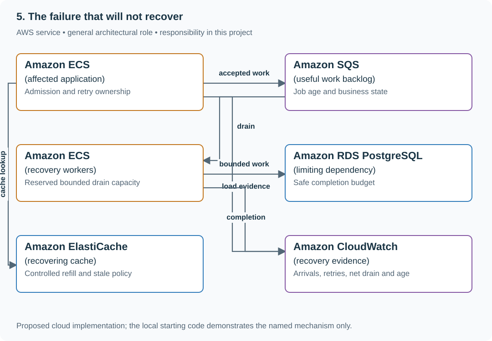
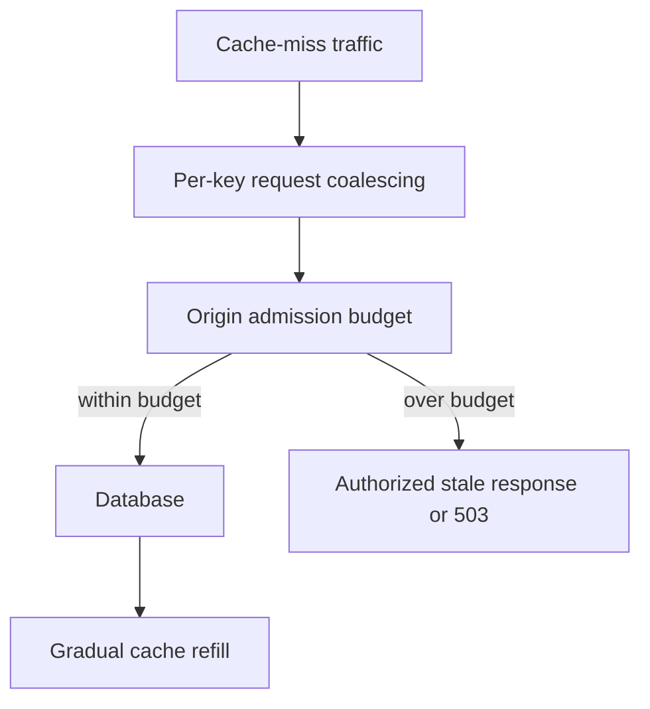

# Recover a service trapped in expired work and retries

## Application background

A traffic spike makes the reading-list service slow. The spike ends, but the service remains slow because old requests are still waiting and clients keep retrying them. Workers spend their time on operations whose callers have already given up.

Recovery requires more than waiting for the original trigger to disappear. The service must stop feeding this loop, remove work that can no longer help a caller and leave spare capacity to finish useful requests.

### Example walkthrough

| Action | Expected behavior |
|---|---|
| Incoming traffic returns to normal | Check whether old work is still consuming the workers. |
| Expired requests are retried again | Stop attempts that are beyond the operation's deadline. |
| Useful arrival rate falls below useful completion rate | Observe the remaining backlog shrink. |

A backlog is accepted work waiting to finish. Its size decreases only when useful completion exceeds incoming work, including any retries that you continue to admit.

## Your assignment

**Deliver:** Produce a recovery procedure and a before/after backlog timeline. Stop useless expired work and show that useful completion exceeds new useful arrivals long enough to drain the queue.

**Required behavior:** Recovery requires arrivals below safe useful completion capacity. Separate stale disposable work from business obligations that still need reconciliation. Measure backlog age and net drain, not only whether the original fault disappeared.

The required first milestone is a working local implementation of the behavior above. The numbered implementation steps define the scope. The cloud architecture is a later extension, not something the starter has already provisioned.

## Get the code and run the supplied example

The code is in the public [junior-to-staff repository](https://github.com/Soulful-Iris/junior-to-staff). Install Git and Python 3.12+. No AWS account or Python packages are required for this first run. If you already have a checkout, use it and skip cloning.

```bash
git clone https://github.com/Soulful-Iris/junior-to-staff.git
cd junior-to-staff
python3 examples/architecture-starts/05_the_failure_that_will_not_recover.py
```

**Supplied file:** [`examples/architecture-starts/05_the_failure_that_will_not_recover.py`](https://github.com/Soulful-Iris/junior-to-staff/blob/main/examples/architecture-starts/05_the_failure_that_will_not_recover.py). You can also [read or download the source here](../../../../examples/architecture-starts/05_the_failure_that_will_not_recover.py).

This program is a **mechanism demonstration**: it runs the small scenario in one process and prints the result. It is not an HTTP service, a complete application, or an AWS deployment. A successful run demonstrates this mechanism only. It does not establish the workload or failure guarantees of the application you will build.

**Example output from the supplied run:**

Generated IDs and timestamps may differ. Compare the state transitions and outcomes.

```text
{'backlog': 600, 'net_drain_per_s': 30, 'ideal_drain_s': 20.0}
{'backlog': 600, 'net_drain_per_s': -10, 'ideal_drain_s': 'never at these rates'}
```

### Set up your implementation workspace

Create `work/05-the-failure-that-will-not-recover/` in your checkout (or use a separate repository). Copy the supplied mechanism into that directory as `mechanism.py`, then extract its state transitions into functions you can call from your implementation. The record and module names below describe what you must implement. They are not a promise that files with those names already exist. Keep a `README.md` beside your implementation with its exact run commands and observed results.

## Local components and state to implement

This table names the records, interfaces or decision inputs for your deliverable. Unless a name is explicitly linked to supplied source above, it is something you create. Implement the local state transitions first, then connect the HTTP, storage or worker boundaries required by the steps.

| Record / module | Key or interface | Responsibility |
|---|---|---|
| work_inventory | job_id,deadline,business_state,repair_required | Distinguishes stale response work from unresolved effects. |
| recovery_budget | arrivals,capacity,retry_share | Explicit net-drain calculation. |
| incident_timeline | trigger,feedback_loop,mitigation,recovered | Evidence that the sustaining mechanism stopped. |

## Implement the assignment

### 1. Identify the sustaining loop

Plot original arrivals, retries, completions and queue age separately. Find whether retry traffic, cold-cache misses, connection exhaustion or another feedback path keeps load above capacity. Removing the initiating fault is only the first observation.

### 2. Stop useless amplification

Bound retry ownership and admission, cancel expired read work and reserve capacity for useful jobs. A timed-out payment is not disposable: move it to reconciliation using its stable operation identity. Do not delete obligations to make the queue graph look healthy.

### 3. Create and measure drain capacity

Reduce arrivals or optional work until safe completions exceed admitted useful arrivals. Estimate drain time from backlog divided by net capacity, then compare actual oldest-age decay. If the estimate fails, inspect variable job cost and dependency contention.

### 4. Reopen with limits

Warm caches through a bounded origin budget and gradually restore traffic. Keep recovery controls available independently of the failing path. Record the trigger and feedback loop separately so the permanent repair addresses both.

## Demonstrate the completed local result

| Action | Expected visible result |
|---|---|
| Run the starting program | The healthy recovery case drains in an ideal 20 seconds. The retry loop never drains at the stated rates. |
| Turn off only the original spike | Retry-driven backlog still grows. |
| Restore a cold cache | Origin load remains below the database budget. |

**Handoff:** In your implementation README, include the start command, one successful operation, the failure case above and the resulting stored state or decision. State which dependencies are simulated. Someone with a fresh checkout should be able to reproduce this without your chat history.

## Workload assumptions and capacity decisions

These are constructed exercise assumptions. The stated workload is a design target. The local demonstration does not establish that throughput. Use the [estimation constants](../../../01-code/01-problem-solving/estimation-constants.md) to check units before choosing capacity.

| Input or objective | Calculation / consequence |
|---|---|
| 600 useful queued jobs. 20 new jobs/s. 50 completions/s | Net drain is 30/s. Ideal drain time is 20 seconds plus measured overhead. |
| 60 retry arrivals/s. 50 completions/s | Backlog still grows 10/s after the initial spike ends. |
| Cold cache: 1,000 reads/s. Database capacity 100/s | Unbounded cache bypass preserves the outage by overloading the database. |

## Map the local implementation to AWS

**Deployment status: local only.** Running the supplied command creates no AWS resources and configures no cloud connections. The diagram is a proposed deployment of the completed application. Each box needs either a deployed runtime, a provisioned service or an explicitly external dependency.

Read the diagram by following the arrows from the entry point: application code accepts the request or event, the state owner commits it, and any worker produces the later result. The table ties those roles to code and adapter work. Multiple boxes do not imply multiple Python files already exist.



Recovery is a capacity inequality plus correct work classification. Queue depth falling is useful evidence only if obligations are completed or explicitly resolved, rather than silently discarded.

| Local responsibility | Cloud destination and role | Implementation still required |
|---|---|---|
| Application or worker process | Amazon ECS: affected application | Build a container and task definition. Supply configuration, task roles and graceful shutdown behavior. |
| Local pending-work collection | Amazon SQS: useful work backlog | Publish committed job intent, consume messages and persist deduplication/ownership state. Add visibility, retry and dead-letter handling. |
| Application or worker process | Amazon ECS: recovery workers | Build a container and task definition. Supply configuration, task roles and graceful shutdown behavior. |
| Local records and transaction boundary | Amazon RDS PostgreSQL: limiting dependency | Write PostgreSQL schema/migrations and a database adapter. Configure credentials, connection limits and recovery. |
| Local cache, counter or coordination state | Amazon ElastiCache: recovering cache | Implement a Redis/Valkey adapter and atomic operations, expiry and unavailable-cache behavior. Keep the durable authority separate. |
| Local counters, timestamps and diagnostic output | Amazon CloudWatch: recovery evidence | Emit bounded metrics and logs, build the named operational view and configure retention and access. |

### Provision resources, then connect the application

| Resource or boundary | Initial configuration and reason |
|---|---|
| Recovery controls | Independent admission/retry knobs with known safe defaults and owner. |
| Queue handling | Preserve logical job identity and obligations. Expire only work whose contract permits it. |
| Cache warmup | Fleet-wide origin limit and bounded stale serving where allowed. No unrestricted bypass. |

Use one disposable AWS environment for the cloud exercise. Put the named resources in `infra/template.yaml` or your existing IaC tool, pass resource IDs through configuration, and scope each runtime role to its own tables, buckets and queues. The diagram is a design to implement. It is not a claim that these resources have been deployed. Record the commands you used to deploy and remove the exercise resources.

For concrete provisioning commands, configuration wiring and cleanup, use the [AWS foundation guide](../../../../examples/architecture-starts/infra/README.md). It includes a deployable table/queue/object-storage foundation and explains which application and service adapters you still implement.

A provisioned queue or table does not make the local program use it. Configure resource IDs in the deployed runtime, replace the local adapter, and replay the same successful and failing operation against that runtime. Record the deployed commit and observable result, then remove the disposable resources using your infrastructure tool.

## Extend the design after the baseline works


Job cost varies by 100×. Replace a simple job-count estimate with remaining work units and identify the oldest expensive obligation rather than predicting recovery from queue count alone.

<details>
<summary>Follow-up scenarios and worked designs</summary>

## Follow-up 1 · The cache is cold

**Changed requirement:** Cache loss sends 1,000 reads/s to a database that can handle 100/s. Should every miss bypass?

<details>
<summary>Worked design and implementation</summary>

No. Bound refresh/bypass work, coalesce within an explicit scope, and serve authorized bounded-stale data or return 429/503. TTL jitter alone cannot protect a single expired hot key.

**Add a recovery controller before the origin.** Coalesce repeated requests for the same key within a stated scope, cap global origin work, and refill gradually. Keep user authorization independent of whether a stale value is available. If no safe value can be served, return a prompt overload response.

At 1,000 offered reads/s and a 100/s origin limit, account for the other 900/s through coalescing, permitted stale responses or rejection. Show that the origin stays within its budget during cache restart. A TTL with random jitter spreads many expirations but does not protect one extremely hot key.

**Revised flow.** These are proposed components to implement, not extra services started by the supplied demo.



</details>

## Follow-up 2 · Expired work has business value

**Changed requirement:** A job expired by latency policy but represents a payment request. May the worker drop it?

<details>
<summary>Worked design and implementation</summary>

Separate obsolete presentation work from durable obligations. Transition the payment to a visible timeout/unknown state with an owner and reconciliation. Acknowledge/drop only according to the business contract.

**Split deadline expiry from business completion.** A suggestion can become useless after the user leaves. A submitted payment may already have changed external state and still needs an answer. Store user-response timeout separately from payment outcome.

Expire the interactive wait, then let provider confirmation arrive later. The record should move from unknown to confirmed without initiating another payment. Deliver an operator view listing unresolved obligations and the owner who reconciles them. Dropping a queue message must not erase that obligation.

</details>

## Supplied mechanism practice

- [Runnable reliability arithmetic and incident lab](../labs/reliability/README.md) — includes its own run command, fixtures and validation limits.

These exercises verify specific boundaries. Completing their reference tests does not implement or assess the full project.

</details>
