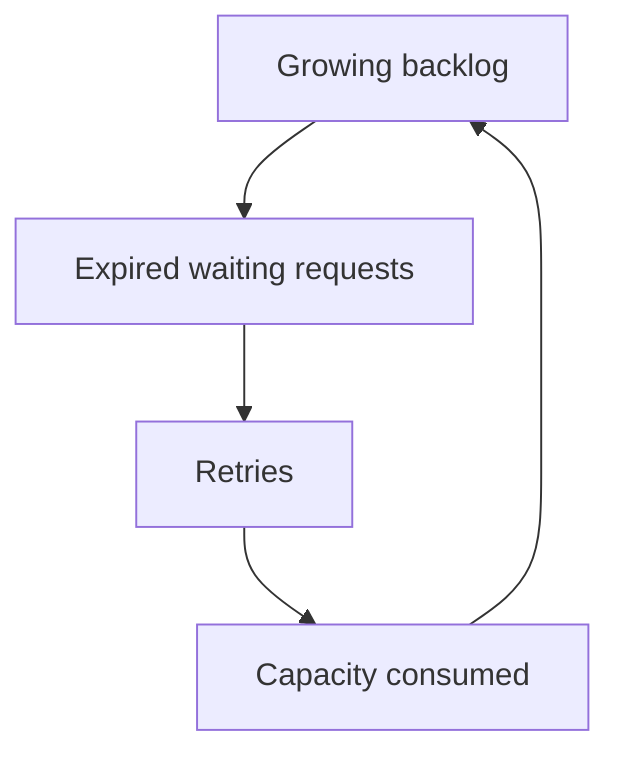
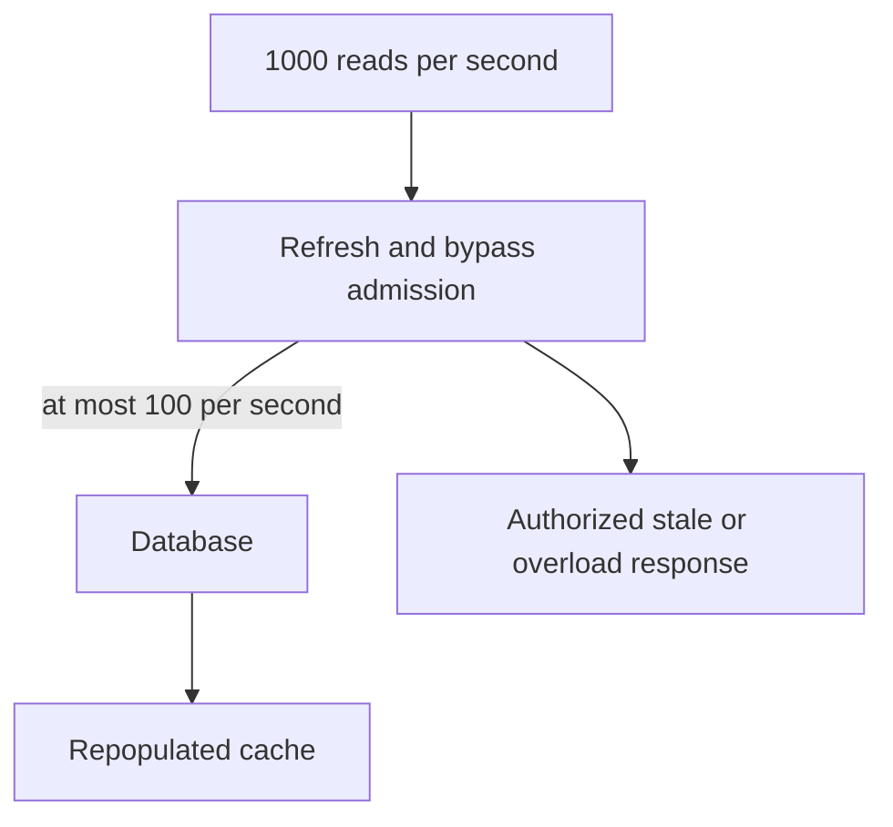
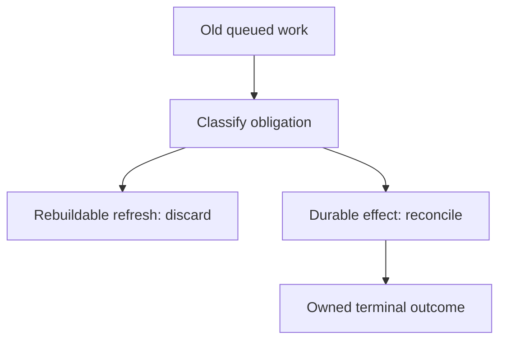

# 5. The failure that will not recover

[Curriculum](../../../README.md) · [Reliability and incident response](../README.md) · [Project index](../../../../indexes/projects.md)

## The reviewer's brief

> A brief traffic spike ends, but the bookmark service stays slow: expired requests keep retrying and consume the slots needed for fresh work. Identify the sustaining loop and a measurable recovery action. What capacity is available to drain it?

This is a **constructed practice brief**, not an attributed company question.
Prerequisites: [the section](../failure-budgets.md). This page is a build brief; it does not ship a runnable application. The original build and prompt sequence below defines the implementation checkpoints.

| Case | Exact input or workload | Expected outcome |
|---|---|---|
| Small example | Backlog 600 useful jobs, new arrivals 20/s, safe completion 50/s after mitigation. | Net drain 30/s, so ideal drain time is 20 seconds plus measured overhead. |
| Boundary / failure | Retry arrivals 60/s while completion remains 50/s after the original spike ends. | Backlog still grows 10/s; removing the original trigger does not restore stability. |
| Scope | Discard only expired/rebuildable work; durable business operations need reconciliation. | Explain any additional assumption before implementing it. |

## See the first reviewable result

**First slice:** Start a 600-job backlog, reduce new useful arrivals to 20/s and restore safe completion to 50/s. **Show:** an ideal drain slope of 30/s and roughly 20 seconds, then measure actual drain. Add 60/s retry arrivals instead: backlog grows 10/s after the original spike ends. The graph must make the sustained feedback loop visible.

<!-- project-expectation:start -->

## What you are expected to hand over

**The finished artifact:** Induce a metastable failure: overload the system, remove the overload, and watch it stay broken. Then find the mechanism and fix it.

Bring a runnable slice or decision artifact, its normal output, and a captured
failure from the table above. Include one check that turns red when the guarantee
breaks, the state owner, and the first operational limit. For each follow-up,
change the diagram **and** the evidence before claiming the design still works.

### How the review conversation gets harder

| Review gate | The interviewer changes | Expected response |
|---|---|---|
| Baseline | Run the small example from the table above. | Demonstrate the observable outcome end to end and identify which boundary owns it. |
| Failure | Reproduce the boundary/failure row above. | Show the failure before the fix, then prove the protected behavior without hiding the error. |
| Senior · The cache is cold | Cache loss sends 1,000 reads/s to a database that can handle 100/s. Should every miss bypass? Predict which boundary must change before opening the design. | No. Bound refresh/bypass work, coalesce within an explicit scope, and serve authorized bounded-stale data or return 429/503. TTL jitter alone cannot protect a single expired hot key. |
| Lead · Expired work has business value | A job expired by latency policy but represents a payment request. May the worker drop it? State what evidence would make you reject your first design. | Separate obsolete presentation work from durable obligations. Transition the payment to a visible timeout/unknown state with an owner and reconciliation; acknowledge/drop only according to the business contract. |
| Evidence | A reviewer asks, “How do you know?” | Build in three stops: reproduce the small case and baseline failure; implement the protected boundary; then replay both changed requirements with captured outputs. |
| Handoff | The author is unavailable and the environment is new. | Another engineer can run, observe, break, and recover the artifact from the repository evidence. |

Before implementation, say the baseline invariant, the owner of each piece of
state, and what the user sees when the named dependency or assumption fails. That
five-minute explanation is part of the project: if it is vague, the build is not
ready to begin.

<!-- project-expectation:end -->

Before looking at the guidance, state the invariant in one sentence and trace the example. In interview practice, implement or sketch independently, then reveal the reasoning. During AI-assisted practice, use the prompts below and verify each checkpoint before the next request.

## Baseline and the failure to explain



The trigger and the sustaining feedback are different. More application workers can intensify overload when the fixed bottleneck is the database.

<details>
<summary>Reveal the approach and decisions</summary>

Account for arrivals, completions and obsolete work, then cap admission and stop redundant retries. Reserve a real downstream budget for recovery. The invariant is positive net drain with bounded useful age; warm compute is not automatically spare database capacity.

</details>

## Follow-up 1 · The cache is cold

**Changed requirement:** Cache loss sends 1,000 reads/s to a database that can handle 100/s. Should every miss bypass? Predict which boundary must change before opening the design.

<details>
<summary>Expected reasoning and changed diagram</summary>

No. Bound refresh/bypass work, coalesce within an explicit scope, and serve authorized bounded-stale data or return 429/503. TTL jitter alone cannot protect a single expired hot key.



</details>

## Follow-up 2 · Expired work has business value

**Changed requirement:** A job expired by latency policy but represents a payment request. May the worker drop it? State what evidence would make you reject your first design.

<details>
<summary>Expected reasoning and changed diagram</summary>

Separate obsolete presentation work from durable obligations. Transition the payment to a visible timeout/unknown state with an owner and reconciliation; acknowledge/drop only according to the business contract.



</details>

## Evidence to bring to review

Build in three stops: reproduce the small case and baseline failure; implement the protected boundary; then replay both changed requirements with captured outputs. Record commands, fixtures, and observed results in your implementation README. A diagram is a prediction until those checks run.

**Senior expectation:** Replay the failure, remove the trigger, and measure positive net drain after repair. **Additional lead scope:** Protect recovery capacity and define which work may be abandoned. Completion demonstrates practice evidence; it does not establish interview readiness or multi-team delivery experience.

## Supplied mechanism practice

- [Runnable reliability arithmetic and incident lab](../labs/reliability/README.md) — includes its own run command, fixtures and validation limits.

These exercises verify specific boundaries; completing their reference tests does not implement or assess the full project.

## Build and prompt sequence

*You end up having built a system that stays down after the cause is gone, and then fixed it.*

**Build**

Induce a metastable failure: overload the system, remove the overload, and watch
it stay broken. Then find the mechanism and fix it.

**The thought process**

This is the most valuable project in the section and the least known. A
**metastable failure** is one where the trigger has gone and the system remains
down, because the recovery itself requires capacity the system no longer has. A
queue full of work whose timeouts have all expired; a cache that emptied, so
every request now hits the database, so nothing ever repopulates the cache; a
retry backlog that saturates the very capacity needed to drain it.

The decision that makes this tractable is realising it is about **a sustaining
loop**, not about the trigger. So the question to ask of your own system is: is
there any state where the work required to recover exceeds the capacity
available? That question is answerable on paper, before you build the drill.

Then the fixes, which are all about breaking the loop: drop work that is already
too old to be useful, admit load gradually rather than all at once when
recovering, and keep enough capacity in reserve that recovery is possible.

**How to organise the prompts**

```
Here is my system. Is there a state where it would stay broken after the
cause was removed? Walk through the loop: what is consuming the capacity
that recovery needs.

If you think there is not, tell me what property prevents it.
```

That second sentence is the honest version — sometimes the answer is genuinely
no, and knowing why is as valuable as finding one.

```
Design a safe experiment that induces it in my environment, with a stop
condition so I can end it. Do not run anything yet.
```

```
Now the fixes. For each: drop stale work, gradual admission on recovery,
reserved capacity. Tell me what each costs when the system is HEALTHY,
because that is the price I pay every day for a rare event.
```

The everyday cost is the real decision. Most resilience mechanisms are a small
permanent tax against a rare catastrophe, and you should know the tax.

**On AWS**

Three concrete places this bites. **SQS** message age is the metric that reveals
it: a queue whose oldest message keeps getting older while the consumer runs flat
out is a metastable state, and the fix is often to drop messages past a useful
age — which you do by checking the timestamp in the handler, because SQS will not
do it for you.

**Auto Scaling** can be part of the loop rather than the cure: scaling out helps
only if the bottleneck is your compute, and if it is the database then more
instances make it worse. Knowing which is why you did project 4 first.

Provisioned concurrency on Lambda and warm pools on an ASG can reduce
startup delay, but do not by themselves reserve database, network or provider
capacity for recovery. Reserve admission/concurrency budgets at the actual
bottleneck and measure their healthy-state cost.

**What productionising it means**

Work has a maximum useful age and is dropped past it. Recovery admits load
gradually rather than opening the gates. Queue age is a monitored metric with an
alarm, because it is the early signal. And you have induced the failure once, in
daylight, so you recognise it — which is the only reason anybody diagnoses these
quickly.

**The learning**

Some failures are self-sustaining, and for those, removing the cause is not the
fix. Once you have seen one you will stop asking "what broke" first and start
asking "what is keeping it broken", which is a different and better question.

**How you would know it is wrong**

- Induce it, remove the trigger, and watch. If it recovers on its own, you did not build a metastable failure — find the real loop.
- After the fix, induce it again. Recovery should happen without intervention, and you should be able to time it.
- Check the everyday cost of each fix. If it is zero, you have probably not actually reserved anything.
- Look at queue age rather than queue depth. Depth can be flat while age climbs, and age is the one that tells you.

---

[Back to the ordered project index](../projects.md)
