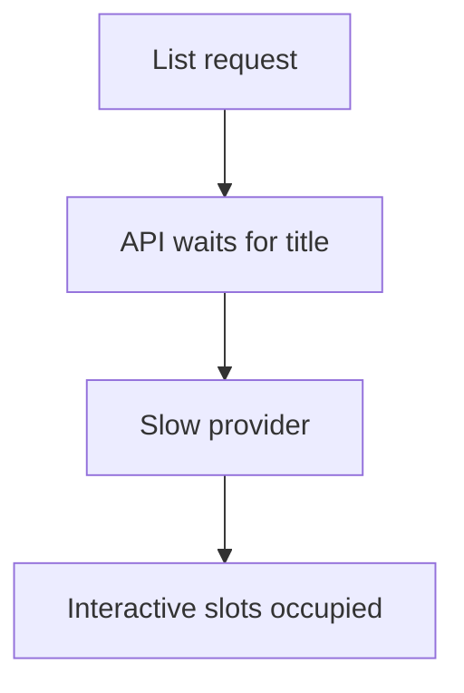
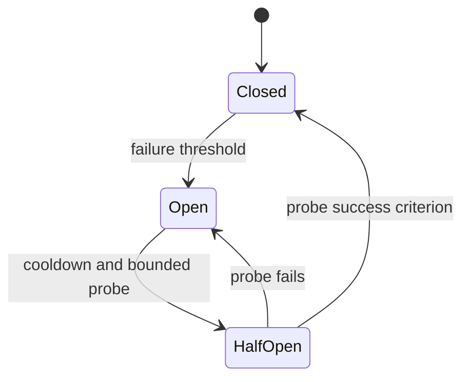
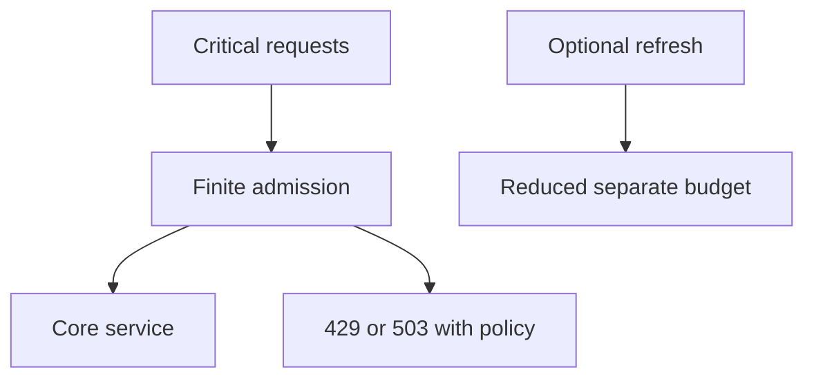
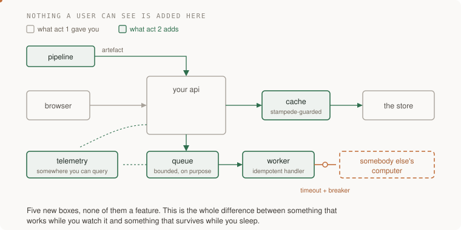

# 1. Degrade, do not stop

[Curriculum](../../../README.md) · [Reliability and incident response](../README.md) · [Project index](../../../../indexes/projects.md)

## The reviewer's brief

> Your reading list becomes unusable when a title provider slows. Users still need their saved links. Keep core reads useful and make the degraded state visible. Which data is safe to serve stale?

This is a **constructed practice brief**, not an attributed company question.
Prerequisites: [project index](../../../../indexes/projects.md) and [prerequisite lesson](../../01-system-design/design-method.md). This page is a build brief; it does not ship a runnable application. The original build and prompt sequence below defines the implementation checkpoints.

| Case | Exact input or workload | Expected outcome |
|---|---|---|
| Small example | List data is local; title provider takes 8 s; interactive deadline is 500 ms. | Return saved URLs and pending/stale title labels within the chosen budget; provider work is bounded or deferred. |
| Boundary / failure | Cached data belongs to a different account or exceeds the allowed age. | Never serve it as fallback; return a clear authorized degraded/error state. |
| Scope | Availability policy is operation-specific; no promise to serve all traffic under arbitrary overload. | Explain any additional assumption before implementing it. |

<!-- project-expectation:start -->

## What you are expected to hand over

**The finished artifact:** Take the outside call from your initial application — the page fetch, the vision model, the mail sender — and make every failure mode of it a designed behaviour rather than an accident. Then turn the dependency off and use the product.

Treat that sentence as a review contract, not an inspiration. A reviewable
submission contains all of the following:

- the narrow working slice or decision artifact described above, reproducible
  from a clean checkout with assumptions stated;
- captured proof of the normal flow **and** the boundary/failure row above;
- tests, probes, or metrics that can go red when the important guarantee breaks;
- a short decision record naming ownership, excluded scope, and the first
  operational limit; and
- a changed contract, diagram, and new evidence for each follow-up—not only a
  paragraph claiming the original design still works.

### How the review conversation gets harder

| Review gate | The interviewer changes | Expected response |
|---|---|---|
| Baseline | Run the small example from the table above. | Demonstrate the observable outcome end to end and identify which boundary owns it. |
| Failure | Reproduce the boundary/failure row above. | Show the failure before the fix, then prove the protected behavior without hiding the error. |
| Senior · The provider recovers | The breaker opens, then probes recovery. How many requests probe at once? Predict which boundary must change before opening the design. | Use a bounded half-open probe set, not all waiting callers. Close only according to tested success criteria; a failed probe returns to the open state while the fallback remains usable. |
| Lead · Everything is high priority | Critical arrivals exceed capacity even after optional work is disabled. What gives? State what evidence would make you reject your first design. | Bound interactive admission too. Choose finite queueing or fast overload response, reserve recovery capacity, and report denied critical work; priority cannot guarantee service beyond capacity. |
| Evidence | A reviewer asks, “How do you know?” | Build in three stops: reproduce the small case and baseline failure; implement the protected boundary; then replay both changed requirements with captured outputs. |
| Handoff | The author is unavailable and the environment is new. | Another engineer can run, observe, break, and recover the artifact from the repository evidence. |

Before implementation, say the baseline invariant, the owner of each piece of
state, and what the user sees when the named dependency or assumption fails. That
five-minute explanation is part of the project: if it is vague, the build is not
ready to begin.

<!-- project-expectation:end -->

Before looking at the guidance, state the invariant in one sentence and trace the example. In interview practice, implement or sketch independently, then reveal the reasoning. During AI-assisted practice, use the prompts below and verify each checkpoint before the next request.

## Baseline and the failure to explain



The baseline makes an optional enrichment dependency mandatory for the primary user task.

<details>
<summary>Reveal the approach and decisions</summary>

Define degradation per operation, then deadlines, bounded retries and breaker behavior. The invariant is preserved authorization and bounded resource use in every state. Cache outage must not produce unlimited database bypass.

</details>

## Follow-up 1 · The provider recovers

**Changed requirement:** The breaker opens, then probes recovery. How many requests probe at once? Predict which boundary must change before opening the design.

<details>
<summary>Expected reasoning and changed diagram</summary>

Use a bounded half-open probe set, not all waiting callers. Close only according to tested success criteria; a failed probe returns to the open state while the fallback remains usable.



</details>

## Follow-up 2 · Everything is high priority

**Changed requirement:** Critical arrivals exceed capacity even after optional work is disabled. What gives? State what evidence would make you reject your first design.

<details>
<summary>Expected reasoning and changed diagram</summary>

Bound interactive admission too. Choose finite queueing or fast overload response, reserve recovery capacity, and report denied critical work; priority cannot guarantee service beyond capacity.



</details>

## Evidence to bring to review

Build in three stops: reproduce the small case and baseline failure; implement the protected boundary; then replay both changed requirements with captured outputs. Record commands, fixtures, and observed results in your implementation README. A diagram is a prediction until those checks run.

**Senior expectation:** Demonstrate every forced fallback and breaker transition. **Additional lead scope:** Own product degradation choices and dependent-team budgets. Completion demonstrates practice evidence; it does not establish interview readiness or multi-team delivery experience.

## Build and prompt sequence



*When the thing you depend on goes away, your product gets worse rather than stopping.*

**Build**

Take the outside call from your initial application — the page fetch, the vision model,
the mail sender — and make every failure mode of it a designed behaviour rather
than an accident. Then turn the dependency off and use the product.

**The thought process**

The decision that has to come first, and it is a product decision disguised as a
technical one: **what does the user get when the dependency is gone?** There are
only a few honest answers — the stale version, a placeholder, a queued promise,
or a clear refusal — and picking is your job, not the framework's.

Then the ordering that matters: you cannot decide timeouts until you have decided
degradation. A timeout is how long you are willing to wait *before doing the
fallback*, and without a fallback there is nothing to time out into, which is why
so many systems have timeouts measured in minutes.

Third, and this is the senior part: **classify your requests.** Not everything
deserves the same treatment when you are short of capacity. Somebody loading
their own list matters more than a background refresh. Rank them before you need
to, because you will not do it well during an incident.

**How to organise the prompts**

```
Here is my system and the one call it makes to a service I do not
control. List every way that call can fail — not just error and
timeout, but slow, partial, wrong, and succeeding with stale data.

For each, tell me what the user currently sees. Do not fix anything yet.
```

The current behaviour is the finding. Most of those rows will say "the page
hangs" or "a 500".

```
Now, for each failure, I will tell you the behaviour I want. Implement
the fallback path FIRST, before touching the timeout, and give me a way
to force each fallback on demand.
```

Forcing it on demand is the part that makes this real. A fallback you cannot
trigger deliberately is a fallback you have never seen.

```
Add a circuit breaker. Then show me the three states — closed, open,
half-open — actually happening in a test, with what the user sees in
each.
```

```
Classify requests into three priorities and shed the lowest first under
pressure. Show me the shedding happening, and tell me what a user in
each class experiences.
```

**On AWS**

The fallback usually needs somewhere to keep the last good answer:
**ElastiCache** (Valkey or Redis) if you want it in memory and shared,
**DynamoDB** with a TTL if you want it durable and cheap, and honestly a local
in-process cache if there is one instance. Choose by how bad a stale answer is,
not by which sounds more serious.

Where the choice genuinely matters: if the fallback is "queue it and do it
later", that is **SQS**, and the user-facing response changes from an answer to
an acknowledgement — a product change you should name out loud.

An **Application Load Balancer** health check can remove an unhealthy target
from normal rotation; this is not a per-dependency deadline or circuit breaker.
For new builds, implement bounded deadlines, retry ownership and breaker policy
in the application around the third-party operation. For traffic among ECS
services, evaluate **ECS Service Connect** discovery, proxy behavior and telemetry
separately; it is not a universal third-party fallback policy.

Do not select App Mesh for this new project: AWS announces end of support on
**2026-09-30**. Capability/lifecycle checked **2026-09-22** against [the App Mesh
notice](https://docs.aws.amazon.com/app-mesh/latest/userguide/what-is-app-mesh.html)
and [Service Connect documentation](https://docs.aws.amazon.com/AmazonECS/latest/developerguide/service-connect.html).

**What productionising it means**

Every fallback can be forced on demand, and you have forced each one at least
once. The breaker's state is visible in telemetry rather than inferred. Stale
answers are labelled as stale where a person can see it. And the priority
classes exist in code, not in a document.

**The learning**

Availability is not a property you add, it is a set of decisions about what to
give up and in what order. A system with no fallbacks has made all of those
decisions by default, and the default is always "stop".

**How you would know it is wrong**

- Block the dependency at the network level and use the product for five minutes. Write down what you experienced.
- Make the dependency slow rather than absent — that is the harder case and the commoner one.
- Force each fallback deliberately. Any you cannot force is untested.
- Check whether a stale answer is identifiable as stale, from outside.
- Shed load and confirm the *low* priority class is what suffered.

**Stage it**

1. The failure inventory, with what the user currently sees.
2. Fallbacks, each forceable on demand.
3. Timeouts and the breaker, with all three states demonstrated.
4. Priority classes and shedding, verified from the user's side.

---

[Back to the ordered project index](../../../../indexes/projects.md)
