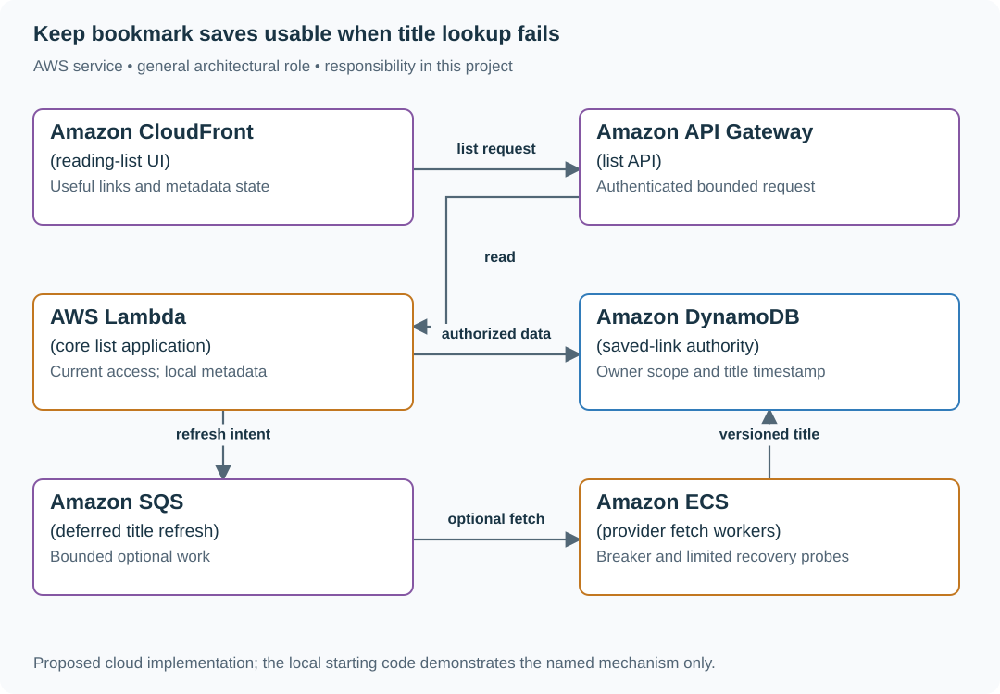

# 1. Degrade, do not stop

## What you are building

> Keep a reading list usable when its title provider takes eight seconds. Users still need saved URLs within a 500 ms interactive budget. Cached titles may help, but another account’s content or an over-age value is never an acceptable fallback.

**Working contract:** Core list reads come from authorized local records. Optional titles can be pending or bounded-stale under an explicit policy. Every fallback preserves current authorization, and recovery probes use bounded concurrency.

## Workload and the decisions it changes

These are constructed exercise assumptions. The stated workload is a design target; the local demonstration does not establish that throughput. Use the [estimation constants](../../../01-code/01-problem-solving/estimation-constants.md) to check units before choosing capacity.

| Input or objective | Calculation / consequence |
|---|---|
| Eight-second provider time; 500 ms list deadline | The list cannot synchronously wait for the provider and still meet the contract. |
| One-hour cached-title freshness allowance assumption | Show stale/pending state; the value’s age is checked before fallback. |
| 1,000 simultaneous readers after recovery | Half-open probes need a small shared budget, not one probe per waiting request. |

## Start with one working boundary

Run from the repository root with Python 3.12+:

```bash
python3 examples/architecture-starts/degrade_do_not_stop.py
```

[Open the starting code](../../../../examples/architecture-starts/degrade_do_not_stop.py). This is a runnable demonstration of the critical state boundary. The API, UI, cloud adapters and operating behavior below are the application you build around it.

| Record / module | Key or interface | Responsibility |
|---|---|---|
| saved_links | owner,id,url,title,title_observed_at | Core local data and optional metadata age. |
| provider_health | state,failures,next_probe,probe_budget | Closed/open/half-open behavior. |
| list_response | link,display_title,title_status | Explicit useful degraded result. |

## AWS implementation



The queue isolates optional enrichment from core reads. The user-facing contract remains useful because the local record is sufficient to open the saved link.

## Build it in this order

### 1. Separate core and optional work

Implement list reads without a live title-provider dependency. Save URLs before enrichment and return title_status pending when no title exists. The browser renders useful links immediately and does not replace the whole page with a spinner for optional metadata.

### 2. Define safe stale serving

Scope cached records by owner/group and reauthorize before returning them. Check observed age against the title policy. Do not use the same stale allowance for permissions, payment state or other fields whose semantics require current truth.

### 3. Bound failure and recovery

Use a short provider deadline, bounded queue and circuit state to stop repeated doomed calls. In half-open state, allow a small controlled number of probes and gradually restore traffic. Cache refresh jobs remain idempotent and version-aware.

### 4. Expose the degraded experience

Show saved URL and stale/pending label without alarming the user with internal stack traces. Record fallback rate, age and core latency for operators. If critical demand itself exceeds capacity, apply explicit admission rather than pretending optional-work removal solves every overload.

## Infrastructure configuration

| Resource or boundary | Initial configuration and reason |
|---|---|
| Core path | No synchronous dependency on remote title success; deadline fits local work. |
| Worker pool | Independent concurrency and breaker probe budget; failure cannot exhaust API connections. |
| Cache policy | Explicit age and ownership checks on every fallback, with visible pending/stale state. |

Use one disposable AWS environment for the cloud exercise. Put the named resources in `infra/template.yaml` or your existing IaC tool, pass resource IDs through configuration, and scope each runtime role to its own tables, buckets and queues. The diagram is a design to implement; it is not a claim that these resources have been deployed. Record the commands you used to deploy and remove the exercise resources.

For concrete provisioning commands, configuration wiring and cleanup, use the [AWS foundation guide](../../../../examples/architecture-starts/infra/README.md). It includes a deployable table/queue/object-storage foundation and explains which application and service adapters you still implement.

## Observe the result

| Action | Expected visible result |
|---|---|
| Run the starting program | Ana receives her link with stale title state; Ben’s cached content is excluded. |
| Make the provider take eight seconds | Core reads stay within their measured local budget. |
| Restore the provider | Only the bounded probe share runs before full traffic resumes. |

## The next design decision

Add an optional AI summary. Give it its own latency/cost budget and source-version identity; a failed summary must not remove access to the saved article.

<details>
<summary>Further constraints from the original project</summary>

## Follow-up 1 · The provider recovers

**Changed requirement:** The breaker opens, then probes recovery. How many requests probe at once? Predict which boundary must change before opening the design.

<details>
<summary>Expected reasoning and changed diagram</summary>

Use a bounded half-open probe set, not all waiting callers. Close only according to tested success criteria; a failed probe returns to the open state while the fallback remains usable.

</details>

## Follow-up 2 · Everything is high priority

**Changed requirement:** Critical arrivals exceed capacity even after optional work is disabled. What gives? State what evidence would make you reject your first design.

<details>
<summary>Expected reasoning and changed diagram</summary>

Bound interactive admission too. Choose finite queueing or fast overload response, reserve recovery capacity, and report denied critical work; priority cannot guarantee service beyond capacity.

</details>

</details>
